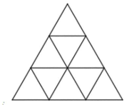
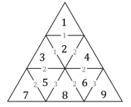
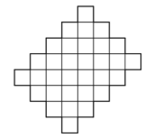
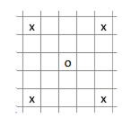
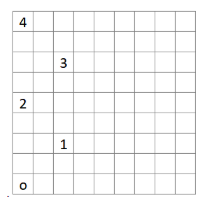
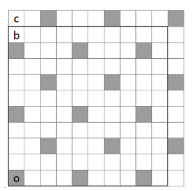
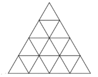
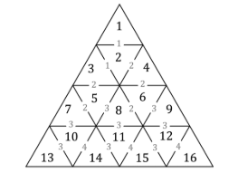

# <lo-sample/> LV.AMO.2023.5.1

Skaitļus no $1$ līdz $9$ ieraksti 1. att. redzamajos mazajos trijstūros 
(katrā trijstūrī citu naturālo skaitli) tā,
lai blakus trijstūros ierakstītie skaitļi neatšķiras vairāk kā par $3$.  
*Piezīme.* Par blakus trijstūriem sauksim trijstūrus, kam ir kopīga mala.

## Atrisinājums

Sk., piemēram, 2. att., kur pelēkā krāsā norādītas atbilstošās starpības.

# <lo-sample/> LV.AMO.2023.5.2

Doti divi skaitļi. Zināms, ka viens no tiem ir tieši septiņas reizes lielāks nekā otrs un katram no tiem ir
vismaz divi cipari. Vai var gadīties, ka abu skaitļu pierakstā izmantoti tikai cipari: **(a)** $3$; $4$; $6$ un $7$;
**(b)** $1$; $2$ un $3$?

## Atrisinājums

**(a)** Nē, nevar. Ja skaitļa pēdējais cipars ir $3$, $4$, $6$ vai $7$, tad septiņas reizes lielāka skaitļa
pēdējais cipars ir attiecīgi $1$; $8$; $2$ vai $9$, bet pēc uzdevuma nosacījumiem nevienu no šiem cipariem
nevar izmantot skaitļu pierakstā.  
**(b)** Jā, var, piemēram, der skaitļi $33$ un $231$, jo $33 \cdot 7 = 231$.

# <lo-sample/> LV.AMO.2023.5.3

Rūtiņu lapā, kurā katras rūtiņas malas garums ir $1$, uzzīmē daudzstūri, kuram gan perimetra, gan
laukuma vērtība ir tāda pati kā malu skaits!

## Atrisinājums

Piemēram, skat. 3. att., kur uzzīmēts $32$-stūris, kura laukuma un perimetra vērtība ir $32$.

# <lo-sample/> LV.AMO.2023.5.4

Dots kvadrāts ar izmēriem $n \times n$ rūtiņas. Vienā gājienā kauliņu var pārlikt tieši $2$ rūtiņas uz priekšu pa
jebkuru no diagonālēm, kas iziet no tā lauciņa, kurā atrodas kauliņš (skat. 4. att., kur kauliņš apzīmēts
ar "o" un ar "x" atzīmētas tās rūtiņas, uz kurām to drīkst pārvietot). Vai, veicot vairākus gājienus, kauliņu
no kreisās apakšējās rūtiņas var pārvietot uz kreiso augšējo rūtiņu, ja kvadrāta izmēri ir: **(a)** $9 \times 9$;
**(b)** $10 \times 10$; **(c)** $11 \times 11$?

## Atrisinājums

**(a)** Jā, var, skat., piemēram, 5. att., kur ar skaitļiem parādīti veiktie gājieni.

**(b)** Nē, nevar. **(c)** Nē, nevar. Pieņemsim, ka kauliņš sākumā atrodas uz pelēkas rūtiņas. Ievērojot, ka
kauliņu var pārlikt izlaižot vienu rūtiņu pa diagonāli, pakāpeniski pelēkā krāsā iekrāsojam rūtiņas, kurās
var atrasties kauliņš (skat. 6. att., kur iekrāsotas visas rūtiņas, kurās var atrasties kauliņš). Tā kā augšējā
kreisā stūra rūtiņa ir balta (kvadrātam $10 \times 10$ tā atzīmēta ar b, bet kvadrātam $11 \times 11$ tā atzīmēta ar
c), tad tajā kauliņš nevar nonākt.

# <lo-sample/> LV.AMO.2023.5.5

Gunai bija četru veidu konfektes: 8 “Serenādes”, 14 “Lācīši Ķepainīši”, 20 “Vāverītes” un 26 “Sarkanās
magones”. Katru no saviem dzimšanas dienas viesiem viņa uzcienāja ar tieši 3 dažādām konfektēm.
Kāds ir lielākais iespējamais viesu skaits, kas bija ieradušies uz Gunas dzimšanas dienas svinībām?

## Atrisinājums

Lielākais iespējamais viesu skaits ir $21$. Guna varēja pacienāt 21 viesi šādi:

* $13$ viesus pacienāja ar “Lācīšiem Ķepainīšiem”, “Vāverītēm” un “Sarkanajām magonēm”;
* $7$ viesus pacienāja ar “Serenādēm”, “Vāverītēm” un “Sarkanajām magonēm”;
* $1$ viesi pacienāja ar “Serenādi”, “Lācīti Ķepainīti” un “Sarkano magoni”.

Kopā Guna viesiem būtu iedevusi $8$ “Serenādes”, $14$ “Lācīšus Ķepainīšus”, $20$ “Vāverītes” un $21$
“Sarkano magoni”, kas nepārsniedz viņai esošo konfekšu daudzumu.

Pierādīsim, ka vairāk kā $21$ viesi Guna pacienāt nevarēs. Katru viesi ir jāpacienā ar vismaz divām
dažādām konfektēm no “Serenādēm”, “Lācīšiem Ķepainīšiem” un “Vāverītēm”. Kopā šo konfekšu ir
$8 + 14 + 20 = 42$. Ja būtu $22$ viesi vai vairāk, tad tiem vajadzētu vismaz $22 \cdot 2 = 44$ šo veidu
konfektes. Tātad vairāk par $21$ viesi nevar ierasties uz svinībām.

## Atrisinājums

Lielākais iespējamais viesu skaits ir $21$. Guna varēja pacienāt $21$ viesi šādi:

* $13$ viesus pacienāja ar “Lācīšiem Ķepainīšiem”, “Vāverītēm” un “Sarkanajām magonēm”;
* $7$ viesus pacienāja ar “Serenādēm”, “Vāverītēm” un “Sarkanajām magonēm";
* $1$ viesi pacienāja ar “Serenādi”, “Lācīti Ķepainīti” un “Sarkano magoni”.

Kopā Guna viesiem būtu iedevusi $8$ “Serenādes”, $14$ “Lācīšus Ķepainīšus”, $20$ “Vāverītes” un $21$ “Sarkano
magoni”, kas nepārsniedz viņai esošo konfekšu daudzumu.

Pierādīsim, ka vairāk kā $21$ viesi Guna pacienāt nevarēs. Pieņemsim, ka viņa ir pacienājusi $22$ viesus.
Tātad ir iztērētas $22 \cdot 3 = 66$ konfektes. Tā kā sākumā Gunai bija $8 + 14 + 20 + 26 = 68$ konfektes,
tad pāri paliek 68 − 66 = 2 konfektes. Ievērojam, ka katru viesi var pacienāt ar ne vairāk kā vienu
“Sarkano magoni”, tātad pāri jāpaliek vismaz $26 − 22 = 4$ “Sarkanajām magonēm”. Izveidojas
pretruna, tātad pieņēmums ir aplams un $22$ viesus Guna pacienāt nevar. Ja viņa nevar pacienāt $22$
viesus, tad nevar arī vairāk, un $21$ ir lielākais iespējamais viesu skaits.

# <lo-sample/> LV.AMO.2023.6.1

Skaitļus no $1$ līdz $16$ ieraksti 7. att. redzamajos mazajos trijstūros 
(katrā trijstūrī citu naturālo skaitli) tā,
lai blakus trijstūros ierakstīties skaitļi neatšķiras vairāk kā par $4$.  
*Piezīme.* Par blakus trijstūriem sauksim trijstūrus, kam ir kopīga mala.

## Atrisinājums

Skat., piemēram, 8. att., kur pelēkā krāsā norādītas atbilstošās starpības.

