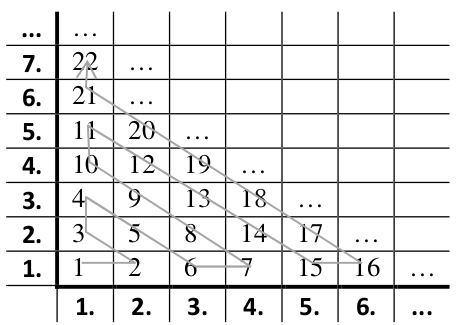

# <lo-sample/> LV.AMO.2000.7.1

Dots, ka $a,b,c,d$ – naturāli skaitļi un $ab=cd$. Pierādīt, ka skaitli $a^2 + b^2 + c^2 + d^2$ 
var izsacīt kā divu veselu skaitļu kvadrātu summu. Vai to noteikti var izsacīt kā divu naturālu skaitļu kvadrātu summu?

<small>

* topic:StandardIdentities
* questionType:Prove
* domain:NT
* concepts:square-Alg

</small>

## Atrisinājums

Izteiksmei var pieskaitīt $2ab$ un atņemt tam vienādo $2cd$, tad atdalīt kvadrātus:

$$a^2 + 2ab + b^2 + c^2 - 2cd + d^2 = (a+b)^2 + (c-d)^2.$$

Tādēļ vienmēr to var izteikt kā divu veselu skaitļu kvadrātu summu.

Ne vienmēr $a^2 + b^2 + c^2 + d^2$ var būt divu naturālu kvadrātu summa. Piemēram,
$1^2+1^2+1^2+1^2 = 4$ nav izsakāms kā $m^2 + n^2$, kur $m, n \in \mathbb{N}$.

# <lo-sample/> LV.AMO.2000.7.2

Atrast mazāko naturālo skaitli, kam visi cipari ir vienādi un kas dalās ar $49$?

<small>

* topic:LittleFermatAndEuler
* topic:IntegerFactorization
* genre:optimization
* questionType:FindOptimal
* domain:NT
* concepts:decimal-notation,digit,divisibility

</small>

## Atrisinājums

Aprēķinām atlikumus, dalot $1,11,111,1111,11111,111111$ ar $7$. 
Atlikumi ir $1,4,6,5,2,0$. Tādēļ $111111$ dalās ar $7$ un 
septiņreiz lielāks skaitlis $777777$ dalās ar $49$. 

*Piezīme.* Fakts, ka $111111$ dalās ar $7$ seko no 
tā, ka $10^6 - 1 = 999999$ dalās ar $7$. 
Šī apgalvojuma vispārinājums ir Mazā Fermā teorēma: 
Katram pirmskaitlim $p$ un katram $a$, kas nedalās ar $p$, 
$a^{p-1} - 1$ dalās ar $p$. 

# <lo-sample/> LV.AMO.2000.7.4

Vai naturālos skaitļus

**(A)** no $1$ līdz $12$ ieskaitot,
**(B)** no $1$ līdz $50$ ieskaitot

var tā sadalīt pa pāriem, lai visas pāros ieejošo skaitļu summas būtu dažādas un katra no tām būtu pirmskaitlis?
(Piemēram, skaitļus no $1$ līdz $6$ varētu sadalīt tā: $1+2=3$, $3+4=7$, $5+6=11$).

<small>

* topic:PrimesDistribution
* topic:NumTheoryPigeonhole
* topic:ExhaustionMethod
* concepts:partition,primes,sum
* questionType:ProveDisprove
* domain:NT
* genre:construction

</small>

## Atrisinājums

**(A)** Var sadalīt, piemēram, tā: $(1,4)$, $(2,5)$, $(3,8)$, $(6,7)$, $(9,10)$, $(11,12)$. 

**(B)** Bet $(1,100)$ ir tikai $24$ pirmskaitļi, kas lielāki par $2$.
Tāpēc nav iespējams izveidot $25$ pārus no skaitļiem $[1;50]$ tā, lai iegūtu $25$ dažādus 
pirmskaitļus -- tas būtu pretrunā ar Dirihlē principu.

# <lo-sample/> LV.AMO.2000.8.3

Uz katras no vairākām kartītēm uzrakstīts pa naturālam skaitlim (starp tiem var būt arī vienādi); uz visām kartītēm uzrakstīto skaitļu summa ir $100$. Vai noteikti var atrast tādas kartītes (varbūt vienu pašu), uz kurām uzrakstīto skaitļu summa ir $50$, ja kartīšu skaits ir

**(A)** $50$,
**(B)** $51$?

<small>

* topic:NumTheoryMathInduction
* topic:NumTheoryPigeonhole
* genre:construction
* questionType:ProveDisprove
* domain:Comb
* strategy:Interpretation
* concepts:sum

</small>

## Atrisinājums

**(A)** Ne vienmēr. Ir šāds pretpiemērs: $49$ kartītes ar "1" un $1$ kartīte ar "51". 

**(B)** Ieviešam sekojošu interpretāciju: Uzzīmējam riņķa līniju, kuru regulāra $100$-stūra
virsotnes sadala $100$ vienādos lokos. Vispirms nokrāsojam vienu no regulārā $100$-stūra virsotnēm sarkanu un 
atbilstoši katras kartītes skaitlim $n_i$ ($i=1,2,\ldots,51$) nokrāsojam sarkanu virsotni, kuru no 
iepriekšējās atdala $n_i$ vienādie loki (virzoties pretēji pulksteņa rādītāju virzienam).
Saliekot visus $51$ lokus, pēdējā sarkanā virsotne būs tā, kuru atzīmēja pašā sākumā 
(jo visu skaitļu $n_i$ summa ir tieši $100$). 

Esam ieguvuši $51$ sarkanu punktu uz riņķa līnijas. 
Visas $100$-stūra virsotnes var sagrupēt pa pāriem (kur vienā pārī ietilpst divas virsotnes, kuras 
ir tieši pretī viena otrai -- kuras atdala tieši $50$ riņķa līnijas loki). 
Pēc Dirihlē principa, vismaz vienā no pāriem abas pretējās virsotnes būs sarkanas, jo pāru 
pavisam ir $50$ (un katrai sarkanajai virsotnei nevar iedot pārī ne-sarkanu). 

Iegūtais pāris ar abām sarkanajām virsotnēm, kas ir tieši pretī viena otrai der kā atrisinājums, 
jo no vienas uz otru var aiziet tieši $50$ soļos, izmantojot skaitļus $n_i$. 

# <lo-sample/> LV.AMO.2000.9.2

Vai skaitli  
**(A)** skaitli $2$,  
**(B)** skaitli $\frac{1}{8}$  
var izsacīt kā četriem dažādiem naturālu skaitļu 
kvadrātiem apgriezto lielumu summu?

<small>

* concepts:sum,square-Alg,inverse-number
* questionType:ProveDisprove,ProveDisprove
* domain:Alg

</small>

# <lo-sample/> LV.AMO.2000.9.4

Apskatām pirmos $n$ naturālos skaitļus. No tiem jāizvēlas divus tā, 
lai to reizinājums būtu vienāds ar visu pārējo skaitļu summu. 
Vai tas ir iespējams, ja  
**(A)** $n=10$,  
**(B)** $n=15$?

<small>

* concepts:sum,product
* questionType:ProveDisprove,ProveDisprove
* domain:NT

</small>

# <lo-sample/> LV.AMO.2000.10.2

Divu pirmskaitļu starpība ir $100$. Uzrakstot pirmo 
galā otrajam, atkal iegūst pirmskaitli. 
Atrast šos pirmskaitļus un pierādīt, ka citu bez 
Jūsu atrastajiem nav.

<small>

* concepts:primes,digit-manipulation
* questionType:FindAll
* domain:NT

</small>

# <lo-sample/> LV.AMO.2000.11.1

Dots, ka $x^2+y^2+z^2 = t^2$, kur $x,y,z,t$ – naturāli skaitļi. 
Cik no skaitļiem $x,y,z,t$ var būt pāra skaitļi?

<small>

* concepts:even-number
* questionType:FindCount
* domain:NT

</small>

# <lo-sample/> LV.AMO.2000.11.4

Funkcijas $f(x)$ argumenti un vērtības ir naturāli skaitļi. 
Katram naturālam $x$ izpildās vienādība

$$f(f(x))+f(x) = 2x.$$

Atrast visas šādas funkcijas $f(x)$ un pierādīt, 
ka citu bez atrastajām nav.

<small>

* concepts:function,argument,value
* questionType:FindAll
* domain:NT

</small>

# <lo-sample/> LV.AMO.2000.12.2

Atrisināt naturālos skaitļos vienādojumu

$$\left( 2a+b \right) \cdot \left( 2b + a \right) = 2^c.$$

<small>

* concepts:equation
* questionType:FindAll
* domain:NT

</small>

# <lo-sample/> LV.AMO.2000.12.5

Naturālu skaitļu virkni sauc par $F$-virkni, 
ja tā ir augoša, bezgalīga un katrs tās loceklis, 
sākot ar trešo, vienāds ar abu iepriekšējo locekļu summu. 
Vai eksistē  
**(A)** galīgs daudzums,  
**(B)** bezgalīgs daudzums  
$F$-virkņu ar īpašību: katrs naturāls skaitlis pieder 
tieši vienai no tām.

<small>

* concepts:sequence
* questionType:ProveDisprove,ProveDisprove
* domain:NT

</small>

# <lo-sample/> LV.AMO.2001.7.2

Naturālu skaitli sauc par simetrisku, ja tā pēdējais cipars 
nav $0$ un, uzrakstot tā ciparus apgrieztā secībā, 
skaitlis nemainās. Piemēram, $1221$ ir simetrisks skaitlis, bet $1231$ - nav.  
**(A)** pierādiet: ja simetrisks sešciparu skaitlis dalās ar $13$, tad tas dalās arī ar $7$,  
**(B)** vai taisnība, ka katrs simetrisks sešciparu skaitlis, kas dalās ar $7$, dalās arī ar $13$?

<small>

* topic:DivisibilityRulesOther
* topic:NotationPolynomial
* topic:IntegerCongruence
* concepts:palindrome,decimal-notation
* questionType:Prove,ProveDisprove
* domain:NT

</small>

## Atrisinājums

**(A)** $13$ dala $\overline{abcabc}=1001\cdot{}\overline{abc}$ un 
arī $\overline{abccba}$ (tas ir dots). 
Atņemot abus skaitļus, iegūstam $13 \mid 99|a-c|$ un $a=c$.

**Piezīme:** Ievērojam, ka $\overline{abccba}$ var izteikt 
$100001a + 10010b + 1100c = 13\cdot (\ldots ) + 5(a-c)$. 
Tad $a-c$ dalās ar $13$ un $a=c$; aizstāj $c$ un dala ar $7$.

**(B)** $108801$ ir pretpiemērs.

# <lo-sample/> LV.AMO.2001.8.3

Andrim vajadzēja sareizināt divus dažādus pozitīvus trīsciparu skaitļus. 
Izklaidības pēc viņš tos vienkārši uzrakstīja vienu otram galā. 
Iegūtais sešciparu skaitlis izrādījās $3$ reizes lielāks par reizinājumu, 
kuru Andrim vajadzēja iegūt. Kādu sešciparu skaitli Andris uzrakstīja?

<small>

* topic:NotationShift
* topic:StandardIdentities
* topic:NumTheoryInequalityMethod
* questionType:FindAll
* domain:NT
* genre:digit-manipulation
* concepts:decimal-notation

</small>

## Atrisinājums

* Apzīmē $a$ un $b$ - abi ir trīsciparu skaitļi
* Ja $1000a+b=3ab$, tad $b/a=3b-1000$. 
* Veseli trīsciparu skaitļi $a,b$ rodas tikai tad, ja $b=334$.

# <lo-sample/> LV.AMO.2001.9.4

Dots, ka $x,y,z$ - naturāli skaitļi un katrs no 
skaitļiem $xy-z$, $xz-y$ un $yz-x$ dalās ar $3$. 
Pierādiet, ka $x^2+y^2+z^2$ dalās ar $3$.

<small>

* concepts:divisibility
* questionType:Prove
* domain:NT

</small>

# <lo-sample/> LV.AMO.2001.10.3

Kāds ir mazākais pirmskaitlis $p$, kuram nevar atrast tādus 
nenegatīvus veselus skaitļus $x$ un $y$, ka 
${\displaystyle p = \left| 2^x - 3^y \right|}$?

<small>

* concepts:primes
* questionType:FindOptimal
* domain:NT

</small>

# <lo-sample/> LV.AMO.2001.11.3

Skaitļu virknes elementi ir naturāli skaitļi. 
Pirmo elementu izvēlas patvaļīgi, bet katrs nākošais 
elements ir vienāds ar iepriekšējā elementa naturālo dalītāju skaitu. 
(Piemēram, ja virknes pirmais elements ir $14$, 
tad virkne ir $14, 4, 3, 2, 2, 2, \ldots$).
Kāds var būt virknes pirmais elements, 
ja neviens tās elements nav naturāla skaitļa kvadrāts?

<small>

* concepts:sequence,divisibility,square-Alg
* questionType:FindAll
* domain:NT

</small>

# <lo-sample/> LV.AMO.2001.12.2

Atrisināt naturālos skaitļos vienādojumu $(2a+b)(2b+a)=2c$.

<small>

* concepts:equation
* questionType:FindAll
* domain:NT

</small>

# <lo-sample/> LV.AMO.2002.7.4

Divi spēlētāji pamīšus raksta uz tāfeles pa vienam 
naturālam skaitlim no $1$ līdz $8$ ieskaitot. 
Nedrīkst rakstīt skaitļus, ar kuriem dalās kaut 
viens jau uzrakstīts skaitlis. 
Kas nevar izdarīt gājienu, zaudē.
Parādiet, kā tas, kas izdara pirmo gājienu, var uzvarēt.

<small>

* genre:game
* concepts:divisibility
* questionType:Algorithm
* strategy:Contradiction
* domain:NT

</small>

## Atrisinājums

Ja skaitļiem $\{ 2,3,\ldots,7,8\}$ uzvar 1.sp., 
atkārto viņa stratēģiju. Ja uzvar 2.spēlētājs, sāk ar gājienu "$1$".

## Atrisinājums

Sāk ar $2$, tad uz katru $(5; 7)$, $(6; 8)$ un $(4; 3)$ atbild ar otru skaitli no pārīša.

# <lo-sample/> LV.AMO.2002.7.5

Kādu lielāko daudzumu dažādu naturālu skaitļu, kas nepārsniedz $100$, var izvēlēties tā, 
lai nekādu divu izvēlēto skaitļu starpība nebūtu ne $3$, ne $4$, ne $7$?

<small>

* topic:SequencePeriodicity
* topic:NumTheoryPigeonhole
* genre:optimization
* questionType:FindOptimal
* domain:Comb
* strategy:ExhaustiveSearch,Symmetry

</small>

## Atrisinājums

Ja $>30$, tad no $10$ sk., jāizvēlas $4$. No $\{1,4,8\}$, $\{2,5,9\}$, $\{2,6,10\}$, $\{7\}$ 
jāņem pa $1$ – neiespējami.

Lai izvēlētos $4$ no *ABCABCXABC*, jāņem arī $X$, bet līdzīgi arī *ABCYABCABC* 
un $X$,$Y$ starpība ir $3$.

# <lo-sample/> LV.AMO.2002.8.2

Andrim vajadzēja sareizināt divus dažādus divciparu skaitļus. Izklaidības pēc 
viņš tos vienkārši uzrakstīja vienu otram galā. Iegūtais četrciparu skaitlis izrādījās 
$3$ reizes lielāks par reizinājumu, kuru Andrim vajadzēja iegūt. 
Kādu četrciparu skaitli Andris uzrakstīja?

<small>

* topic:NotationShift
* topic:StandardIdentities
* topic:NumTheoryInequalityMethod
* seeAlso:LV.AMO.2001.8.3
* questionType:FindAll
* domain:NT
* genre:digit-manipulation
* concepts:decimal-notation

</small>

## Atrisinājums

Ja $100a+b=3ab$, tad $b/a=3b-100$. Abi cipari $a,b$ ir veseli tad, ja $b=34$.

# <lo-sample/> LV.AMO.2002.8.3

Par Fibonači skaitļiem sauc skaitļus $1; 2; 3; 5; 8; \ldots$ 
(katru nākošo iegūst, saskaitot divus iepriekšējos).
Vai var pastāvēt vienādība $a+b=c+d$,
ja $a$, $b$, $c$, $d$ ir dažādi Fibonači skaitļi?

<small>

* topic:NumTheoryExtremeElement
* concepts:fibonacci-sequence
* questionType:ProveDisprove
* domain:NT
* strategy:ExtremeElement

</small>

## Atrisinājums

Ja $d$ ir lielākais no Fibonači skaitļiem, tad $a+b=d$, 
kur $a$,$b$ ir Fibonači skaitļi tieši pirms $d$. Bet tā kā $c>0$ arī 
ir Fibonači skaitlis, tad $a+b<c+d$. 

# <lo-sample/> LV.AMO.2002.9.3

Dots, ka $x, y, z$ naturāli skaitļi un katrs no 
skaitļiem $xy-z$, $xz-y$ un $yz-x$ dalās ar $3$. 
Pierādīt, ka $x^2+y^2+z^2$ dalās ar $3$.

<small>

* seeAlso:LV.AMO.2001.9.4
* concepts:divisibility
* questionType:Prove
* domain:NT

</small>

# <lo-sample/> LV.AMO.2002.10.3

Katrs naturāls skaitlis nokrāsots vienā krāsā. 
Ir zināms: ja divu naturālu skaitļu starpība ir pirmskaitlis, 
tad tie ir nokrāsoti dažādās krāsās. 
Kāds ir mazākais iespējamais krāsu skaits?

<small>

* concepts:primes
* questionType:FindOptimal
* domain:NT

</small>

# <lo-sample/> LV.AMO.2002.11.3

Zināms, ka naturāls skaitlis $n$ dalās ar pirmskaitli 
$p$ un $p>\sqrt{n}$. Pierādīt, ka ne $n-1$, $n^3-1$ 
nav divu tādu naturālu skaitļu reizinājums, kuru starpība ir $2$.

<small>

* concepts:primes
* questionType:Prove
* domain:NT

</small>

# <lo-sample/> LV.AMO.2002.12.4

Skaitļu virkni $a_1, a_2, a_3, \ldots$ veido sekojoši 
$a_1=0$; $a_2=1$; pie $n>2$ skaitli $a_n$ iegūst, 
pierakstot skaitlim $a_{n-1}$ pa labi galā skaitli $a_{n-2}$. 
(Piemēram, $a_3=10$; $a_4=101$, $a_5=10110$ utt.) 
Kādiem $n$ skaitlis $a_n$ dalās ar $11$?

<small>

* concepts:sequence
* questionType:FindAll
* domain:NT

</small>

# <lo-sample/> LV.AMO.2003.7.3

Divi spēlētāji pamīšus raksta uz tāfeles pa vienam naturālam 
skaitlim no $1$ līdz $9$ ieskaitot. Nedrīkst rakstīt skaitļus, ar kuriem dalās 
kaut viens jau uzrakstīts skaitlis. Kas nevar izdarīt gājienu, zaudē. 
Parādiet, kā tas, kas izdara pirmo gājienu, var uzvarēt.

<small>

* genre:game
* concepts:divisibility
* questionType:Algorithm
* domain:NT
* strategy:Contradiction

</small>

## Atrisinājums

Ja skaitļiem $\{ 2,3,\ldots,8,9\}$ 
uzvar 1.spēlētājs, atkārto viņa stratēģiju. Ja uzvar 2.spēlētājs, 
sāk ar gājienu "1".

## Atrisinājums

Sāk ar $2$, tad katrā grupā $(5;7)$, $(3;8)$ un $(4;6;9)$ uzvar izolēti.

# <lo-sample/> LV.AMO.2003.7.5

Uz tāfeles pa reizei uzrakstīti visi naturālie skaitļi no $1$ līdz $n$ ieskaitot. 
Ar vienu gājienu var izvēlēties divus uz tāfeles uzrakstītus skaitļus 
(apzīmēsim tos ar $a$ un $b$), nodzēst tos un to vietā uzrakstīt $\left| a^2-b^2 \right|$. 
Pēc $n-1$ gājiena uz tāfeles paliek viens skaitlis.  
Vai tas var būt $0$, ja **(A)** $n=8$, **(B)** $n=9$?

<small>

* topic:InvariantParity
* topic:SeriesMembersSumsClosedFormulas
* topic:ExhaustionMethod
* concepts:absolute-value
* genre:making-moves
* questionType:Algorithm
* domain:NT
* strategy:Invariant

</small>

## Ieteikums

Skaitļu komplektā var ar programmēšanas līdzekļiem 
atrast mazāko, ko var iegūt ar šiem gājieniem.

## Atrisinājums

**(A)**
Pie $n=8$ sākotnējais skaitļu komplekts ir $\{ 1,2,3,4,5,6,7,8 \}$. 
Izdarām šādus gājienus: 

* $(4,5) \rightarrow 5^2 - 4^2 = 9$, jaunie skaitļi ir $\{1,2,3,6,7,8,9\}$,
* $(7,9) \rightarrow 9^2 - 7^2 = 32$, jaunie skaitļi ir $\{1,2,3,6,8,32\}$,
* $(2,6) \rightarrow 6^2 - 2^2 = 32$, jaunie skaitļi ir $\{1,3,8,32,32\}$,
* $(1,3) \rightarrow 3^2 - 1^2 = 8$, jaunie skaitļi ir $\{8,8,32,32\}$,
* $(8,8) \rightarrow 8^2 - 8^2 = 0$, jaunie skaitļi ir $\{0,32,32\}$,
* $(32,32) \rightarrow 32^2 - 32^2 = 0$, jaunie skaitļi ir $\{0,0\}$,
* $(0,0) \rightarrow 0^2 - 0^2 = 0$, paliek skaitlis $\{ 0 \}$.

**(B)**
Ja $n=9$, tad visu skaitļu summa ir $1+2+\ldots+9=45$. 
Izdarot gājienu (nodzēšot $a$ un $b$ un uzrakstot $\left| a^2-b^2 \right|$) 
summas paritāte nemainās. Tāpēc pēc katra soļa visu uz tāfeles uzrakstīto 
skaitļu summa būs nepāra skaitlis.

# <lo-sample/> LV.AMO.2003.8.3

Kādā lielākajā daudzumā dažādu naturālu saskaitāmo, 
kas visi lielāki par $1$, var sadalīt skaitli $56$ tā, lai katru divu 
saskaitāmo lielākais kopīgais dalītājs būtu $1$?

<small>

* topic:NumTheoryExtremeElement
* topic:PrimesDistribution
* genre:optimization
* concepts:gcd,coprimes
* questionType:FindOptimal
* domain:NT
* strategy:ExtremeElement

</small>

## Atrisinājums

Ar sešu saskaitāmo summu var izteikt $56$ šādi:
$3,5,7,11,13,17$. 

Ar septiņiem vai vairāk saskaitāmajiem nevar, jo 
pat izvēloties visus septiņus mazākos pirmskaitļus, to 
summa ir $2+3+5+7+11+13+17 = 58 > 56$. 

# <lo-sample/> LV.AMO.2003.8.5

Uz katras no divām lapām jāuzraksta pa $n$ veseliem pozitīviem skaitļiem. 
Visiem $2n$ uzrakstītajiem skaitļiem jābūt dažādiem. Pie tam uz lapām uzrakstīto 
skaitļu summām jābūt vienādām savā starpā, un uzrakstīto skaitļu 
kvadrātu summām arī jābūt vienādām savā starpā.  
Vai tas iespējams, ja **(A)** $n=3$, **(B)** $n=4$, **(C)** $n=2003$?

<small>

* topic:SequencePeriodicity
* topic:ExhaustionMethod
* topic:StandardIdentities
* concepts:square
* questionType:ProveDisprove,ProveDisprove,ProveDisprove
* domain:NT
* strategy:Symmetry

</small>

## Atrisinājums

**(A)** Aplūkojam divas grupas: $\{ 1,5,6 \}$, $\{ 2,3,7 \}$.
Abās grupās skaitļu summas ir $12$, bet kvadrātu summas ir $62$. 

**(B)** Aplūkojam grupas $(1,4,6,7)$, $(2,3,5,8)$. 

**(C)** Arī šai vērtībai $n = 2003$ to var izdarīt. 
Pamatosim ar indukciju, ka to var izdarīt katram $n = 4m+3$, ja $m \geq 0$ ir 
vesels skaitlis.

*Bāze:* Pie ie $n=3$ var izdarīt kā punktā **(A)**.  
*Induktīvais pieņēmums:* Pieņemsim, ka to var izdarīt kādai vērtībai $n=3+4m$. 
Pamatosim, ka var izdarīt arī lielākai vērtībai:
$n=3+4(m+1)$.
*Induktīvā pāreja:* Sadala pirmos $3+4m$ skaitļus atbilstoši induktīvajam pieņēmumam. 
Ar $k$ apzīmējam lielāko no skaitļiem, kas izmantoti šajā konstrukcijā. 
Pievienosim astoņus jaunus skaitļus, tos sadalot grupās (līdzīgi kā **(B)** punktā):

$$(k+1, k+4, k+6, k+7)\;\;\text{un}\;\;(k+2, k+3, k+5, k+8)$$. 

Visi šie astoņi skaitļi ir savstarpēji dažādi. 

* Vienā grupā summa ir $(k+1) + (k+4) + (k+6) + (k+7) = 4k + 18$. Tāda pati summa ir arī 
  otrajā grupā: $(k+2) + (k+3) + (k+5) + (k+8)$. 
* Vienā grupā kvadrātu summa ir $(k+1)^2 + (k+4)^2 + (k+6)^2 + (k+7)^2 = 4k^2 + 36k + 102$. 
  Arī otrā grupā: $(k+2)^2 + (k+3)^2 + (k+5)^2 + (k+8)^2 = 4k^2 + 36k + 102$. 

Tāpēc pievienojot jaunās abas grupas katru savai pusei, gan skaitļu summas, gan 
to kvadrātu summas joprojām sakritīs.

# <lo-sample/> LV.AMO.2003.9.3

Noskaidrot, kādiem dažādiem pirmskaitļiem 
$p_1, p_2, \ldots, p_n$ pastāv īpašība: 
$p_1p_2p_3\ldots{}p_n$ dalās ar 
$(p_1-1)(p_2-1)\ldots(p_n-1)$.

<small>

* concepts:primes,divisibility
* questionType:FindAll
* domain:NT

</small>

# <lo-sample/> LV.AMO.2003.10.3

Dots, ka $n$ - vesels pozitīvs skaitlis un skaitļi 
$2n+1$ un $3n+1$ ir veselu skaitļu kvadrāti.  
**(A)** atrodiet kaut vienu tādu $n$,  
**(B)** vai $5n+3$ var būt pirmskaitlis?

<small>

* concepts:primes,square-Alg
* questionType:FindExample,ProveDisprove
* domain:NT

</small>

# <lo-sample/> LV.AMO.2003.11.3

Vai eksistē tāds naturāls skaitlis $n$, 
ka $6^n-1$ dalās ar $4^n-1$?

<small>

* concepts:divisibility
* questionType:ProveDisprove
* domain:NT

</small>

# <lo-sample/> LV.AMO.2003.12.2

Vai eksistē tāds vesels pozitīvs skaitlis $n$, 
ka skaitlim $n^2$ ir tikpat daudz naturālu dalītāju, 
kas dod atlikumu $1$, dalot ar $3$, 
cik naturālu dalītāju, kas dod atlikumu $2$, dalot ar $3$?

<small>

* concepts:divisibility,divisors
* questionType:ProveDisprove
* domain:NT

</small>

# <lo-sample/> LV.AMO.2004.7.3

Kādam mazākajam naturālajam $n$ visas daļas

$$\frac{5}{n+7}, \frac{6}{n+8}, \frac{7}{n+9}, \ldots, \frac{35}{n+37}, \frac{36}{n+38}$$

ir nesaīsināmas?

<small>

* topic:EuclideanAlgorithm
* topic:PrimesDistribution
* concepts:fractions,gcd
* questionType:FindOptimal
* domain:NT

</small>

## Atrisinājums

Izmantojam Eiklīda algoritmu.

* Visas daļas izskatās šādi: $\frac{k}{n+(k+2)}$. 
* Vajag, lai $\mbox{LKD}(k,n+(k+2))=1$. 
* $\mbox{LKD}(k,n+(k+2))=\mbox{LKD}(k,n+2)=1$, $k=5,\ldots,36$.

$n+2=37$ ir savstarpējs pirmskaitlis ar visiem $k$, t.i. $n=35$.

# <lo-sample/> LV.AMO.2004.8.3

Dots, ka $A$ un $B$ – naturāli divciparu skaitļi. Skaitli $X$ iegūst, 
pierakstot skaitlim $A$ galā skaitli $B$; skaitli $Y$ iegūst, 
pierakstot skaitlim $B$ galā skaitli $A$. 
Dots, ka $X-Y$ dalās ar $91$. Pierādīt, ka $A=B$.

<small>

* topic:NotationShift
* topic:IntegerFactorization
* concepts:decimal-notation,divisibility
* genre:digit-manipulation
* questionType:Prove
* domain:NT

</small>

## Atrisinājums

$(100A+B)-(100B+A) = 99(A-B)$ un $A-B$ dalās ar $91$. Divciparu skaitļiem tas nozīmē $A=B$.

# <lo-sample/> LV.AMO.2004.8.5

Virknē augošā kārtībā izrakstīti naturālie skaitļi no $1$ līdz $2004$ ieskaitot, 
katrs vienu reizi. Izsvītrojam no tās skaitļus, kas atrodas 
$1., 4., 7., 10., \ldots$ vietās. No palikušās virknes atkal
izsvītrojam skaitļus, kas tajā atrodas $1., 4., 7., \ldots$ vietās. 
Ar iegūto virkni rīkojamies tāpat, utt.,
kamēr paliek neizsvītrots viens skaitlis. Kurš tas ir?

<small>

* topic:MultiplesInInterval
* topic:DefiningRecurrentSequences
* topic:NonlinearRecurrences
* concepts:sequence
* genre:making-moves
* questionType:FindAll
* domain:NT
* strategy:WorkingBackwards

</small>

## Atrisinājums

Pirms pēdējās izsvītrošanas pēdējais skaitlis bija \#2, pirms tam \#3, \#5, \#8, \#12, utt.
**#GadījumuPārlase** Pēc $n$ svītrošanām pirmais palikušais ir $x_n$. Pamato $x_{n+1} = \left\lceil 3x_n/2 \right\rceil$ pāru un nepāru $x_n$.

# <lo-sample/> LV.AMO.2004.9.5

Kvadrāts sastāv no $n \times n$ rūtiņām. 
Katrā rūtiņā jāieraksta viens no skaitļiem $-1; 0; 1$ tā, lai $n$ rindās
un $n$ kolonnās ierakstīto skaitļu summas visas būtu dažādas.
Vai to var izdarīt, ja **(A)** $n=4$; **(B)** $n=5$?

<small>

* concepts:sum
* questionType:ProveDisprove,ProveDisprove
* domain:NT

</small>

# <lo-sample/> LV.AMO.2004.10.3

Dots, ka $n$ – naturāls skaitlis.  
**(A)** pierādīt, ka $n^2 + 11n + 30$ nav naturāls skaitlis,  
**(B)** atrast šī skaitļa pirmo ciparu aiz komata atkarībā no $n$.

<small>

* questionType:Prove,FindAll
* domain:NT

</small>

# <lo-sample/> LV.AMO.2004.10.5

Vai, izmantojot tikai $3$ dažādus ciparus, var uzrakstīt 
$16$ trīsciparu skaitļus, kas visi dod dažādus
atlikumus, dalot ar $16$?

<small>

* concepts:remainder,divisibility
* questionType:ProveDisprove
* domain:NT

</small>

# <lo-sample/> LV.AMO.2004.11.1

Vai eksistē tāds naturāls skaitlis $n$, ka $2004^n-1$ dalās ar $1500^n-1$?

<small>

* concepts:divisibility
* questionType:ProveDisprove
* domain:NT

</small>

# <lo-sample/> LV.AMO.2004.12.1

Dots, ka $n$ – naturāls skaitlis, $n>1$. Vai izteiksmi

$$\left( x^n + x^{n-1} + \ldots + x + 1 \right)^2 - x^n$$

noteikti var izsacīt kā divu polinomu reizinājumu tā, 
lai neviens no šiem polinomiem nebūtu
konstante un visi abu polinomu 
koeficienti būtu veseli skaitļi?

<small>

* concepts:integer-polynomial
* questionType:ProveDisprove
* domain:NT

</small>

# <lo-sample/> LV.AMO.2004.12.3

Funkcijai $f(n)$ gan argumenti, gan vērtības 
ir naturāli skaitļi, un katriem diviem naturāliem
skaitļiem $x$ un $y$ pastāv vienādība

$$xf(y)+yf(x)=(x+y)f(x^2+y^2).$$

Atrast visas šādas funkcijas $f$ un pierādīt, ka citu bez jūsu atrastajām nav.

<small>

* concepts:function,argument,value
* questionType:FindAll
* domain:NT

</small>

# <lo-sample/> LV.AMO.2004.12.4

Ar $n$ apzīmējam patvaļīgu nepāra naturālu skaitli, 
kas lielāks par $1$. Pierādīt: abi skaitļi $n$ un $n+2$
vienlaicīgi ir pirmskaitļi tad un tikai tad, ja 
$(n-1)!$ nedalās ne ar $n$, ne ar $n+2$.

<small>

* concepts:primes,divisibility
* questionType:Prove
* domain:NT

</small>

# <lo-sample/> LV.AMO.2005.7.4

Triju veselu pozitīvu skaitļu summa ir $407$. 
Ar kādu lielāko daudzumu nuļļu var beigties šo
skaitļu reizinājums?

<small>

* topic:DivisibilityRulesLastDigits
* topic:ModularArithmetic
* genre:optimization
* concepts:decimal-notation
* questionType:FindOptimal
* seeAlso:LT.VILNIUS.2008.12.1

</small>

## Atrisinājums

Ievērojam, ka $407 = 250+125+32$, tad $p = 1000000$. 

Pamatosim, ka vēl vairāk nuļļu dabūt nevar dabūt.

* Divi saskaitāmie nevar beigties ar "5", jo atlikušajam tad jābeidzas ar "7". 
  Tātad vismaz viens saskaitāmais beigsies ar nulli. 
* Vairāk kā sešus $5$-pirmreizinātājus nevar iegūt 
  ($125=5^3$ un $250=5^3\cdot{}2$ ir optimāli).

# <lo-sample/> LV.AMO.2005.8.3

Kā var sadalīt naturālos skaitļus no 1 līdz 9 ieskaitot divās daļās tā, 
lai vienas daļas visu skaitļu summa būtu vienāda ar otras daļas 
visu skaitļu reizinājumu?

<small>

* topic:TreeTraversalBacktracking
* concepts:partition
* genre:construction
* questionType:FindExample
* strategy:CaseAnalysis

</small>

## Atrisinājums

Ja $a,b,c$ ir reizināti, tad var $abc=32$ un $a+b+c=45-32=13$. $(a,b,c)=(1,4,8)$.

# <lo-sample/> LV.AMO.2005.9.1

Atrast mazāko naturālo skaitli, kas dalās ar $225$
un kura decimālajā pierakstā neizmanto nevienu
no cipariem $3; 4; 5; 6; 7; 8; 9$.

<small>

* concepts:divisibility,decimal-notation
* questionType:FindOptimal

</small>

# <lo-sample/> LV.AMO.2005.10.3

Kādiem naturāliem skaitļiem $n$ abi skaitļi 
$2^n-1$ un $2^n+1$ ir pirmskaitļi?

<small>

* concepts:primes
* questionType:FindAll

</small>

# <lo-sample/> LV.AMO.2005.10.4

Funkcijas $f(t)$ definīcijas apgabals un vērtību 
apgabals ir kopa $\{ 1; 2; \ldots; n\}$, pie tam visas vērtības
ir dažādas. Vai iespējams, ka visi skaitļi $f(x)-x$, 
$x=1; 2; \ldots; n$, ir dažādi, ja  
**(A)** $n=15$, **(B)** $n=16$?

<small>

* concepts:function
* questionType:ProveDisprove,ProveDisprove

</small>

# <lo-sample/> LV.AMO.2005.11.4

Dots, ka $a < b \leq c < d$ ir pozitīvi veseli skaitļi, 
$ad=bc$ un $d - a \leq 1$. Pierādīt, ka $a$ ir vesela skaitļa
kvadrāts.

<small>

* concepts:square-Alg
* questionType:Prove

</small>

# <lo-sample/> LV.AMO.2005.12.1

Vai eksistē tāds vesels pozitīvs skaitlis $n$, 
ka skaitlim $n^2$ ir tikpat daudz naturālu dalītāju, 
kas dod atlikumu $1$, dalot ar $3$, 
cik naturālu dalītāju, kas dod atlikumu $2$, dalot ar $3$?

<small>

* seeAlso:LV.AMO.2003.12.2
* concepts:divisibility,remainder
* questionType:ProveDisprove

</small>

# <lo-sample/> LV.AMO.2005.12.5

Divi spēlētāji spēlē sekojošu spēli, izdarot gājienus 
pēc kārtas. Sākumā doti divi stieņi: viens ar
garumu $n$, otrs ar garumu $n+1$ ($n$ – pozitīvs vesels skaitlis). 
Ar vienu gājienu var vai nu salauzt
vienu stieni divos īsākos, kuru garumi ir pozitīvi 
veseli skaitļi, vai arī izslēgt no turpmākās spēles
gaitas $k$ stieņus, katram no kuriem garums ir $k$ 
($k$ – jebkurš vesels pozitīvs skaitlis). Spēlētājs,
kurš izdara pēdējo gājienu, uzvar.
Kurš spēlētājs uzvar, pareizi spēlējot?

<small>

* questionType:ProveDisprove

</small>

# <lo-sample/> LV.AMO.2006.7.1

Vilcienā Rīga-Mehiko vietas numurētas ar naturāliem skaitļiem, sākot ar $1$ 
(numerācija ir vienota visam vilcienam, t.i., ir tikai viena vieta ar numuru $1$, 
viena vieta ar numuru $2$ utt; numuri piešķirti virzienā no lokomotīves uz vilciena "asti"). 
Visos vagonos ir vienāds vietu skaits. Vietas ar numuriem $1996$ un $2015$ ir vienā vagonā,
bet vietas ar numuriem $630$ un $652$ – dažādos vagonos, 
kas pie tam nav blakus viens otram. Cik vietu ir katrā vagonā?

<small>

* topic:SeriesMembersSumsClosedFormulas
* topic:SequenceGaps
* topic:ExhaustionMethod
* concepts:sequence
* questionType:FindAll

</small>

## Atrisinājums

* Vietu skaits $k \leq 22$ (jo $1996$ un $2015$ ir vienā vagonā) 
* Vietu skaits $k \geq 21$ (jo $630$ un $652$ – dažādos vagonos, 
kas pie tam nav blakus viens otram). 
* $1995$ vai $1994$ jādalās ar $k$, jo ar šo vietu beidzas kārtējais vagons.

# <lo-sample/> LV.AMO.2006.8.3

Naturāla skaitļa $x$ ciparu summu apzīmēsim ar $S(x)$. 
Pieņemsim, ka $n$ – tāds naturāls skaitlis, kam vienlaicīgi 
izpildās īpašības $S(n)=10$ un $S(5n)=5$.  
**(A)** atrodiet kaut vienu tādu skaitli,  
**(B)** vai tādu skaitļu ir bezgalīgi daudz?  
**(C)** vai kāds no tādiem skaitļiem ir nepāra?

<small>

* topic:DivisibilityRulesFor2And4
* topic:NotationInsert
* genre:special-numbers,sum-of-digits
* questionType:FindExample,ProveDisprove,ProveDisprove
* strategy:TrialAndError

</small>

## Atrisinājums

Uzminēts piemērs (pāru cipari divreiz samazinās, ja reizina ar $5$).

**(A)** $22222$ der  
**(B)** Var $22222$ vidū iespraust $0$ (arī $64\cdot 10^k$ der).   
**(C)** Ja $n$ nepāra, $5n$ beigtos ar $5$, nav iespējams, jo $n \neq 1$. 

# <lo-sample/> LV.AMO.2006.9.1

Kāda ir lielākā iespējamā ciparu summa septiņciparu 
naturālam skaitlim, kas dalās ar $8$?

<small>

* concepts:sum,divisibility
* questionType:FindOptimal

</small>

# <lo-sample/> LV.AMO.2006.9.5

Apskatām naturālos skaitļus no $1$ līdz $100$ ieskaitot. 
Kādu lielāko daudzumu no tiem var izvēlēties tā, 
lai nekādi divi izvēlētie skaitļi nedalītos viens 
ar otru un katriem diviem izvēlētajiem skaitļiem 
lielākais kopīgais dalītājs būtu lielāks par $1$?

<small>

* concepts:divisibility,gcd
* questionType:FindOptimal

</small>

# <lo-sample/> LV.AMO.2006.10.3

Ir dots, ka, sareizinot visus naturālos skaitļus 
no $1$ līdz $33$ ieskaitot, iegūst

$$86833176188xy8864955181944012zt000000,$$

kur $x, y, z, t$ ir cipari. Noskaidrojiet $x$, 
$y$, $z$ un $t$ vērtības.

<small>

* questionType:FindAll

</small>

# <lo-sample/> LV.AMO.2006.11.2

Dots, ka $a<b \leq c < d$ ir pozitīvi veseli 
skaitļi, $ad = bc$ un $\sqrt{d}-\sqrt{a} \leq 1$. 
Pierādīt, ka $a$ ir vesela skaitļa kvadrāts.

<small>

* concepts:square-Alg
* questionType:Prove

</small>

# <lo-sample/> LV.AMO.2006.12.1

Vai eksistē tāds vesels pozitīvs skaitlis $n$, 
ka skaitlim $n^2$ ir tikpat daudz naturālu dalītāju, 
kas dod atlikumu $1$, dalot ar $3$, 
cik naturālu dalītāju, kas dod atlikumu $2$, dalot ar $3$?

<small>

* concepts:divisibility,divisors,remainder
* questionType:ProveDisprove

</small>

# <lo-sample/> LV.AMO.2007.7.1

Kādu lielāko daudzumu dažādu ciparu var izrakstīt pa apli tā, 
lai katri divi blakus uzrakstīti cipari, lasot tos vienalga 
kādā virzienā, veidotu pirmskaitļa pierakstu?

<small>

* topic:HamiltonCircuits
* topic:PrimesDistribution
* genre:optimization
* concepts:primes
* questionType:FindOptimal
* seeAlso:LV.AMO.2008.7.2

</small>

## Atrisinājums

Meklējam ciklu grafā. 
Iespējamie pāri $(1,3)$, $(1,7)$, $(3,7)$, 
$(7,9)$. $4$-cikla nav, jo $9$ tikai viens kaimiņš. $3$-cikls $1-3-7-1$.

# <lo-sample/> LV.AMO.2007.7.3

Uz tāfeles sākumā uzrakstīti $6$ divciparu naturāli skaitļi. 
Andris ar savu gājienu var pieskaitīt dažiem skaitļiem $1$, bet pārējiem skaitļiem $2$. 
(Var arī pieskaitīt visiem skaitļiem $1$ vai visiem skaitļiem $2$.) 
Pēc tam Maija ar savu gājienu var nodzēst jebkuru skaitli, kas dalās ar $7$ 
vai kam ciparu summa dalās ar $7$. Pēc tam gājienu izdara Andris, pēc tam – Maija, utt. 
Pierādīt, ka Maija var panākt, lai skaitļu uz tāfeles vairs nebūtu 
(pieņemsim, ka tiek spēlēts pietiekoši ilgi).

<small>

* topic:SequenceGaps
* topic:InfiniteDescent
* concepts:decimal-notation,divisibility,sum-of-digits
* genre:game
* questionType:Prove

</small>

## Atrisinājums

Ir bezgalīgi daudzi "dzēšami pāri". 
Pārīšiem $(105;106)$, 
$(160;161)$, $(167;168)$, $(175;176)$ utt. Andris nevar tikt pāri.

# <lo-sample/> LV.AMO.2007.8.3

Juliata iedomājās naturālu skaitli, sareizināja visus tā ciparus un iegūto 
rezultātu pareizināja ar iedomāto skaitli. Gala rezultātā Juliata ieguva $1716$. 
Kādu skaitli viņa iedomājās sākumā?

<small>

* topic:CanonicalFactorization
* topic:NumTheoryInequalityMethod
* concepts:decimal-notation
* genre:digit-manipulation
* questionType:FindAll

</small>

## Atrisinājums

Dalījums pirmreizinātājos: $1716=2^2 \cdot 3 \cdot 11 \cdot 13$. 

* Bet skaitļi $11$ un $13$ nav cipari. 
* Visas atbildes ir formā $11 \cdot 13 \cdot k$.

# <lo-sample/> LV.AMO.2007.9.1

Kvadrātveida tabula sastāv no $10 \times 10$ rūtiņām. 
Katrā rūtiņā ierakstīts nenulles cipars. 
No katras rindiņas un katras kolonnas cipariem, 
ņemot tos patvaļīgā secībā, izveidots viens desmitciparu 
naturāls skaitlis. Vai var gadīties, ka tieši $19$ no 
šiem skaitļiem (ne vairāk un ne mazāk) dalās ar $3$?

<small>

* concepts:divisibility
* questionType:ProveDisprove

</small>

# <lo-sample/> LV.AMO.2007.9.3

**(A)** katrs no naturāliem skaitļiem $a$ un $b$ ir izsakāms 
kā divu veselu skaitļu kvadrātu summa. 
Pierādiet, ka arī reizinājums  ir izsakāms šādā veidā.  
**(B)** atrodiet divus tādus polinomus ar veseliem koeficientiem 
$f(x)$ un $g(x)$, ka visiem $x$ pastāv vienādība

$$\left( f(x) \right)^2 + \left( g(x) \right)^2 =$$

$$= \left( x^2+1 \right)\left( x^2 + 4 \right)
\left(x^2 + 2x + 2 \right)\left( x^2 - 2x + 2 \right).$$

<small>

* concepts:sum,square-Alg,equation
* questionType:Prove,FindExample

</small>

# <lo-sample/> LV.AMO.2007.10.1

Desmitciparu naturāls skaitlis dalās ar 
$999\,999$. Vai tas var dalīties arī ar $1\,000\,001$?

<small>

* seeAlso:LV.AMO.2008.10.1
* concepts:divisibility
* questionType:ProveDisprove

</small>

# <lo-sample/> LV.AMO.2008.8.1

Kādu lielāko daudzumu dažādu ciparu var izrakstīt pa apli tā, 
lai katri divi blakus uzrakstīti cipari, lasot tos vienalga 
kādā virzienā, veidotu pirmskaitļa pierakstu?

<small>

* seeAlso:LV.AMO.2007.7.1
* concepts:primes
* questionType:FindOptimal

</small>

# <lo-sample/> LV.AMO.2008.7.2

Dots, ka $x$ un $y$ – tādi naturāli skaitļi, ka  $x \cdot y = 10^{12}$. 
Vai var būt, ka ne $x$, ne $y$ nesatur savā pierakstā nevienu ciparu $0$?

<small>

* topic:DivisibilityRulesLastDigits
* topic:StandardIdentities
* concepts:decimal-notation
* questionType:ProveDisprove

</small>

## Atrisinājums

Nē. Izmantojam 10^12 dalījumu pirmreizinātājos
$x$ vai $y = 2^{12} = 4096$. (Vai arī sareizināsies $2$ un $5$.)

# <lo-sample/> LV.AMO.2008.8.3

Dots, ka $n>1$ – naturāls skaitlis, kas nav pirmskaitlis. 
Pierādīt, ka var atrast vismaz trīs dažādus naturālus skaitļus $a_1,a_2,\ldots,a_k$, 
kas apmierina sakarību

$$a_1 + a_2 + \ldots + a_k = n \cdot \left( \frac{1}{a_1} + 
\frac{1}{a_2} + \ldots + \frac{1}{a_k} \right).$$

<small>

* topic:DivisorNumberAndSum
* topic:IntegerFactorization
* topic:TelescopicSums
* concepts:primes,series
* questionType:Prove

</small>

## Atrisinājums

* Sadala pa pāriem $a_1a_k = a_2a_{k-1} = \ldots = n$ (un $k \geq 3$).
* Tad $a_1 + \ldots + a_k = a_k + \ldots + a_1$.

$$1+3+9 = 9 \cdot \left( \frac{1}{1} + \frac{1}{3} + \frac{1}{9} \right). $$

# <lo-sample/> LV.AMO.2008.9.1

Kvadrātveida tabula sastāv no $12 \times 12$ rūtiņām. 
Katrā rūtiņā ierakstīts nenulles cipars. No katras 
rindiņas un katras kolonnas cipariem, ņemot tos patvaļīgā secībā, 
izveidots viens divpadsmitciparu naturāls skaitlis. 
Vai var gadīties, ka tieši $23$ no šiem skaitļiem 
(ne vairāk un ne mazāk) dalās ar $3$?

<small>

* questionType:ProveDisprove

</small>

# <lo-sample/> LV.AMO.2008.9.4

Naturālie skaitļi no $1$ līdz $2008$ ieskaitot 
jāsadala grupās tā, lai izpildītos sakarība: 
ja $a$ dalās ar $b$ un $b$ dalās ar $c$ 
($a$, $b$, $c$ – dažādi naturāli skaitļi), 
tad $a$, $b$ un $c$ visi nepieder vienai un tai pašai grupai. 
Kāds ir mazākais iespējamais grupu skaits?

<small>

* concepts:groups
* questionType:FindOptimal

</small>

# <lo-sample/> LV.AMO.2008.10.1

Desmitciparu naturāls skaitlis dalās ar 9 999 999. 
Vai tas var dalīties arī ar 10 000 001 ?

<small>

* seeAlso:LV.AMO.2007.10.1
* concepts:divisibility
* questionType:ProveDisprove

</small>

# <lo-sample/> LV.AMO.2008.10.4

Uz $50$ kartiņām uzrakstīti naturāli skaitļi no 
$1$ līdz $50$ ieskaitot (katrs skaitlis uz citas kartiņas). 
Rindā viena aiz otras atrodas $2008$ rūtiņas. 
Kartiņas kaut kā uzliktas uz $50$ rūtiņām (uz katras rūtiņas – 
ne vairāk kā viena kartiņa). Ja kādam $n$, $1 \leq n < 50$, 
kartiņai $n$ tieši pa labi esošā rūtiņa ir brīva, 
tad kartiņu $n+1$ atļauts pārcelt uz šo brīvo rūtiņu; 
to sauc par vienu gājienu. Pierādīt, ka nevar izdarīt 
vairāk par $1250$ gājieniem.

<small>

* questionType:Prove

</small>

# <lo-sample/> LV.AMO.2008.11.2

Funkcija $f(n)$ definēta visiem veseliem $n$ un pieņem 
veselas vērtības. Visiem veseliem $x$ un $y$ pastāv vienādība

$$f(f(x) + y) = x + f(y+2008).$$

Atrast visas tādas funkcijas $f$ un pierādīt, ka citu bez Jūsu atrastajām nav.

<small>

* concepts:function,equation
* questionType:FindAll

</small>

# <lo-sample/> LV.AMO.2008.11.3

Dots, ka $n$ – naturāls skaitlis. Noskaidrojiet:  
**(A)** vai var gadīties, ka skaitlim $n^2 - 1$ 
ir tieši $10$ dažādi naturāli dalītāji?  
**(B)** vai var gadīties, ka skaitlim $n^2 - 4$ ir tieši 
$10$ dažādi naturāli dalītāji, ja $n$ – pāra skaitlis?

<small>

* concepts:divisors
* questionType:ProveDisprove,ProveDisprove

</small>

# <lo-sample/> LV.AMO.2008.12.2

Kādiem naturāliem $n$ skaitļu kopu  var sadalīt 
divās daļās tā, lai vienlaicīgi izpildītos šādi nosacījumi:  

a. katrs skaitlis nonāktu tieši vienā daļā,  
b. abās daļās būtu vienāds daudzums skaitļu,   
c. katras daļas visu skaitļu vidējais aritmētiskais arī piederētu šai daļai?

<small>

* concepts:arithmetic-mean
* questionType:FindAll

</small>

# <lo-sample/> LV.AMO.2008.12.4

Vai eksistē tādi trīs naturāli skaitļi, kas visi 
lielāki par $1$ un kam piemīt īpašība:
katra skaitļa kvadrāts, pamazināts par $1$, 
dalās ar katru no abiem pārējiem skaitļiem?

<small>

* concepts:divisibility,square-Alg
* questionType:ProveDisprove

</small>

# LV.AMO.2009.7.2

Trijstūrim $T$ visas malas ir dažāda garuma. Par punktiem $M$ un $N$
zināms tikai tas, ka tie atrodas trijstūra $T$ iekšpusē.  
**(A)** vai var gadīties, ka nogrieznis $MN$ garāks par divām $T$ malām?  
**(B)** vai var gadīties, ka nogrieznis $MN$ garāks par visām $T$ malām? 

<small>

* concepts:triangle
* questionType:ProveDisprove,ProveDisprove

</small>

# <lo-sample/> LV.AMO.2009.7.3

Tabula sastāv no $3 \times 3$ rūtiņām. Rūtiņās ierakstīti naturāli skaitļi no $1$
līdz $9$ (katrā rūtiņā cits skaitlis). Skaitļu summas rindās un kolonnās
visas ir dažādas. Kāds lielākais daudzums šo summu var būt pirmskaitļi?

<small>

* topic:ModularParity
* topic:PrimesDistribution
* topic:SeriesMembersSumsClosedFormulas
* topic:ExhaustionMethod
* concepts:primes,sum,table,row,column,natural-numbers
* genre:fill-in-table
* questionType:FindOptimal
* isHard:true

</small>

## Atrisinājums

Nepāri kā pentomino "V". $(5,6,4)$,$(9,8,2)$,$(7,3,1)$. Nevar būt $p_1+p_2+p_3=45$.

# <lo-sample/> LV.AMO.2009.7.4

Trijstūris $ABC$ ir šaurleņķu. Trijstūri $AMB$ un $BNC$ abi ir
vienādmalu un atrodas ārpus $\bigtriangleup ABC$. Pierādīt, ka $AN=CM$.  

<small>

* concepts:triangle
* questionType:Prove

</small>

# <lo-sample/> LV.AMO.2009.7.5

Vairākiem rūķīšiem ir vienādi naudas daudzumi. Brīdi pa brīdim
kāds no rūķīšiem paņem daļu savas naudas un sadala to pārējiem
vienādās daļās. Pēc kāda laika izrādījās, ka vienam no rūķīšiem ir $8$
dālderi, bet citam – $25$ dālderi. Cik pavisam ir rūķīšu? (Dālderis ir
vienīgā rūķīšiem pieejamā naudas vienība.)

<small>

* topic:InvariantRemainder
* concepts:divisibility
* genre:making-moves
* questionType:FindAll

</small>

## Atrisinājums

Ja rūķu ir $a$, pārdalot $k$ dālderus, 
starpība starp devēja un saņēmēja naudas daudzumiem 
mainās par $(a-1)k+k = ak$. Ja sākumā starpība bija $0$, bet 
beigu starpība ir $17$, tad $a=17$.

# <lo-sample/> LV.AMO.2009.8.4

Profesors Cipariņš ar savu ārzemju kolēģi ieradās Ziemassvētku
eglītes pasākumā, kurā piedalījās universitātes darbinieki, viņu
draugi, ģimenes locekļi, paziņas utt. Norādot uz trim viesiem,
Cipariņš piezīmēja: "Šo cilvēku vecumu reizinājums ir $2450$, bet
summa – divas reizes lielāka nekā Jūsu vecums." Kolēģis atteica:
"Es nezinu un nevaru noskaidrot, cik veci ir šie ļaudis." Tad Cipariņš
piebilda: "Es esmu vecāks par jebkuru citu šai eglītē." Tagad kolēģis
uzreiz pateica minēto $3$ viesu vecumus. Cik gadu tai laikā bija
Cipariņam un cik – viņa kolēģim? (Visus vecumus izsaka veselos
gados.)

<small>

* topic:CanonicalFactorization
* topic:ExhaustionMethod
* genre:word-problem
* isHard:true
* questionType:FindAll

</small>

## Atrisinājums

Kolēģa 1.atbildei atbilst 
$(5,10,49)$ vai $(7,7,50)$. Otrā Profesora Cipariņa piebilde neļauj tos atšķirt.

# <lo-sample/> LV.AMO.2009.9.4

Naturāla skaitļa $n$ pozitīvo dalītāju skaitu apzīmējam ar $d(n)$.
Piemēram, $d(1)=1$; $d(6)=4$ utt. Sauksim skaitli $n$ par 
apaļīgu, ja tas dalās ar $d(n)$.  
**(A)** atrodiet piecus apaļīgus skaitļus,  
**(B)** pierādiet, ka apaļīgu skaitļu ir bezgalīgi daudz.

<small>

* concepts:divisors
* questionType:FindExample,Prove

</small>

# <lo-sample/> LV.AMO.2009.10.2

Dots, ka $p$ un $q$ ir divi viens otram sekojoši nepāra pirmskaitļi
(piemēram, $13$ un $17$). Pierādīt: skaitli $p+q$ var sadalīt triju tādu
naturālu skaitļu reizinājumā, kas visi lielāki par $1$ (starp šiem trim
skaitļiem var būt arī vienādi).

<small>

* concepts:primes
* questionType:Prove

</small>

# <lo-sample/> LV.AMO.2009.11.2

Spēlē OP! piedalās $n$ spēlētāji ($n \geq 2$). Spēle notiek vairākas dienas.
Katru dienu viens spēlētājs uzvar, bet pārējie zaudē. Sakaņā ar
noteikumiem $i$-tajā dienā ($i = 1, 2, \ldots$) uzvarētājs saņem
$i(n-1)$ punktus, bet katrs zaudētājs zaudē pa $i$ punktiem. Spēles
sākumā visiem ir pa $0$ punktiem. Pēc kāda mazākā dienu skaita var
gadīties, ka visiem atkal ir pa $0$ punktiem?

<small>

* questionType:FindOptimal

</small>

# <lo-sample/> LV.AMO.2009.11.3

Dots, ka $a$ un $b$ – naturāli skaitļi un skaitļa 
$S = a^2 + ab + b^2$ pēdējais
cipars ir $0$. Kāds ir skaitļa $S$ priekšpēdējais cipars?

<small>

* questionType:FindAll

</small>

# <lo-sample/> LV.AMO.2009.12.3

Dots, ka $n$ - naturāls pāra skaitlis. Apskatām reizinājumu

$$R = n(n + 1)(n + 2)(n + 3).$$

**(A)** vai var būt, ka $R$ ir kāda naturāla skaitļa kvadrāts?  
**(B)** vai var būt, ka $R$ ir kāda naturāla skaitļa kubs?

<small>

* questionType:ProveDisprove,ProveDisprove

</small>

# <lo-sample/> LV.AMO.2009.12.5

Uz galda atrodas $n$ konfektes, $n$ – naturāls skaitlis. Divi spēlētāji
pamīšus ēd pa $x^2$ konfektēm, kur $x$ – naturāls skaitlis ($x$ var mainīties
no gājiena uz gājienu). Tas, kam nav ko ēst, zaudē. Pierādīt: ir
bezgalīgi daudz tādu $n$, ka, pareizi spēlējot, otrais spēlētājs var
uzvarēt.

<small>

* questionType:Prove

</small>

# <lo-sample/> LV.AMO.2010.7.1

Uz tāfeles uzrakstīti pieci dažādi pirmskaitļi, kas nepārsniedz $100$. Par tiem
zināms, ka

1. pirmais ir $7$;
2. trešais ir par $4$ lielāks nekā piektais;
3. skaitlim, kuru iegūst, ceturto sareizinot ar piekto, visi cipari ir vienādi;
4. pirmais un ceturtais summā dod pieckāršotu otro.

Atrodi visus šos skaitļus!

<small>

* topic:PrimesDistribution
* topic:PrimesDistribution
* topic:CanonicalFactorization
* concepts:primes
* genre:construction
* questionType:FindAll
* strategy:CaseAnalysis

</small>

## Atrisinājums

(a) $p_1=7$, (b) $p_5 \neq 11$, (d) $p_4 \neq 11$, (c) $p_4 p_5 = 3 \cdot 37$, (d) $p_4 \neq 37$. Tātad $(7,2,41,3,37)$.

# <lo-sample/> LV.AMO.2010.7.2

Caur trijstūra $ABC$ virsotni $A$ novilktā taisne $t$ sadala trijstūri divos
vienādos trijstūros.
Vai var gadīties, ka $AB>AC$? 

<small>

* concepts:equal-triangles
* questionType:ProveDisprove

</small>

# <lo-sample/> LV.AMO.2010.7.3

Ieraksti tabulas ar izmēriem $4 \times 4$ rūtiņas katrā rūtiņā vienu naturālu skaitli
tā, lai vienlaicīgi izpildītos šādas divas īpašības:

1. visi ierakstītie skaitļi ir dažādi;
2. jebkuru četru skaitļu, nekādi divi no kuriem neatrodas ne vienā rindā, 
nedz vienā kolonnā, summa ir $2010$.

Pietiek parādīt vienu veidu, kā to var izdarīt.

<small>

* topic:LinearSystemsApplications
* topic:TreeTraversalBacktracking
* genre:construction
* questionType:FindExample
* genre:magic-construction

</small>

## Atrisinājums

Saskaita 2 tabulas: $((1,2,3,4),\ldots,(1,2,3,4))$ un
$(0,\ldots,0),(4,\ldots,4),(996,\ldots,996),(1000,\ldots,1000)$.

# <lo-sample/> LV.AMO.2010.7.4

Vairākiem bērniem visiem ir vienāds skaits konfekšu. Brīdi pa brīdim kāds
no bērniem paņem daļu savu konfekšu un sadala to pārējiem vienādās
daļās. Pēc kāda laika izrādījās, ka vienam no bērniem ir $4$ konfektes, bet
citam – $23$ konfektes. Cik pavisam ir bērnu? (Konfektes netiek dalītas
daļās, apēstas vai izmestas.)

<small>

* topic:InvariantRemainder
* questionType:FindAll

</small>

## Atrisinājums

Ja bērnu ir $a$, pārdalot $k$ konfektes, starpība mainās par $(a-1)k+k = ak$. 
Ja starpība divu bērnu konfekšu skaitam pēc kāda laika ir $19$, tad $a=19$.

# <lo-sample/> LV.AMO.2010.8.1

Starp skaitļiem

$$6\;\;1\;\;3\;\;4,$$

nemainot to secību, ievieto aritmētisko darbību zīmes ("$+$", "$-$", "$\cdot$",
"$:$") un iekavas tā, lai iegūtās izteiksmes vērtība būtu **(A)** $25$,
**(B)** $24$.  
Vai to var izdarīt?

<small>

* topic:AlgorithmsOnSyntaxTrees
* questionType:ProveDisprove,ProveDisprove

</small>

## Atrisinājums

**(A)** $(6 + 1) \cdot 3 + 4 = 25$;  
**(B)** $6 : (1 - 3:4)=24$.

# <lo-sample/> LV.AMO.2010.8.2

Andris un Juris katrs izvēlas trīs secīgus naturālus skaitļus tā, ka visi
seši skaitļi ir atšķirīgi. Katru Andra skaitli sareizināja ar katru Jura
skaitli, ieguva deviņus reizinājumus. Pierādi, ka starp iegūtajiem
deviņiem skaitļiem vismaz astoņi būs savā starpā atšķirīgi!

<small>

* topic:NumTheoryExprForConcepts
* topic:ExhaustionMethod
* questionType:Prove

</small>

## Atrisinājums

Ja iedomāti $(a-1,a,a+1)$ un $(b-1,b,b+1)$ tad 2 vienādi reizinājumi var rasties vien tad,  
ja $b \pm 1 = 2a$ vai $a \pm 1 = 2b$.

# <lo-sample/> LV.AMO.2010.9.1

Naturālus skaitļus no $1$ līdz $2N$ jāsadala $N$ pāros tā, 
lai katra pāra skaitļu summa būtu pirmskaitlis, 
pie tam šīm $N$ summām jābūt dažādām. Vai to
iespējams izdarīt, ja  
**(A)** $N = 5$; **(B)** $N = 10$?

<small>

* concepts:primes,sum
* questionType:ProveDisprove,ProveDisprove

</small>

# <lo-sample/> LV.AMO.2010.9.3

Naturāla skaitļa $n$ pozitīvo dalītāju skaitu apzīmējam ar $d(n)$. 
Piemēram, $d(1)=1$; $d(6)=4$ utt. 
Sauksim skaitli $n$ par apaļīgu, ja tas dalās ar $d(n)$.  
**(A)** atrodi piecus apaļīgus pāra skaitļus,  
**(B)** pierādi, ka apaļīgu pāra skaitļu ir bezgalīgi daudz.

<small>

* concepts:divisors
* questionType:FindExample,Prove

</small>

# <lo-sample/> LV.AMO.2010.9.4

$2010 \times 2010$ rūtiņas lielā kvadrātā,
sākot ar apakšējo kreiso rūtiņu,
pēc kārtas tiek ierakstīti naturālie
skaitļi kā parādīts zīmējumā
(katrā rūtiņā ierakstīts viens
skaitlis).
Piemēram, skaitlis $19$ ierakstīts
ceturtajā rindā, trešajā kolonnā.  
**(A)** Kurš skaitlis ierakstīts 20. rindā, 10. kolonnā?  
**(B)** Kurā rindā un kurā kolonnā atrodas rūtiņa, 
kurā ierakstīts skaitlis $2010$?

<small>

* questionType:FindAll,FindAll

</small>

# <lo-sample/> LV.AMO.2010.10.4

Cik dažādos veidos skaitli $2010$ var izteikt kā vismaz divu pēc kārtas
sekojošu naturālu skaitļu summu? Saskaitāmo secība nav svarīga. 

<small>

* topic:SeriesMembersSumsClosedFormulas
* topic:CanonicalFactorization
* topic:ExhaustionMethod
* questionType:FindCount
* concepts:sum,consecutive-numbers

</small>

# <lo-sample/> LV.AMO.2010.11.1

Dotas trīs aritmētiskas progresijas:  
(1) $8, 19, 30, 41, 52, \ldots$  
(2) $8, 21, 34, 47, 60, \ldots$  
(3) $4, 21, 38, 55, 72, \ldots$  
(a) Atrodi mazāko skaitli, kas pieder visām trim 
dotajām virknēm!
(b) Pierādi, ka ir bezgalīgi daudz tādu skaitļu, 
kas pieder visām trim dotajām virknēm!

<small>

* concepts:arithmetic-progression,sequence

</small>

# <lo-sample/> LV.AMO.2010.11.4

Uz tāfeles uzrakstīts skaitlis $2010$. 
Divi spēlētāji spēlē sekojošu spēli. Vienā
gājienā jāizvēlas vienu no pašlaik uz tāfeles 
uzrakstītā skaitļa $N$ dalītājiem
$d > 1$, jāatņem to no $N$, jānodzēš no tāfeles 
$N$ un tā vietā jāraksta iegūtā
starpība $N-d$. Gājienus izdara pēc kārtas. 
Zaudē tas, kurš iegūst $0$. Kurš no
spēlētājiem, pareizi spēlējot, uzvarēs – 
tas, kurš sāk, vai tas, kurš izdara otro gājienu?

<small>

* concepts:divisors
* questionType:ProveDisprove

</small>

# <lo-sample/> LV.AMO.2010.12.3

Atrodi visus tādus naturālus skaitļus $n$, 
ka skaitļi $n$, $d(n)$ un $d(d(n))$
veido dilstošu aritmētisku progresiju. ($d(x)$ ir 
skaitļa $x$ naturālo dalītāju skaits.)

<small>

* concepts:arithmetic-progression,divisors
* questionType:FindAll

</small>

# <lo-sample/> LV.AMO.2010.12.5

Uz galda atrodas $n$ cepumi, kur $n$ – naturāls skaitlis. 
Divi spēlētāji pamīšus ēd pa $x^3$ cepumiem, 
kur $x$ – naturāls skaitlis (dažādiem
gājieniem $x$ var būt atšķirīgs). 
Tas, kam nav ko ēst, zaudē. Pierādi: ir bezgalīgi daudz 
tādu $n$, ka, pareizi spēlējot, otrais spēlētājs uzvar!

<small>

* questionType:Prove

</small>

  