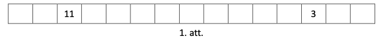
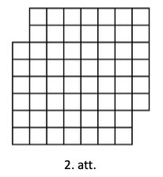

# <lo-sample/> LV.NOL.2023.5.1

Ieraksti katrā tukšajā rūtiņā (skat. 1.att.) vienu skaitli (skaitļi 
var būt arī vienādi) tā, lai katrās trīs blakus rūtiṇās skaitļu summa 
būtu viena un tā pati un visu rūtiṇās ierakstīto skaitļu 
(ieskaitot abus dotos skaitļus) summa būtu $223$. Pietiek parādīt 
vienu veidu, kā to var izdarīt.

{ width=300px }

<small>

* questionType:FindExample
* domain:Alg

</small>

# <lo-sample/> LV.NOL.2023.5.2

Rūķīši mežā ir uzbūvējuši astoṇas mājiṇas un starp tām izveidojuši 
vairākas taciṇas. Katra taciṇa savieno divas mājiņas, 
taciṇas var krustoties. Vai iespējams, ka no mājiņām iziet attiecīgi: 
**(A)** $2, 2, 2, 4, 4, 4, 4, 4$ taciṇas; **(B)** $1,2,2,2,2,3,4,5$ taciṇas?

<small>

* questionType:ProveDisprove,ProveDisprove
* domain:Comb
* LTopic:LTInvariant

</small>

# <lo-sample/> LV.NOL.2023.5.3

Parādi, kā 2.att. figūru ($6 \times 8$ rūtiņu taisnstūris, 
no kura izgriezts $3 \times 4$ rūtiņu taisnstūris), griežot pa 
rūtiņu līnijām, var sagriezt trīs vienādās figūrās! Figūras ir vienādas, 
ja tās var uzlikt vienu uz otras tā, ka abas figūras sakrīt 
(figūras var pagriezt un apmest otrādi).

{ width=250px }

<small>

* questionType:FindExample
* domain:Geom

</small>

# <lo-sample/> LV.NOL.2023.5.4

Parādi, kā skaitli $174$ var uzrakstīt kā $3$ dažādu naturālu skaitļu 
summu tā, lai katru divu šo skaitļu summa dalītos ar trešo skaitli!

<small>

* questionType:FindExample
* domain:NT

</small>

# <lo-sample/> LV.NOL.2023.5.5

Ja automātā ievieto sarkanu monētu, tad tas izdod $5$ zilas monētas, 
bet, ja automātā ievieto zilu monētu, tad tas izdod $3$ sarkanas monētas. 
Vai, atkārtoti izmantojot automātu, ir iespējams iegūt vienāda skaita 
sarkanās un zilās monētas, ja sākumā ir dota viena sarkana monēta?

<small>

* questionType:ProveDisprove
* domain:Comb
* LTopic:LTInvariant

</small>

# <lo-sample/> LV.NOL.2023.6.1

Atrodi vienu veidu, kādi naturāli skaitḷi jāievieto $x, y$ un $z$ vietā, lai vienādība

$$2+\frac{1}{x+\frac{1}{y+\frac{1}{z}}}=\frac{37}{13}$$

būtu patiesa!

<small>

* questionType:FindExample
* domain:Alg

</small>

# <lo-sample/> LV.NOL.2023.6.2

Rūķīši mežā ir uzbūvējuši desmit mājinas un starp tām izveidojuši 
vairākas taciṇas. Katra tacina savieno divas mājiṇas, taciṇas var 
krustoties. Vai iespējams, ka no mājinām iziet attiecīgi:  
**(A)** $2, 2, 2, 2, 2, 3, 3, 3, 3, 7$ tacinas; **(B)** $2, 2, 2, 2, 4, 4, 4, 4, 4, 4$ taciņas?

<small>

* questionType:ProveDisprove
* domain:Comb
* LTopic:LTInvariant

</small>

# <lo-sample/> LV.NOL.2023.6.3

Parādi, kā, griežot pa rūtinuu līnijām, 1.att. doto figūru var sagriezt 
$4$ vienādās figūrās! Figūras ir vienādas, ja tās var uzlikt vienu uz 
otras tā, ka abas figūras pilnīgi sakrīt (figūras var pagriezt un apmest otrādi).

{ width=200px }

<small>

* questionType:FindExample
* domain:Geom

</small>

# <lo-sample/> LV.NOL.2023.6.4

Vai skaitli: **(A)** $72$, **(B)** $73$ var izteikt kā trīs dažādu 
naturālu skaitļu summu tā, lai katru divu šo skaitḷu summa dalītos 
ar atlikušo skaitli?

<small>

* questionType:ProveDisprove,ProveDisprove
* domain:NT

</small>

# <lo-sample/> LV.NOL.2023.6.5

Naturālu skaitli atļauts reizināt ar $2$, kā arī izsvītrot no tā 
pieraksta ciparus $0,3,6,9$ (varbūt tikai kādu no tiem). 
Vai, vairākkārt izpildot šādus gājienus, no skaitla $17$ var iegūt: 
**(A)** skaitli $1$; **(B)** skaitli $15$?

<small>

* questionType:ProveDisprove,ProveDisprove
* domain:NT
* LTopic:LTInvariant

</small>

# <lo-sample/> LV.NOL.2023.7.1

Vai tukšajās rūtiņās (skat. 1.att.) var ierakstīt pa vienam 
naturālam skaitlim tā, lai rezultātā būtu ierakstīti visi naturālie 
skaitḷi no $1$ līdz $25$ un katri divi skaitli, kuru starpība ir $1$, 
būtu ierakstīti rūtiņās ar kopīgu malu?

{ width=200px }

<small>

* questionType:ProveDisprove
* domain:Comb

</small>

# <lo-sample/> LV.NOL.2023.7.2

Vai **(A)** $90$ lampiṇas, **(B)** $73$ lampiṇas ar vadiem var savienot tā, lai katra 
no tām būtu savienota ar vadu ar tieši $5$ citām lampiņām?

<small>

* questionType:ProveDisprove,ProveDisprove
* domain:Comb
* LTopic:LTInvariant

</small>

# <lo-sample/> LV.NOL.2023.7.3

Dots četrstūris $ABCD$, kuram visi lenki ir mazāki nekā $180^{\circ}$, 
$\sphericalangle A=\sphericalangle B$, $BC=1$ un $AD=3$. Pierādīt, ka $CD>2$.

<small>

* questionType:Prove
* domain:Geom
* LTopic:LTStructureAugmentation

</small>

# <lo-sample/> LV.NOL.2023.7.4

Cik ir tādu naturālu skaitļu $n$, kuriem skaitlim $n^{2}$ ir tikpat ciparu, 
cik skaitlim $n^{3}$?

<small>

* questionType:FindCount
* domain:NT

</small>

# <lo-sample/> LV.NOL.2023.7.5

Kastē atrodas baltas, sarkanas un zaḷas lodītes. Ar vienu gājienu no 
kastes var izṇemt divas dažādu krāsu lodītes un ielikt kastē vienu 
trešās krāsas lodīti (vienmēr pietiek jebkuras krāsas lodīšu, 
ko ielikt kastē). Vai var panākt, ka kastē paliek tikai viena lodīte, 
ja sākumā kastē atrodas:  
**(A)** $10$ baltas, $12$ sarkanas un $16$ zalas lodītes;  
**(B)** $10$ baltas, $12$ sarkanas un $15$ zaḷas lodītes?

<small>

* questionType:ProveDisprove,ProveDisprove
* domain:Comb
* LTopic:LTInvariant

</small>

# <lo-sample/> LV.NOL.2023.8.1

Ieraksti katrā tukšajā rūtiṇā (skat. 1.att.) vienu pirmskaitli 
(skaitḷi var būt arī vienādi) tā, lai katrās četrās blakus 
rūtiņās skaitļu summa būtu viena un tā pati un visu rūtiņās 
ierakstīto skaitļu (ieskaitot abus dotos skaitļus) summa būtu $127$. 
Pietiek parādīt vienu veidu, kā to var izdarīt.

{ width=300px }

<small>

* questionType:FindExample
* domain:NT

</small>

# <lo-sample/> LV.NOL.2023.8.2

Pasākumā satikās $m$ cilvēki. Katrs no tiem draudzējas ar tieši $3$ 
citiem cilvēkiem (ja $A$ draudzējas ar $B$, tad $B$ draudzējas ar $A$). 
Zināms, ka no katriem trim cilvēkiem var atrast divus, kuri savā starpā 
nedraudzējas. Vai var gadīties, ka **(A)** $m=11$, **(B)** $m=10$?

<small>

* questionType:ProveDisprove,ProveDisprove
* domain:Comb
* LTopic:LTInvariant

</small>

# <lo-sample/> LV.NOL.2023.8.3

Dots vienādsānu trijstūris $ABC$, kuram $AB = BC$. Uz malas $AB$ 
izvēlēts punkts $M$ un uz malas $BC$ izvēlēts punkts $K$ tā, 
ka $AM = AK = AC$. Zināms, ka $AK \perp MC$. Aprēḳināt trijstūra $ABC$ leṇkus!

<small>

* questionType:FindAll
* domain:Geom
* LTopic:LTStructureAugmentation

</small>

# <lo-sample/> LV.NOL.2023.8.4

Parādi, kā, griežot pa rūtiṇu līnijām, 2.att. doto figūru var 
sagriezt $4$ vienādās figūrās! Figūras ir vienādas, ja tās var 
uzlikt vienu uz otras tā, ka abas figūras sakrīt (figūras var 
pagriezt un apmest otrādi).

{ width=200px }

<small>

* questionType:FindExample
* domain:Geom

</small>

# <lo-sample/> LV.NOL.2023.8.5

Pa apļveida trasi vienā virzienā Kārlis skrien ar kājām un Sandris 
brauc ar skrejriteni, bet pretējā virzienā Vilnis brauc ar velosipēdu 
un Mārtiṇš ar mopēdu (katrs brauc ar savu, nemainīgu ātrumu). Zināms, 
ka Kārlis satiek Vilni ik pēc $12$ minūtēm, Sandris apdzen Kārli ik 
pēc $20$ minūtēm, bet Mārtiṇš apdzen Vilni ik pēc $5$ minūtēm. 
Cik bieži Mārtiṇš satiek Sandri?

<small>

* questionType:FindAll
* domain:Alg

</small>

# <lo-sample/> LV.NOL.2023.9.1

Dots, ka $x$ ir naturāls skaitlis. Kāds lielākais skaits skaitļu 
$x$; $x+2$; $x+4$; $x+6$; $x+8$ vienlaicīgi var būt pirmskaitḷi?

<small>

* questionType:FindOptimal
* domain:NT

</small>

# <lo-sample/> LV.NOL.2023.9.2

Novadijā dzīvo $73$ rūḳi un daži no tiem savā starpā draudzējas 
(ja rūḳis $\mathrm{A}$ draudzējas ar rūḳi B, tad arī B draudzējas 
ar $A$, tas ir, draudzība ir abpusēja). Vai var būt tā, ka katram 
rūķim ir tieši $9$ draugi?

<small>

* questionType:ProveDisprove
* domain:Comb
* LTopic:LTInvariant

</small>

# <lo-sample/> LV.NOL.2023.9.3

Punkts $X$ ir izliekta četrstūra $ABCD$ diagonāles $AC$ viduspunkts. 
Zināms, ka $CD \| BX$. Aprēķināt $AD$ garumu, ja $BX=3, BC=7$ un $CD=6$.

<small>

* questionType:FindAll
* domain:Geom
* LTopic:LTStructureAugmentation

</small>

# <lo-sample/> LV.NOL.2023.9.4

Atrast visus tādus reālu skaitļu pārus $(x;y)$, kuriem

$$\left(x^{4}+1\right)\left(y^{4}+1\right)=4 x^{2} y^{2}$$

<small>

* questionType:FindAll
* domain:Alg
* LTopic:LTExpressionTransforms

</small>

# <lo-sample/> LV.NOL.2023.9.5

Dabas rezervātā katra koka vecums gados izsakāms kā naturāls skaitlis. 
Koku vidējais vecums pirms vakardienas negaisa bija tieši $72$ gadi. Negaisa 
laikā Zibens spēriena dēļ gāja bojā viens $2023$ gadus vecs koks un tagad 
rezervāta koku vidējais vecums ir tieši $71$ gads. Kāds lielākais 
skaits $2023$ gadus vecu koku varēja atrasties rezervātā pirms vakardienas 
negaisa? 

*Piezīme.* Pa šīm divām dienām neviens koks nav kļuvis vecāks.

<small>

* questionType:FindOptimal
* domain:Alg

</small>

# <lo-sample/> LV.NOL.2023.10.1

Noskaidrot, vai skaitlis $\sqrt{4+2 \sqrt{3}}-\sqrt{4-2 \sqrt{3}}$ 
ir racionāls vai iracionāls!

<small>

* questionType:ProveDisprove
* domain:Alg

</small>

# <lo-sample/> LV.NOL.2023.10.2

Uz papīra lapas atzīmēti daži punkti tā, ka nekādi trīs punkti 
neatrodas uz vienas taisnes. Daži punkti ir savienoti ar 
nogriežņiem tā, ka no katra punkta iziet tieši $4$ nogriežṇi. 
Zināms, ka nav uzzīmēts neviens tāds trijstūris, kuram visas 
virsotnes ir dotajos punktos. Kāds ir mazākais skaits punktu, 
kas var būt atzīmēti uz papīra lapas?

<small>

* questionType:FindOptimal
* domain:Comb

</small>

# <lo-sample/> LV.NOL.2023.10.3

Šaurleṇķu trijstūra $ABC$ augstumi krustojas punktā $H$. 
Aprēḳināt četrstūra $ABHC$ laukumu, ja $AH = BC = 8$.

<small>

* questionType:FindAll
* domain:Geom
* LTopic:StructureAugmentation

</small>

# <lo-sample/> LV.NOL.2023.10.4

Atrast lielāko naturālo skaitli $N$ ar īpašību - katram pirmskaitlim 
$p<N$ skaitlis $N+2p$ arī ir pirmskaitlis!

<small>

* questionType:FindOptimal
* domain:NT

</small>

# <lo-sample/> LV.NOL.2023.10.5

Volejbola turnīrā katra komanda spēlēja ar katru tieši vienu reizi; 
neizšķirtu nav. Ir zināms: lai kuru komandu mēs izvēlētos 
(apzīmēsim to ar $K$), tā ir izcīnījusi tieši tikpat uzvaru, 
cik kopā izcīnījušas visas tās komandas, pret kurām $K$ uzvarēja. 
Kāds var būt komandu skaits, kas piedalījās šajā turnīrā? 
(Nevienā turnīrā nav mazāk kā $2$ komandas.)

<small>

* questionType:FindAll
* domain:Comb

</small>

# <lo-sample/> LV.NOL.2023.11.1

Pierādīt, ka $x^{2}+y^{2}+\frac{1}{2} \geq x+y$ visiem reāliem $x$ un $y$.

<small>

* questionType:Prove
* domain:Alg
* LTopic:LTExpressionTransforms

</small>

# <lo-sample/> LV.NOL.2023.11.2

Kādā zemē dzīvo rūķi, katri divi no tiem vai nu draudzējas, 
vai viens otru ienīst. Zināms, ka nav tādu trīs rūḳu,
kas visi viens otru ienīst. Vai noteikti var atrast tādus 
trīs rūḳus, kas visi savā starpā draudzējas, ja šajā zemē ir 
**(A)** $5$ rūķi, **(B)** $6$ rūķi?

<small>

* questionType:ProveDisprove,ProveDisprove
* domain:Comb
* LTopic:LTContradiction

</small>

# <lo-sample/> LV.NOL.2023.11.3

Dots vienādsānu trijstūris $ABC$, kuram $AB = AC$ un 
$\sphericalangle BAC<60^{\circ}$. Riṇka līnija, kuras centrs ir punktā 
$B$ un rādiuss $BC$, krusto trijstūra malas $AC$ un $AB$ 
attiecīgi punktos $D$ un $E$. Aprēķināt $\frac{AD}{DC}$, 
ja $\frac{AE}{EB}=\frac{2}{5}$.

<small>

* questionType:FindAll
* domain:Geom
* LTopic:LTStructureAugmentation

</small>

# <lo-sample/> LV.NOL.2023.11.4

Pierādīt, ka nekādu divu secīgu naturālu skaitļu reizinājums 
nav izsakāms formā $36n+8$, kur $n$ ir naturāls skaitlis!

<small>

* questionType:Prove
* domain:NT
* LTopic:LTContradiction

</small>

# <lo-sample/> LV.NOL.2023.11.5

Skaitļu virkni, kurā ir $N$ elementi, sauksim par $N$ mazāko 
naturālo skaitļu permutāciju, ja tajā atrodami visi 
naturālie skaitļi no $1$ līdz $N$.

Zināms, ka virkne $\left\{ a_{i} \right\}$ ir $n$ ($n>3$) mazāko naturālo 
skaitļu permutācija.

Virknes $\left\{ b_{i} \right\}$ ($1 \leq i \leq n-1$) elementus aprēķina 
pēc formulas $b_{i}=\left|a_{i+1}-a_{i}\right|$.

Virknes $\left\{ c_{i} \right\}$ ($1 \leq i \leq n-2$) elementus aprēķina 
pēc formulas $c_{i}=\left|b_{i+1}-b_{i}\right|$.

Pierādīt, ka $\left\{ b_{i} \right\}$ un $\left\{ c_{i} \right\}$ 
vienlaikus abas nevar būt attiecīgi $n-1$ un $n-2$ mazāko 
naturālo skaitļu permutācijas!

<small>

* questionType:Prove
* domain:Comb

</small>

# <lo-sample/> LV.NOL.2023.12.1

Atrast mazāko reālo skaitli $a$, ar kuru visiem reāliem 
skaitliem $x, y, z$ ir spēkā nevienādība:

$$x^{2}+y^{2}+z^{2}+a \geq x + 2y + 3z$$

<small>

* questionType:FindOptimal
* domain:Alg
* LTopic:LTExpressionTransforms

</small>

# <lo-sample/> LV.NOL.2023.12.2

Šaha turnīrā katri divi šahisti ir vai nu izspēlējuši tieši vienu 
šaha partiju, vai arī nav izspēlējuši nevienu partiju. Vai noteikti 
var atrast tādus trīs šahistus, kas savā starpā ir izspēlējuši vai nu 
visas $3$ partijas, vai nevienu partiju, ja turnīrā piedalās 
**(A)** $5$, **(B)** $6$ šahisti?

<small>

* questionType:ProveDisprove,ProveDisprove
* domain:Comb
* LTopic:LTMeanValuePrinciple

</small>

# <lo-sample/> LV.NOL.2023.12.3

Dots vienādsānu trijstūris $ABC$, kuram $AB=AC$ un $\sphericalangle BAC < 60^{\circ}$. 
Rinķa līnija, kuras centrs ir punktā $B$ un rādiuss $BC$, 
krusto trijstūra malas $AC$ un $AB$ attiecīgi punktos $D$ (kas nesakrīt ar $C$) 
un $E$. Pierādīt, ka $AD < 2AE$.

<small>

* questionType:Prove
* domain:Geom

</small>

# <lo-sample/> LV.NOL.2023.12.4

Pierādīt, ka nekādu divu secīgu naturālu skaitļu reizinājums nav izsakāms 
formā $27n+11$, kur $n$ ir naturāls skaitlis.

<small>

* questionType:Prove
* domain:NT
* LTopic:LTExpressionTransforms

</small>

# <lo-sample/> LV.NOL.2023.12.5

Dotas $2023$ kastes, sākumā tajās ir attiecīgi $1, 2, 3, \ldots, 2023$ 
konfektes. Vienā gājienā var izvēlēties naturālu skaitli $n$ un no 
dažām kastēm (varbūt tikai no vienas) apēst $n$ konfektes. 
Kāds ir mazākais gājienu skaits, ar kuru var panākt, 
ka visas kastes ir tukšas?

<small>

* questionType:FindOptimal
* domain:Comb
* LTopic:LTInduction

</small>
