# <lo-sample/> LV.NOL.2024.5.1

Parādi vienu veidu, kādu ciparu var ierakstīt katrā aplîtī, lai iegūtu patiesu vienādību, visi pieci ierakstītie cipari būtu dažādi un neviens no tiem nebūtu 2.

## Atrisinājums 

Der, piemēram, $23 \cdot 26=598$.  
*Piezīme.* Der arī $26 \cdot 29=754$.

# <lo-sample/> LV.NOL.2024.5.2

Uz rūtinu lapas rūtinu krustpunktos atzīmēti $16$ punkti (skat. 1. att.). 
Kāds mazākais skaits punktu jānodzēš, lai nekādi trīs no atlikušajiem punktiem neatrastos uz vienas taisnes?

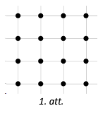

## Atrisinājums 

Mazākais punktu, ko jānodzēš, skaits ir $8$, piemēram, skat. 2. att.

Pamatosim, ka mazāk punktu nodzēst nav iespējams. Katrā rindā ir jānodzēš vismaz divi punkti 
(citādi būs taisne, uz kuras atrodas trīs punkti), tātad kopā ir jānodzēš vismaz $8$ punkti.

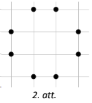

# <lo-sample/> LV.NOL.2024.5.3

Dots kvadrāts ar izmēriem $6 \times 6$ rūtiṇas, kurā dažas rūtiṇas atzīmētas ar 
"$o$" un " $x$ " (skat. 3. att.). Parādi, kā šo kvadrātu sagriezt pa rūtiṇu līnijām 
četrās vienādās dalās tā, lai katra dạla saturētu vienu rūtiṇu, kurā ierakstīts "$o$", 
un vienu rūtiṇu, kurā ierakstīts "$x$"!

*Piezīme.* Figūras ir vienādas, ja tās var uzlikt vienu uz otras tā, ka abas figūras 
sakrīt (figūras var pagriezt un apmest otrādi).

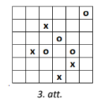

## Atrisinājums 

Skat. 4. att.

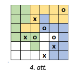

# <lo-sample/> LV.NOL.2024.5.4

Rindā uzrakstīti $2024$ skaitli. Zināms, ka pirmais uzrakstītais skaitlis ir 
$41$ un katru nākamo var iegūt, iepriekšējā skaitļa visu ciparu reizinājumam 
pieskaitot $23$ (piemēram, otrais uzrakstītais skaitlis ir $27$, jo 
$4 \cdot 1+23=27$). Kāds ir pēdējais uzrakstītais skaitlis?

## Atrisinājums 

Pēdējais skaitlis ir $29$. Aprēķinām pirmos dotās virknes skaitļus:

$$\underbrace{41 ; 27 ; 37 ; 44 ; 39 ; 50 ; 23 ; 29}; 41 ; 27 ; 37 ; \ldots$$

levērojam, ka, sākot ar 9. virknes locekli, skaitli sāk periodiski atkārtoties, perioda garums ir 8 skaitli. 
Tã kā $2024$ dalās ar $8$ ($2024: 8=253$), tad 2024. skaitlis būs tāds pats, kā 8. skaitlis, tātad $29$.

# <lo-sample/> LV.NOL.2024.5.5

Ja automātā iemet divus vienādus žetonus, tad tas izdod vienu zaļu žetonu, 
bet, ja iemet divus dažādus žetonus, tad tas izdod vienu dzeltenu žetonu. 
Sākumā Dagmārai bija $20$ dzelteni un $15$ zaḷi žetoni. 
Vai iespējams, ka pēc atkārtotas automāta izmantošanas viṇai palika:   
**(a)** divi zaļi un viens dzeltens žetons,  
**(b)** divi dzelteni un viens zaļš žetons?

## Atrisinājums 

**(a)** Nē, tas nav iespējams. levērosim, ka pēc katras darbības dzelteno žetonu skaits 
vai nu nemainās (tas notiek gadījumos, kad automātā iemet divus zalus žetonus 
vai vienu zalu un vienu dzeltenu žetonu) vai arī samazinās par $2$ 
(tas notiek, ja automātā iemet divus dzeltenus žetonus). 
Tā kā sākumā dzelteno žetonu skaits bija pāra skaitlis, 
tad arī pēc jebkuras darbības tas būs pāra skaitlis. 
Tātad nav iespējams, ka dzelteno žetonu skaits ir $1$ (kas ir nepāra skaitlis).

**(b)** Jā, ir iespējams. Dagmāra varēja rīkoties šādi: vispirms 9 reizes 
iemest automātā 2 dzeltenus žetonus (un saṇemt vienu zaļu), pēc 9 
šādām darbībām vinai paliktu $24$ zaļi žetoni un 2 dzelteni žetoni. 
Pēc tam 23 reizes jāiemet automātā 2 zaļus žetonus, katru reizi automāts atdotu 
$1$ zaļu žetonu, kā rezultātā zaļo žetonu skaits katrā reizē samazinātos par $1$. 
Tātad beigās viņai paliktu 2 dzelteni žetoni un 1 zaļš žetons.

# <lo-sample/> LV.NOL.2024.6.1

Parādi vienu veidu, kādu ciparu var ierakstīt katrā aplîtī, lai iegūtu patiesu vienādību, visi seši ierakstītie cipari būtu dažādi un neviens no tiem nebūtu 3 .

## Atrisinājums 

Der, piemēram, $34 \cdot 37=1258$.  
*Piezīme.* Der arī $37 \cdot 38=1406$.

# <lo-sample/> LV.NOL.2024.6.2

Kāds ir lielākais skaits 7. att. doto figūru, ko var izgriezt no 5. att. dotās figūras, ja jābūt izgrieztām arī tieši divām 6. att. figūrām?

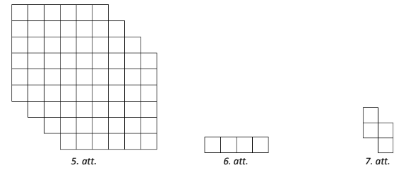

## Atrisinājums 

Lielākais skaits figūru ir $14$, piemēram, skat. 8. att. Pamatosim, ka vairāk 7. att. figūru nevar izgriezt.

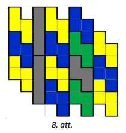

lekrāsojot 5. att. figūru šaha galdiṇa veidā, iegūstam $33$ pelēkas rūtiṇas un $36$ 
baltas rūtinas (skat. 9. att.). Lai kā izgrieztu 6. att. un 7. att. dotās figūras, 
tās vienmēr noklāj tieši 2 pelēkas rūtiṇas (skat. 10. att.). Tas nozīmē, ka no 
5. att. dotās figūras var izgriezt ne vairāk kā 16 figūras, jo 17 figūras noklātu 
jau $17 \cdot 2=34$ pelēkās rūtiṇas. Tā kā jāizgriež divas 6. att. figūras, 
tad 7. att. figūras var izgriezt ne vairāk kā $14$.

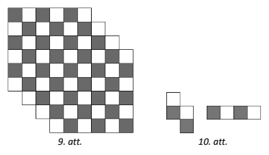

# <lo-sample/> LV.NOL.2024.6.3

Dots kvadrāts ar izmēriem $6 \times 6$ rūtiṇas, kurā dažas rūtinas atzīmētas ar 
"$o$" un " $x$ " (skat. 11. att.). Parādi, kā šo kvadrātu sagriezt pa rūtiṇu 
līnijām četrās vienādās dalās tā, lai katra daḷa saturētu vienu rūtiṇu, 
kurā ierakstīts "$o$", un vienu rūtinu, kurā ierakstīts "$x$"!

*Piezīme.* Figūras ir vienādas, ja tās var uzlikt vienu uz otras tā, 
ka abas figūras sakrīt (figūras var pagriezt un apmest otrādi).

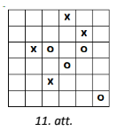

## Atrisinājums 

Skat. 12. att.

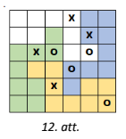

# <lo-sample/> LV.NOL.2024.6.4

Rindā uzrakstīti $2024$ skaitli. Zināms, ka pirmais uzrakstītais skaitlis ir $49$ 
un katru nākamo var iegūt, iepriekšējā skaiț̣a visu ciparu reizinājumam pieskaitot 
$19$ (piemēram, otrais uzrakstītais skaitlis ir $55$, jo $4 \cdot 9+19=55$). 
Kāds ir pēdējais uzrakstītais skaitlis?

## Atrisinājums 

Pēdējais uzrakstītais skaitlis ir $37$. Aprēkinām pirmos dotās virknes skaitļus:

$$49; 55; 44; \underbrace{35; 34; 31; 22; 23; 25; 29; 37; 40; 19; 28}; 35; 34; 31; \ldots$$

Ievērojam, ka, sākot ar 15. virknes locekli, skaitļi sāk periodiski atkārtoties, perioda garums ir $11$. 
Tā kā $2024$ dalās ar $11$ ($2024=11 \cdot 184$), tad 2024. skaitlis būs tāds pats, kā 11. skaitlis, tātad $37$.

*Piezīme.* Var arī spriest, ka meklē virknes, kas sākas ar skaitli 
$35$ (noņemot dotās virknes pirmos trīs skait|us), pēdējo skaitli. 
Tādā gadījumā $2021:11=183$, atlikums $8$, tāpēc meklētais skaitlis ir perioda 8. skaitlis un tas ir $37$.

# <lo-sample/> LV.NOL.2024.6.5

Vai var uzzīmēt tādu slēgtu lauztu līniju no **(a)** $6$ posmiem, **(b)** $7$ posmiem, 
kas katru savu posmu krusto tieši vienu reizi?

*Piezīme.* Par lauztu līniju sauc līniju, kas sastāv no galīga skaita taisnes nogriežṇiem, 
ko sauc par posmiem. Lauztu līniju, kuras galapunkti sakrīt, sauc par slēgtu lauztu līniju.

## Atrisinājums 

**(a)** Jā, var, piemēram, skat. 13. att.

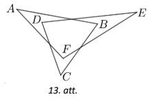

**(b)** Nē, nevar. levērosim, ka šādas lauztās līnijas posmus var sadalīt pa pāriem, 
katrā pāri saliekot divus posmus, kas krustojas. Tātad šādas lauztas līnijas posmu skaitam 
jābūt pāra skaitlim, bet $7$ ir nepāra skaitlis.

# <lo-sample/> LV.NOL.2024.7.1

Katrā tukšajā aplîtī ierakstīt vienu darbību zīmi ($+$,$-$,$\cdot$,$:$) tā, 
lai taisnstūros iegūtās izteiksmju vērtības būtu naturāli skaiți 
un visas sešas kopā saturētu visus ciparus no $1$ līdz $9$, 
katru ciparu tieši vienu reizi! (Iekavas lietot nedrīkst un jāievēro darbību secība.)

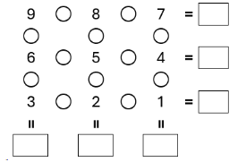

## Atrisinājums 

Skat. 14. att.

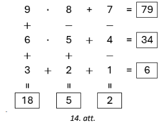

# <lo-sample/> LV.NOL.2024.7.2

Kāda lielākā ciparu summa var būt desmitciparu skaitlim, kas dalās ar $18$?

## Atrisinājums 

Lielākā iespējamā ciparu summa ir $81$. Tāda ir, piemēram, skaitlim $9999999990$, tas dalās, 
gan ar $9$, gan ar $2$, tātad tas dalās arī ar $9 \cdot 2=18$.

Pamatosim, ka lielāka ciparu summa nav iespējama. Lai skaitlis dalītos ar $18$, 
tam jādalās arī ar $9$, tātad tā ciparu summai jādalās ar $9$. 
Lielākā iespējamā desmitciparu skaitla ciparu summa ir $9 \cdot 10=90$. 
Tāda ciparu summa ir tikai skaitlim $9999999999$, tomēr tas nedalās ar $18$. 
Nākamā lielākā iespējamā ciparu summa ir $90-9=81$ (kas dalās ar $9$), 
tātad tā ir meklētā ciparu summa.

# <lo-sample/> LV.NOL.2024.7.3

Plaknē atlikti četri punkti $A, B, C, D$. Zināms, ka $AB=4$, $BC=7$, $CD=10$ un $DA=3$. 
Kāds var būt nogriežņa $AC$ garums, ja zināms, ka tas ir naturāls skaitlis?

## Atrisinājums 

No trijstūra nevienādības $\triangle ABC$ un $\triangle ADC$ 
(pieļaujot, ka punkti atrodas arī uz vienas taisnes) attiecīgi iegūstam:

\begin{itemize}
\item $AC \leq AB+BC=4+7=11$ un $AC \geq BC-AB=7-4=3$;
\item $AC \leq AD+DC=3+10=13$ un $AC \geq CD-AD=10-3=7$.
\end{itemize}

Tātad $AC \geq 7$ un $AC \leq 11$. 
Šiem nosacijumiem atbilst naturālie skaiț̣i $7$; $8$; $9$; $10$ un $11$.

Tã kā dotajiem nogriežṇu garumiem un nogriežṇu garumiem $8$; $9$; $10$ 
izpildās trijstūra nevienādības nosacījumi, tad šādas $AC$ vērtības ir iespējamas. 
Nogriežṇa $A C$ garums var būt $11$, 
tad punkti $A, B, C$ atrodas uz vienas taisnes (tieši šādā secībā),
bet punkts $D$ neatrodas uz šīs taisnes ($\triangle ADC$ eksistē, jo tā malu garumiem 
izpildās trijstūra nevienādība). Nogriežṇa $AC$ garums var būt $7$, 
tad punkti $C,A,D$ atrodas uz vienas taisnes (tieši šādā secībā), 
bet punkts $B$ neatrodas uz šîs taisnes ($\triangle ABC$ eksistē, jo tā malu garumiem 
izpildās trijstūra nevienādība).

# <lo-sample/> LV.NOL.2024.7.4

No 15. att. un 16. att. figūrām, katru izmantojot vismaz vienu reizi, 
salikt taisnstūri, kurā 16. att. figūras nesaskaras ne ar malu, ne ar stūri! Figūras drīkst pagriezt.

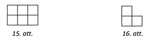

## Atrisinājums 

Skat., piemēram, 17. att.

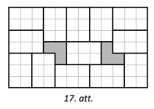

# <lo-sample/> LV.NOL.2024.7.5

Konditorejā nopērkamas 10 tortes, to cena ir attiecīgi 
$20 ; 21 ; 22 ; 23 ; 24 ; 25 ; 26 ; 27 ; 28 ; 29$ eiro 
(katra torte ir tieši vienā eksemplārā). Konditorejā viens pēc otra iegriezās $3$ gardēži, 
katrs no tiem nopirka sev dažas tortes, turklāt katrs iztērēja ne vairāk kā $85$ eiro. 
Pierādīt, ka pēc gardēžu apmeklējuma vismaz viena torte vēl palika nenopirkta!

## Atrisinājums 

levērosim, ka katrs gardēdis varēja nopirkt ne vairāk kā 3 tortes, jo pat 
$4$ vislētākās tortes kopā maksā 86 eiro $(20+21+22+23=86)$. Tātad visi trīs gardēži 
kopā varēja nopirkt ne vairāk kā $3 \cdot 3 = 9$ tortes, tātad vismaz viena torte palika nenopirkta.

## Atrisinājums 

Pienemsim pretējo, ka trīs gardēži kopā nopirkuši visas tortes. 
Tad pēc Dirihlē principa var atrast gardēdi, kurš ir nopircis vismaz $4$ tortes. 
Bet pat 4 vislētākās tortes kopā maksā $20+21+22+23=86$, kas ir vairāk nekā 
katrs gardēdis ir iztērējis ($85$ eiro). Tātad kopā nopirka ne vairāk kā $3 \cdot 3=9$ tortes, 
līdz ar to vismaz viena torte palika nenopirkta.

# <lo-sample/> LV.NOL.2024.8.1

Vai iespējams, sareizinot sešus dažādus pirmskaiț̣us, iegūt sešciparu skaitli, kam visi cipari ir vienādi?

## Atrisinājums 

Jā, var, piemēram, der sešciparu skaitlis $222222=2 \cdot 3 \cdot 37 \cdot 7 \cdot 11 \cdot 13$.

*Piezīme.* Der arī skaitlis $555555=5 \cdot 3 \cdot 37 \cdot 7 \cdot 11 \cdot 13$.

# <lo-sample/> LV.NOL.2024.8.2

Vienādsānu trijstūrī $ABC$ ($AB=AC$) uz malām $BC$ un $AC$ atlikti attiecīgi punkti 
$D$ un $E$ tā, lai $AE=AD$ un $\sphericalangle BAD=30^{\circ}$. Aprēk̄ināt leṇki $CDE$.

## Atrisinājums 

Tā kā $AB=AC$, tad $\sphericalangle B=\sphericalangle C=\alpha$ (skat. 18. att.). 
No trijstūra $ABC$ iekšējo leṇku summas iegūstam, ka 
$\sphericalangle BAC=180^{\circ}-2 \cdot \sphericalangle B=180^{\circ}-2 \alpha$. 
Tātad 
$$\sphericalangle DAE=\sphericalangle BAC-\sphericalangle BAD=180^{\circ}-2 \alpha-30^{\circ}=150^{\circ}-2 \alpha.$$ 

Tā kā $AD=AE$, tad trijstūris $ADE$ ir vienādsānu un 
$$\sphericalangle ADE = \sphericalangle AED=\left(180^{\circ}-\sphericalangle DAE \right): 2=\left(180^{\circ}-\left(150^{\circ}-2 \alpha\right)\right): 2=15^{\circ}+\alpha.$$ 

Ievērojam, ka 
$$\sphericalangle DEC=180^{\circ}-\sphericalangle AED=180^{\circ}-\left(15^{\circ}+\alpha\right)=165^{\circ}-\alpha.$$ 
Izmantojot trijstūra iekšējo leņķu summu $\triangle DEC$, iegūstam, ka 
$$\sphericalangle CDE=180^{\circ}-\sphericalangle DEC-\sphericalangle ECD=180^{\circ}-\left(165^{\circ}-\alpha\right)-\alpha=15^{\circ}.$$

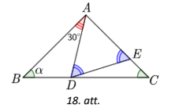

# <lo-sample/> LV.NOL.2024.8.3

Uz rūtiṇu lapas rūtịnu krustpunktos atzīmēti $25$ punkti (skat. 19. att.). 
Kāds mazākais skaits punktu jānodzēš, lai nekādi trīs no atlikušajiem punktiem neatrastos uz vienas taisnes?

Piezīme. levēro, ka uz vienas taisnes atrodas ne tikai punkti, kas atrodas vienā rindā, 
kolonnā vai diagonālē, bet arī, piemēram, punkti $A, B, C$ (skat. 20. att.)!

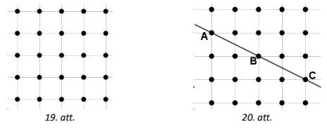

## Atrisinājums 

Mazākais punktu, ko jānodzēš, skaits ir $15$, piemēram, skat. 21. att.

Pamatosim, ka mazāk punktu nodzēst nav iespējams. Katrā rindā ir jānodzēš vismaz 
trīs punkti (citādi būs taisne, uz kuras atrodas trīs punkti), tātad kopā ir jānodzēš vismaz $15$ punkti.

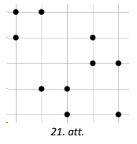

# <lo-sample/> LV.NOL.2024.8.4

Konditorejā nopērkamas $16$ tortes, to cena ir attiecīgi $30; 31; 32; \ldots; 45$ eiro 
(katra torte ir tieši vienā eksemplārā). Konditorejā viens pēc otra iegriezās $5$ gardēži, 
katrs no tiem nopirka sev dažas tortes, turklāt katrs iztērēja ne vairāk kā $125$ eiro. 
Pierādīt, ka pēc gardēžu apmeklējuma vismaz viena torte vēl palika nenopirkta!

## Atrisinājums 

Ievērosim, ka katrs gardēdis varēja nopirkt ne vairāk kā $3$ tortes, 
jo pat $4$ vislētākās tortes kopā maksā $126$ eiro $(30+31+32+33=126)$. 
Tātad visi trīs gardēži kopā varēja nopirkt ne vairāk kā $3 \cdot 5 = 15$ tortes, 
tātad vismaz viena torte palika nenopirkta.

## Atrisinājums 

Pien̦msim pretējo, ka trīs gardēži kopā nopirkuši visas tortes. 
Tā kā $16=5 \cdot 3+1$, tad pēc Dirihlē principa var atrast gardēdi, 
kurš ir nopircis vismaz $4$ tortes. Bet pat 4 vislētākās tortes kopā maksā 
$30+31+32+33=126$, kas ir vairāk nekā katrs gardēdis ir iztērējis ($125$ eiro). 
Tātad kopā nopirka ne vairāk kā $3 \cdot 5=15$ tortes, lî̀z ar to vismaz viena torte palika nenopirkta.

# <lo-sample/> LV.NOL.2024.8.5

Vai **(a)** 22. att., **(b)** 23. att. dotā kvadrāta rūtiṇās var ierakstīt 
deviṇus dažādus naturālus skaitlus tā, lai katrā rūtiņā būtu ierakstīts 
viens skaitlis un katrā rindā un katrā kolonnā skaitli pieaugtu bultiņas norādītajā virzienā?

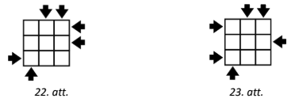

## Atrisinājums 

**(a)** Jā, var, piemēram, skat. 24. att.

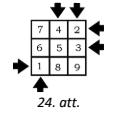

**(b)**  Nē, nevar. Aplūkosim rūtiṇas $B1$, $B2$, $B3$, $B4$ (skat. 25. att.). 
Ņemot vērā bultiņu virzienu, skaițliem jābūt sakārtotiem šādi: 
$B1 < B2 < B3 < B4 < B1$. Tā kā skaitlis nevar būt mazāks pats par sevi, 
tad šāds skaitļu izvietojums nav iespējams.

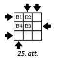