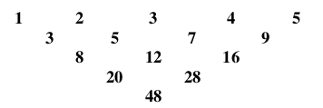

# <lo-sample/> LV.VOL.2000.9.1

Dots, ka $n$ - vesels skaitlis. Cik daudzi no skaitļiem $n^2+1$,
$n(n+1)$ un $3n^3-2$ ir pāra skaitļi?

<small>

* questionType:FindCount
* domain:NT

</small>

# <lo-sample/> LV.VOL.2000.9.4

Kurus no skaitļiem $1$; $55$; $56$; $7$; $36$ var izsacīt formā
$\frac{1}{a_1} + \frac{2}{a_2} + \ldots + \frac{10}{a_{10}}$, 
kur $a_1, a_2, \ldots, a_{10}$ - naturāli skaitļi, starp
kuriem var būt arī vienādi?

<small>

* questionType:FindCount
* domain:Alg

</small>

# <lo-sample/> LV.VOL.2000.10.2

Kādu mazāko naturālo skaitli var iegūt kā vērtību, ievietojot
iekavas izteiksmē $15:14:13:12:11:10:9:8:7:6:5:4:3:2$?

<small>

* questionType:FindOptimal
* domain:Alg

</small>

# <lo-sample/> LV.VOL.2000.11.2

Dots, ka $a$ un $b$ - naturāli skaitļi. Ir zināms arī, ka izteiksmes
$a + \frac{b}{a} - \frac{1}{b}$
vērtība ir naturāls skaitlis.  
**(A)** Pierādīt, ka šīs izteiksmes
vērtība ir kāda naturāla skaitļa kvadrāts.  
**(B)** Vai jebkuram
naturālam $n$ var atrast tādus naturālus 
$a$ un $b$, ka $a + \frac{b}{a} - \frac{1}{b} = n^2$?

<small>

* questionType:Prove,ProveDisprove
* domain:NT

</small>

# <lo-sample/> LV.VOL.2000.11.4

Doti seši dažādi iracionāli skaitļi. Pierādīt, ka no tiem var
izvēlēties $3$ skaitļus (apzīmēsim tos ar $x$, $y$, $z$) tā, ka visi trīs
skaitļi $x+y$, $x+z$, $y+z$ ir iracionāli.

<small>

* questionType:Prove
* domain:Alg

</small>

# <lo-sample/> LV.VOL.2000.12.5

Doti $12$ dažādi naturāli skaitļi. Katriem $5$ no tiem mazākais
kopīgais dalāmais ir viens un tas pats skaitlis $M$. Ir zināms,
ka no dotajiem $12$ skaitļiem var izvēlēties $x$ skaitļus tā, ka
katri divi no izvēlētajiem ir savstarpēji pirmskaitļi.  
**(A)** pierādīt, ka $x \leq 4$,  
**(B)** pierādīt: var gadīties, ka $x=4$.

<small>

* questionType:Prove,Prove
* domain:NT

</small>

# <lo-sample/> LV.VOL.2001.9.1

Sienāža lēciena garums ir $5$. Viņš sākotnēji atrodas punktā ar
koordinātām $(0;0)$ un var pārvietoties tikai pa punktiem, kam abas
koordinātas ir veseli skaitļi.  
**(A)** Pierādīt, ka sienāzis var nokļūt punktā ar koordinātām $(1;0)$,  
**(B)** Vai sienāzis var nokļūt jebkurā punktā ar veselām koordinātām?

<small>

* questionType:Prove,ProveDisprove
* domain:NT
* topic:PythagoreanTriples
* topic:BezoutIdentity

</small>

# <lo-sample/> LV.VOL.2001.9.2

Naturāla skaitļa $A$ ciparus uzrakstīja pretējā secībā un ieguva skaitli $B$.
Izrādījās, ka $B$ dalās ar $A$. Kāds var būt dalījums?

<small>

* questionType:FindAll
* domain:NT

</small>

# <lo-sample/> LV.VOL.2001.10.5

Kādiem naturāliem skaitļiem $n$ piemīt sekojoša īpašība: nosvītrojot
skaitļa $2^n$ pirmo ciparu, iegūst divnieka pakāpi ar naturālu kāpinātāju?

<small>

* questionType:FindAll
* domain:NT
* topic:CountingObjects
* topic:PeriodicRemainders
* topic:DivisibilityRulesFor3And9
* topic:IntegerFactorization

</small>

## Atrisinājums

Ar eksperimentēšanu atrodam, ka
divnieka pakāpes $32$ un $64$ der. 
Nosvītrotās skaitļa daļas vērtība ($30$ vai $60$) abos gadījumos ir $15$ daudzkārtnis. 
Piemēram:

$$2^6-2^2 = 2^2(2^4-1)=2^2(8+4+2+1).$$ 

Lai $2^n - 2^m = 2^m(2^{n-m}-1)$ būtu nosvītrojamais cipars, šai izteiksmei jādalās ar $5$.
Pakāpes $2^{n-m}$ dalot ar $5$, iegūst šādus atlikumus:

| $n-m$             | 0   | 1   | 2   | 3   | 4   | 5   | 6   | 7   | 8   |
| ----------------- | --- | --- | --- | --- | --- | --- | --- | --- | --- |
| $2^{n-m} \pmod 5$ | 1   | 2   | 4   | 3   | 1   | 2   | 4   | 2   | 1   |
| $2^{n-m} \pmod 3$ | 1   | 2   | 1   | 2   | 1   | 2   | 1   | 2   | 1   |

Tā kā $n-m \neq 0$ un vajag, lai $2^{n-m}-1$ dalās ar $5$, iegūstam, ka $n-m > 0$
dalās ar $4$. Tad $2^{n-m}$ ir $16$, $256$, $4096$, $65536$ utt.   

**Secinājums:** Ja $2^{n-m} - 1$ dalās ar $5$, tad tas
dalās arī ar $3$. To var ieraudzīt tabuliņā, jo arī atlikumi (mod 3) ir periodiski. 
Un tā kā $n-m$ dalās ar $4$, tad tas dalīsies arī ar $2$. 

Izsvītrotais cipars pareizināts ar $10$ pakāpi 
ir $2^m\cdot{}(2^{n-m}-1)$. Šī skaitļa ciparu summai jādalās ar $3$, bet ne ar $9$. 
Vienīgi cipari $3$, $6$ apmierina šo īpašību, tātad 
$2^m\cdot{}(2^{n-m}-1)$ ir vai nu $3 \cdot 10^k$ vai  $6 \cdot 10^k$. 
Bet ja šie skaitļi ir lielāki par $30$ vai $60$, tad
dalot $300$, $600$ (vai $3000$, $6000$ utt.) ar divnieka pakāpēm, 
iegūsim tikai pirmreizinātājus $3$ un $5$.

# <lo-sample/> LV.VOL.2001.11.1

Pierādīt, ka
$\sqrt[3]{5\sqrt{2} + 7} - \sqrt[3]{5\sqrt{2} - 7} = 2$.

<small>

* questionType:Prove
* domain:Alg

</small>

# <lo-sample/> LV.VOL.2001.11.3

Atrisināt naturālos skaitļos vienādojumu $x^2+3^x=y^2$.

<small>

* questionType:FindAll
* domain:NT

</small>

# <lo-sample/> LV.VOL.2001.12.3

Atrisināt naturālos skaitļos vienādojumu $x^2-y!=2001$. (Piezīme: ar $y!$
saprot visu naturālo skaitļu reizinājumu no $1$ līdz $y$ ieskaitot.)

<small>

* questionType:FindAll
* domain:NT

</small>

# <lo-sample/> LV.VOL.2002.9.1

Par naturāliem skaitļiem $x$ un $y$ zināms, ka 
$30<x<40<y<50$ un $xy$ ir kāda vesela 
skaitļa kubs. Kādas ir $x$ un $y$ vērtības?

<small>

* questionType:FindAll
* domain:NT
* topic:FactorizationAndProperties
* topic:ExhaustionMethod

</small>

## Atrisinājums

Kādi skaitļi ir pilni kubi

* Reizinājums $xy$ ir pilns kubs, ja ikviena $xy$ 
  pirmreizinātāja pakāpe dalās ar $3$.
* Daudzas $x,y$ vērtības (kas satur tādus pirmreizinātājus $p$, 
  kas nav kvadrātā, kam nevar piereizināt $p^2$), var izslēgt:

$$\left\{ 
\begin{array}{l}
x \neq 31;\;33;\;34;\;35;\;37;\;38;\;39\\
y \neq 41;\;42;\;43;\;44;\;45;\;46;\;47;\;49\\
\end{array} \right.$$

Šķirojam gadījumus:

* Pirmreizinātājus $5$ un $7$ izmantot nav iespējams, jo $y=49$ 
  varētu salikt kopā vienīgi ar $x=35$, bet tad kāpinātājs pie
  $5$ nedalītos ar trīs (jo $x,y \in (25;50)$). 
* Paliek  tikai pirmskaitļi $2$ un $3$ un šādas vērtības:

$$x = 32;\;36\;\;\mbox{un}\;\;y=48.$$

Der vienīgi $x=36$, $y=48$. Tad $xy=2^63^3$ un $\sqrt[3]{xy}=12$.

# <lo-sample/> LV.VOL.2002.10.4

Kādiem naturāliem skaitļiem $n$ skaitlis $n\cdot{}2^{n-1}$ 
ir naturāla skaitļa kvadrāts?

<small>

* questionType:FindAll
* domain:NT

</small>

# <lo-sample/> LV.VOL.2002.10.5

Uz tāfeles sākotnēji pa reizei uzrakstīti veselie skaitļi no $0$ līdz
$1024$ ieskaitot. Spēlētāji $A$ un $B$ spēlē sekojošu spēli.
Vispirms $A$ nodzēš $2^9=512$ skaitļus. Pēc tam $B$ nodzēš $2^8=256$
skaitļus. Pēc tam $A$ nodzēš $2^7=128$ skaitļus. Pēc tam $B$ nodzēš
$2^6 =64$ skaitļus utt., kamēr ar pēdējo gājienu $B$ nodzēš $2^0=1$
skaitli. Uz tāfeles paliek divi skaitļi; apzīmēsim tos ar $x$ un $y$.
Spēlētājs $A$ vēlas, lai $\left| x-y \right|$ būtu iespējami liels; 
$B$ vēlas, lai $\left| x-y \right|$ būtu iespējami mazs. 
Cik lielu $\left| x-y \right|$ vērtību $A$ var
sasniegt?

<small>

* questionType:FindAll
* domain:Comb

</small>

# <lo-sample/> LV.VOL.2002.11.2

Vienā kaudzītē ir $m$ konfektes, otrā - $n$ konfektes. 
Ar vienu gājienu var vai nu apēst vienu konfekti, 
vai apēst pa vienai konfektei no katras kaudzītes, vai arī
pārlikt vienu konfekti no vienas kaudzītes uz otru. 
Kas nevar izdarīt gājienu, zaudē. Andris un Juris 
izdara pa vienam gājienam pēc kārtas; pirmais iet
Andris. Kurš uzvar, pareizi spēlējot?

<small>

* questionType:Algorithm
* domain:Comb

</small>

# <lo-sample/> LV.VOL.2002.11.5

Kuriem naturāliem skaitļiem $n$, kas lielāki par $3$ 
un nedalās ar $3$, izpildās
īpašība: visi tie naturālie skaitļi, kas mazāki par $n$ 
un kuru lielākais kopīgais dalītājs ar $n$ ir $1$, 
veido aritmētisku progresiju?

<small>

* topic:IntegerFactorization
* topic:ArithmeticAndGeometricSeries
* questionType:FindAll
* domain:NT

</small>

## Atrisinājums

* Der visi pirmskaitļi $n>3$, jo skaitļi, kas mazāki par $n$
  un kas ir savstarpēji pirmskaitļi ar $n$ ir šie:
  $1,2,\ldots,n-2,n-1$.
* Der visas pakāpes $2^k > 3$, jo savstarpēji pirmskaitļi 
  ir visi nepāru skaitļi: $1,3,5,\ldots,2^k-3,2^k-1$.

Neder citi skaitļi

Pieņemsim, ka $n = (2k+1)2^m$ ir pāru skaitlis, kas nav $2$ pakāpe un nedalās ar $3$. 
Ja $n$ ir pāru skaitlis, tad $2k+1 > 1$ un tam ir nepāra dalītājs. 
Tāpēc progresijā $1,3,\ldots,n-1$ būs kāds skaitļa $n$ dalītājs.
Līdzīgu iemeslu dēļ neder arī nepāru skaitļi, kas nav pirmskaitļi, bet 
nedalās ar $3$. 

# <lo-sample/> LV.VOL.2002.12.1

Ja $a$ un $b$ - naturāli skaitļi, tad ar $(a,b)$ apzīmējam 
$a$ un $b$ lielāko kopīgo dalītāju. Atrast lielāko iespējamo 
$(4n+3,6n+1)$ vērtību, ja $n$ - naturāls skaitlis.

<small>

* questionType:FindOptimal
* domain:NT

</small>

# <lo-sample/> LV.VOL.2003.9.1

Naturālu skaitli sauc par simetrisku, ja, izlasot tā decimālo
pierakstu no otra gala, iegūst to pašu skaitli. Piemēram,
simetriski ir skaitļi $111$; $424$; $88$; $5225$; $7$. 
Ir zināms, ka visi sešciparu simetriskie naturālie skaitļi 
dalās ar naturālu skaitli $x$. Kādas var būt $x$ vērtības?

<small>

* questionType:FindAll
* domain:NT
* topic:DivisibilityRuleFor11
* topic:ExtremeElementMethod
* topic:EuclideanAlgorithm

</small>

## Atrisinājums

Skaitlis $\overline{abccba} = 100001a + 010010b + 001100c$ 
noteikti dalās ar $11$ (dalāmības pazīme, kā arī $100001$, 
$10010$, $1100$ dalās ar $11$). 

Vai $11$ ir lielākais kopīgais dalītājs visiem sešciparu simetriskajiem 
skaitļiem (tātad - lielākā iespējamā $x$ vērtība)? 
Atrodam lielāko kopīgo dalītāju simetriskiem sešciparu skaitļiem  
$100001$ un $101101$:
$$\mbox{LKD}(101101,100001) = \mbox{LKD}(100001,1100).$$ 
* Skaitlis $1100 = 2^2 \cdot 5^2 \cdot 11$, bet
ar $2$ un $5$ nedalās $100001$. 

Tātad $x=11$ ir lielākā $x$ vērtība. Var būt arī vērtība $x=1$. 

# <lo-sample/> LV.VOL.2003.10.2

Dots, ka $a$ un $b$ ir naturāli skaitļi, pie tam $a$ nedalās ar $5$. 
Skaitļu virkni $x_1, x_2, x_3, \ldots$ 
veido sekojoši: $x_1 = 5$, $x_{n+1} = ax_n + b$, ja $n=1;2;3;\ldots$. 
Kādai lielākajai $k$ vērtībai iespējams, ka visi skaitļi
$x_1;x_2;x_3;\ldots;x_k$ ir pirmskaitļi?

<small>

* questionType:FindOptimal
* domain:NT

</small>

# <lo-sample/> LV.VOL.2003.11.2

Naturālu skaitļu virknē $a_1, a_2, \ldots$ pirmo locekli $a_1$ izvēlas
patvaļīgi, un pie $n \geq 1$ pastāv vienādība $a_{n+1} = a_n^3 + 2003$. 
Kāds lielākais daudzums virknes locekļu var būt naturālu skaitļu
kvadrāti?

<small>

* questionType:FindOptimal
* domain:NT

</small>

# <lo-sample/> LV.VOL.2003.12.1

Vai eksistē  
**(A)** tādi naturāli skaitļi $x$, $y$ un $z$, 
kas lielāki par $1$, ka $x! \cdot y! = z!$?  
**(B)** tādi naturāli skaitļi $a, b, c, d, e$, kas lielāki par $1$, ka
$a! \cdot b! \cdot c! \cdot d! = e!$?

<small>

* questionType:ProveDisprove,ProveDisprove
* domain:NT

</small>

# <lo-sample/> LV.VOL.2003.12.4

"Tabulā" augšējā rindiņā pēc kārtas izrakstīti naturāli skaitļi no $1$ līdz $5$;
nākošajās rindiņās katrs skaitlis vienāds ar abu virs tā uzrakstīto
skaitļu summu. Kāds skaitlis atrodas apakšējā "virsotnē" tabulā, kas
veidota līdzīgi un kuras augšējā rindiņā izrakstīti 
naturāli skaitļi no $1$ līdz $2003$ ieskaitot?  

<small>

* questionType:FindAll
* domain:Alg

</small>

# <lo-sample/> LV.VOL.2004.9.3

Jānītis grib uzrakstīt $n$ dažādus naturālus skaitļus tā, lai nekādu
sešu uzrakstīto skaitļu summa nedalītos ar $6$.
Vai tas ir iespējams, ja  
**(A)** $n=10$,  
**(B)** $n=11$?

<small>

* questionType:ProveDisprove,ProveDisprove
* domain:NT

</small>

# <lo-sample/> LV.VOL.2004.10.3

Uz tāfeles uzrakstīti dažādi pirmskaitļi, to vidējais aritmētiskais
ir $27$.
Kāds vislielākais pirmskaitlis var būt uzrakstīts uz tāfeles?

<small>

* questionType:FindOptimal
* domain:NT

</small>

# <lo-sample/> LV.VOL.2004.11.2

Kādiem pirmskaitļiem $a$ un $b$ skaitlis $a^2 + 3ab + b^2$ ir naturāla
skaitļa kvadrāts?

<small>

* questionType:FindAll
* domain:NT

</small>

# <lo-sample/> LV.VOL.2004.12.5

Dots, ka $x_1 = 3$, $y_1 = 4$ un katram naturālam $n$ pastāv sakarība

$$x_{n+1} = 3x_n + 2 y_n,\;\; y_{n+1} = 4x_n + 3y_n.$$

Pierādīt, ka neviens no skaitļiem $y_1, y_2, y_3, \ldots$
nav naturāla skaitļa kubs.

<small>

* questionType:Prove
* domain:NT

</small>

