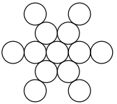
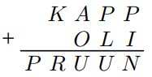

# &nbsp;

<h1 style="font-size:28pt">Skaitļu teorija: Igaunijas olimpiādes, 10.kl.</h1>

* EE.PK - Eesti Piirkonnavoor (Igaunijas reģionu kārta)
* EE.LO - Eesti Lõppvoor (Igaunijas gala/valsts kārta)
* EE.LVS - Eesti Sügisene lahtine võistlus (Igaunijas rudens atvērtais konkurss)
* <blue>**EE.LVT** - **Eesti Talvine lahtine võistlus** (Igaunijas ziemas atvērtais konkurss)</blue>
* EE.TST - Eesti võistkonna valikvõistlus (Igaunijas IMO "Team Selection Test")

[Matemaatikaolümpiaadid ](http://www.math.olympiaadid.ut.ee/html/index.php)

# <lo-sample/> EE.LVT.2009.9_10.1

Atrast visus vienādojuma $xy-3x+7y = 2030$ atrisinājumus 
naturālos skaitļos.

<!--
ru=
Найти все решения уравнения $xy-3x+7y = 2030$ в положительных целых
числах.
-->

<!--
questionType=Find.All
genre=integer-equation
-->

# <lo-sample/> EE.LVT.2009.9_10.5

Sauksim naturālu skaitli $n$ par *pirmskaittiecīgu*, ja 
eksistē vismaz trīs tādi pirmskaitļi, kuriem nodzēšot pēdējo 
ciparu, iegūst skaitli $n$. Pierādīt, ka jebkuri 
divi naturāli pirmskaittiecīgi skaitļi atšķiras vismaz par $3$. 

<!--
ru=
Назовём положительное целое число n простолюбивым, если найдутся
по крайней мере три таких простых числа, при стирании последней 
цифры которых получается число n. Доказать, что любые два простолюбивых
положительных целых числа различаются по крайней мере на $3$.
-->

<!--
questionType=Prove.ForAll
genre=digit-manipulation
concepts=primes
-->

# <lo-sample/> EE.LVT.2009.11_12.3

Sauksim naturālu skaitli $n$ par *tīru*, ja tas neietilpst nevienā
veselu skaitļu virknē
$c_0, c_1, c_2, \ldots$ , kur $0 < c_0 < n$,
un ko visiem $i > 0$ definē šādi:
$$c_i = \left\{
\begin{array}{ll}
\frac{c_{i-1}}{2}, & \mbox{ja $c_{i−1}$ ir pāru,}\\
3c_{i-1} - 1, & \mbox{ja $c_{i-1}$ ir nepāru.}
\end{array} \right.$$
Piemēram, skaitlis $10$ nav tīrs, jo tas ietilpst virknē 
$5, 14, 7, 20, 10, \ldots$, kas apmierina virknes nosacījumus.  
a) Vai katrs naturāls skaitlis, kurš dalās ar $3$, ir tīrs?  
b) Pierādīt, ka, ja $n > 1$ ir tīrs, bet nedalās ar $3$, tad
skaitlis $n + 1$ dalās ar $6$.

<!--
ru=
Назовём положительное целое число $n$ чистым, если оно не содержится
ни в какой последовательности целых чисел 
$c_0, c_1, c_2, \ldots$ , где $0 < c_0 < n$,
и при каждом $i > 0$
$$c_i = \left\{ 
\begin{array}{ll}
\frac{c_{i-1}}{2}, & \mbox{если $c_{i−1}$ чётно,} \\
$3c_{i-1} - 1, & \mbox{если $c_{i-1}$ нечётно.}
\end{array} \right.$$
Например, число $10$ не является чистым, так как оно содержится в последовательности 
$5, 14, 7, 20, 10, \ldots$, удовлетворяющей условиям задачи.  
а) Является ли каждое делящееся на $3$ положительное целое число чистым?  
б) Доказать, что если целое число $n > 1$ чистое, но не делится на $3$, то
число $n + 1$ делится на $6$.
-->

<!--
questionType=ProveDisprove.ForAll,Prove.ForAll
genre=sequence-properties
-->

# <lo-sample/> EE.LVT.2010.9_10.1

Atrast visus naturālos skaitļus, kuru pierakstā nav vairāk par četriem
cipariem, un kuri, nodzēšot pirmo ciparu, samazinās tieši $25$ reizes
(pēc nodzēšanas skaitlis var sākties arī ar ciparu $0$). 

<!--
ru=
Найти все не более чем четырёхзначные положительные целые числа, 
которые при стирании первой цифры уменьшаются ровно в 25 раз 
(оставшееся число может начинаться и на цифру 0).
-->

<!--
questionType=Find.All
genre=digit-manipulation
-->

# <lo-sample/> EE.LVT.2010.9_10.1

Aplūkosim naturālus skaitļus $N$, kuriem ir tieši $6$ 
pozitīvi dalītāji - apzīmēsim šos dalītājus ar 
$d_1,\ldots,d_6$, turklāt
$1 = d_1 < d_2 < d_3 < d_4 < d_5 < d_6 = N$. 
Sauksim skaitli $N$ par *labu*, ja summa
$d_4 + d_5$ dalās ar summu $d_2 + d_3$.  
a) Atrast mazāko naturālo skaitli $N$, kuram ir tieši
$6$ pozitīvi dalītāji un kurš nav labs.  
b) Pierādīt, ka atradīsies bezgalīgi daudz naturālu skaitļu
$N$, kuriem ir tieši $6$ pozitīvi dalītāji un kuri nav labi.

<!--
ru=
Рассмотрим положительные целые числа $N$, у которых ровно 
$6$ положительных делителей − обозначим эти делители через 
$d_1,\ldots,d_6$, причём
$1 = d_1 <d_2 <d_3 <d_4 <d_5 <d_6 = N$. 
Назовём число $N$ хорошим, если сумма
$d_4 + d_5$ делится на сумму $d_2 + d_3$.  
а) Найти наименьшее положительное целое число $N$, у которого ровно
$6$ положительных делителей и которое не является хорошим.  
б) Доказать, что найдётся бесконечно много положительных 
целых чисел $N$, у которых ровно $6$ положительных делителей и которые не
являются хорошими.
-->

<!--
questionType=Find.Min,Prove.Other
concepts=divisors
-->

# <lo-sample/> EE.LVT.2010.11_12.5

Cik ir tādu naturālu skaitļu, kas dalās ar $2010$, kuriem ir 
tieši $2010$ pozitīvu dalītāju (ieskaitot $1$ un pašu skaitli)? 

<!--
ru=
Сколько найдётся таких положительных целых чисел, делящихся на $2010$,
у которых ровно $2010$ положительных делителей (включая $1$ и само это
число)?
-->

<!--
questionType=Find.Count
concepts=divisors
-->

# <lo-sample/> EE.LVT.2011.9_10.1

Pierādīt, ka vienādojumam
$$2x^3 − y^2 = 3$$
nav atrisinājumu veselos skaitļos.

<!--
ru=
Доказать, что уравнение
$$2x^3 − y^2 = 3$$
не имеет целочисленных решений.
-->

<!--
questionType=Prove.NotExists
genre=integer-equation
-->

# <lo-sample/> EE.LVT.2011.9_10.5

Vai var gadīties, ka trijstūrim ar veseliem malu garumiem
perimetrs dalās ar divkāršotu trijstūra pašas garākās malas garumu. 

<!--
ru=
Может ли быть так, что периметр треугольника 
с целочисленными длинами сторон делится на удвоенную длину 
самой длинной стороны этого треугольника?
-->

<!--
questionType=ProveDisprove.Exists
genre=integer-geometry
-->

# <lo-sample/> EE.LVT.2011.11_12.1

Pierādīt, ka jebkuram pozitīvam skaitlim $n$ pirmo $n$ 
pirmskaitļu summa ir lielāka par $n^2$. 

<!--
ru=
Доказать, что при любом положительном целом числе n сумма первых n
простых чисел больше, чем n^2.
-->

<!--
questionType=Prove.ForAll
concepts=primes
-->

# <lo-sample/> EE.LVT.2011.11_12.2

Atrast visus naturālu skaitļu trijniekus $(a,b,c)$, 
kuriem izpildās vienādība
$$a^{bc} + b^{ca} + c^{ab} = 3abc.$$

<!--
ru=
Найти все тройки положительных целых чисел $(a,b,c)$, 
при которых выполняется равенство
$$a^{bc} + b^{ca} + c^{ab} = 3abc.$$
-->

<!--
questionType=Find.All
genre=integer-equation
-->

# <lo-sample/> EE.LVT.2012.9_10.1

Kärt's uzraksta uz tāfeles daļas $\frac{1}{2}$
un $\frac{1}{3}$, bet Märt's uzraksta uz papīra $10$ 
naturālus skaitļus pēc savas izvēles, turklāt tos nerāda Kärt'am.
Pēc tam Kärt's sāk pa vienai rakstīt klāt jaunas daļas
sekojošā veidā: katrā solī viņš izvēlas kādas uz tāfeles jau 
esošas daļas $\frac{a}{b}$ un $\frac{c}{d}$, 
un pievieno uz tāfeles daļu $\frac{a + c}{b + d}$ saīsinātā veidā.
(Piemēram, ja Kärt's izvēlējās daļas
$\frac{1}{3}$ un $\frac{3}{5}$, tad viņš pievienos tām
daļu $\frac{1}{2}$, jo
$\frac{1 + 3}{3 + 5} = \frac{4}{8} = \frac{1}{2}$.)
Vai vienmēr Kärt's spēs izvēlēties daļas tā, lai pēc kaut kāda soļu skaita
uz tāfeles parādītos daļa, kuras saucējs ir savstarpējs pirmskaitlis ar
visiem Märt'a uzrakstītajiem skaitļiem?

<!--
ru=
Карен записывает на доске дроби $\frac{1}{2}$
и $\frac{1}{3}$, а Маша записывает на бумаге
$10$ положительных целых чисел по своему выбору, причём Карену она их
не показывает. Затем Карен начинает по одной добавлять дроби на доску следующим образом: на каждом шагу он выбирает какие-то две уже
имеющиеся на доске дроби $\frac{a}{b}$ и $\frac{c}{d}$
и записывает на доску дробь $\frac{a + c}{b + d}$
в несократимом виде. (Например: если Карен выбрал дроби 
$\frac{1}{3}$ и $\frac{3}{5}$, то он
дописывает дробь $\frac{1}{2}$, потому что
$\frac{1 + 3}{3 + 5} = \frac{4}{8} = \frac{1}{2}$.)
Всегда ли Карен сможет выбрать дроби так, что после некоторого числа
шагов он запишет на доске дробь, знаменатель которой окажется взаимно
простым со всеми числами, записанными Машей?
-->

<!--
questionType=ProveDisprove.Other
genre=game
-->

# <lo-sample/> EE.LVT.2012.9_10.5

Atrast visus tos veselu skaitļu pārus $(a, b)$, kuriem
$(a + 1)(b − 1) = a^2b^2$.

<!--
ru=
Найти все такие пары целых чисел $(a, b)$, что 
$(a + 1)(b − 1) = a^2b^2$.
-->

<!--
questionType=Find.All
genre=integer-equation
-->

# <lo-sample/> EE.LVT.2012.11_12.1

Ar $a$ un $b$ apzīmējam tādus naturālus skaitļus, ka $b$ dalās ar $a$, bet
pierakstot skaitļus $a$ un $b$ vienu aiz otra šajā secībā, 
iegūsim skaitli 
$(a + b)^2$. Pierādīt, ka $\frac{b}{a}=6$.

<!--
ru=
Пусть $a$ и $b$ такие положительные целые числа, что $b$ делится на $a$, а
записывая числа $a$ и $b$ друг за другом в этом порядке, получим число
$(a + b)^2$. Доказать, что $\frac{b}{a}=6$.
-->

<!--
questionType=Prove.ForAll
genre=digit-manipulation
-->

# <lo-sample/> EE.LVT.2012.11_12.2

Ar $x$ un $y$ ir dažādi naturāli skaitļi. Pierādīt, ka 
$$\frac{x^2 + 4xy + y^2}{x^3 − y^3}$$
nav vesels skaitlis.

<!--
ru=
Пусть $x$ и $y$ различные положительные целые числа. Доказать, что
$$\frac{x^2 + 4xy + y^2}{x^3 − y^3}$$
не является целым числом
-->

<!--
questionType=Prove.ForAll
-->

# <lo-sample/> EE.LVT.2012.11_12.5

Atrast visas funkcijas $f$, kas definēta naturāliem skaitļiem
un pieņem naturālas vērtības, kas apmierina nosacījumu: 
Katriem naturāliem skaitļiem $k$ un
$a_1,\ldots,a_k$ skaitlis $f(a_1)+\ldots+f(a_k)$ dalās
ar skaitli $a_1 + \ldots + a_k$.

<!--
ru=
Найти все такие функции $f$ из множества положительных целых чисел в
это же самое множество, которые удовлетворяют условию: 
при любых положительных целых числах $k$ и 
$a_1,\ldots,a_k$ число $f(a_1)+\ldots+f(a_k)$ делится
на число $a_1 + \ldots + a_k$.
-->

<!--
questionType=Find.All
genre=functional-equation
-->

# <lo-sample/> EE.LVT.2013.9_10.1

Sauksim naturālu skaitli par *interesantu*, ja 
skaitlis, kuru veido jebkuri divi
blakusesoši cipari šajā skaitlī, dalās ar $19$ vai ar $21$. 
Piemēram, skaitlis $7638$ ir interesants, jo $76$ ir 
daudzkārtnis skaitlim $19$, 
$63$ ir daudzkārtnis skaitlim $21$, 
$38$ ir daudzkārtnis skaitlim $19$. 
Cik pavisam ir interesantu skaitļu, kuru 
pierakstā ir $2013$-cipari.

<!--
ru=
Назовём натуральное число интересным, если число, 
состоящее из любых двух рядом стоящих цифр этого числа, 
является кратным числу $19$ или числу $21$. 
Например, число $7638$ интересное, так как $76$ кратно числу 
$19$, $63$ кратно числу $21$, а $38$ кратно числу $19$. 
Сколько всего существует $2013$-значных интересных чисел?
-->

<!--
questionType=Find.Count
genre=string-counting
-->

# <lo-sample/> EE.LVT.2013.9_10.3

Par naturāla skaitļa $n$ *nepāra daļu* sauksim lielāko 
nepāra naturālo skaitli, ar kuru dalās $n$.
Vai atradīsies tāds nepāru naturāls skaitlis, kuru 
nevar izteikt kā divu pēc kārtas sekojošu naturālu 
skaitļu nepāru daļu reizinājumu.

<!--
ru=
Нечётной частью положительного целого числа n назовём наибольшее
нечётное положительное целое число, на которое число n делится.
Найдётся ли такое нечётное положительное целое число, 
которое невозможно представить в виде произведения нечётных частей 
двух последовательных положительных целых чисел?
-->

<!--
questionType=ProveDisprove.Exists
-->

# <lo-sample/> EE.LVT.2013.11_12.1

Atrast visus tos pozitīvu racionālu skaitļu pārus, 
kuriem pārī ietilpstošo skaitļu summa ir vesels skaitlis, 
un arī šo skaitļu apgriezto lielumu summa ir vesels skaitlis. 

<!--
ru=
Найти все такие пары положительных рациональных чисел, при которых
сумма входящих в пару чисел является целым числом, 
а также сумма обратных им чисел является целым числом.
-->

<!--
questionType=Find.All
-->

# <lo-sample/> EE.LVT.2013.11_12.5

(a) Vai atradīsies tāds vesels skaitlis $c$ un polinoms $P(x)$ 
ar veseliem koeficientiem, kam $P(c) \neq c$, bet $P(P(c)) = c$?  
(b) Vai atradīsies tāds vesels skaitlis $c$ un polinoms $P(x)$ 
ar veseliem koeficientiem, kam $P(c) \neq c$ un $P(P(c)) \neq c$, 
bet $P(P(P(c))) = c$?  
*Piezīme:* Par polinomu ar veseliem koeficientiem sauc
no $x$ atkarīgu izteiksmi
$P(x) = a_0 + a_1x + a_2x^2 +\ldots+ a_n x^n$,
kur $n$ − naturāls skaitlis un $a_0,a_1,a_2,\ldots,a_n$ - veseli skaitļi.

<!--
ru=
a) Найдётся ли такое целое число $c$ и многочлен $P(x)$ с целочисленными
коэффициентами, при которых $P(c) \neq c$, но $P(P(c)) = c$?  
b) Найдётся ли такое целое число c и многочлен $P(x)$ с целочисленными
коэффициентами, при которых $P(c) \neq c$ и $P(P(c)) \neq c$, 
но $P(P(P(c))) = c$?  
*Замечание:* многочленом с целочисленными коэффициентами называется
зависящее от переменной $x$ выражение 
$P(x) = a_0 + a_1x + a_2x^2 +\ldots+ a_n x^n$,
где $n$ − натуральное число и $a_0,a_1,a_2,\ldots,a_n$ − целые числа.
-->

<!--
questionType=ProveDisprove.Exists
concepts=integer-polynomials
-->

# <lo-sample/> EE.LVT.2014.9_10.1

Pēc kārtas sekojoši naturāli skaitļi, sākot
ar $1$, sadalīti grupās pa desmit tā, ka 
1.grupā atrodas skaitļi no $1$
līdz $10$, 2.grupā skaitļi no $11$ līdz $20$, 
3.grupā skaitļi no $21$ līdz $30$ utt.
Vai eksistē tāds vesels pozitīvs skaitlis, ka,
skaitli saskaitot ar viņa grupas numuru, iegūst 
$2014$?

<!--
ru=
Последовательные положительные целые числа, 
начиная с числа $1$, разбиты на группы по десять так, 
что в 1-ой группе находятся числа от $1$
до $10$, во 2-ой от $11$ до $20$, в 3-ой от $21$ до $30$ и т. д. 
Существует ли такое
положительное целое число, что сумма его 
самого с номером его группы равна $2014$?
-->

<!--
questionType=ProveDisprove.Exists
-->

# <lo-sample/> EE.LVT.2014.9_10.2

Ar $d_n$ apzīmējam skaitli vai skaitļa daļu, 
ko veido $n$ pēc kārtas sekojoši cipari $d$. 
Piemēram, pieraksts $4_3$ apzīmē skaitli $444$, bet $1_25_38_29_1$
apzīmē skaitli $11555889$. Zināms, ka ir spēkā vienādība
$3_a2_b5_c + 2_c5_a3_b = 5_38_17_d5_28_3$, 
kur $a$, $b$, $c$ un $d$ ir kaut kādi pozitīvi 
veseli skaitļi. Atrast $a$, $b$, $c$ un $d$.

<!--
ru=
Пусть $d_n$ обозначает число или часть числа, 
состоящюю из $n$ последовательных цифр $d$. 
Например, запись $4_3$ обозначает число $444$, а $1_25_38_29_1$
обозначает число $11555889$. Известно, что имеет место равенство
$3_a2_b5_c + 2_c5_a3_b = 5_38_17_d5_28_3$, 
где $a$, $b$, $c$ и $d$ какие-то положительные
целые числа. Найти числа $a$, $b$, $c$ и $d$.
-->

<!--
genre=decimal-manipulation
questionType=Find.Only
-->

# <lo-sample/> EE.LVT.2014.9_10.3

Pierādīt, ka patvaļīgu naturālu skaitļu $n$ un $m$
mazākā kopīgā dalāmā kvadrāts dalās ar to 
reizinājumu $nm$, bet 
$nm$ savukārt dalās ar skaitļu $n$ un $m$ 
lielākā kopīgā dalītāja kvadrātu.

<!--
ru=
Доказать, что квадрат наименьшего общего 
кратного произвольных положительных целых 
чисел $n$ и $m$ делится на их произведение $nm$, а $nm$ в
свою очередь делится на квадрат 
наибольшего общего делителя чисел $n$ и $m$.
-->

<!--
concepts=lcm,gcd
questionType=Prove.ForAll
-->

# <lo-sample/> EE.LVT.2014.11_12.1

Vai eksistē tāds vesels skaitlis $x$, ka 
$2 \leq x \leq m-1$, un $x^2 - x$ dalās ar $m$, ka  
a) $m = 2014$;  
b) $m = 2015$?

<!--
ru=
Существует ли такое целое число $x$, что $2 \leq x \leq m-1$, и 
$x^2 − x$ делится на $m$, если  
а) $m = 2014$;  
б) $m = 2015$?
-->

<!--
questionType=ProveDisprove.Exists
-->

# <lo-sample/> EE.LVT.2014.11_12.3

Atrast visus tos četrciparu naturālos skaitļus, kuru
dalījums ar savu ciparu summu ir mazākais iespējamais. 

<!--
ru=
Найти все такие четырёхзначные натуральные числа, результат деления
которых на сумму своих цифр будет наименьшим возможным.
-->

<!--
questionType=Find.All
genre=optimization
-->

# <lo-sample/> EE.LVT.2015.9_10.1

Kertu pieder viens cipars $4$ un cik patīk daudz ciparu $3$. 
Izvietojot šos ciparus kaut kādā secībā, Kertu nolēma izveidot skaitli, 
kurš dalītos ar iespējami daudziem skaitļiem no $1$ līdz $9$. 
Kāds ir mazākais šāds skaitlis, kuru viņa var izveidot, ja  
a) Kertu aplūko tikai tos skaitļus, kas satur abus ciparus?  
b) Skaitļiem nav noteikti jāsatur abi cipari?

<!--
ru=
У Карины есть одна цифра $4$ и сколько угодно цифр $3$. Располагая эти
цифры одну за другой, Карина решила составить число, 
которое бы делилось на как можно больше чисел от $1$ до $9$. 
Каково наименьшее такое число, если
а) Карина учитывает только те числа, которые содержат обе цифры?
б) числа не обязаны содержать обе цифры?
-->

<!--
questionType=Find.Min
-->

# <lo-sample/> EE.LVT.2015.9_10.3

Veseli skaitļi $a,b,c,d,e,f$ apmierina nosacījumu $a+c+e=b+d+f$.
Pierādīt, ka $100000a + 10000b + 1000c + 100d + 10e + f$ dalās ar $11$.

<!--
ru=
Целые числа $a,b,c,d,e,f$ удовлетворяют условию $a+c+e=b+d+f$.
Доказать, что $100000a + 10000b + 1000c + 100d + 10e + f$ делится на $11$.
-->

<!--
questionType=Prove.ForAll
-->

# <lo-sample/> EE.LVT.2015.11_12.1

Vai eksistē tāds nepāru naturāls skaitlis $p$, ka 
no $p$ atšķirīgu skaitļa $p$ dalītāju summa ir lielāka par skaitli $p$? 

<!--
ru=
Существует ли такое нечётное положительное число $p$, 
что сумма отличных от $p$ положительных делителей числа $p$ больше числа $p$?
-->

<!--
concepts=divisors
questionType=ProveDisprove.Exists
-->

# <lo-sample/> EE.LVT.2015.11_12.4

Izgudrotājs iepazīstināja karali ar savu jauno spēli uz rūtiņu laukuma ar
izmēru $9\times{}10$. Karalis apsolīja viņam par pirmo rūtiņu vienu 
rīsu graudiņu, par otru rūtiņu - arī vienu graudiņu, bet 
par katru nākamo rūtiņu - tik daudz graudiņu, cik ir iepriekšējās divās rūtiņās kopā.
Pierādīt, ka par pēdējo rūtiņu izgudrotājs, saskaņā ar karaļa solījumu, 
nopelnīs vairāk kā $2015^4$
rīsa graudiņu.

<!--
ru=
Мудрец представил королю свою новую интересную игру на клетчатом
поле размером $9\times{}10$. Король пообещал заплатить ему за первую 
клетку одно рисовое зёрнышко, за вторую клетку также одно зёрнышко, а за
каждую последующую клетку столько же зёрен, сколько за предыдущие
две клетки вместе. Доказать, что за последнюю клетку мудрец, согласно
обещанию короля, заработает более чем $2015^4$
рисовых зёрен.
-->

<!--
questionType=Find.Only
genre=prove-inequality
-->

# <lo-sample/> EE.LVT.2016.9_10.2

Juku iedomājās trīsciparu skaitli. Ja šī skaitļa ciparus pieraksta pretējā secībā, 
tad iegūst to pašu trīsciparu skaitli. Juku ievēroja, ka, pieskaitot iedomātajam 
skaitlim $2016$, iegūsim četrciparu skaitli, kurš arī nemainās, pierakstot
tā ciparus pretējā secībā. Kādu skaitli iedomājās Juku? 

<!--
ru=
Костя задумал трёхзначное число. Если записать цифры этого числа в обратном порядке, 
то получим то же самое трёхзначное число. Костя заметил, что если прибавить к 
задуманному числу $2016$, то получим четырёхзначное число, 
которое не изменится, если записать его цифры в обратном
порядке. Какое число задумал Костя?
-->

<!--
genre=digit-manipulation
questionType=Find.All
-->

# <lo-sample/> EE.LVT.2016.9_10.3

Ar $n$ apzīmēts naturāls skaitlis. Pierādīt, ka mazākais kopīgais dalāmais 
jebkuriem $n$ pēc kārtas sekojošiem naturāliem skaitļiem dalās ar mazāko kopīgo 
dalāmo skaitļiem $1,2,\ldots,n$.  
*Piezīme:* Par jebkura skaitļu daudzuma mazāko kopīgo dalāmo sauc mazāko naturālo skaitli, 
kurš dalās ar visiem šiem skaitļiem. 

<!--
ru=
Пусть $n$ − положительное целое число. Доказать, что наименьшее общее
кратное любых $n$ последовательных положительных целых чисел делится
на наименьшее общее кратное чисел $1,2,\ldots,n$.  
*Примечание.* Наименьшим общим кратным любого количества положительных 
целых чисел называют наименьшее положительное целое число,
которое делится на все эти числа.
--> 

<!--
concepts=lcm,gcd
questionType=Prove.ForAll
-->

# <lo-sample/> EE.LVT.2016.9_10.4

a) Vai jebkuriem diviem vienādas paritātes skaitļiem $a$ un $b$ var atrast 
tādus daļskaitļus $x$ un $y$, ka gan $x+y$, gan $ax+by$ ir veseli skaitļi?  
b) Tas pats jautājums, ja $a$ un $b$ ir dažādas paritātes skaitļi.  
*Piezīme:* Par daļskaitli saucam skaitli, kas nav nav vesels.  
Paritāte izsaka, vai skaitlis dalās ar $2$. Tādējādi divi veseli skaitļi 
ar vienādu paritāti būs abi pāru vai abi nepāru. Bet no diviem dažādas paritātes
skaitļiem viens ir pāru un otrs ir nepāru.

<!--
ru=
а) Можно ли при любых заданных целых числах одинаковой чётности $a$
и $b$ найти такие дробные числа $x$ и $y$, что как $x+y$, так и $ax+by$
будут целыми числами?  
б) Тот же вопрос, если $a$ и $b$ разной чётности.  
*Примечание.* Дробным числом называют число, которое не является целым. 
Чётность показывает, делится ли число на $2$. Таким образом, два
целых числа одинаковой чётности либо оба чётные, либо оба нечётные, а
среди двух целых чисел разной чётности одно чётное и одно нечётное.
-->

<!--
concepts=parity
questionType=ProveDisprove.ForAll
-->

# <lo-sample/> EE.LVT.2016.11_12.1

Sniegpārsliņas aplīšos ierakstīti visi naturālie skaitļi no $1$ līdz $13$ tā, 
ka piecu skaitļu summa uz katras no taisnēm un arī septiņu centrālo 
skaitļu summa visas ir vienādas savā starpā. Atrast šo summu, ja
zināms, ka tā ir mazākā iespējamā.

<!--
ru=
В снежинке в кружках записаны все натуральные
числа от 1 до 13 так, что суммы пяти чисел, находящихся на каждой из прямых, 
а также сумма семи центральных чисел, все равны между собой. 
Найти эту сумму, если известно, что она наименьшая из возможных.
-->

<!--
genre=magic-configuration
questionType=Find.Min
-->

# <lo-sample/> EE.LVT.2016.11_12.2

Cik veidos var aizstāt burtus ar cipariem tā, lai iegūtu pareizu 
saskaitīšanas darbību? Vienādiem burtiem visur atbilst vienādi cipari, 
dažādiem burtiem - dažādi cipari. 

<!--
ru=
Сколькими способами можно заменить буквы на цифры так, чтобы получилось 
корректное сложение? Одинаковым буквам везде соответствуют одинаковые цифры, 
разным буквам разные цифры.
-->

<!--
genre=cryptarithm
questionType=Find.Count
-->

# <lo-sample/> EE.LVT.2016.11_12.3

Mašai dārzā ir elektriskais karuselis, kurā viņa katru dienu vizinās. 
Viņai patīk kārtība, tādēļ pēc lietošanas vienmēr atstāj karuseli 
vienā un tanī pašā stāvoklī. Tomēr katru nakti dārzā iezogas trīs lāči
un ķeras pie karuseļa griešanas. Lāču tēvs vienā solī pagriež karuseli 
tieši par $\frac{1}{7}$ no pilna apgrieziena. 
Lāču māte vienā solī pagriež karuseli tieši par 
$\frac{1}{9}$ no pilna apgrieziena. Mazais lācītis vienā solī pagriež karuseli 
tieši par $\frac{1}{32}$ no pilna apgrieziena. Katrs no lāčiem var griezt
karuseli tik reižu, cik vēlas. Cik dažādus karuseļa stāvokļus Maša var
ieraudzīt nākamajā rītā?

<!--
ru=
У Маши в саду есть электрическая карусель, на которой она катается
каждый день. Она любит порядок и поэтому после использования всегда
оставляет карусель в одном и том же положении. Однако каждую ночь
в сад прокрадываются три медведя и принимаются вращать карусель.
Мишка-папа за раз поворачивает карусель ровно на
$\frac{1}{7}$
оборота. Мишка-мама за раз поворачивает карусель ровно на
$\frac{1}{9}$ оборота. Медвежёнок за
раз поворачивает карусель ровно на
$\frac{1}{32}$ оборота. Каждый из медведей может вращать 
карусель столько раз, сколько захочет. Сколько различных
вариантов положения карусели может обнаружить Маша утром?
-->

<!--
questionType=Find.Count
-->

# <lo-sample/> EE.LVT.2017.9_10.2

Pierakstā
$$0\;\;1\;\;2\;\;3\;\;4\;\;5\;\;6\;\;7\;\;8\;\;9$$
starp katriem diviem pēc kārtas sekojošiem cipariem liek zīmi "plus" vai "mīnuss".  
a) Atrast mazāko pozitīvo nepāru skaitli, kuru nevar iegūt kā šādas izteiksmes vērtību.  
b) Atrast mazāko pozitīvo pāru skaitli, kuru nevar iegūt kā šādas izteiksmes vērtību. 

<!--
ru=
В записи
$$0\;\;1\;\;2\;\;3\;\;4\;\;5\;\;6\;\;7\;\;8\;\;9$$
между каждыми двумя идущими подряд цифрами ставят знак "плюс" или
"минус".  
а) Найти наименьшее положительное нечётное число, которое невозможно получить как значение такого выражения.  
б) Найти наименьшее положительное чётное число, которое невозможно
получить как значение такого выражения.
-->

<!--
genre=build-expression
questionType=Find.Min
-->

# <lo-sample/> EE.LVT.2017.9_10.3

Vai var atrast tādus četrus dažādus pirmskaitļus, 
no kuriem izvēloties jebkurus trīs, to summa arī ir pirmskaitlis. 

<!--
ru=
Найдутся ли четыре различных простых числа, сумма любых трёх из которых будет также простым числом?
-->

<!--
concepts=primes
questionType=ProveDisprove.Exists
-->

# <lo-sample/> EE.LVT.2017.11_12.2

Taisnleņka trijstūrī visi malu garumi ir veseli skaitļi. 
Vienas katetes garums ir nepāru pirmskaitlis $p$. Atrast divu 
pārējo šī trijstūra malu garumus. 

<!--
ru=
В прямоугольном треугольнике длины всех сторон целочисленны. Длина
одного катета − нечётное простое число $p$. Найти длины других двух
сторон этого треугольника.
--> 

<!--
genre=integer-geometry
questionType=Find.All
-->

# <lo-sample/> EE.LVT.2017.11_12.3

Vai eksistē pieci dažādi pirmskaitļi, no kuriem izvēloties 
jebkurus trīs, to summa arī ir pirmskaitlis?

<!--
ru=
Найдутся ли пять различных простых чисел, сумма каждых трёх из которых также является простым числом?
-->

<!--
concepts=primes
questionType=ProveDisprove.Exists
-->

# <lo-sample/> EE.LVT.2018.9_10.1

a) Vai eksistē divi dažādi naturāli skaitļi, kuru kvadrātu summa ir 
kāda vesela skaitļa kubs?  
b) Tas pats jautājums, ja kuba vietā ir ceturtā pakāpe. 

<!--
ru=
а) Найдутся ли два различных положительных целых числа, сумма
квадратов которых является кубом какого-то целого числа?
б) Тот же вопрос, если вместо куба четвёртая степень.
-->

<!--
questionType=ProveDisprove.Exists
-->

# <lo-sample/> EE.LVT.2018.9_10.3

Nerātnais Juku nodzēsa desmitciparu skaitlim uz tāfeles 
divus ciparus tā, ka palika pieraksts 
$$\ast\,2\,0\,1\,8\ast2\,0\,1\,9$$ 
(zvaigznītes apzīmē nodzēstos ciparus). Atrast visas iespējas, 
kāds varēja būt sākotnējais skaitlis, ja zināms, ka tas
dalījās ar $99$. 

<!--
ru=
Шаловливый Юра стёр в написанном на доске десятизначном числе две
цифры так, что осталась запись $\ast{}2018\ast{}2019$ (звёздочки обозначают 
стёртые цифры). Найти все возможности, чему могло равняться изначальное
число, если известно, что оно делилось на $99$.
-->

<!--
genre=digit-manipulation
questionType=Find.All
-->

# <lo-sample/> EE.LVT.2018.9_10.4

Uz datora ekrāna cits zem cita parādās skaitļi. 
Vienmēr, ja pēc kārtas parādījās skaitļi $a$ un $b$, 
tad nākamais tur parādīsies skaitlis $ab-1$. 
Pirmie uz ekrāna parādījās skaitļi $1$ un $2$. 
Atrast skaitli, kurš tur parādīsies kā $2018$-tais.

<!--
ru=
На экране компьютера одно под другим поочерёдно появляются числа.
Всегда, когда друг за другом появляются числа $a$ и $b$, 
следующим появляется число $ab-1$. 
Первыми на экране появились числа $1$ и $2$. Найти
число, которое появилось $2018$-м.
-->

<!--
genre=procedure
questionType=Find.Only
-->

# <lo-sample/> EE.LVT.2018.11_12.1

Sauksim skaitli par *skaistu*, ja tas atšķiras
no kāda vesela skaitļa kvadrāta mazāk nekā par $10\%$. 
Pierādīt, ka vienādojumam 
$$x^3 + y^3 = z^2$$
ir bezgalīgi daudz risinājumu, 
kur $x$, $y$ un $z$ ir skaisti naturāli skaitļi. 

<!--
ru=
Назовём число красивым, если оно отличается 
от квадрата какого-то целого числа меньше, 
чем на $10\%$. Доказать, что у уравнения
$$x^3 + y^3 = z^2$$
есть бесконечно много решений, 
где $x$, $y$ и $z$ – красивые целые положительные числа.
-->

<!--
questionType=Prove.Other
-->

# <lo-sample/> EE.LVT.2018.11_12.3

Naturāli skaitļi $a$ un $b$ ir tādi, 
ka daļas 
$$\frac{5a^4 + a^2}{b^4 + 3b^2 + 4}$$
vērtība ir vesels skaitlis. Pierādīt, ka $a$ ir salikts
skaitlis. 

<!--
ru=
Целые положительные числа $a$ и $b$ таковы, что значение дроби
$$\frac{5a^4 + a^2}{b^4 + 3b^2 + 4}$$
целочисленно. Доказать, что $a$ – составное число.
-->

<!--
concepts=primes,composite-numbers
questionType=Prove.ForAll
-->

