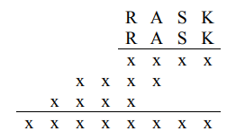
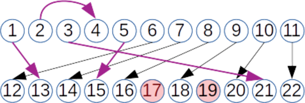
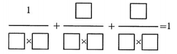
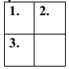

# &nbsp;

<hgroup style="font-size:70%; width:35%;">

<h1 style="font-size:28pt">Skaitļu teorija: Lietuvas olimpiādes</h1>

</hgroup>
<hgroup style="font-size:70%; width:65%;">

* LT.LKMMO - Lietuvos komandinė mokinių matematikos 
olimpiada (Lietuvas skolēnu matemātikas komandu olimpiāde)
* LT.LDK - Varžybos Lietuvos Didžiosios Kunigaikštystės garbei
(Sacensības Lietuvas Lielkņazistes godam)  
* LT.RAJ - Rajono/miesto etapas (Rajona/pilsētas posms)  
* LT.LMMO - Lietuvos mokinių matematikos olimpiada (Lietuvas skolēnu
matemātikas olimpiāde: nacionālais posms)  
* LT.VUMIF - Vilniaus universiteto Matematikos ir 
informatikos fakulteto olimpiada (Viļņas universitātes 
rīkota olimpiāde skolēniem)  
* LT.TST - Atrankos (Lietuvas atlases sacensības)
* <blue>**LT.LJKMO** - **Lietuvos jaunesniųjų klasių moksleivių olimpiada (Lietuvas
jaunāko klašu skolēnu olimpiāde)**</blue>

[Matematikos olimpiados](http://mif.vu.lt/matematikos-olimpiados/)

</hgroup>

# <lo-sample/> LT.LJKMO.1999.7_8.1

Atšifrējiet reizināšanu "stabiņā". Kā parasti, dažādiem 
reizināmā un reizinātāja burtiem atbilst dažādi cipari. 
Visi citi cipari apzīmēti ar vienādu simbolu "x".  
Atšifrējiet reizinājumu:

<small>

* [nota.algor.arithm](#)
* [nota.est.numdigits](#)
* [alg.ineq.equations](#)
* [misc.extr.param](#)

</small>

<!--
lt=
Iššifruokite daugybą "stulpeliu". Kaip visada skirtingoms 
dauginamojo ir daugiklio raidėms atitinka skirtingi skaičiai. 
Visi kiti skaičiai pažymėti vienodu simboliu x.  
Iššifruokite šią sandaugą.
-->

<!--
questionType=Find.All
-->

## <lo-soln/> LT.LJKMO.1999.7_8.1 (atrod S un R)

* Reizināšana pierakstīta, izlaižot otro no četriem saskaitāmajiem. Tas notiek vienīgi tad, ja 
$S=0$. 
* Pēdējais no četriem saskaitāmajiem ir četrciparu skaitlis, 
tātad $R \cdot \overline{RASK} < 10^5$ (četrciparu skaitlis) parāda, ka $R \leq 3$. 
* Reizināšanas rezultāts tomēr ir astoņciparu skaitlis, tātad $R \geq 3$. 

**Secinājums:** $S=0$ un $R=3$. 

## <lo-soln/> LT.LJKMO.1999.7_8.1 (atrod A)

* Tā kā $A \neq 0$, tad mēģinot ņemt $A = 1$ iegūstam $3109^2 = 9665881$, 
kas nav 8-ciparu rezultāts. No šejienes redzam, ka pat vislielākā 
$K$ vērtība $K=9$ neder. Tātad $A \neq 1$. 
* Ja $A > 3$ (piemēram $A=4$), tad $R \cdot \overline{RASK} \geq 3 \cdot 3401$ nav 4-ciparu skaitlis. 
Tātad $A \leq 3$. 

**Secinājums:** Der vienīgi vērtība $A=2$, kas pārsniedz $1$, bet ir mazāka par $4$ (un nav vienāda ar $R=3$).

* Ja $K \geq 4$, tad $K \cdot \overline{RASK}$ nav 4-ciparu. Tātad $K=1$. 

**Atbilde:** $\overline{RASK} = 3201$. 

# <lo-sample/> LT.LJKMO.1999.7_8.3

Atrodiet kādu $100$-ciparu skaitli, kurš dalās ar $100$ 
un kura visu ciparu summa ir $100$. Atrodiet pašu mazāko šādu skaitli. 

<small>

* [nota.divrule.2_5pow.divides](#)
* [misc.extr](#)

</small>

<!--
lt=
Raskite kokį nors $100$-ženklį skaičių, kuris dalijasi 
iš $100$ ir kurio visų skaitmenų suma yra
$100$. Raskite patį mažiausią tokį skaičių.
-->

<!--
questionType=Find.Any,Find.Min
-->

## <lo-soln/> LT.LJKMO.1999.7_8.3

* Pēdējiem diviem cipariem skaitlī jābūt nullēm, lai dalītos ar $100$ (dalāmības pazīme ar $100 = 2^2 \cdot 5^2$). 
* Ciparu summu $100$ cenšamies iegūt, izvietojot vislielākos ciparus ("9") iespējami tuvu skaitļa beigām:
$$M = 100\ldots009999999999900.$$
* Iegūstam skaitli $M$, kam ir $100$ cipari - sākumā $1$ vieninieks, tad $86$ nulles, tad $11$ deviņnieki, visbeidzot $2$ nulles.

Mazāks skaitlis nevar būt, jo pirmais cipars nevar būt nulle. Bet jebkurā citā veidā iegūstot to pašu ciparu summu, 
kāds no esošā skaitļa $M$ cipariem no nulles pārtaps par kaut ko citu, t.i. pieaugs.

# <lo-sample/> LT.LJKMO.2000.7_8.3

Kādu pašu mazāko summu var iegūt, saskaitot visus ciparus skaitlim, 
kurš bez atlikuma dalās ar $23$? 

<small>

* [div.fta.divisors](#)
* [comb.full](#)
* [nota.algor.longdiv](#)
* [seq.recur.linear](#)

</small>

<!--
lt=
Kokią pačią mažiausią sumą galime gauti sudėję visus be liekanos iš $23$
besidalijančio skaičiaus skaitmenis?
-->

<!--
questionType=Find.Min
-->

## <lo-soln/> LT.LJKMO.2000.7_8.3 (pārlase)

* Ciparu summa nevar būt $1$, jo skaitlis $10\ldots0 = 10^n$ satur tikai 
pirmreizinātājus $2$ un $5$, tas ar $23$ nedalīsies.
* Ciparu summu $2$ var mēģināt iegūt, aplūkojot skaitļus $11$, $101$, $1001$, utt. 
(Nav jēgas pievienot beigās nulles, jo tās neiespaidos dalāmību ar $23$.)
* Ar pilno pārlasi, mēģinot dalīt $11, 101, 1001,\ldots$, iegūstam, ka mazākais skaitlis, kuru var izdalīt ar $23$ ir šāds:
$$100000000001 = 10^{11} + 1.$$

**Piezīme:** Bezgalīgu ciparu virkni $10^k = 1000\ldots$ dalot "stabiņā" ar $23$ var gaidīt brīdi, 
kad radīsies atlikums $22$. Tanī brīdī $10^k + 1$ dalās ar $23$ bez atlikuma.

## <lo-soln/> LT.LJKMO.2000.7_8.3 (rekurenta virkne)

Virkni $11,101,1001,10001,\ldots$ var izteikt ar rekurentu sakarību: 
$$\left\{ \begin{array}{l}
a_1 = 11,\\
a_{k+1} = 10 \cdot (a_k -1) + 1 = 10 \cdot a_k - 9.
\end{array} \right.$$

No teorijas zināms, ka rekurenti uzdotām virknēm atlikumi (piemēram, dalot ar $23$) periodiski mainās - katru 
nākamo locekli viennozīmīgi nosaka iepriekšējais. Tāpēc virknē $a_k$ reiz būs loceklis, kas dalās ar $23$ 
(un šādi locekļi parādīsies bezgalīgi bieži). Var arī sanākt, ka $a_k$ periods iestājas **pirms** rodas
loceklis, kurš dalās ar vajadzīgo skaitli.

# <lo-sample/> LT.LJKMO.2001.7_8.1

Vesels pozitīvs skaitlis uzrakstāms tikai ar trijniekiem un 
septiņniekiem, bet visu tā ciparu summa dalās gan ar $3$, gan ar $7$. 
Atrodiet pašu mazāko tādu skaitli. 

<small>

* [div.fta.divisors](#)
* [misc.extr](#)

</small>

<!--
lt=
Sveikas teigiamas skaičius yra užrašomas vien tik 
trejetais ir septynetais, o visų jo
skaitmenų suma dalijasi ir iš $3$, ir iš $7$. 
Raskite patį mažiausią tokį skaičių. 
-->

<!--
questionType=Find.Min
-->

## <lo-soln/> LT.LJKMO.2001.7_8.1

* Ja skaitļa pierakstā izmantoti $k$ trijnieki, tad $k$ dalās
ar $7$, citādi $k \cdot 3$ nedalās ar $7$ (septiņnieku pieskaitīšana
ciparu summai dalāmību ar $7$ nemaina). 
* Ja skaitļa pierakstā izmantoti $m$ septiņnieki, tad $m$ dalās
ar $3$, citādi $m \cdot 7$ nedalās ar $3$ (trijnieku pieskaitīšana
dalāmību ar $3$ nemaina). 

Tātad mazākais skaitlis ar septiņniekiem ir $777$, mazākais ar trijniekiem
ir $3333333$. Bet mazākais skaitlis, kur ir abu veidu cipari ir 
$3333333777$. 

# <lo-sample/> LT.LJKMO.2001.7_8.2

Atrodiet veselus atrisinājumus vienādojumam
$x-y= x^2 + xy+ y^2$.

<small>

* [alg.equ.guess](#)
* [alg.equ.parametrize](#)
* [alg.ineq.quadratic](#)
* [alg.equ.quadratic.discriminant](#)

</small>

<!--
lt=
Raskite sveikuosius lygties 
$x-y= x^2 + xy+ y^2$ sprendinius.
-->

<!--
questionType=Find.All
-->

## <lo-soln/> LT.LJKMO.2001.7_8.2 (uzmin dažas saknes)

2.pakāpes vienādojumiem ar 2 nezināmajiem (veselos skaitļos)
saknes nav viegli izteikt ar formulām; tāpēc mēģinām uzminēt
dažas saknes, ievietojot mazus $y$:

* Ja $y=0$, tad $x = x^2$ un saknes ir $x_1 = 0$, $x_2=1$.  
* Ja $y=1$, tad $x - 1 = x^2 + x + 1$ jeb $x^2 = -2$ (sakņu nav). 
* Ja $y=-1$, tad $x + 1 = x^2 - x + 1$ jeb $x^2 - 2x = 0$ un saknes
ir $x_1 = 0$, $x_2 = 2$.  

## <lo-soln/> LT.LJKMO.2001.7_8.2 (citas saknes?)

Fiksētam $y$ vienādojums ir kvadrātvienādojums pret $x$: 
$$x^2 + (y-1)x + (y^2+y) = 0.$$ 
Lai būtu atrisinājumi, diskriminantam jābūt nenegatīvam:
$$D = (y-1)^2 - 4(y^2 + y) \geq 0$$
jeb $y^2 - 2y + 1 - 4y^2 - 4y = -3y^2 -6y + 1\geq 0$ jeb
$$3y^2 + 6y - 1 \leq 0.$$

## <lo-soln/> LT.LJKMO.2001.7_8.2 (citas saknes?)

Nevienādība $3y^2 + 6y - 1 \leq 0.$ izpildās, ja $y \in [y_1,y_2]$, kur
$$y_{1,2} = \frac{-3 \pm \sqrt{9+3}}{3};\;\;y_1 \approx -2.15;\;\;y_2 \approx 0.15.$$

Intervālā ir veselas $y$ vērtības: $y \in \{ -2,-1,0 \}$

* Ja $y=-2$, tad $x+2 = x^2 - 2x + 4$ jeb $x^2 - 3x + 2$ un saknes ir $x_1 = 1$, $x_2 = 2$. 
* Gadījumus $y = -1$, $y=0$ skatījām agrāk (pie minēšanas). 

## <lo-soln/> LT.LJKMO.2001.7_8.2 (kopsavilkums)

Apkopojam visas atbildes:
$$\left\{ \begin{array}{l}
\text{ja}\;y=-2,\;\text{tad}\;(x,y)=(1,-2)\;\text{vai}\;(2,-2)\\
\text{ja}\;y=-1,\;\text{tad}\;(x,y) = (0,-1)\;\text{vai}\;(2,-1)\\
\text{ja}\;y=0,\;\text{tad}\;(x,y) = (0,0)\;\text{vai}\;(1,0)
\end{array} \right.$$

Citām veselām $y$ vērtībām sakņu nav, jo tad diskriminants 
(vienādojumam attiecībā pret $x$) ir negatīvs.

# <lo-sample/> LT.LJKMO.2002.7_8.1

Ja no skaitļu virknes $2$, $4$, $6$, $8$, $10$, $12$, 
$14$ un $16$ izsvītrotu $4$, $8$, $10$, $14$ un $16$, 
tad atlikušo skaitļu $2$, $6$ un $12$ reizinājums būtu
$144 = 12 \cdot 12$, tātad būtu pilns kvadrāts. 
Kāds ir mazākais skaitļu skaits, ko jāizsvītro no sākotnējās virknes, lai 
atlikušo skaitļu reizinājums būtu pilns kvadrāts?

<small>

* [div.fta.pow.square](#)

</small>

<!--
lt=
Jei iš skaičių $2$, $4$, $6$, $8$, $10$, $12$, 
$14$ ir $16$ išbrauktume $4$, $8$, $10$, $14$ ir $16$, 
tai likusių skaičių $2$, $6$ ir $12$ sandauga būtų lygi
$144 = 12 \cdot 12$, taigi būtų tikslus kvadratas. 
Kiek mažiausiai skaičių
reikėtų išbraukti iš tos eilės, kad likusių skaičių 
sandauga būtų tikslus kvadratas?
-->

<!--
questionType=Find.Min
-->

## <lo-soln/> LT.LJKMO.2002.7_8.1

* Skaitļi $10$ un $14$ noteikti jāsvītro, jo tie ir vienīgie, kuri 
satur attiecīgi reizinātājus $5$ un $7$. 
* Sareizinot visus citus, iegūstam $2^{13} \cdot 3^2$. 
Pirmreizinātājs $2$ kāpināts nepāra pakāpē, bet vajag pāra (citādi 
nebūs pilns kvadrāts). 

**Atbilde:** Jāsvītro vismaz trīs reizinātāji. 
Piemēram, $10$, $14$ un arī $2$ ($2$ vietā var ņemt $8$ - abos 
gadījumos tur pirmreizinātājs $2$ ir nepāru pakāpē). 

# <lo-sample/> LT.LJKMO.2002.7_8.2

Dots vienādojums
$$3xy - x - 2y = 8.$$
**(a)** Atrodiet vienu veselu skaitļu pāri $(x; y)$, kas apmierina šo vienādojumu.  
**(b)** Atrodiet divus veselu skaitļu pārus, kas apmierina šo vienādojumu.  
**(c)** Atrodiet trīs veselu skaitļu pārus, kas apmierina šo vienādojumu.  
**(d)** Atrodiet visus šī vienādojuma atrisinājumu pārus.

<!--
lt=
Duota lygtis
$$3xy - x - 2 y = 8.$$
**(a)** Raskite vieną sveikųjų skaičių porą $(x; y)$, tenkinančią šią lygtį.  
**(b)** Raskite dvi sveikųjų skaičių poras, tenkinančias šią lygtį.  
**(c)** Raskite tris sveikųjų skaičių poras, tenkinančias šią lygtį.  
**(d)** Raskite visas šios lygties sveikųjų sprendinių poras.
-->

<!--
questionType=Find.Any,Find.All
-->

# <lo-sample/> LT.LJKMO.2002.7_8.4

Ar $S(n)$ apzīmējam naturāla skaitļa $n$ ciparu summu, piemēram, 
$S(129) = 1+2+9=12$. Skaitļus $n$ un $m$ sauksim par *radniecīgiem*, ja 
$n+S(n)=m+S(m)$. Atrodiet:  
**(a)** divus radniecīgus skaitļus;  
**(b)** trīs savstarpēji radniecīgus skaitļus;  
**(c)** vai eksistē $23$ savstarpēji radniecīgi skaitļi?

<!--
lt=
Simboliu $S(n)$
žymėsime natūraliojo skaičiaus $n$ skaitmenų sumą, pavyzdžiui,
$S(129) = 1+2+9=12$. Skaičius $n$ ir $m$ vadinsime *giminingais*, jei
$n+S(n)=m+S(m)$. Raskite:  
**(a)** du giminingus skaičius;  
**(b)** tris tarpusavyje giminingus skaičius;  
**(c)** ar egzistuoja $23$ tarpusavyje giminingi skaičiai?
-->

<!--
questionType=Find.Any,ProveDisprove.Exists
-->

# <lo-sample/> LT.LJKMO.2003.7_8.3

Atrodiet kaut vienu tādu skaitli, kas beidzas ar "2003", 
dalās ar $2003$ un kura ciparu summa vienāda ar $2003$. 

<small>

* [nota.combine.padding](#)
* [misc.invar](#)
* [seq.arithm.mod](#)

</small>

<!--
lt=
Nurodykite nors vieną tokį skaičių, kuris baigiasi "2003", 
dalijasi iš $2003$ ir kurio skaitmenų suma yra lygi $2003$.
-->

<!--
questionType=Find.Any
-->

## <lo-hints/>  LT.LJKMO.2003.7_8.3

* Vai protam apmierināt katrus divus no trim nosacījumiem?
* Kurus divus nosacījumus ir visgrūtāk apmierināt?
* Kā noteikta lieluma soļiem palielināt ciparu summu, saglabājot dalāmību ar $2003$?
Vai mākam izveidot (ja nepieciešams divus vai vairākus) tāda lieluma soļus, 
lai ciparu summa varētu pieaugt tieši līdz $2003$.

## <lo-soln/> LT.LJKMO.2003.7_8.3 (polsterēšana)

* Ir viegli panākt, lai skaitlis beigtos ar cipariem "2003" - var vienkārši uzrakstīt $2003$. 
* Sākotnējais skaitlis $2003$ dalās ar $2003$.
* Sākotnējo skaitli var "polsterēt":
    * Skaitļa pierakstā (izņemot beidzamos $4$ ciparus) iesprauž jaunus gabalus "2003" (vai skaitļa $2003$ 
daudzkārtņus). 
    * Skaitļa dalāmība ar $2003$ saglabājas, bet ciparu summa pieaug. 

Pirmā polsterēšanas doma (var dabūt ciparu summas, kas dalās ar $5$):
$$\underbrace{2003}\underbrace{2003}\ldots\underbrace{2003}.$$

## <lo-soln/> LT.LJKMO.2003.7_8.3 (piemēra koriģēšana)

* Iespraužot skaitļa pieraksta vidū jaunu fragmentu "2003", 
ciparu summa pieaug par soli $5$ (tas joprojām 
beidzas ar cipariem "2003" un dalās ar $2003$). 
* Ciparu summu $2000$ var iegūt, iespraužot šo fragmentu $400$ reizes.
* Kā dabūt par $3$ lielāku ciparu summu? Vai eksistē fragments, kurš 
dalās ar $2003$, bet tā ciparu summa ir $3$ (vai skaitlis, kas dod 
atlikumu $3$, dalot ar $5$)? 

## <lo-soln/> LT.LJKMO.2003.7_8.3 (2003k ciparu summas)

* Aplūkojam aritmētisku progresiju ar $2003$ daudzkārtņiem
un katra šāda skaitļa $2003k$ ciparu summu $S(2003k)$:

<table>
<tr>
<th>$k$</th><td>$1$</td><td>$2$</td><td>$3$</td><td>$4$</td><td>$5$</td><td>$6$</td><td>$7$</td><td>$\ldots$</td>
</tr>
<tr>
<th>$2003 \cdot{}k$</th>
<td>$2003$</td><td>$4006$</td><td>$6009$</td><td>$8012$</td><td>$10015$</td><td>$12018$</td><td>$14021$</td><td>$\ldots$</td>
</tr>
<tr>
<th>$S(2003 \cdot{}k)$</th>
<td>$5$</td><td>$10$</td><td>$15$</td><td>$11$</td><td>$7$</td><td>$12$</td><td>$8$</td><td>$\ldots$</td>
</tr>
</table>

Redzam, ka $7\cdot{}2003$ ciparu summa ir $8$. Tam pievienojot fragmentus $2003$, var dabūt, lai ciparu summa 
būtu $8,13,18,23,\ldots,1998,2003$. Meklētā skaitļa piemērs:
$$14021\underbrace{2003}_{\text{1.reize}}\underbrace{2003}_{\text{2.reize}}\ldots\underbrace{2003}_{\text{399.reize}}.$$

# <lo-sample/> LT.LJKMO.2003.7_8.4

No naturāliem skaitļiem $1,2,\ldots{},22\,$, 
izmantojot tos visus pa vienai reizei, tika 
izveidotas $11$ parastas daļas. 
Kāds lielākais skaits no šīm daļām var būt 
vienāds veseliem skaitļiem?

<small>

* [comb.graph.bipartite](#)
* [div.prop.primes](#)

</small>

<!--
lt=
Iš natūraliųjų skaičių nuo $1$ iki $22$, 
panaudojus juos visus po vieną kartą, buvo
sudaryta $11$ trupmenų. Koks galėjo būti 
didžiausias skaičius trupmenų, lygių
sveikiems skaičiams?
-->

<!--
questionType=Find.Max
-->

## <lo-soln/> LT.LJKMO.2003.7_8.4 (piemērs)

* Visai daudzi skaitļi $[1;22]$ dalās viens ar otru.
* Sadalām kopu divās daļās (no $1$ līdz $11$ un arī 
no $12$ līdz $22$). Centīsimies iespējami vairāk likt pāros
skaitļus no pretējām daļām, veidojot *divdaļīgu grafu*. 

Vairums bultiņu ir starp $n$ un $2n$. 
Visas citas ir violetas. Viena ir novilkta starp virsotnēm $2$ un $4$ (abas 
atrodas vienā daļā) - tas vairs neatbilst divdaļīga grafa nosacījumam.

## <lo-soln/> LT.LJKMO.2003.7_8.4 (nevar labāk)

* Pirmskaitļi $13,17,19$ visi pārsniedz $22/2 = 11$, tie nevar būt nevienai 
veselai daļai saucējā. 
* Visi šie pirmskaitļi dalās ar $1$, bet tikai vienu var savienot ar $1$, 
jo skaitļi daļās nedrīkst atkārtoties. 
* Tātad divi skaitļi noteikti paliek bez pāra (mūsu gadījumā $17$ un $19$). 
To veidotā daļa būs vienīgā neveselā.

# <lo-sample/> LT.LJKMO.2004.7_8.1

$7$-ciparu skaitlis uzrakstāms ar $7$ dažādiem cipariem un dalās ar visiem 
septiņiem saviem cipariem.  
**(a)** Atrodiet vienu šādu $7$-ciparu skaitli;  
**(b)** Atrodiet pašu lielāko tādu $7$-ciparu skaitli;  
**(c)** Atrodiet pašu mazāko tādu $7$-ciparu skaitli.

<!--
lt=
$7$-ženklis skaičius užrašomas $7$ skirtingais skaitmenimis ir 
dalijasi iš visų $7$ savo skaitmenų.  
**(a)** Raskite vieną tokį $7$-ženklį skaičių;  
**(b)** Raskite patį didžiausią tokį $7$-ženklį skaičių;  
**(c)** Raskite patį mažiausią tokį $7$-ženklį skaičių.
-->

<!--
questionType=Find.Any,Find.Max,Find.Min
-->

# <lo-sample/> LT.LJKMO.2004.7_8.3

Nenegatīvi veseli skaitļi $m$ un $n$ apmierina nosacījumu
$$mn - n + m = 2004.$$
**(a)** Atrodiet vienu tādu skaitļu $m$ un $n$ pāri $(m; n)$;  
**(b)** Atrodiet visus iespējamos tādus skaitļu $m$ un $n$ pārus.

<!--
lt=
Neneigiami sveikieji skaičiai $m$ ir $n$ tenkina sąlygą
$$mn - n + m = 2004.$$
**(a)** Raskite vieną tokią skaičių $m$ ir $n$ porą $(m; n)$;
**(b)** Raskite visas galimas tokias skaičių $m$ ir $n$ poras.
-->

<!--
questionType=Find.Any,Find.All
-->

# <lo-sample/> LT.LJKMO.2005.7_8.2

Skaitļu $83$ un $89$ pāri $(83;89)$ sauc par *simta pāri*, jo 
$83 + 8 + 9 = 100$ un $89 + 8 + 3 = 100$. 
Cik pavisam ir divciparu simta pāru? Atrodiet tos.

<!--
lt=
Skaičių $83$ ir $89$ pora $(83;89)$ yra vadinama šimtine pora, 
nes $83 + 8 + 9 = 100$ ir $89 + 8 + 3 = 100$. 
Kiek yra dviženklių šimtinių skaičių porų? Nurodykite jas.
-->

<!--
questionType=Find.Count,Find.All
-->

# <lo-sample/> LT.LJKMO.2006.7_8.1

Tikai ar nullēm un vieniniekiem uzrakstāms $11$-ciparu skaitlis beidzas ar "11" un 
dalās ar $11$.   
**(a)** Atrodiet kaut vienu tādu $11$-ciparu skaitli.  
**(b)** Atrodiet pašu mazāko tādu $11$-ciparu skaitli.  
**(c)** Atrodiet pašu lielāko tādu $11$-ciparu skaitli.

<!--
lt=
Vien tik nuliais ir vienetais užrašomas $11$-ženklis skaičius baigiasi "11" ir
dalijasi iš $11$.  
**(a)** Nurodykite kokį nors vieną tokį $11$-ženklį skaičių.  
**(b)** Suraskite patį mažiausią tokį $11$-ženklį skaičių.  
**(c)** Suraskite patį didžiausią tokį $11$-ženklį skaičių.
-->

<!--
questionType=Find.Any,Find.Min,Find.Max
-->

# <lo-sample/> LT.LJKMO.2006.7_8.4

Vienādojumu sistēmu
$$\left\{ \begin{array}{l}
a^2+b^2= 2(c+d)\\
c^2+d^2=2(a+b)
\end{array} \right.$$
risināsim veselos skaitļos $a$, $b$, $c$ un $d$.  
**(a)** Atrodiet vienu tādu skaitļu $a$, $b$, $c$ un $d$ četrinieku $(a,b,c,d)$.  
**(b)** Atrodiet divus tādus skaitļu $a$, $b$, $c$ un $d$ četriniekus $(a,b,c,d)$.  
**(c)** Atrodiet visus tādus skaitļu $a$, $b$, $c$ un $d$ četriniekus $(a,b,c,d)$.

<!--
lt=
Lygčių sistemą
$$\left\{ \begin{array}{l}
a^2+b^2= 2(c+d)\\
c^2+d^2=2(a+b)
\end{array} \right.$$
spręsime sveikaisiais skaičiais $a$, $b$, $c$ ir $d$.  
**(a)** Nurodykite vieną tokį skaičių $a$, $b$, $c$ ir $d$ ketvertą $(a,b,c,d)$.  
**(b)** Nurodykite du tokius skaičių $a$, $b$, $c$ ir $d$ ketvertus $(a,b,c,d)$.  
**(c)** Raskite visus tokius skaičių $a$, $b$, $c$ ir $d$ ketvertus $(a,b,c,d)$.
-->

<!--
questionType=Find.Any,Find.All
-->

# <lo-sample/> LT.LJKMO.2007.7_8.2

**(a)** Barons Minhauzens netic, ka visus veselos pozitīvos skaitļus no $1$ līdz $16$
iespējams izrakstīt vienā rindā tā, ka jebkuru divu blakus esošu skaitļu 
summa būtu pilns kvadrāts. Vai baronam ir taisnība, tam neticot?  
**(b)** Barons Minhauzens tic, ka visus veselos pozitīvos skaitļus no 
$1$ līdz $16$ var izrakstīt pa apli tā, ka jebkuru divu blakus esošu skaitļu 
summa būtu pilns kvadrāts. Vai baronam ir taisnība, šādi uzskatot? 

<small>

* [comb.graph.cycle](#)

</small>

<!--
lt=
**(a)** Baronas Miunhauzenas nė už ką netiki, kad būtų galima 
visus sveikuosius teigiamus skaičius nuo $1$ iki $16$ surašyti 
į vieną eilutę taip, kad bet kurių dviejų kaimyninių skaičių
suma būtų tikslus kvadratas. Ar baronas yra teisus taip netikėdamas?  
**(b)** Baronas Miunhauzenas tvirtai tiki, kad pavyks visus 
sveikuosius teigiamus skaičius nuo $1$ iki $16$ surašyti ratuku taip, 
kad bet kurių dviejų kaimyninių skaičių suma būtų tikslus
kvadratas. Ar baronas yra teisus taip tikėdamas?
-->

<!--
questionType=ProveDisprove.Exists
-->

# <lo-sample/> LT.LJKMO.2007.7_8.4

**(a)** Šerloks Holmss kopā ar doktoru Vatsonu gribētu atrast visus
veselu pozitīvu skaitļu $x$ un $y$ pārus $(x, y)$, kam 
$$x^2 - y^2 - x + y = 10.$$
Cik tādu pāru viņi atradīs un kādi ir šie pāri?  
**(b)** Mēģiniet viņiem palīdzēt un noskaidrojiet, vai ir iespējams 
tāds veselu pozitīvu skaitļu $x$ un $y$ pāris $(x, y)$, ka
$$x^2 - y^2 - x + y = 2007.$$

<!--
lt=
**(a)** Šerlokas Holmsas kartu su daktaru Vatsonu norėtų surasti 
visas sveikųjų teigiamų skaičių $x$ ir $y$ poras $(x, y)$, kad
$$x^2 - y^2 - x + y = 10.$$
Kiek tokių porų jie suras, ir kokios yra tos poros?  
**(b)** Pamėginkite padėti jiems ir raskite, jeigu tai tik įmanoma, 
tokią sveikųjų teigiamų skaičių $x$ ir $y$ porą $(x, y)$, kad
$$x^2 - y^2 - x + y = 2007.$$
-->

<!--
questionType=Find.Count,Find.All,ProveDisprove.Exists
-->

# <lo-sample/> LT.LJKMO.2008.7_8.1

Kļuvuši nopietnāki, Toms un Džerijs 
iekārtojās darbā dalītāju uzskaites inspekcijā. 
Pirmais viņiem uzticētais darbs bija pārbaudīt pēc 
kārtas uzrakstītus skaitļa $30$ daudzkārtņus, t.i. 
skaitļus $30, 60, 90, 120, \ldots$.  
Par katru skaitļa $30$ daudzkārtni, kuram pašam ir tieši $30$ dalītāju, 
viņiem tika apsolīta prēmija. 
Par pirmo pārbaudīto skaitli $30$ Toms un Džerijs prēmiju nesaņems, jo pašam 
skaitlim $30$ tik daudz dalītāju nav. To ir tikai $8$, jo visi 
skaitļa $30$ dalītāji ir 
$$1, 2, 3, 5, 6, 10, 15\;\;\text{un}\;\;30.$$
**(a)** Vai var atrast kaut vienu tādu skaitļa $30$ daudzkārtni, par kuru 
Toms un Džerijs dabūtu prēmiju?  
**(b)** Vai var atrast $2$ tādus $30$ daudzkārtņus, kam ir pa $30$ dalītājiem?  
**(c)** Vai var atrast $6$ tādus $30$ daudzkārtņus?  
**(d)** Vai Toms un Džerijs var iegūt $8$ prēmijas? 

<!--
lt=
Surimtėję Tomas ir Džeris įsidarbino kontrolieriais 
Daliklių apskaitos inspekcijoje. Pats
pirmasis jiems pavestas darbas buvo iš eilės tikrinti 
visų skaičiaus $30$ kartotinių, t.y. skaičių
$$30, 60, 90, 120, \ldots$$
daliklių kiekį. Už kiekvieną tokį $30$ kartotinį, kuris pats turi 
lygiai $30$ daliklių, jiems buvo pažadėta premija. 
Už patį pirmą patikrintą skaičių $30$ Tomas ir Džeris premijos negaus, nes pats
skaičius $30$ tiek daliklių neturi – jų tėra tik $8$, nes visi skaičiaus $30$ dalikliai yra
$$1, 2, 3, 5, 6, 10, 15\;\;\text{ir}\;\;30.$$
**(a)** Ar galima surasti nors vieną tokį skaičiaus $30$ kartotinį, 
už kurį Tomas ir Džeris gautų premiją?  
**(b)** Ar galima surasti $2$ tokius $30$ kartotinius, turinčius po $30$ daliklių?  
**(c)** Ar galima surasti $6$ tokius $30$ kartotinius?  
**(d)** Ar gali Tomas ir Džeris gauti $8$ premijas? 
-->

<!--
questionType=ProveDisprove.Exists
-->

# <lo-sample/> LT.LJKMO.2008.7_8.2

Alisa raksta astoņus ciparus, kas lielāki par vienu - $2$, $3$, $4$, $5$, $6$, $7$, 
$8$ un $9$ pa vienam katrā no $8$
vienādības lodziņiem tā, lai vienādība būtu patiesa. 
Ar ko vienāda lielākā no trim daļām šajā vienādībā?

<!--
lt=
Alisa aštuonis didesnius už $1$ skaitmenis $2$, $3$, $4$, $5$, $6$, $7$, 
$8$ ir $9$ įrašo kiekvieną į lygiai vieną iš $8$
lygybės langelių taip, kad lygybė būtų teisinga. 
Kam yra lygi pati didžiausioji iš tų trijų 
teisingos lygybės trupmenų? 
-->

<!--
questionType=Find.Max
-->

# <lo-sample/> LT.LJKMO.2008.7_8.4

Veselīgais skeptiķis Sančo Pansa neparko netic, ka 
nepieredzējis meklētājs varētu atrast tādu naturālu 
skaitli $n$, ka lielais skaitlis $n^6 + 206$ 
dalītos bez atlikuma ar citu palielu skaitli $n^2 + 2$, 
bet Dons Kihots arvien daudzina, ka tādi skaitļi ir. 
Varbūt tiešām iespējams noskaidrot, cik tādu ir 
un kādi tie ir?

<!--
lt=
Sveikas skeptikas Sanča Pansa nė už ką netiki, 
kad nepatyręs ieškotojas galėtų surasti tokį
natūralųjį skaičių $n$, kad didelis skaičius $n^6 + 206$ 
dalytųsi be liekanos iš nemenko skaičiaus $n^2 + 2$, 
o don Kichotas užsispyręs vis kartoja, 
kad tokių skaičių yra. Negi tikrai įmanoma
nustatyti, kiek jų yra ir kokie jie yra? 
-->

<!--
questionType=ProveDisprove.Exists,Find.All
-->

# <lo-sample/> LT.LJKMO.2009.7_8.3

Klusās ziemas naktīs, kad izklīst pēdējie nesteidzīgie gājēji, 
mūžīgais pilsētas uzraugs, klusais Rolands mierīgi nokāpj centrā no 
pjedestāla un ar maestro Raini liek tādu, kā viņi to sauc, 
*kluso Brēmenes pasjansu*. Tam nepieciešamas $7$ dažādas 
kartiņas ar skaitļiem $0$, $1$, $2$, $3$, $4$, $5$, $6$ -
katrā kartiņā ierakstīts pa vienam skaitlim.
Rolands ar Raini tad pārmaiņus ņem pa kartiņai, 
parasti pirmais kartiņu ņem Rolands. 
Tas, kurš agrāk nekā viņa pretinieks no savām kartiņām 
(ne obligāti visām) saliek naturālu skaitli, kurš bez atlikuma 
dalās ar $17$, uzvar. Portālā ihaha.com izplatījās
nežēlīgi strīdi par to, vai var vāds no viņiem var vienmēr 
ņemt kartiņas tā, lai uzvarētu, vienalga ko darītu viņa pretinieks. 
Atradās viens gudrinieks, Rekss, kurš nepaguris apgalvo, ka:  
**(a)** ja kāds no viņiem arī var vienmēr uzvarēt, lai ko arī nemēģinātu 
otrs spēlētājs, tad uzvarētājs ir tas, kurš sāk. 
Vai gudriniekam Reksam ir taisnība? Atbildi pamatojiet.  
**(b)** Vai tiešām kāds no viņiem var vienmēr uzvarēt, lai 
ko nedarītu viņa pretinieks?  
Kā tur ir? Atbildi pamatojiet.

<!--
lt=
Tyliomis žiemos naktimis, kai išsiskirsto paskutinieji
negausūs praeiviai, amžinasis miesto sergėtojas tylusis
Rolandas ramiai nulipa centre nuo pjedestalo ir su 
maestro Rainiu dėlioja tokį, kaip jie vadina, 
*tylųjį Brėmų pasiansą*. Tam reikalingos $7$ skirtingos
kortelės su skaičiais $0$, $1$, $2$, $3$, $4$, $5$, $6$ - 
kiekvienoje kortelėje įrašytas vienintelis skaičius. 
Rolandas su Rainiu tada pakaitomis ima po kortelę, 
paprastai pirmasis kortelę ima Rolandas. 
Tas, kuris anksčiau negu jo varžovas iš savo turimų kortelių 
(nebūtinai visų) sudaro natūralųjį skaičių, kuris be liekanos
dalijasi iš $17$, laimi. Portale ihaha.com įsiplieskė 
nuožmūs ginčai apie tai, ar gali kuris nors iš jų visada imti 
korteles taip, kad vis tiek laimėtų, kad ir ką bedarytų jo 
varžovas. Atsirado vienas gudročius, vardu Reksas, kuris
išsijuosęs tvirtino, kad:  
**(a)** jeigu jau kuris nors iš jų ir gali visada laimėti, kad ir 
ko besigriebtų kitas žaidėjas, tai tuo laiminčiuoju yra tas, 
kuris pradeda.  
Ar teisus gudročius Reksas? Atsakyma pagrįskite.  
**(b)** Tai ar gali kuris nors iš jų visada laimėti, kad ir ko 
besigriebtų jo varžovas?  
Kaip čia yra? Atsakymą, suprantama, irgi pagrįskite.
-->

<!--
questionType=ProveDisprove.ForAll,Algorithm
-->

# <lo-sample/> LT.LJKMO.2009.7_8.4

Šajā krustskaitļu mīklā (nejaukt ar krustvārdu mīklu) 
maestro Rainis par katru cenu grib ierakstīt $4$ divciparus 
skaitļus - $2$ horizontāli un $2$ vertikāli. Viņš ir
labi iekalis sev galvā, ka neviens divciparu skaitlis 
nesākas ar nulli. Viņš apņēmies šos četrus divciparu
skaitļus ierakstīt izraudzītajā kārtībā, paskaidrodams, 
kādēļ šai krustskaitļu mīklai ir viens vienīgs atrisinājums.

**Horizontāli:** 1. Skaitļa $3$ daudzkārtnis. 3. Trīskāršots pirmais skaitlis.  
**Vertikāli:** 1. Skaitļa $25$ daudzkārtnis. 2. Pilns kvadrāts. 

<!--
lt=
Į šį kryžiaskaitį (nepainioti su kryžiažodžiu) maestro 
Rainys nori žūtbūt įrašyti $4$ dviženklius skaičius - 
$2$ horizontaliai ir $2$ vertikaliai. Jis yra gerai įsikalęs
sau į galvą, kad joks dviženklis skaičius neprasideda nuliu. 
Jis pasiryžęs šiuos keturis dviženklius skaičius įrašyti pasirinktąja
tvarka, paaiškindamas, kodėl šis kryžiaskaitis turi vienintelį
sprendinį. 

**Horizontaliai:** 1. Skaičiaus $3$ kartotinis. 3. Trigubas pirminis skaičius. 
**Vertikaliai:** 1. Skaičaus $25$ kartotinis. 2. Tikslusis kvadratas.
-->

<!--
questionType=Prove.Exists
-->

# <lo-sample/> LT.LJKMO.2010.7_8.1

Jūru princese visgudrākajiem Sinbada kuģa jūrniekiem jautāja, vai 
var starp skaitļiem, kas ir vienādības kreisajā pusē
$$7^5\;\;7^4\;\;7^3\;\;7^2\;\;7\;\;1\,=\,2009$$
salikt iekavas un aritmētisku darbību zīmes, kad 
uzrakstītā vienādība izrādītos patiesa.  
Ko gudrākajiem jūrniekiem vajadzētu atbildēt princesei?  
Atbildi, protams, jūrnieki pamatoja, lai princese par viņiem nezobotos.  
Vai to var izdarīt?

<!--
lt=
Jūrų princesė visų išmintingesnių Sinbado laivo jūrininkų klausinėdavo, ar
galima tarp skaičių, esančių kairiojoje lygybės pusėje 
$$7^5\;\;7^4\;\;7^3\;\;7^2\;\;7\;\;1\,=\,2009$$
sudėlioti skliaustus ir aritmetikos veiksmų 
ženklus, kad užrašytoji lygybė pasidarytų teisinga.  
Ką turėtų atsakyti princesei išmintingieji jūrininkai?  
Atsakymą, suprantama, jūreiviai pagrįsdavo, kad princesė iš jų nesišaipytų.  
Ar tai įmanoma?
-->

<!--
questionType=ProveDisprove.Exists
-->

# <lo-sample/> LT.LJKMO.2010.7_8.5

Princese lūdza Sinbadam visiem paskaidrot, vai skaitlis
$4^{20} + 2^{20} + 1$ tiešām dalās vēl ar kādu trešo naturālo skaitli, 
bet ne tikai ar $1$ un, zināms, pats ar sevi.  
(Zinātniski izsakoties, Princese apvaicājās, vai tas 
skaitlis ir pirmskaitlis, vai nē.)  
Kā tur ir? Atbildi princesei pamatojiet. 

<!--
lt=
Princesė prašo Sinbado visiems paaiškinti, ar skaičius 
$4^{20} + 2^{20} + 1$ tikrai
dalijasi dar iš kokio nors trečiojo natūraliojo skaičiaus, 
o ne tik kad iš $1$ ir, žinoma, pats iš savęs.  
(Mokslininkų kalba kalbant, Princesė, suprantama, 
teiraujasi, ar tas skaičius yra pirminis skaičius, ar nėra.)  
Tai kaip ten yra? Atsakymą princesei pagrįskite. 
-->

<!--
questionType=ProveDisprove.Exists
-->

# <lo-sample/> LT.LJKMO.2011.7_8.1

Ķīvīte Matilde no kaut kurienes atnesa trīsciparu skaitli, 
cūka Kamila tūlīt rotaļīgi samainīja vietām tā vienu un desmitu 
ciparus, bet Ēzelītis Daiņus, neko negaidīdams un nevienam nevaicādams, 
ņēma un saskaitīja abus šos skaitļus.  
Zirgs Dominiks pajautāja, kāda gan ir šī summa?  
Ēzelītis Daiņus pēkšņi kļuva ļoti noslēpumains un pateica, ka šo skaitļu 
summai ir $4$ cipari un tā sākas ar cipariem $173$.  
Zirgs Dominiks nolēma atrast, kāds varētu būt tas pēdējais, 
ceturtais vēl nezināmās summas (vienu pozīcijas) cipars.

<!--
lt=
Pempė Matilda iš kažkur (o iš kur – ji nė už ką nepasakys) 
atnešė triženklį skaičių, kielė Kamilė tuojau žaismingai 
perstatė vietomis jo vienetų ir dešimčių skaitmenis, 
o Asiliukas Dainius nieko nelaukdamas ir niekieno 
nepasiklausęs ėmė ir sudėjo abu tuos skaičius.  
Arklys Dominykas paklausė, kokia gi yra ta suma yra?  
Asiliukas Dainius staiga pasidarė labai paslaptingas ir tepasakė, kad tų skaičių suma
turi $4$ skaitmenis ir prasideda skaitmenimis $173$.  
Arklys Dominykas nusprendė surasti, koks galėtų būti tas 
paskutinysis $4$-tasis dar nežinomas tos sumos (vienetų) skaitmuo.
-->

<!--
questionType=Find.All
-->

# <lo-sample/> LT.LJKMO.2011.7_8.2

Naskā cūka Kamila simtgadīga ozola virsotnē atrada senu pergamentu ar 
titullapā uzrakstītu simtciparu skaitli. Tā pirmie $49$ cipari visi 
bija deviņnieki, $50$-tais cipars vispār nebija redzams, 
tas bija pilnīgi izbalējis, tālāk tanī bija vēl $49$ nulles, bet
pats pēdējais šī 100-ciparu skaitļa cipars bija deviņnieks.  
Pēdējais rokraksta teikums svinīgi vēstīja, ka 
šis $100$-ciparu skaitlis pats noteikti ir kāda ievērojama naturāla skaitļa kvadrāts.  
Zirgs Dominiks zina, ka cūka Kamila no viņa neatstāsies, 
līdzkamēr viņš sīki, precīzi un ļoti saprotami neizklāstīs, 
kāds tad ir šī 100-ciparu skaitļa izdzisušais 50-tais cipars, 
un līdzkamēr viņš viņai neparādīs, ar cik cipariem rakstāms
un kāds skaitlis jāceļ kvadrātā, lai iegūtu sākotnējo skaitli. 

<!--
lt=
Guvioji Kielė Kamilė šimtamečio ąžuolo viršūnėje rado 
senovinį pergamentą su tituliniame puslapyje užrašytu 
šimtaženkliu skaičiumi. Jo pirmieji $49$ skaitmenys buvo 
visi devynetai, $50$-tojo skaitmens apskritai nesimatė, 
jis buvo visai išblukęs, toliau jame buvo dar $49$ nuliai, 
o pats paskutinysis to 100-ženklio skaitmuo buvo vėl devynetas.  
Paskutinis rankraščio sakinys iškilmingai bylojo, kad tas 
visas $100$-ženklis skaičius pats garantuotai yra kažinkokio 
įžymaus natūraliojo skaičiaus kvadratas.  
Arklys Dominykas žino, kad Kielė Kamilė neatstos nuo jo tol, 
kol jis jai smulkiai tiksliai ir labai suprantamai neišguldys, 
koks gi yra tas $50$-tasis išblukęs to $100$-ženklio
skaičiaus skaitmuo ir kol jis jai neparodys, 
keliaženklio ir kokio skaičiaus kvadratas yra tas pradinis skaičius. 
--> 

<!--
questionType=Find.All
-->

# <lo-sample/> LT.LJKMO.2012.7_8.1

Dzenītis Baltrus, kurš pats ir liels putnu arodbiedrību aktīvists un, ko te slēpt, 
Atamana Žagatas vēlēšanu uzticamais un personīgais padomdevējs, 
maiņas beigās ļoti mīl sausajā priedē vēl iekalt kādu saskaitīšanu 
vai dalīšanu stabiņā. Pēdējā laikā Juoku mežā kā epidēmija izplatījās skaitļu divkāršošana. 
Tā arī vakar, pirms lidošanas mājās, kādā liepā Dzenītis Baltrus 
atrada trīsciparu skaitli, kura pierakstā nebija nuļļu. 
Viņš to divkāršoja un atviegloti nopūtās, redzot, ka arī divkāršotajā 
skaitlī nuļļu ciparu nav. 
Viņš sāka domāt, kādu lielāko skaitu reižu šādi divkāršojot var 
samazināties divkāršotā skaitļa ciparu reizinājums. 
(Par to, ka no divkāršošanas trīsciparu skaitļa ciparu reizinājums 
var samazināties, Dzenītis Baltrus pārliecinājās, skatoties 
uz piemēru: $661 \cdot 2 = 1322$).  
Citiem vārdiem, Dzenītim Baltrusam jāiekaļ šāds uzdevums: 
Trīsciparu skaitli bez nulles cipariem divkāršoja un divkāršotajā 
skaitlī arī nav nulles ciparu. Kādu lielāku skaitu reižu pēc vienas 
tādas divkāršošanas var samazināties skaitļa ciparu reizinājums.

<!--
lt=
Genelis Baltrus, kuris pats yra didis paukščių profsąjungų aktyvistas ir, ko čia
slėpti, paties Atamano Šarkos rinkimų patikėtinis ir asmeninis patarėjas, baigęs pamainą
labai mėgsta sausoje pušyje dar pakalinėti kokią sudėtį stulpeliu ar dalybą kampu.
Pastaruoju metu kaip kokia epidemija Juokų miške paplito skaičių dvigubinimas. Štai ir
vakar prieš skrisdamas namo Grainio liepoje Genelis Baltrus dar susirado triženklį
skaičių, kuris buvo, žinoma, be nulių (nuo nulinių skaitmenų Genelis Baltrus čiaudėja),
padvigubino jį ir lengviau atsiduso pamatęs, kad ir padvigubintame skaičiuje nulinių
skaitmenų nėra. Ir pradėjo jis galvoti, kiek daugiausiai kartų taip dvigubinant gali
sumažėti dvigubinamojo skaičiaus skaitmenų sandauga. (O kad nuo dvigubinimo
triženklio skaičiaus skaitmenų sandauga gali sumažėti Genelis Baltrus įsitikino
žiūrėdamas į pavyzdį: $661 \cdot 2 = 1322$).
Kitaip sakant, genelis Baltrus turi “sukalti” tokį uždavinį. Triženklis skaičius be
nulinių skaitmenų buvo padvigubintas ir nulinių skaitmenų padvigubintame skaičiuje vėl
nėra. Kiek daugiausiai kartų po vieno tokio padvigubinimo gali sumažėti triženklio
skaičiaus skaitmenų sandauga?
-->

<!--
questionType=Find.Max
-->

# <lo-sample/> LT.LJKMO.2012.7_8.2

Žagatu, sīļu un bezdelīgu specializētajā daiļamatniecības skolā, kur 
kopš gadsimtiem allaž pastiprināti mācīja aritmētiku un spīdīgo akmentiņu cenu 
svārstības, šīgada pēdējā kontroldarbā, gan ne visiem, bet tikai vairāk aritmētikā iedziļinājušamies, 
tika ieteikts tāds "brīvprātīgi obligātais" uzdevums, kas sastāv no divām daļām.  
Pirmajā daļā vajadzēja uzrakstīt vienu tādu $100$-ciparu skaitli, kura 
decimālajā pierakstā atrodami, ak, kāda apnicība, tikai nulles un vieninieki, 
bet pašu skaitli var dalīt $12$ vienādās veselās daļās.   
Otrajā daļā jau bez kādas izlocīšanās bija prasīts atrast nevis jebkuru, 
bet vismazāko no visiem šādiem $100$-ciparu skaitļiem.

<!--
lt=
Šarkų, kėkštų ir blezdingų profiliuotoje dailiųjų amatų mokykloje, kur nuo
šimtmečių sustiprintai visada buvo dėstoma aritmetika bei puošniųjų akmenukų kainų
svirduliavimai, per baigiamąjį kontrolinį šiais metais, tiesa, ne visiems, o tik giliau į
aritmetiką įsikertantiesiems, buvo labai rekomenduojamas toks laisvai pasirenkamas
privalomas uždavinys, susidedantis iš dviejų dalių.
Pirmojoje dalyje reikėjo užrašyti kokį nors vieną $100$-ženklį skaičių, kurio
įprastiniame dešimtainiame užraše terandame – o kokia nuobodybė – tik nulius ir
vienetus, o pats skaičius be liekanos, gražiai turi pasidalinti į $12$ lygių dalių.
Antrojoje dalyje jau be jokių užuolankų buvo klausinėjama bei reikalaujama
surasti jau nebe bet kokį, o jau patį mažiausią iš visų tokių $100$-ženklių skaičių.
-->

<!--
questionType=Find.Any,Find.Min
-->

# <lo-sample/> LT.LJKMO.2012.7_8.4

Dzenītis Baltrus savu dēlu Bali māca pacietīgi minēt visu, ko vien var, 
piemēram, visādus naturālus (veselus pozitīvus) vienādojumu atrisinājumus. 
Dzenītis Baltrus savam dēlam visu nedēļu kala galvā domu, ka vienādojumā
$\frac{1}{m} + \frac{1}{n} = \frac{19}{94}$,
kur $m$ un $n$ ir naturāli skaitļi, bez lielas mocīšanās, gandrīz tikai ar minēšanu var:  
**(a)** $33$ minūtēs pat bez kādām lielām teorijām var atminēt vienu tādu naturālu 
skaitļu pāri $(m;n)$, kas atbilst šim vienādojumam;  
**(b)** atminot vienu pāri, minūtes laikā var atrast arī otru atbilstošu pāri.  
**(c)** tālāk dzenītis Baltrus tieši pajautāja dēlam Balim, cik pavisam ir šādu pāru?

<!--
lt=
Genelis Baltrus savo sūnų Balį moko kantriai spėlioti viską, ką tik įmanoma,
pavyzdžiui, visokiausius natūraliuosius (sveikuosius teigiamus) lygčių sprendinius.
Genelis Baltrus savo sūnui visą savaitę kalė į galvą mintį, kad turint lygtį
$\frac{1}{m} + \frac{1}{n} = \frac{19}{94}$,
kur $m$ ir $n$ yra natūralieji skaičiai, be didesnio vargo, beveik vien tik spėliojant, galima:  
**(a)** per $33$ minutes net ir be jokių didelių teorijų atspėti vieną tokią natūraliųjų
skaičių porą $(m;n)$ porą, tinkančią tai lygčiai;  
**(b)** atspėjus vieną porą, per minutę galima nurodyti ir antrą tokią tinkamą porą.  
**(c)** toliau genelis Baltrus tiesiai paklausė sūnų Balį, kiek iš viso yra tokių porų?
-->

<!--
questionType=Find.Any,Find.Count
-->

# <lo-sample/> LT.LJKMO.2012.7_8.6

Atamana Žagatas pilnvarots doktorants Ūpis ar saviem maģistrantiem sīļiem un bakalauriem 
zvirbuļiem pilnīgi bez kļūdām sareizināja visus veselos skaitļus no $1$ līdz $2012$ un, 
no iegūtā reizinājuma atņēmuši $1$, iegūto skaitli viņi uzrakstīja uz tievas un garas 
papīra strēmelītes. Pēc tam viņi, bolīdami acis 
uz šo strēmelīti, sāka apņēmīgi domāt, kāds mazākais
skaits ciparu šajā garajā skaitlī jānomaina uz nullēm, 
lai iegūtais skaitlis dalītos ar $13$?  
Atamans Žagada šajā sakarībā pajokoja reti atklāti, lai dzirdētu visa putnu ieleja, 
kaut šo aforismu visi jau ne reizi bija dzirdējuši: Žagata atkārtoja, ka pieklājīgiem 
putniem piedāvātie uzdevumi ir divējādi: vienkārši vai arī interesanti. 

<!--
lt=
Atamano Šarkos pavedimu doktorantas Apuokas su savo magistrantais
kėkštais ir bakalaurais žvirbliais absoliučiai – neįtikėtina, bet be klaidų, įsidėmėkite, be
klaidų – sudaugino visus sveikuosius skaičius nuo $1$ iki $2012$ ir, iš gautosios sandaugos
atėmę $1$, gautąjį skaičių užrašė plonoje ilgoje popieriaus juostelėje. Po to jie visi
spoksodami į tą juostelę pradėjo ryžtingai galvoti, kiek mažiausiai skaitmenų tame ilgoje
popieriaus juostelėje užrašytame skaičiuje gana būtų pakeisti nuliais, kad tas skaičius jau
dalintųsi iš $13$?  
Atamanas Šarka ta proga pajuokavo kaip reta atvirai, kad išgirdo visas paukščių
juokų slėnis, nors tą aforizmą visi jau ne sykį buvo girdėję: atamanas Šarka vėl pakartojo,
kad padoriems paukščiams siūlomi uždaviniai būna dvejopi: paprasti arba įdomūs.
-->

<!--
questionType=Find.Min
-->

# <lo-sample/> LT.LJKMO.2013.7_8.2

Kurmja Karoļa tante Leokādija Rausīte no mazām dienām tic trīsciparu skaitļu 
harmonijai. Viņa augsti vērtē visus tos trīsciparu skaitļus (un uzskata, ka tie 
ir ne tāpat vien zinātnieku izdomāti), kurus var iegūt, pie kāda konkrēta
trīsciparu skaitļa pieskaitot šī paša skaitļa ciparus. Teiksim, skaitlis
$225$ viņai šķiet ne tāpat vien zinātnieku izdomāts, jo 
ir tāds trīsciparu skaitlis, proti $216$, pie kura pieskaitot tā visus trīs ciparus
$2$, $1$, $6$, tieši tā notiek, kā Leokādijai gribētos: $216 +2 + 1 + 6 = 225$. 
Jau kuro laiku tante Leokādija visiem radiniekiem un paziņām uzdzen šausmas ar jautājumu:
Kāds ir vislielākais trīsciparu skaitlis, par kuru nekādi nepateiksi, nepierādīsi, nedabūsi, 
ka tas būtu ne tāpat vien zinātnieku izdomāts?

<!--
lt=
Kurmio Karolio teta Kas(t)ė Rausytė nuo jaunų dienų tiki į triženklių skaičių
harmoniją. Ji labai vertina visus tokius triženklius skaičius ir laiko, kad jie nebe reikalo
yra mokslininkų sugalvoti – taip jai be jokių juokų atrodo – kuriuos galima gauti prie
kažkokio konkretaus triženklio skaičius pridėjus visus tris to konkretaus skaičius
skaitmenis. Sakysime, skaičius $225$ jai atrodo ne be reikalo mokslininkų išgalvotas, nes
yra toks triženklis skaičius, vardu $216$, prie kurio pridėjus jo visus tris skaitmenis $2$, $1$ ir $6$
tikrai taip ir išeina, kaip Leokadijai norėtųsi: $216 + 2 + 1 + 6 = 225$.
Jau kuris laikas teta Leokadija visus savo giminaičius ir pažįstamus siaubia klausimu,
koks gi yra pats didžiausias triženklis skaičius, apie kurį niekaip nepasakysi-neįrodysi-
negausi, kad jis yra ne be reikalo mokslininkų sugalvotas?
-->

<!--
questionType=Find.Max
-->

# <lo-sample/> LT.LJKMO.2013.7_8.6

Zemē noliktas $9$ akmeņu kaudzes (katrā ir vismaz pa vienam akmenim). Bebrs
Babrungs-Bungs pārbaudīja, ka jebkurās divās kaudzēs akmeņu skaits atšķiras, 
bet lielākajā kaudzē, viņa vārdiem sakot, ir $n$ akmeņu. Vēlāk 
viņam kļuva skaidrs arī, ka jebkuras kaudzes visus akmeņus var sadalīt 
atlikušajās kaudzēs tā, lai iegūtajās $8$ kaudzēs būtu vienāds skaits akmeņu. 
Bez tam, jebkuru divu kaudžu visus akmeņus var sadalīt atlikušajās kaudzēs tā, lai 
lai iegūtajās $7$ kaudzēs būtu vienāds akmeņu skaits. Atrodiet mazāko iespējamo $n$ vērtību. 

<!--
lt=
Ant žemės guli $9$ akmenų krūvos (kiekvienoje bent po vieną akmenį). Bebras
Babrungas-Bungas patikrino, kad bet kuriose dviejose krūvose yra po skirtingą akmenų
skaičių, o didžiausioje krūvoje, jo žodžiais tariant, yra $n$ akmenų. Vėliau jam dar
paaiškėjo, kad bet kurios vienos krūvos visus akmenis įmanoma sumesti į likusias
akmenų krūvas taip, kad gautose $8$ krūvose būtų po lygiai akmenų. Negana to, bet kurių
dviejų krūvų visus akmenis įmanoma sumesti į likusias akmenų krūvas taip, kad gautose
$7$ krūvose būtų po lygiai akmenų. Sužinokite mažiausią galimą $n$ reikšmę.
-->

<!--
questionType=Find.Min
-->

# <lo-sample/> LT.LJKMO.2014.7_8.1

Meža vidū stāv liela tāfele, pie kuras rosās $85$ Zaķi Pišķi, kuri ko prot, ko ne, bet 
viņi visi raksta skaitļus "gaismas ātrumā". Kā teikts, viņi ir pašā Mācītā Meža vidū 
pie neiedomājama lieluma tāfeles, uz kuras pēc kārtas uzrakstīti visi veselie skaitļi 
no $1$ līdz $2150$.  
Katrā minūtē cits Zaķis, sākot ar 1. un beidzot ar 85.zaķi pagūst veikt ar šiem skaitļiem tādu darbību: 
Ja skaitlis dalās ar $100$, tad to izdala ar $100$, bet ja skaitlis ar $100$ nedalās, tad 
no tāda skaitļa atņem $1$. Pēc tam visus agrākos skaitļus nodzēš un to vietā ieraksta iegūtos rezultātus
(atceramies, ka visus $2150$ skaitļus var nomainīt minūtes laikā - un tā dara katrs zaķis). 
Kāds skaitlis būs lielākais no visiem uz tāfeles uzrakstītajiem, kad savas
izmaiņas būs beidzis pēdējais, 85.zaķis Pišķis, vārdā Mīkoliņš?

<!--
lt=
Miško viduryje stovi didžiulė lenta, prie kurios bruzda $85$ Kiškiai Piškiai, kurie ką moka, ką ne,
bet visi jie skaičius rašo „šviesos greičiu“. Kaip sakyta, jie bruzda pačiame Mokyto Miško viduryje
prie neįsivaizduojamo didumo lentos, kurioje iš eilės yra surašyti visi sveikieji skaičiai nuo $1$ iki
$2150$.  
Kiekvieną minutę vis kitas Kiškis, pradedant $1$-uoju ir baigiant $85$-uoju, 
suspėja atlikti su tais skaičiais tokią operaciją:
jeigu skaičius dalijasi iš $100$, tai jis tą skaičių iš $100$ ir padalija, 
o jeigu skaičius iš 100 nesidalija, tai iš tokio skaičiaus jis atima $1$, 
tada kiekvieną senąjį skaičių nuvalo ir vietoje jo parašo gautą rezultatą
(kaip pamename, visus $2150$ skaičių jis spėja pakeisti per minutę – ir taip kiekvienas).
Koks skaičius bus pats didžiausias iš visų lentoje parašytųjų, kai savo rašymus bus baigęs
paskutinysis, $85$-tasis Kiškis Piškis, vardu Mykoliukas?
-->

<!--
questionType=Find.Max
-->

# <lo-sample/> LT.LJKMO.2014.7_8.2

Lapsa Snape Saldžūne atkal klāstīja Zaķītim Paikutim kaut kādas pašizdomātas ašas 
fantāzijas par to, ka nezkur Aritmētikas brikšņos ir tāds daudzciparu skaitlis, kurā 
noteikti ir vismaz divi divnieki, vēl tur noteikti ir vismaz divi četrinieki – un pat divi astoņnieki ir – 
un kurš tomēr nekādi nedalās ar $4$ bez atlikuma, dziedi vai raudi.
"Atrodi man, Paikuti, kaut vienu šādu skaitli" - viņa uzmācīgi prasīja zaķim.  
Bet saviem bērniem Lapsa Snape stāstīja nevis to, bet citu, līdzīgu pasaku, kura 
beidzās ar lūgumu lapsēniem atrast nevis vienu iespējamu tādu piemēru, bet jau 
tūdaļ - vismazāko no visiem šādiem daudzciparu skaitļiem. 
Tātad arī mēs vēlreiz pajautāsim to pašu, atkārtojot jautājumu: Kāds ir vismazākais
daudzciparu skaitlis, kurā ir vismaz divi divnieki, vismaz divi četrinieki un vismaz divi 
astoņnieku, un kurš nedalās bez atlikuma ar $4$? 

<!--
lt=
Lapė Snapė Saldžiūnė vėl porino Zuikučiui Paikučiui kažkokias veikiausiai jos pačios išgalvotas
fantazijas apie tai, kad gyvena kažkur Aritmetikos brūzgynuose toks daugiaženklis skaičius,
kuriame garantuotai yra bent du dvejetai, dar garantuotai yra dar ir bent du ketvertai – ir net dar ir
bent du aštuonetai yra – ir kuris vis tiek niekaip nesidalija be liekanos į $4$ lygias dalis, nors tu verk.
„Surastum tu man, Paikuti, kada kokį nors vieną tokį skaičių“- prisispyrusi prašydavo ji zuikio.
O savo vaikams Lapė Snapė sekdavo jau nebe tą, bet kitą, nors ir panašią, bet jau kitokią pasaką,
kuri baigdavosi atviru lapiukų prašymu surasti ne kokį nors vieną galimą tokį pavyzdį, bet jau iš
karto daug nedelsiant – patį mažiausią iš visų tokių galimų daugiaženklių skaičių.
Taigi ir mes dar sykį paklauskime to paties pakartodami klausimą: koks yra pats mažiausias
daugiaženklis skaičius, kuriame yra bent du dvejetai, bent du ketvertai ir bent du aštuonetai ir kuris
nesidalija be liekanos iš $4$?
-->

<!--
questionType=Find.Any,Find.Min
-->

# <lo-sample/> LT.LJKMO.2015.7_8.5

Naturāls skaitlis ir *taizemiski apaļīgs*, ja tas ir lielāks par $10$ un
dalās ar savu ciparu reizinājumu. Cik daudzi naturāli skaitļi, kuri visi ir 
taizemiski apaļīgi, var sekot pēc kārtas?

<!--
lt=
Natūralusis skaičius yra *tailandiškai apvalus*, jeigu jis yra didesnis 
už $10$ ir dalijasi iš savo skaitmenų sandaugos. Kiek natūraliųjų skaičių, 
kurių kiekvienas yra tailandiškai apvalus, gali eiti iš eilės?
-->

<!--
questionType=Find.Max
-->

# <lo-sample/> LT.LJKMO.2015.7_8.6

Naturālu skaitli $N$ sauc par *debesu atjautības skaitli* 
vai, īsi sakot, *Taizemes pērli*, ja tam piemīt šāda īpašība: 
eksistē pozitīvs vesels skaitlis $k$, kuram ir vismaz divi cipari, kuri 
visi ir vienādi (piemēram $999$ vai $222222$), kuram 
skaitlis $N \cdot k$ arī sastāv no vienādiem cipariem. 
Piemēram, skaitlis $3$ ir taizemes pērle, jo $3 \cdot 222 = 666$.  
**(a)** Atrodiet skaitli, kuram ir $10$ ciparu un kurš Jums šķiet esam 
taizemes pērle, turklāt pierādiet, ka tas tiešām tāds ir.  
**(b)** Pierādiet, ka skaitlis $11$ nav Taizemes pērle.  
**(c)** Noskaidrojiet, vai $143$ ir vai nav Taizemes pērle un, 
saprotams, pareizi pamatojiet savu atbildi.

<!--
lt=
Natūralusis skaičius $N$ vadinamas *nežemiško sumanumo skaičiumi*, 
arba, trumpai, *tailandiškuoju perlu*, jeigu jis pasižymi 
tokia savybe: egzistuoja teigiamas sveikasis skaičius $k$, 
turintis bent du skaitmenis, kurie visi yra vienodi 
(kaip kad, pavyzdžiui, $999$ arba $222222$), ir toks, 
kad skaičius $N \cdot k$ irgi susideda iš vienodų
skaitmenų. Sakysime, skaičius $3$ yra tailandiškasis perlas, 
nes $3 \cdot 222 = 666$.  
**(a)** Nurodykite skaičių, kuris turi $10$ skaitmenų ir kuris 
Jums rodosi esąs tailandiškasis perlas, bei įrodykite, 
kad jis tikrai yra toks.  
**(b)** Įrodykite, kad skaičius $11$ nėra tailandiškasis perlas.  
**(c)** Nustatykite, ar $143$ yra tailandiškasis perlas, 
ar nėra ir, suprantama, deramai pagrįskite savo atsakymą.
-->

<!--
questionType=Find.Any,Prove.Other,ProveDisprove.Exists
-->

# <lo-sample/> LT.LJKMO.2016.7_8.3

Skaitlis $4$ skaitlī $97$ "ietilpst" $24$ reizes un vēl 
$1$ "atliek", jo $97 = 4 \cdot 24 + 1$.
Tad "aritmētiski apkalti" ķīniešu vecāki savām 
meitām un dēliem pie gadījuma ļoti pacietīgi atkārto, ka
skaitļa $97$ dalīšanas ar $4$ (nepilnais) dalījums ir 
$24$, bet atlikums ir $1$.  
Viens ķīnieša Mina dēls Čens, kurš nekad nepieļāva nekādas 
aritmētiskas kļūdas, kaut tēvs arī teica, ka viņš esot lēns, 
reiz veica skaitļa $N$ dalīšanu ar $333$ un konstatēja, 
ka dalīšanas (nepilnā) dalījuma un atlikuma summa vienāda ar $300$. 
Cits dēls, Liņ Bins vārdā, tēva mīlulis, veica tā 
paša skaitļa dalīšanu iar $777$ un ieguva, ka arī tagad 
(nepilnā) dalījuma un atlikuma summa joprojām ir $300$. 
Vai jūs varētu, tikai to zinādami, mums paskaidrot, kāds 
varētu būt skaitlis $N$?

<!--
lt=
Skaičius $4$ į skaičių $97$ „sutelpa“ net $24$ kartus ir 
sutilpus dar $1$ „atlieka“, nes $97 = 4 \cdot 24 + 1$.
Tada „aritmetiškai pasikaustę“ mokyti kinų tėvai 
savo dukroms ir sūnums prireikus labai kantriai kartoja, 
kad skaičiaus $97$ dalybos iš $4$ (nepilnasis) dalmuo 
yra $24$, o liekana $1$.  
Vienas kino Mingo sūnus Čengas, kuris niekada 
nedarydavo jokių aritmetinių klaidų, nors tėvas 
ir sakydavo, kad jis lėtas, kartą atliko tokio 
skaičiaus $N$ dalybą iš $333$ ir nustatė, kad tos dalybos 
(nepilnojo) dalmens ir liekanos suma yra lygiai $300$. 
Kitas sūnus, vardu Lin Binis, tėvo numylėtinis, atliko 
to paties skaičiaus $N$ dalybą iš $777$ ir gavo, kad
ir dabar (nepilnojo) dalmens ir liekanos suma vėl yra $300$. 
Ar galėtumėte tik tiek težinodami paaiškinti mums, 
koks galėtų būti tas skaičius $N$?
-->

<!--
questionType=Find.All
-->

# <lo-sample/> LT.LJKMO.2016.7_8.5

Netālu no Lielā Ķīnas mūra dzīvo tāds vientuļnieks, kurš saka, ka 
īsto skaitlisko pilngadību viņš varētu atzīt tikai tādam jaunietim, 
kurš aizgājis tuksnesī spētu viens pats, vispār bez citu palīdzības atbildēt uz šādu 
jautājumu: Vai var tabuliņas $5 \times 10$ lodziņos ierakstīt visus skaitļus no $1$ līdz $50$, 
pa vienam skaitlim katrā lodziņā tā, ka visu rindiņu un visu kolonnu skaitļu summas 
būtu vienādas $15$ dažādiem, pēc kārtas sekojošiem naturāliem skaitļiem? 

<!--
lt=
Ne taip toli nuo Didžiosios Kinų sienos gyveno vienas toks atsiskyrėlis, kuris sakė, kad
tikrąją skaitinę pilnametystę jis galėtų pripažinti tik tokiam jaunuoliui, kuris, išėjęs į
dykumą, sugebėtų vienas pats, visai niekieno nepadedamas, atsakyti į tokį klausimą: ar
galima į lentelės $5 \times 10$ langelius surašyti visus skaičius nuo $1$ iki $50$, 
po vieną skaičių kiekviename langelyje, taip, kad visų eilučių ir visų stulpelių 
skaičių sumos pasirodytų esančios lygios $15$-ai iš eilės einančių natūraliųjų skaičių?
-->

<!--
questionType=ProveDisprove.Exists
-->

# <lo-sample/> LT.LJKMO.2017.7_8.2

Šovasar Brazīlijas presē parādījās ziņojums par neticamu 
aritmētikas mīļotāja Romario sasniegumu: viņš, izmantojot pa 
vienai reizei deviņus no desmit cipariem  $0$, $1$, $2$, $3$,
$4$, $5$, $6$, $7$, $8$, $9$, uzrakstīja trīs naturālus skaitļus, 
un šo skaitļu summa ir $2017$. Vai tas tiešām iespējams? 
Vai to pašu var izdarīt, neizmantojot kādi citu ciparu (citu nekā tas, 
kuru neizmantoja Romario)?

<!--
lt=
Šią vasarą Brazilijos spaudoje pasirodė pranešimas apie neįtikėtiną
aritmetikos mėgėjo Romario pasiekimą: jis, panaudojęs po vieną kartą 
devynis iš dešimties skaitmenų $0$, $1$, $2$, $3$,
$4$, $5$, $6$, $7$, $8$, $9$, užrašė tris natūraliuosius skaičius, 
ir tų skaičių suma buvo $2017$. Ar tai tikrai įmanoma? Ar galima 
padaryti tą patį, nepanaudojus kurio nors kito skaitmens (kito nei tas,
kurio nepanaudojo Romario)?
-->

<!--
questionType=ProveDisprove.Exists
-->

# <lo-sample/> LT.LJKMO.2017.7_8.3

Naturālu skaitli $n$ sauc par *brazīliski nobriedušu*, ja tas dalās 
ar $9$, tā decimālpierakstā ir visi $10$ cipari un ja, bez tam, 
tajā vieninieku ir vairāk nekā nuļļu, divnieku – vairāk nekā vieninieku, 
utt. (t.i. jo lielāks cipars, jo vairāk reižu tas izmantots, uzrakstot $n$). 
Pamēģiniet:  
**(a)** uzrakstīt kaut vienu brazīliski nobriedušu skaitli;  
**(b)** atrast vismazāko brazīliski nobriedušu skaitli.

<!--
lt=
Natūralusis skaičius $n$ vadinamas *braziliškai brandžiu*, jei dalijasi 
iš $9$, jo dešimtainiame užraše yra visi $10$ skaitmenų ir jei, be to, 
jame vienetukų yra daugiau negu nuliukų, dvejetukų – daugiau nei vienetukų, 
ir t.t. (t.y. kuo didesnis skaitmuo, tuo daugiau kartų jis
panaudojamas užrašant $n$). Pabandykite:  
**(a)** užrašyti bent vieną braziliškai brandų skaičių;  
**(b)** rasti patį mažiausią braziliškai brandų skaičių.
-->

<!--
questionType=Find.Any,Find.Min
-->

# <lo-sample/> LT.LJKMO.2018.7_8.6

Zirga Dominika draugs Ēzelītis Apolinārs bieži mēdz pārbaudīt 
savu skaitlisko izturību. Reizēm viņš saka Dominikam:   
– Iedomājies divas bezgalīgas skaitļu virknes. Pirmajā ierakskstīti 
visi skaitļa $29$ daudzkārtņi. Otrajā rindiņā rakstītas pirmās rindiņas skaitļu ciparu summas:

<table>
<tr><td>$29$</td><td>$58$</td><td>$87$</td><td>$116$</td><td>$145$</td><td>$\ldots$</td>
<tr><td>$11$</td><td>$13$</td><td>$15$</td><td>$8$</td><td>$10$</td><td>$\ldots$</td>
</table>

Vai varētu man pierādīt, ka ikviens skaitlis, kurš vismaz 
reizi parādījies apakšajā rindiņā, parādās tajā bezgalīgi daudz reižu?  
– Elementāri, – atbildēja Dominiks, – es pat zinu, 
kāds ir mazākais skaitlis apakšējā rindiņā un kāds skaitlis uzrakstīts virs tā, 
kur šis mazākais skaitlis parādās pirmo reizi.  
Vai arī jums viss ir tikpat acīmredzami kā Zirgam Dominikam?

<!--
lt=
Arklio Dominyko draugas Asiliukas Apolinaras dažnai mėgsta patikrinti 
jo skaitinę ištvermę. Kartą jis sako Dominykui:  
– Įsivaizduok dvi begalines skaičių eilutes. Pirmoje surašyti visi skaičiaus 
$29$ kartotiniai:
$$29, 58, 87, 116, 145, \ldots.$$
Antroje eilutėje po kiekvienu pirmos eilutės skaičiumi parašyta 
jo skaitmenų suma:
$$11, 13, 15, 8, 10, \ldots.$$
Ar galėtum man įrodyti, kad kiekvienas skaičius, 
kartą pasirodęs apatinėje eilutėje, pasirodo 
joje be galo daug kartų?  
– Elementaru, – atsakė Dominykas, – aš net žinau, 
koks yra mažiausias skaičius apatinėje
eilutėje ir koks skaičius parašytas virš jo, 
kai tas mažiausias skaičius pasirodo pirmą kartą.  
Ar ir jums viskas taip pat akivaizdu, kaip ir 
Arkliui Dominykui?
-->

<!--
questionType=Prove.Other,Find.Only
-->

