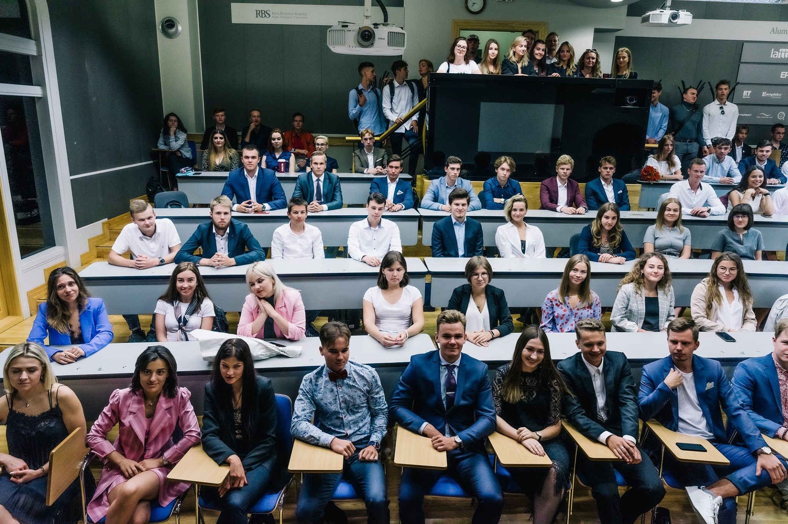
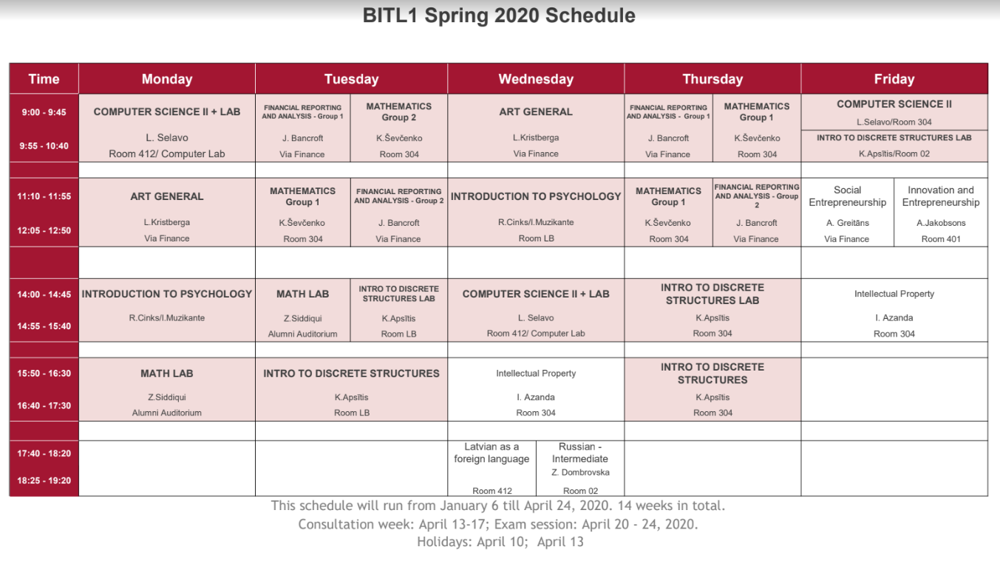

# &nbsp;

<hgroup>

<h1 style="font-size:28pt">Pirmais BITL gads</h1>

<blue>Tendences STEM izglītībā</blue>

</hgroup><hgroup>

1. Studenti ar "nestandarta CV"
2. Globāli standarti
3. Starpdisciplinaritāte
4. "Augstas likmes"
5. Daļa no apmācības: IT/Biznesa projekti komandām (par šo drusku sīkāk)

</hgroup>

<!--

Validate - Your TODO lists
Your plans to learn new skills

-->

# <lo-why/> why

Kāpēc jāapspriež BITL?

* IT/STEM var apgūt vairākās LV augstskolās.
* Dažas lietas RBS BITL izpaužas koncentrēti (viss, kas saistīts 
ar augstākās izglītības globalizāciju).

## Kas ir BITL

* Studiju programma, ko kopīgi realizē LU, RTU, RBS pasniedzēji. 
* Ikdienas dzīvi nodrošina Rīgas Biznesa Skola (Skolas iela 11).
* "Datorzinātne un organizāciju tehnoloģijas" - saīsinājums ir BITL. 
* [Par BITL](https://www.bitl.lv/par-programmu/)
* Bachelor of Business Administration (BBA); Bachelor of IT Leadership (BITL)

## <lo-summary/> BITL un BBA studenti

# <lo-summary/>  BITL studenti, "nestandarta CV"

<hgroup>

* Nestandarta izglītības ceļi: Apmaiņas programmas, 
tālmācība, gads starp vidusskolu un augstskolu. 
* Francija, Uzbekistāna, nodarbibas angliski.
* Pasniedzējiem jāvar strādāt ar ļoti dažādiem studentiem. 

</hgroup>
<hgroup>

* Biežāk ierobežojošais faktors ir studenta darbaspējas, motivācija un raksturs (nevis 
priekšzināšanas par konkrētu lietu). 
* 1.semestrī dažus priekšmetus (Matemātisko analīzi, u.c.) grūtāk mācīt ļoti 
nevienādo zināšanu dēļ (dala pēc spējām/priekšzināšanām) pat trīs grupās.

</hgroup>

# <lo-summary/> Globāli standarti

<hgroup>

* Programmas atbilst "State University of New York at Buffalo"
* Mācību grāmatas angliski (elektroniskās)
* "APA Style" - Lietišķo dokumentu noformēšanas stils. 
* Grāmatvedības standarti. 

</hgroup>
<hgroup>

* RBS skola vēršas pret špikošanu (TurnItIn.com)
* Pievērš uzmanību skolas reputācijai: 
    * Nepieļauj studēšanu vīzas dēļ.
    * Neizmanto nelicencētu programmatūru vai neatbilstoši iegūtas grāmatu kopijas.
    * Cenšas nodrošināt diplomu kvalitātes garantijas.

</hgroup>

# <lo-summary/> Starpdisciplinaritāte 

# <lo-summary/> Augstas likmes

<hgroup>

* Vēlamais finansēšanas modelis: Valsts, mācību maksas (stipendijas), privātuzņēmumi - kas pretī saņem sakarīgus studentus praksēs un
augstskolas centienus padarīt studiju programmu industrijai aktuālu. 
* Stipendiju noteikumi - augsta vidējā atzīme
* Salīdzinoši garas vasaras brīvdienas (maijs-augusts), "Internships"

</hgroup>
<hgroup>

* Studijas RBS nevar apvienot ar darbu.
* Studijas prasa darbaspējas, psiholoģisku noturību, spēju 
risināt jautājumus atbilstoši "pieaugušo pasaules" noteikumiem, 
pildīt saistības, laikā iesniegt uzdevumus, darboties komandās.
* Pasniedzējiem jāvar paskaidrot atzīmu pamatotība (*defensible grades*).

</hgroup>

# <lo-summary/> RBS studenti Bauskā

* [RBS studenti palīdzēs Bauskas pašvaldībai](https://labsoflatvia.com/aktuali/rbs-studenti-palidzes-bauskas-pasvaldibai)
* Vai tikai BITL vai arī BBA? Beigās izlēma, ka būs abas programmas (ap 70 cilvēki). 
* Kāda būs pašvaldības atsaucība?
* Kas notiks ar projektiem pēc semestra beigām?

## <lo-summary/> Problēmtēmas Bauskas pašvaldībā

* Bauskas problēmtēmu uzklausīšana (to dara pasniedzēji).
* Studenti mācās atsijāt idejas (*ideation sessions*)
* Komandu veidošana līdzīga hakatonam (*pitching*, trūkstošo cilvēku uzaicināšana pēc krāsām/lomām)
* 9 komandas, 7-8 cilvēki katrā (iespējams, tās ir pārāk lielas)
* BBA un BITL studenti darbojas kopā
* Izbraukuma sesijas Bauskā; daļa darba ir attālināta saziņa.

## <lo-summary/> Projektu piemēri - 1

* Informatīva vietne ģimnāzistu konsultēšanai par apmaiņas programmām un citām skolēnu (un skolotāju) izaugsmes iespējām. 
* Balsošanas vietne par Bauskas vecpilsētas renovācijas projektiem un idejām. 
* "Orientēšanās tūrisma" velomaršruts pa Bauskas apkārtni, kur dalībnieki skenē QR kodus un pilda mazus uzdevumiņus. 
* Kaut kas līdzīgs "Manabalss.lv" - bet tikai Bauskas pašvaldības projektiem. 
* Bauska.lv mājaslapas apmeklētājiem iespēja pieteikties saņemt jaunumus e-pastā. 

## <lo-summary/> Projektu piemēri - 2

* Bauskas karjeras konsultāciju vietne - personības testi, cilvēku mudina kaut ko apskatīt, satikties ar dzīvu karjeras konsultantu, kaut kur pieteikties.
* Interaktīva karte ar slāņiem, kur parādītas Bauskas apmeklētājam svarīgas lietas (ēstuves, apskates objekti, tualetes)
* Pašvaldības projektu darbplūsmas vieta - integrējas ar pašvaldības datiem, parāda to statusu/progresu 
vienkāršam iedzīvotājam saprotamākā veidā.
* Reklāmas videorullīši, kas parāda Bauskas skaistumu rudens/ziemas sezonā; to izplatīšana sociālajos tīklos.

## <lo-summary/> Ietirgotās naudas vietā - "validācija" 

* Studentu projektam (vismaz kaut kādā minimālā līmenī - kuru studenti var paši skaidri nodefinēt un saskaņot ar visiem pasniedzējiem) 
ir jāiziet visas izstrādes stadijas - idejas apspriešana (Business Case u.c.); pārrunas ar stakeholders; projektēšana/Design; izstrāde, testēšana un ieviešana. 
* Atgriezeniskā saite jeb "validācija" - lietotāju statistika; atsauksmes; "conversion rate" vai soctīklu engagement metrikas; pašvaldības darbinieku vai citu profesionāļu interese 
turpināt darbu pie projekta. 
* Studentu projekti decembrī beidzas. Bet tiek pieņemts, ka (vismaz veiksmīgākie projekti) var tikt turpināti vai nodoti pašvaldību/skolu u.c. ziņā. 

