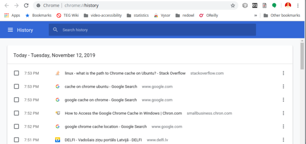

# &nbsp;

<hgroup>

<h1 style="font-size:28pt">Searching the Internet</h1>

<blue>How to use Internet</blue>

</hgroup><hgroup>

**(1) Introduction**  
(2) [Boolean AND, OR, NOT](#section-1)  
(3) [Content Caching](#section-2)  
(4) [Search Options](#section-3)  
(5) [Search Optimization](#section-4)  
(6) [Searching Twitter](#section-5)  
(7) [Language Tools](#section-6)  
(8) [Summary](#section-7)

</hgroup>

# <lo-why/> why

Why do we need to experiment with Web searches?

* We often need answers to **exact** questions.
* Webpages change frequently, some are cached.
* Some useful search patterns.
* Social networks add more options. 
* IT and English Language often mix :)

::: notes

Typing in long, exact questions often does not work

:::

## <lo-summary/> Sources of Inspiration

* [Google Live Trainings](https://www.google.com/insidesearch/searcheducation/training.html)

# &nbsp;

<hgroup>

<h1 style="font-size:28pt">Searching Internet</h1>

<blue>How to use Internet</blue>

</hgroup><hgroup>

(1) [Introduction](#section)  
**(2) Boolean AND, OR, NOT**  
(3) [Content Caching](#section-2)  
(4) [Search Options](#section-3)  
(5) [Search Optimization](#section-4)  
(6) [Searching Twitter](#section-5)  
(7) [Language Tools](#section-6)  
(8) [Summary](#section-7)

</hgroup>

# &nbsp;

<hgroup>

<h1 style="font-size:28pt">Searching Internet</h1>

<blue>How to use Internet</blue>

</hgroup><hgroup>

(1) [Introduction](#section)  
(2) [Boolean AND, OR, NOT](#section-1)  
**(3) Content Caching**  
(4) [Search Options](#section-3)  
(5) [Search Optimization](#section-4)  
(6) [Searching Twitter](#section-5)  
(7) [Language Tools](#section-6)  
(8) [Summary](#section-7)

</hgroup>

# <lo-theory/> What is Caching?

<hgroup>

</hgroup>
<hgroup>

* Caching (*kešošana*, *rezerves kopēšana*) 
means keeping your local copy of some information.
* Phonebook and contacts of your friends in your phone is an
example of a cache. 
* Webpages rely heavily on caching - and there are several caches.

</hgroup>

# <lo-summary/> Browser Cache

* <blue>`\AppData\Local\Google\Chrome\User Data\Default\Cache`</blue> on Windows
* <blue>`$HOME/.cache/google-chrome`</blue> on Linux
* It contains pages that you visited recently. They may open in your browser even 
when you lose Internet connectivity. 

## <lo-summary/> Incognito Mode

* In Android device (Chrome): Press and hold a Web link.
* [Always Open in Incognito?](https://android.gadgethacks.com/how-to/make-chrome-always-open-incognito-mode-0202897/)

Incognito mode implies that there are no cookies. Some newspapers set cookie information to 
limit the number of pageviews. 

</hgroup>

## <lo-summary/> Clearning Cache and History

# <lo-summary/> What is Cached by Google?

<hgroup>

Using Google's Cached page version:  
[https://www.lifewire.com/highlight-keyword-google-cache-search-1616811]

</hgroup>
<hgroup>

* The cache shows the last time the page was indexed, 
it may contain inconsistent or outdated page content and images.
* Some

</hgroup>

# <lo-summary/> Wayback Machine

<hgroup>

TODO: Image

</hgroup>
<hgroup>

* [https://www.lifewire.com/wayback-machine-3481829]
[Wayback Machine Example](http://web.archive.org/web/*/www.dudajevagatve.lv/nt/index.html)

</hgroup>

# &nbsp;

<hgroup>

<h1 style="font-size:28pt">Searching Internet</h1>

<blue>How to use Internet</blue>

</hgroup><hgroup>

(1) [Introduction](#section)  
(2) [Boolean AND, OR, NOT](#section-1)  
(3) [Content Caching](#section-2)  
**(4) Search Options**  
(5) [Search Optimization](#section-4)  
(6) [Searching Twitter](#section-5)  
(7) [Language Tools](#section-6)  
(8) [Summary](#section-7)

</hgroup>

# <lo-theory/> Full Google Search Syntax

https://ahrefs.com/blog/google-advanced-search-operators/

# <lo-theory/> What is SEO?

* SEO (Search Engine Optimization) - how to get your Website 
among the top results for some searches.
* SEO means studying (constantly shifting) preferences of
Google Search engine.
* It is a part of a larger body of knowledge: Web Marketing. 

**Click rate:** How to get visitors to your site?  
**Conversion rate:** How to ask them to do something useful?

## <lo-summary/> "Nigritude Ultramarine"

**SEO Challenge:** Sometimes SEO professionals make contests
(who can get to the top for a phrase that has been announced).  
[“Data voids” on the web have opened a door to manipulators](https://www.niemanlab.org/2019/11/watch-your-language-data-voids-on-the-web-have-opened-a-door-to-manipulators-and-other-disinformation-merchants/)

* There are multiple techniques, but "natural traffic" usually 
works best: You create quality content, update your Website regularly. 
* Then visitors come to see your content. 

You can play some tricks, but usually this means trying to fool Google's
algorithms. 

## <lo-summary/> Phishing Websites

* Mistyping some popular search term may be risky. 
* Your browser can go to a fraudulent site. 

**Warning!** Do not try the sites mentioned in the NBC material on your device.  
Your browser vulnerability may be exploited!

[NBC News: Warning: Misspelling that web address can lead to trouble](https://www.nbcnews.com/business/consumer/warning-misspelling-web-address-can-lead-trouble-n876086)

* Popular traps: mistyping the domain name `.com` as `.cm` (Cameroon) or `.om` (Oman).
* Phishing site: `paypa1.com` (digit `1` instead of "L"); `espn.cm` etc.
* Slightly mistyped Web searches could do the same. 

## <lo-summary/> Browser hijacking

<hgroup>

</hgroup>
<hgroup>

* A related threat is to reset your browser's homepage to a malicious site
(can be done by a JavaScript). 
* Unwanted Adware, if you install unverified extensions for your browser.

</hgroup>

::: notes

http://backofficeitltd.freshdesk.com/support/solutions/articles/1000034157-browser-hijacking-wave

:::

# &nbsp;

<hgroup>

<h1 style="font-size:28pt">Searching Internet</h1>

<blue>How to use Internet</blue>

</hgroup><hgroup>

(1) [Introduction](#section)  
(2) [Boolean AND, OR, NOT](#section-1)  
(3) [Content Caching](#section-2)  
(4) [Search Options](#section-3)  
**(5) Search Optimization**  
(6) [Searching Twitter](#section-5)  
(7) [Language Tools](#section-6)  
(8) [Summary](#section-7)

</hgroup>

# &nbsp;

<hgroup>

<h1 style="font-size:28pt">Searching Internet</h1>

<blue>How to use Internet</blue>

</hgroup><hgroup>

(1) [Introduction](#section)  
(2) [Boolean AND, OR, NOT](#section-1)  
(3) [Content Caching](#section-2)  
(4) [Search Options](#section-3)  
(5) [Search Optimization](#section-4)  
**(6) Searching Twitter**  
(7) [Language Tools](#section-6)  
(8) [Summary](#section-7)

</hgroup>

# <lo-summary/> Searching Social Networks

**A case study: Twitter:** [Advanced Search](https://unionmetrics.com/resources/how-to-use-advanced-twitter-search-queries/)

## <lo-summary/> Searching YouTube

Instead of search syntax can pick "filters" (can search by video, channel, playlist), 
upload date, length, and sorting order. 

# &nbsp;

<hgroup>

<h1 style="font-size:28pt">Searching Internet</h1>

<blue>How to use Internet</blue>

</hgroup><hgroup>

(1) [Introduction](#section)  
(2) [Boolean AND, OR, NOT](#section-1)  
(3) [Content Caching](#section-2)  
(4) [Search Options](#section-3)  
(5) [Search Optimization](#section-4)  
(6) [Searching Twitter](#section-5)  
**(7) Language Tools  
(8) [Summary](#section-7)

</hgroup>

# <lo-summary/> Searches start by correct words

<hgroup>

Spelling Dictionaries contain all dictionary forms

* [KarmaSoft.com](https://www.karamasoft.com/UltimateSpell/Dictionary.aspx) - 
Some popular languages (en-GB, en-US, lt, de). 
* [Aspell dictionaries - trickier format](https://ftp.gnu.org/gnu/aspell/dict/0index.html)

</hgroup>
<hgroup>

Latvian spelling needs more sophisticated spelling dictionaries. 
Morphological changes (many wordforms
are inflections of verbs, etc.). 
English, Chinese and some other languages

</hgroup>

## <lo-summary/> Solving Crosswords

[Crosswords and automata](https://phillipmfeldman.org/English/regex.html)

# <lo-theory/> Regular Expressions

<hgroup>

[Debuggex Site](https://www.debuggex.com/)

</hgroup>
<hgroup>

</hgroup>

<blue>`grep -E '(f|p|qu|s|sp)(ea|ee|oo)(l|n|t)$' en-GB.txt`</blue>

# &nbsp;

<hgroup>

<h1 style="font-size:28pt">Searching Internet</h1>

<blue>How to use Internet</blue>

</hgroup><hgroup>

(1) [Introduction](#section)  
(2) [Boolean AND, OR, NOT](#section-1)  
(3) [Content Caching](#section-2)  
(4) [Search Options](#section-3)  
(5) [Search Optimization](#section-4)  
(6) [Searching Twitter](#section-5)  
(7) [Language Tools](#section-6)  
**(8) Summary**

</hgroup>

# <lo-summary/> An Investigation by BBC

[https://twitter.com/BBCAfrica/status/1044186386847404033](https://twitter.com/BBCAfrica/status/1044186386847404033)

<hgroup>

</hgroup>
<hgroup>

</hgroup>

# <lo-summary/> Summary

<hgroup style="color:#999999">

1. Searched with Boolean AND,OR,NOT
2. Refreshed browser cache
3. Used Wayback Machine
4. Searched by domain and filetype
5. Demonstrated the risks of mistyping
6. Searched Twitter feeds
7. Used regular expressions
8. Searched a corpus of English

</hgroup>
<hgroup>

</hgroup>

