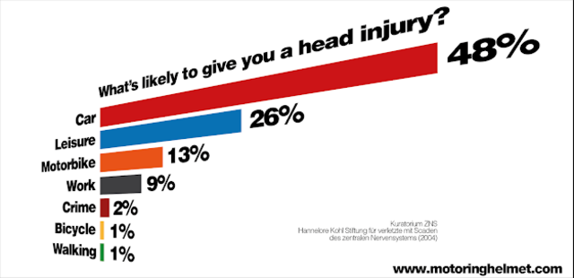
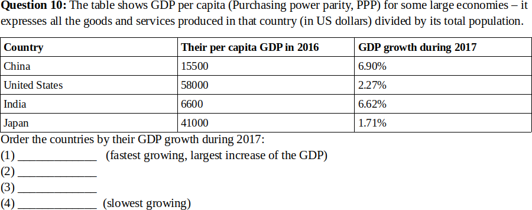
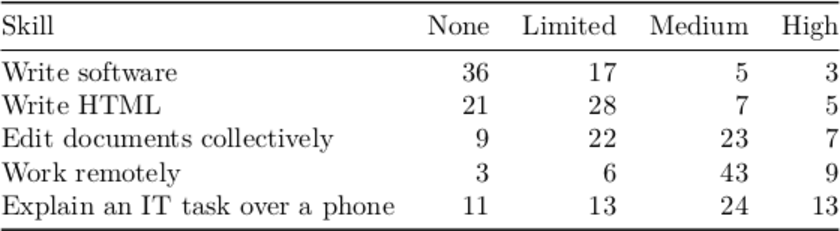
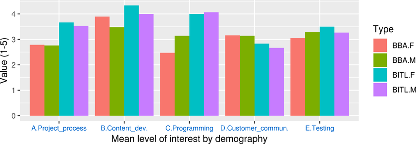

# &nbsp;

<hgroup>

<blue>Week3: Development by a Team</blue>

</hgroup><hgroup>

<span style="color:darkgreen">**(1) Goals for the Class**</span>  
<span>(2) [Critical Thinking](#section-1)</span>  
<span>(3) [Learner Analysis](#section-2)</span>  
<span>(4) [Core Skills and Areas](#section-3)</span>  
<span>(5) [Version Control](#section-4)</span>  
<span>(6) [Summary](#section-5)</span>

</hgroup>


-----

# <lo-why/> why

<div class="bigWhy">

Why discuss "First Year Project" with instructors?

</div>
<div class="smallWhy">

* What things are essential to learn during this course (besides a good 
end-result in your team project to make Bauska municipality happy)?
* What could be the role of instructors? 
* What is the quality of the end product? What can ensure it?

</div>


::: notes

Instructors are like scaffolding (*échafaudage, stalažas, строительные леса*) - 
they are eventually taken away. The finished building should live on.
TechHub Riga, hackatons, ways to validate our skills.

:::


--

## <lo-summary/> Our Objectives

* **Introduce** the concept of *Working Agreement*.
* **Identify** some contexts where common knowledge 
differs from critical thinking.
* **Analyze** the responses and occasional misconceptions
from the Learner Analysis.
* **Discuss** our technical skills, communication practices and 
subject matter knowledge.
* **Store** files in a version control system.


--

## <lo-summary/> New material in ORTUS

* Learner Analysis Answers
* Will post slides (what we see right now)


--

# <lo-theory/> What is a Working Agreement

* [5 Steps to a Working Agreement](https://cspfastpass.com/2018/02/16/five-steps-to-working-agreements-for-a-scrum-team/)
* [Some Example Statements](https://tech.gsa.gov/guides/agile_team_working_agreement/)

* If team members have had common culture, behavioral norms may be implicit. 
* For new teams it is better to write them down. 

--

## <lo-theory/> Questions to be Answered (from Syllabus)

1. Where you will learn about the statuses from other people in your team; 
2. Where you will keep project files and deliverables; 
3. Where is the "backlog" - the list of things you still need to do for your project; 
4. How do you keep track on who is responsible for which task; 
5. Where do you keep the "latest and greatest" version of your prototype, 
in case an instructor or a customer wants to see it. 


--

## <lo-theory/> Even More Questions

> AssUMe - You make an 'ass' out of 'u' and 'me'. 
(Try to be explicit about what you need.)

[More Sample Questions](https://blog.crisp.se/2012/12/06/jimmyjanlen/what-questions-does-your-working-agreement-answer)


-----

# &nbsp;

<hgroup>

<h1 style="font-size:28pt">Week 3: Project Processes</h1>

<blue>Working Agreement, Collaboration</blue>

</hgroup><hgroup>

<span>(1) [Goals for the Class](#section)</span>  
<span style="color:darkgreen">**(2) Critical Thinking**</span>  
<span>(3) [Learner Analysis](#section-2)</span>  
<span>(4) [Core Skills and Areas](#section-3)</span>  
<span>(5) [Version Control](#section-4)</span>  
<span>(6) [Summary](#section-5)</span>

</hgroup>


-----

# <lo-summary/> Recap on Critical Thinking 



Anything unusual about this chart? What about wearing the helmets?


--

## <lo-summary/> Common wisdom may differ

* [Dhaka Tribune on Forest Fires](https://www.dhakatribune.com/world/latin-america/2019/08/24/infographic-amazon-rainforest-fires)
* [Emanuel Macron on Forest Fires](https://twitter.com/EmmanuelMacron/status/1164617008962527232)
* [Forbes on Forest Fires](https://www.forbes.com/sites/michaelshellenberger/2019/08/30/forget-the-hype-forest-fires-have-declined-25-since-2003-thanks-to-economic-growth/#3cba1a48163d)

* [BTW, Vaping is Dangerous](https://www.google.com/search?q=vaping+is+dangerous&sxsrf=ACYBGNQbzQ0kYJnEYd_ID2-uZ_Am9NubWw:1568922354158&source=lnms&tbm=isch&sa=X&ved=0ahUKEwj72uWc093kAhUsposKHYhBBjUQ_AUIEigB&biw=1164&bih=755#imgrc=SLqTOa5CdRYB1M:) - more of the same. Can you prove any opinion?


::: notes

You can draw different charts to convey different messages.

:::


--

## <lo-summary/> Finding out the Truth




::: notes

* Try asking precise questions. Sometimes use calculator.
* What is the right way to measure GDP? 
* Nominal GDP (compare by using the current exchange rate)?
* GDP with Purchasing Power Parity, PPP (comparative prices for some selection/"basket" of goods and services)?

:::


-----

# &nbsp;

<hgroup>

<h1 style="font-size:28pt">Week 3: Project Processes</h1>

<blue>Working Agreement, Collaboration</blue>

</hgroup><hgroup>

<span>(1) [Goals for the Class](#section)</span>  
<span>(2) [Critical Thinking](#section-1)</span>  
<span style="color:darkgreen">**(3) Learner Analysis**</span>  
<span>(4) [Core Skills and Areas](#section-3)</span>  
<span>(5) [Version Control](#section-4)</span>  
<span>(6) [Summary](#section-5)</span>

</hgroup>


-----

# <lo-theory/> Learner Analysis

Typically provides answers to these questions:

* **Attitudes:** General attitudes towards the subject-matter being covered in the class.
Subtopics in the class content that may cause positive or negative feelings.
* **Learning preferences:** Class format, methods and strategies - preferences and dislikes. Selected
medium and delivery system - preferences and dislikes. Language level and specialized
terminology knowledge.
* **Tools and prerequisites:** Prerequisite abilities (present, absent, need support), skill deficiencies and
other personal or environmental deficiencies that require special attention.


--

## <lo-summary/> Prerequisite Skills


Skill levels: **None** - no exposure, 
**Low** - can do this task with assistance, **Medium** - can do this task, **High** - can assist others.




--

## <lo-summary/> Level of Interest

1. controlling software engineering process: 3.05   
(BITL - 3.57, BBA - 2.78)
2. content development: 3.82  
(BITL - 4.10, BBA - 3.68)
3. programming: 3.25  
(BITL - 4.05, BBA - 2.83)
4. customers and functional design: 3.00   
(BITL - 2.71, BBA - 3.15)
5. testing: 3.23  
(BITL - 3.33, BBA - 3.18)

::: notes

Who remembers 4 colors defined by Viesturs?

:::


--

## <lo-summary/> Levels of Interest




-----

# <lo-summary/> Misconceptions on Teamwork - 1

1. Shorter deadlines mean that team needs to be larger. Team size depends on the urgency and the size of
project.  
(In fact, adding more people may delay the project.)
2. Other teams may have skills that one team does not, so they should all work together.  
(IT teams may sometimes collaborate, but ultimately everyone is responsible for their own tasks.)
3. Since tasks change, every iteration may need a different set of people in a team.  
(We need to work with whatever resources we have.)


--

## <lo-summary/> Misconceptions on Teamwork - 2

4. More complex and time consuming work items are most valuable.  
(There might be opposite tendency - as in Pareto Principle, 
where 20% of all effort produces 80% of the value for the customer and vice versa.)
5. If there is no information from the customer or other project owner, work should stop, because there is
no meaningful way to proceed without the information.  
(Information is very important, but gathering
information is our core activity in IT - we cannot expect that it will magically delegate to someone
else.)


--

## <lo-summary/> Misconceptions on Teamwork - 3

6. Iteration model should be applied first and foremost in the places, where there is sufficient information
and when it is easy to split work into stages.  
(Iteration model works best in cases, where there is
uncertainty and we may be initially unable to see the big picture orplan more than 1-2 iterations. The
tasks, which can be well understood and analyzed in advance do not need iteration model.)
7. When all people in the team meet and the team works together, it is most productive.  
(In short
distances meeting often and rushing your work by sitting toegether may get something done, but it is
not sustainable for longer efforts.)


-----

# &nbsp;

<hgroup>

<h1 style="font-size:28pt">Week 3: Project Processes</h1>

<blue>Working Agreement, Collaboration</blue>

</hgroup><hgroup>

<span>(1) [Goals for the Class](#section)</span>  
<span>(2) [Critical Thinking](#section-1)</span>  
<span>(3) [Learner Analysis](#section-2)</span>  
<span style="color:darkgreen">**(4) Core Skills and Areas**</span>  
<span>(5) [Version Control](#section-4)</span>  
<span>(6) [Summary](#section-5)</span>

</hgroup>


-----

# <lo-summary/> Core Areas in an IT Project

Typically there are 3 core areas:

* **Technical execution:** Skills (creating content, coding, testing), selecting the right tools 
and languages.
* **Communication:** Both inside your team and with other stakeholders (specified by Viesturs).
* **Subject matter:** Knowing your topic (education issues, addicts, 
rural municipalities and local governance). 

All three are likely to cause issues.

::: notes

You may be a good communicator in everyday life (or a good programmer or well-informed
about municipality life in Latvia). Yet your skills will be pushed to a limit.

:::


-----

# <lo-theory/> Technical Execution

* Functional design would allow you to construct a Time Machine. 
Technical design most likely would not. 
* Specify a list of skills that you might need **in your team**. 
* In actual life you might hire new people or outsource.
In some contexts you cannot do this.
* Current technical capability - self-assessment. 
* Plan time for learning something, be realistic. Start with 
skills you can learn in 45 minutes or less.

::: notes

Collaboration with other teams is perfectly fine and encouraged.
But realistic teamwork scenario (the reason why we have 6-7 people per team)
is to have all skills available inside a team.

:::


--

## <lo-summary/> Skills by category

* **Using existing services:** Use interactive whiteboards or other educational
stuff. Find something in existing information systems.
* **Hardware skills:** Use sensors. Networking devices.
* **Computer skills:** Install and configure products on your workstations and servers.
* **Content creation skills:** Create photos or videos. Record sound. Create documents.
Create and deliver polls.
* **Software development skills:** Custom solutions. Packaged solutions.
* **Gadget skills:** Use smartphones, tablets or other devices for something.


--

## <lo-summary/> Custom vs. Packaged

* 2 big alternatives how to create a Web site - custom-developed or 
an existing CMS (Content Management System).
* The answer depends on your task. 
* In general, the information system (such as CMS) should be 
a good match for your task - otherwise do not bother learning it.


--

## <lo-summary/> What is POC

* POC - Proof of Concept. 
* We want to know, if something is doable **before** we invest lots of resources.
* Face the largest risks early.


--

## <lo-sample/> Your Favorite Ways to Learn

* **(A)** or **(AB)**, 30 participants prefer live explanations or both (live and video-based explanations),
* **(B)**, 22 participants prefer video-based explanations,
* **(C)**, 6 participants prefer written documentation (as the only option or one of the two preferred).

Will the instructors try to match these preferences? Not always.


-----

# <lo-theory/> Communication

* Teamwork patterns
* Communication patterns

* How do you stage meetings with each other?
* How do you stage meetings with shareholders?


--

## <lo-summary/> List of Contacts

* People from Bauska Municipality, who are responsible for 
problem topics.
* **Discussion:** Best ways to contact Bauska municipality.
There are 9 teams, some overlap in what we want to know...


--

## <lo-sample/> How to Collaborate in a Team

* **(A)**, Emails+FileSharing: 15 participants,
* **(AB)**, Emails+FileSharing and Chats: 12 participants,
* **(B)**, Chats: 26 participants,
* **(C)** or **(BC)**, Desktop sharing (with or without chat): 7 participants.


--

## <lo-sample/> From your Learner Analysis forms

<hgroup>

* Google docs - 12
* WhatsApp - 10
* Email - 4
* Skype - 3
* Slack - 2

</hgroup>

<hgroup>

* Discord - 1
* Facebook Messenger - 1
* Git - 1
* Google hangouts - 1
* Loom - 1

Also [Trello](https://www.betterbuys.com/project-management/reviews/trello/) and some other free Kanban services.

</hgroup>


-----

# <lo-theory/> Knowing your subject area

* [E-governance flops cost taxpayers close to €8m](https://eng.lsm.lv/article/economy/economy/e-governance-flops-cost-taxpayers-close-to-8m.a213139/)
* [The major e-veseliba project may meet the same fate as skolas.lv](http://www.baltic-course.com/eng/Technology/?doc=103572)
* [WHO touts e-health initiative as GPs remain skeptical](https://eng.lsm.lv/article/society/health/who-touts-e-health-initiative-as-gps-remain-skeptical.a256044/)


--

## <lo-summary/> Municipality Governance

* Extensive experience from other municipalities or even 
other countries. No need to create
119 similar projects - separate for each municipality in Latvia.
* **Discussion:** Where can you learn about municipality problem solving?


--

## <lo-summary/> Searching with Google

* Selecting keywords (look up in a thesaurus).   
Keyword for these techniques is SEO (search engine optimization). 
* Use Boolean logic, quoted phrases, wildcards.
* Use special syntax: [https://ahrefs.com/blog/google-advanced-search-operators/](https://ahrefs.com/blog/google-advanced-search-operators/)
* Refine your searches.
* Apply multi step tactics: [http://researcharchive.vuw.ac.nz/xmlui/bitstream/handle/10063/2228/paper.pdf](http://researcharchive.vuw.ac.nz/xmlui/bitstream/handle/10063/2228/paper.pdf)
* Use other resources (besides dictionaries - Wikipedia - Google).


--

## <lo-summary/> Google Search: Solutions

* <blue>`"Mellow fruitfulness" -Keats`</blue>
* <blue>`(agile OR scrum) project management filetype:ppt OR filetype:pptx`</blue>
* <blue>`Betula Pendula site:lv`</blue>

* `(agile OR scrum) project management (filetype:ppt OR filetype:pptx)`   
Would return only PPT files (not PPTX).
* <blue>`Agile Scrum PPT Presentation`  
many false positives, others missing
* `Betula Pendula :lv`    
might work just because keyword "LV" is uncommon outside
Latvia. (Try `:se` to see that you typically do NOT get Swedish sites).


--

## <lo-summary/> Other Ways to Stay Informed?

* [RAIM.GOV.LV](https://raim.gov.lv/); [Latvijas Atvērto datu portāls](https://data.gov.lv/lv)
* General Statistics: Latvijas Statistikas pārvalde. Eurostat, World Bank.
* Educational Statistics: [Ministry of Education](https://www.izm.gov.lv/lv/publikacijas-un-statistika/statistika-par-izglitibu), [Results of School Graduation Examinations](https://visc.gov.lv/vispizglitiba/eksameni/statistika.shtml)
* Bauska homepage and linked resources.
* Spatial information. 


-----

# &nbsp;

<hgroup>

<h1 style="font-size:28pt">Week 3: Project Processes</h1>

<blue>Working Agreement, Collaboration</blue>

</hgroup><hgroup>

<span>(1) [Goals for the Class](#section)</span>  
<span>(2) [Critical Thinking](#section-1)</span>  
<span>(3) [Learner Analysis](#section-2)</span>  
<span>(4) [Core Skills and Areas](#section-3)</span>  
<span style="color:darkgreen">**(5) Version Control**</span>  
<span>(6) [Summary](#section-5)</span>

</hgroup>


-----

# <lo-theory/> What is Version Control

* Collaborative editing (same document available to multiple people)
* Merging multiple edits into one document (what happens, if 
multiple people commit different changes). Also *merge conflicts*. 
* Returning to historical copies of files.
* Tagging files belonging to a release. 
* Creating multiple branches of the project.


--

## <lo-theory/> History of Git

* Developed by Linus Torvalds in 2005. First used
for Linux development community. 
* Largely has replaced other similar tools 
(Perforce, Mercurial, Subversion, CVS)
* Git is decentralized; there is no concept of 
"the central repository". There are repositories that 
can be fully or partially synchronized. 


--

## <lo-theory/> How to Start?

* [GitHub Setup Steps](https://guides.github.com/activities/hello-world/)
* [Git Tutorial](https://product.hubspot.com/blog/git-and-github-tutorial-for-beginners)


--

## <lo-summary/> Things to note - p.1

1. Everybody will need a Git client sofware before you can interact with GitHub. 
2. If you do not have computer where Git can be installed, we will 
consider installing it in the computer class.
3. You need only one repository per team. It does not matter, which team 
member creates this repository. Once it is done he or she can invite
collaborators to that project.
4. Before you can commit your changes for the first time, 
you need to configure your name and email address, so that 
they appear correctly for other users. 


--

## <lo-summary/> Things to note - p.2

5. GitHub can store all types of files. It is best suited and most
useful, when working with text, plaintext files such as HTML or program 
source code. It can work with binary files (but it is harder or not 
possible to trace individual edits).
6. All free GitHub accounts have "open source" licence of some kind. 
7. GitHub also serves as a "social network" for software developers - 
it is used for finding new employees and other interesting people.


-----

# <lo-theory/> What does NOT go into Git?

<red>**WARNING:** Before you check in something into GitHub, 
verify, if you can share it with everyone.<red>

* Do not add to GitHub (or other potentially public 
version control systems) any personal data you 
received during the project. 
(Test-data for your project, contacts, etc.)
* Do NOT add RBS-related assignment solutions as 
this may be considered facilitation of academic dishonesty.


--

## <lo-summary/> Avoid checking in dependent files.

* Independent files (source code, original HTML pages, documents)... All these
are good for Git. 
* Dependent files (compiled code, archives, HTML that is obtained by running
Python) - do NOT put this in Git. (Waste of resources and may 
cause useless "merge conflicts".)


--

## <lo-summary/> GitHub is also Open Source community

* "Social Network" for IT-related adults... 
* May lead to unintened requests to collaborate.

Open Source and Closed Source often work hand in hand. 

* [Balancing Makers and Takers to scale and sustain Open Source](https://dri.es/balancing-makers-and-takers-to-scale-and-sustain-open-source)
by Dries Buytaert (creator of Drupal CMS).


-----

# <lo-theory/> Major steps to set it up

* Get a GitHub account (register in their page)
* Download and install git (client software on your laptop)
* Set up git with your user name and email.

* In Linux (or Windows Git PowerShell) type:

```
$ git config --global user.name "Your name here"
$ git config --global user.email "your_email@example.com"
```


--

## <lo-summary/> Your Data needed for changes

```
[user]
	email = your.email@domain.com
	name = Firstname Lastname
```

GitHub would not release your email, but GitHub user/account 
name will tag your every input there.


--

## <lo-summary/> Someone creates a Git Project

* Go to **Repositories**, click **New**
* Create a short name for your project (lower-case Latin letters, dashes are OK; no spaces
or strange letters)
* You are now the "administrator" for this project, you can invite other 
contributors (write access to the repository). 
* Everyone in the world has read access.


--

## <lo-summary/> Pick Licence Carefully

* By default things you create are NOT Open Source of any kind. 
* Copyright in Latvia is managed by AKKA/LAA and similar lawyers... 
* Open Source (Apache, MIT, Gnu Public) licences for software. 
* Creative Commons (CC-BY v4.0 etc.) licences for content. 

Some Open Source is more restrictive (cannot be reproduced in commercial 
products, etc.). This is sometimes true about Gnu licences.


-----

# <lo-theory> Minimum commands

```
# Sync by pulling from the repository
git pull origin master
# Add one file to the version control 
git add filename.txt
# Add all the recent updates to files
git add -u
# Commit your own changes
git commit -m "Some explanation, why you commit this"
# Sync by pushing
git push 
```


--

## <lo-summary/> Display diff, see history

* You can compare two versions of the same file. 
* GitHub portal highlights your recent changes (and who did it). 
* Can put blame on others.


--

## <lo-summary/> Git and Emotional Life

Ability to store your files reliably - part of the IT culture.

* What happens, if you lose files in your computer. (Spill coffee on laptop, etc.)
* What happens, if you delete files in the public repository. 
* What happens, if you commit and push files having compilation errors or other severe problems.
* What happens, if you forget "git pull" - before you commit and push your own changes. 
* What happens, if you get a merge conflict. 
* What happens, if somebody else has checked in something strange (without a commit message). 


--

## <lo-summary/> Merging changes

* You typically can edit the same (plaintext) file simultaneously by multiple 
people. There typically is no *mutually exclusive* (mutex) editing - where
somebody "checks out a file" as from a library.
* Git combines your changes by **merging**
* Sometimes (if two people add incompatible edits), there is a merge conflict. 
When you pull the recent code from the repository, it shows conflicting lines. 


**Solution:** Edit manually to the right version, mark the conflict as resolved and commit.


--

## <lo-summary/> Working on multiple branches

* In a typical project there may be multiple activities going on at the same time. 
* One team fixes errors in Release 2.0 (their goal is release 2.1). 
* Another team adds new features to the Release 2.0 (their goal is release 3.0). 
* After they are done, they can merge into Release 3.1. 

*(In this case there may be two "branches" of the same file. Merging happens weeks later.)*


-----

# &nbsp;

<hgroup>

<h1 style="font-size:28pt">Week 3: Project Processes</h1>

<blue>Working Agreement, Collaboration</blue>

</hgroup><hgroup>

<span>(1) [Goals for the Class](#section)</span>  
<span>(2) [Critical Thinking](#section-1)</span>  
<span>(3) [Learner Analysis](#section-2)</span>  
<span>(4) [Core Skills and Areas](#section-3)</span>  
<span>(5) [Version Control](#section-4)</span>  
<span style="color:darkgreen">**(6) Summary**</span>

</hgroup>


-----

# <lo-theory/> What we just did?

* **Discussed** the concept of *Working Agreement*, presented some guidelines 
chosen by some teams.
* **Mentioned** some visualizations and intepretations which may require critical thinking.
* **Analyzed** the results of Learner Analysis.
* **Discussed** the need for technical skills, communication practices and 
subject matter knowledge.
* **Introduced** Git - a version control system.


--

## <lo-summary/> Assignment 1: Work Agreement

1. **Per Team:** Complete your first version of "Working Agreement" that suits
the needs of your team. The Working Agreement should answer the questions
from the Syllabus (plus any others that you deem important).  

2. **Per Team:** Create a tentative list of technical skills that you expect might be important, but
are insufficient (nobody has that skill? too few people have that skill?).
No need to learn this stuff, just list the skills (provide a short label 
and define each skill in a single sentence - just as you would do in a Job Advertisment). 
Add this info near the end of your Work Agreement.

3. **Per Team:** Select a tool or a list of tools for remote team communication (sending standups
or statuses). Add this info to your Work Agreement. 

**Due date:** September 27, 2019 (next Friday).


--

## <lo-summary/> Version Control Tasks

4. **Per Team:** Create a site for your team in the GitHub. (We might migrate to another Git 
repository.) Invite all people in your team.

5. **Individually:** Create individual GitHub accounts for each team member. Ensure 
Everybody tries to check in at least one file in the GitHub. (Plaintext files 
such as HTML source might be more interesting to work with.) Try changing


