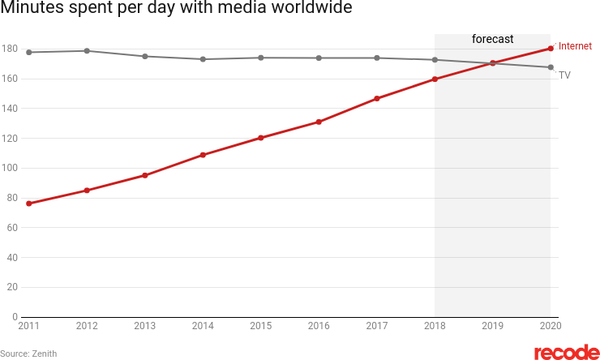
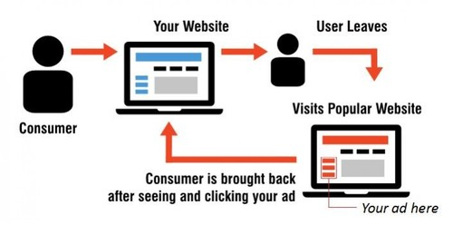

# &nbsp;

<hgroup>

<h1 style="font-size:28pt">YouTube, Google Analytics and Web Marketing</h1>

<blue>Engagement and Sentiment Analysis</blue>

</hgroup><hgroup>

<span style="color:darkgreen">**(1) Introduction**</span>  
<span>(2) [Data in and around Videos](#section-1)</span>  
<span>(3) [LAB 1: Structured Data Testing Tool](#section-2)</span>  
<span>(4) [Automated Data Extraction](#section-3)</span>  
<span>(5) [Sentiment Analysis](#section-4)</span>  
<span>(6) [LAB 2: Sentiment Analysis Webpage](#section-5)</span>  
<span>(7) [Summary](#section-6)</span>

</hgroup>

::: notes

* What are your first idea or association regarding Data Science (*datu mācība*)? 
* It is perfectly fine to have different ideas, since it is a large and versatile topic. 

:::


<!--

Visit https://socialblade.com/ to see YouTube listings (including top 250 channels in Latvia).


https://polsy.org.uk/stuff/ytrestrict.cgi
Enter this:
https://www.youtube.com/watch?v=MZvVvEAPScU&feature=youtu.be 
(or any other video)


(1) Slaidu tekstam jābūt minimālam; tam tikai jādod neliels rāmītis skolēnu pašu darbam.
(2) Slaidu idejai jābūt vienkārši izstāstāmai, nav jāizmanto grūti un mulsinoši termini.
(3) Jautājumiem jāizskatās dabiskiem, jārada interesi uzzināt vairāk, atnākt uz vēl kādu darbnīcu.
(4) Jautājumiem jāasociējas ar skolēnu reālo dzīvi, jāmudina kaut ko pajautāt draugam vai vecmāmiņai. 
(5) Praktiskajiem uzdevumiem jāmudina darboties grupās (vai vismaz pa pāriem), lai nostiprinātu RBS saistību ar pašu sadarbošanās ideju. 

Vienlaikus, ir virkne lietu, kas IT darbnīcas atšķirs no biznesa vai radošuma darbnīcām. Piemēram - darbnīcas aktivitātēm izvirzāmie mērķi būs krietni konkrētāki un "izmērāmāki". 

Pagaidām plānotas 2 darbnīcas:
(A) Darbnīcas mērķis: 
(A1) Kopā ar komandas biedriem izraudzīties tēmu, par kādu pētīt klipus vai soctīklu ierakstus. 
(A2) Atrast kanālu vai kanālus, kur šī tēma plaši pārstāvēta. 
(A3) Identificēt to klipu (vai cita veida sociālā tīkla ierakstu - Instagram u.c.), kurš izraisījis vislielāko lietotāju iesaisti/engagement. Iesaisti noteikt skatījumu, laiku/tīkšķu, komentāru veidā. Katrā tēmu grupā varētu būt kāds "rekords" (teiksim, kosmētikai vai datorspēlēm veltītie YouTub klipi parasti saņem lielāku atsaucību nekā opermūzikas klipi - bet var pētīt gan tos, gan tos). 

(B) Darbnīcas mērķis: 
(B1) Identificēt (gan starp pasniedzēju piedāvātajiem kanāliem, gan arī no iepriekšējā darbnīcā izraudzītajiem) klipos esošo komentāru populārākos vārdus, kas pauž auditorijas attieksmi. 
(B2) Meklēt šos vārdus, lai atrastu līdzīgu saturu.  
(B3) Redzēt, kā sociālajos tīklos izpaužas auditorijas reakcija ne vien kvantitatīvi, bet arī kvalitatīvi (t.s. "sentiment analysis"). Atrast, kuri video radījuši visvairāk pozitīvos vārdiņus vai emoji ("emotikonus" vai smailijus).

Citu workshop/darbnīcu idejas:
===============================
(C) Google meklētājs (un citi līdzīgi meklēšanas servisi) darbībā - kā mērķtiecīgi izmantot visādas tur noslēptas funkcijas. Kā atminēt noslēpumus (teiksim, atbildes par angļu daiļliteratūru) ar Google palīdzību. 
(D) Kā cilvēkus izspiego Internetā - kādas pēdas katrs no mums atstāj Google Maps, Twitter, u.c. servisos.
-->


# <lo-why/> why

<div class="bigWhy">

What makes some social media content successful?

</div>
<div class="smallWhy">

* Are the emotional reactions to videos subjective? Are there any patterns? 
* Are all engaging videos engaging in the same manner? 
* What is "influencer-literacy" (*influencer-pratība*)?

</div>


::: notes 

https://www.db.lv/zinas/ptac-uzraudzis-instagram-un-youtube-influencerus-492378

::: 


## <lo-summary> What are Influencers (ietekmeļi, iespaidotāji)

<hgroup>


</hgroup>
<hgroup>

* "Influencer-pratība" here is just a part of media-literacy: How to avoid 
being manipulated in social networks. 
* **BUT** influencers also need to be literate and develop their skills.
We cannot believe what we want to believe, need to measure and improve.

</hgroup>


## <lo-summary/> TV Ratings and YouTube

<hgroup style="font-size:70%">

[LTV1 in August was the most popular channel in Latvia](https://www.lsm.lv/raksts/zinas/latvija/ltv1-julija-bijis-skatitakais-tv-kanals-latvija.a328521/): <red>**131.3K**</red>


</hgroup>
<hgroup style="font-size:70%">

[Beāta Jonīte: Moving in together](https://youtu.be/x85xEw6OgXQ): <red>**364K**</red>


</hgroup>


## <lo-summary/> Global Trend




* [Vox.com: Next year, people will spend more time online than they will watching TV](https://www.vox.com/2018/6/8/17441288/internet-time-spent-tv-zenith-data-media)
* Another monetization model. There is no longer a TV studio that pays salary to journalists.


<!-- 
> “How did you go bankrupt?” Bill asked.  
> “Two ways,” Mike said. “Gradually and then suddenly.”  
> <blue>(Hemingway, E. *The Sun Also Rises*, 1926.)</blue>
-->

</hgroup>


# &nbsp;

<hgroup>

<h1 style="font-size:28pt">YouTube, Google Analytics and Web Marketing</h1>

<blue>Engagement and Sentiment Analysis</blue>

</hgroup><hgroup>

<span>(1) [Introduction](#section)</span>  
<span style="color:darkgreen">**(2) Data in and around Videos**</span>  
<span>(3) [LAB 1: Structured Data Testing Tool](#section-2)</span>  
<span>(4) [Automated Data Extraction](#section-3)</span>  
<span>(5) [Sentiment Analysis](#section-4)</span>  
<span>(6) [LAB 2: Sentiment Analysis Webpage](#section-5)</span>  
<span>(7) [Summary](#section-6)</span>

</hgroup>


# <lo-theory/> Technologies to Track Users

* Cookies (*sīkdatnes*).
* Tracking pixels and 3rd party banners (*trešo pušu izvietotie pikseļi un reklāmas baneri*).
* Browser fingerprinting (*pārlūkprogrammu digitālnospiedumi*).
* eBeacons (*e-bojas*) - typically Bluetooth or ultrasound. 

[More about Website tracking](https://www.cookiebot.com/en/website-tracking/)


## <lo-summary/> Remarketing: Mechanisms Combined

<div style="font-size:80%">



A consumer visits your Website $A$.   
&nbsp;&nbsp;&nbsp;&nbsp;&nbsp; $\Rightarrow$ It contains a tracking pixel from Website $B$.   
&nbsp;&nbsp;&nbsp;&nbsp;&nbsp; $\Rightarrow$ Both Websites $A$ and $B$ track the user with the same identifier.  
&nbsp;&nbsp;&nbsp;&nbsp;&nbsp; $\Rightarrow$ User navigates to Website $C$ containing Google AdSense.  
&nbsp;&nbsp;&nbsp;&nbsp;&nbsp; $\Rightarrow$ User is reminded to return to Website $A$. 


</div>

::: notes

https://smgnewengland.com/2014/09/22/what-is-remarketing/

::: 


## <lo-summary/> Data at Various Levels

* **Alphabet, Amazon, Facebook* // **Baidu, Alibaba, Tencent:** Platform owners need all these techniques
to get detailed information about each user. Can show more targeted ads.
* **Authors and Content Creators:** Get access to YouTube Analytics, 
to Google Analytics and other tools to improve their content. 
* **End Users:** Can see the information posted to 
the Internet (sometimes they need "honeypot accounts" to see 
Ads from "Saskaņa" political party etc.).

# <lo-sample/> Demo: Tools for Authors

<hgroup style="font-size:70%">

1. Log into your Google account, navigate to YouTube. 
2. Click your picture at the top right, select **Go to Studio (Beta)**


</hgroup>
<hgroup style="font-size:70%">

3. Open **Analytics** and select the statistics you want.


**Note:** You need to publish some videos to see analytics
(who is watching them, when, for how many seconds, how did 
they find you, etc.)

</hgroup>


## <lo-soln/> Analytics Example 1: Timeline


## <lo-soln/> Analytics Example 2: Popularity Piechart


## <lo-soln/> Analytics Example 3: Visitors by Device


## <lo-soln/> Analytics Example 4: Visitors by Demography


# &nbsp;

<hgroup>

<h1 style="font-size:28pt">YouTube, Google Analytics and Web Marketing</h1>

<blue>Engagement and Sentiment Analysis</blue>

</hgroup><hgroup>

<span>(1) [Introduction](#section)</span>  
<span>(2) [Data in and around Videos](#section-1)</span>  
<span style="color:darkgreen">**(3) LAB 1: Structured Data Testing Tool**</span>  
<span>(4) [Automated Data Extraction](#section-3)</span>  
<span>(5) [Sentiment Analysis](#section-4)</span>  
<span>(6) [LAB 2: Sentiment Analysis Webpage](#section-5)</span>  
<span>(7) [Summary](#section-6)</span>

</hgroup>


# <lo-sample/> LAB 1: Verify YouTube Video Metadata

**Steps:** 

1. Turn off sound on your mobile device. 
2. Visit some YouTube video, copy its URL.
2. Open Google's *Structured Data Testing Tool*.
3. Paste the copied URL.
4. View the metadata.

## <lo-soln/> LAB 1: Navigating to the Tool

<hgroup>


</hgroup>
<hgroup>


</hgroup>


## <lo-soln/> LAB 1: Viewing Metadata

<hgroup>


</hgroup>
<hgroup>


</hgroup>


# &nbsp;

<hgroup>

<h1 style="font-size:28pt">YouTube, Google Analytics and Web Marketing</h1>

<blue>Engagement and Sentiment Analysis</blue>

</hgroup><hgroup>

<span>(1) [Introduction](#section)</span>  
<span>(2) [Data in and around Videos](#section-1)</span>  
<span>(3) [LAB 1: Structured Data Testing Tool](#section-2)</span>  
<span style="color:darkgreen">**(4) Automated Data Extraction**</span>  
<span>(5) [Sentiment Analysis](#section-4)</span>  
<span>(6) [LAB 2: Sentiment Analysis Webpage](#section-5)</span>  
<span>(7) [Summary](#section-6)</span>

</hgroup>


# <lo-theory/> Using YouTube API

**Why do you need this:** Sometimes you need quick information on 
user engagement (subscriptions for the channel, 
number of videos, likes per each video, number of comments, 
title, etc.). 

* [YouTube API](https://towardsdatascience.com/what-is-api-and-how-to-use-youtube-api-65525744f520)
gives you a fast and programmable way to extract this data.


## <lo-summary/> Abbreviated counts

 - 
"For consistency" all accounts over 1000 are displayed in 
abbreviated format "1.4K", "23M" etc.


# <lo-theory/> Info not structured as "metadata"

* Using robots (a.k.a. crawlers, spiderbots) can save your time.
* Record texts of comments and video descriptions. 
* Automate your actions, pretend that you are an actual user 
with a browser screen. 


# <lo-theory/> Ethical Robots

<div style="font-size:70%">

Not all robots are welcome in YouTube. See <a href="https://www.youtube.com/robots.txt">robots.txt</a>.

```
User-agent: Mediapartners-Google*
Disallow:

User-agent: *
Disallow: /channel/*/community
Disallow: /comment
Disallow: /get_video
Disallow: /get_video_info
Disallow: /live_chat
Disallow: /login
Disallow: /results
Disallow: /signup
Disallow: /t/terms
Disallow: /timedtext_video
Disallow: /user/*/community
Disallow: /verify_age
Disallow: /watch_ajax
... 

Sitemap: https://www.youtube.com/yt/sitemap/sitemap.xml
```

</div>


# &nbsp;

<hgroup>

<h1 style="font-size:28pt">YouTube, Google Analytics and Web Marketing</h1>

<blue>Engagement and Sentiment Analysis</blue>

</hgroup><hgroup>

<span>(1) [Introduction](#section)</span>  
<span>(2) [Data in and around Videos](#section-1)</span>  
<span>(3) [LAB 1: Structured Data Testing Tool](#section-2)</span>  
<span>(4) [Automated Data Extraction](#section-3)</span>  
<span style="color:darkgreen">**(5) Sentiment Analysis**</span>  
<span>(6) [LAB 2: Sentiment Analysis Webpage](#section-5)</span>  
<span>(7) [Summary](#section-6)</span>

</hgroup>


# <lo-summary/> Sentiment Analysis Basics

* [YouTube Sentiment Analysis](https://github.com/sharan1/youtube-data-sentimental-analysis)
* Sentiment Analysis is often used to study user reaction - 
mostly, if their comments about something are positive or negative. 
(It could be used to analyze more varied emotions as well.) 
* [Sentiment Analysis](https://en.wikipedia.org/wiki/Sentiment_analysis) 
is meant to decode opinions rather than any objective facts. 
* In YouTube sentiments often appear in user comments.


## <lo-summary/> Sentiment Analysis in Latvian

* For English language there are some Machine Learning
models that are already trained to find the sentiments
(the model has to be *trained* by sample data). 
* In Latvian we use a different approach: dictionaries
with word stems expressing emotions.
* Before we analyze anything, all text in user comments is 
space-normalized (single spaces between any two words, 
no other punctuation) 
and converted to the lower case.


## <lo-soln/> Sample dictionaries with Regex


```
(vis)?jauk.*,(vis)?mīlīg.*,(vis)?skaist.*,(vis)?smukāk.*,
piestāv.*,iespārd.*,reeciig.*,rēcīg.*,
wow,super,tii+k,omg,haha
```

```
(vis)?šausmīg.*,(vis)?nejauk.*,(vis)?slikt*,(vis)?garlaicīg.*,(vis)?stulb.*,
heito.*,neciešam.*,
fuj,depressing,


```

```
instagram,fortnite,stream deck,man of medan
akvapark.*
```

## <lo-hints/> Other

* [Sentiment Analysis with ML](https://youtu.be/AJVP96tAWxw)


# &nbsp;

<hgroup>

<h1 style="font-size:28pt">YouTube, Google Analytics and Web Marketing</h1>

<blue>Engagement and Sentiment Analysis</blue>

</hgroup><hgroup>

<span>(1) [Introduction](#section)</span>  
<span>(2) [Data in and around Videos](#section-1)</span>  
<span>(3) [LAB 1: Structured Data Testing Tool](#section-2)</span>  
<span>(4) [Automated Data Extraction](#section-3)</span>  
<span>(5) [Sentiment Analysis](#section-4)</span>  
<span style="color:darkgreen">**(6) LAB 2: Sentiment Analysis Webpage**</span>  
<span>(7) [Summary](#section-6)</span>

</hgroup>


# <lo-sample/> LAB 2: Your visualization website

**Steps:** 

1. Register with GitHub (unless you already have an account). 
2. Clone a small repository with 2 files.
3. Publish that repository using GitHub pages.
4. Edit `index.html` code to display a list of sentiments.


# &nbsp;

<hgroup>

<h1 style="font-size:28pt">YouTube, Google Analytics and Web Marketing</h1>

<blue>Engagement and Sentiment Analysis</blue>

</hgroup><hgroup>

<span>(1) [Introduction](#section)</span>  
<span>(2) [Data in and around Videos](#section-1)</span>  
<span>(3) [LAB 1: Structured Data Testing Tool](#section-2)</span>  
<span>(4) [Automated Data Extraction](#section-3)</span>  
<span>(5) [Sentiment Analysis](#section-4)</span>  
<span>(6) [LAB 2: Sentiment Analysis Webpage](#section-5)</span>  
<span style="color:darkgreen">**(7) Summary**</span>

</hgroup>


# <lo-theory/> What did we cover? 

* We identified 4 ways to track website users.
* We read YouTube data from the author's perspective (inspected YouTube 
analytics). 
* In the **LAB01:** you browsed the YouTube "VideoObjects", and their metadata
in the <blue>Google Structured Data Testing Tool</blue>.
* We demonstrated the data extraction automation using a Python script and
browser automation tool Selenium. 
* In the **LAB02:** you browsed some sentiment data in an 
ad hoc website hosted on GitHub Pages. (More visualization would 
likely coding on a proper computer.)


## <lo-summary/> What Comes Next? 

In a typical research project, one question leads
to **multiple** new questions.

* Can the sentiment analysis detect sarcasm or other uses
of <blue>*figurative language*</blue> (*tēlainās izteiksmes līdzekļi*). 
* How to extract and analyze YouTube video data 
as still images, etc.? (This would involve *deep machine learning*).
* Is there a dependency between the sentiment and user-involvement? 
What types of emotion users love best?


## <lo-summary/> The Last Things

* Please go to a page (indicated by the instructor) 
and fill in the feedback. 
* The contact information: Email `kalvis.apsitis` at the domain 
`gmail.com`. 

<blue>Please send your comments and suggestions!</blue>


# <lo-theory/> Notes for Instructors

1. Check, if you have Python 3.7, Pip3 package manager 
and Selenum installed. You will need them when running
the crawler automation task. See 
[Scraping YouTube](https://www.analyticsvidhya.com/blog/2019/05/scraping-classifying-youtube-video-data-python-selenium/)
for details.
2. You will also need to share your mobile device screen on your desktop 
(so that your mobile phone can be shown on the big screen). 
Either **Vysor** or **scrcpy** could be used. 
See e.g. [Scrcpy description](https://www.omgubuntu.co.uk/2019/07/scrcpy-mirror-android-to-ubuntu-linux). 
3. Before the screen sharing works, you will also need to enable USB debugging 
on the mobile device and connect your phone with the laptop with 
a USB cable.


