# &nbsp;

<hgroup>

<h1 style="font-size:32pt">Simetrija spēlēs: 
(1) Kombinatoriskas spēles</h1>

</hgroup><hgroup>

* **(1) Kombinatoriskas spēles**
* (2) "Karstas" un "aukstas" pozīcijas
* (3) Simetrijas veidi ģeometrijā un aritmētikā
* (4) Vai simetriskais gājiens vienmēr ir iespējams?
* (5) Simetrija dažās skaitļu "noņemšanas" spēlēs

</hgroup>

---

# Kāpēc kombinatoriskas spēles?

<hgroup>

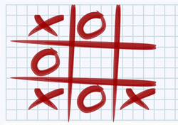

</hgroup>
<hgroup>

* Galīgs skaits pozīciju
* Katrā pozīcijā galīgs skaits iespējamo gājienu
* Dotajā sākumpozīcijā gājienu skaits ir ierobežots

</hgroup>

---

# Kombinatorisko spēļu daudzveidība

<hgroup>

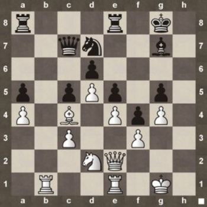

</hgroup>

<hgroup>

* Vai šahā ir galīgs skaits pozīciju? (Mazāks par $(1+64)^{32}$)
* Vai šaha spēlētāja gājienu skaits konkrētajā pozīcijā ir ierobežots? (Ne lielāks par $8 + 27 + 
2\cdot{}13 + 2\cdot{}8+$ $+ 2\cdot{}14 + 8\cdot{}4=137$)
* Vai katra šaha partija reiz beidzas? ([Fifty-move rule](https://en.wikipedia.org/wiki/Fifty-move_rule) - Ja 50 šaha gājienos nenosit nevienu figūru un nepabīda nevienu bandinieku, ieskaita neizšķirtu.)

</hgroup>

---

# Citi ierobežojumi

<hgroup>

</hgroup>

<hgroup>

* Divi spēlētāji
* Gājienus izdara pārmaiņus, tos nedrīkst izlaist
* Zaudē tas, kurš nevar izdarīt kārtējo gājienu
* Pilna informācija
* Spēlei ir "nulles summa" - lai viens uzvarētu, otram jāzaudē
* Nav neizšķirtu

</hgroup>

---

# Kā spēles analizēt?

* Uzdevuma mērķis: 
    - **Noskaidrot, kurš uzvar, pareizi spēlējot:** Pirmais vai otrais spēlētājs.
(*Kombinatoriskā spēlē, ja zināma sākumpozīcija, tajā 
viens no 2 spēlētājiem var nodrošināt sev uzvaru.*)
    - **Atrast uzvarošo stratēģiju:** Algoritmiski pierakstītu veidu, kā spēlēt, lai noteikti uzvarētu.

Uzvarētājam
jāvar atbildēt **visiem** pretinieka gājieniem.  
Risinājumā nedrīkst pieņemt, ka zaudētājs rīkosies noteiktā veidā.

---

# Milzīgs variantu skaits

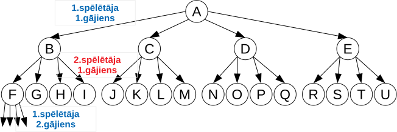

**Būtiska grūtība:** Kombinatoriskās spēlēs mēdz būt ārkārtīgi daudz spēles scenāriju. 
Parasti nevar atsevišķi pierakstīt, ko darīt katrā pozīcijā, atbildot uz katru pretinieka gājienu.

**Kā meklēt atrisinājumu?**  
Var aplūkot *invariantus* - spēles pozīciju īpašības, kas gājienu veikšanas laikā nemainās.

---

# <lo-sample/> Piemērs: Noņemšanas spēle

<hgroup>

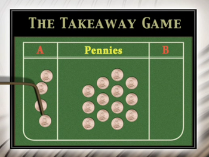

(*Attēls no Paul Zeitz,
"The Art and Craft of Mathematical Problem Solving". 2010.*)

</hgroup>

<hgroup>

Sākumā uz galda ir $n=17$ monētas. Divi spēlētāji pārmaiņus izdara gājienus. 
Ar vienu gājienu atļauts paņemt $1$, $2$, $3$ vai $4$ monētas. Uzvar tas spēlētājs, 
kurš paņem pēdējo monētu. Kurš uzvar, pareizi spēlējot?

Kas notiek citām $n$ vērtībām?

</hgroup>

---

# Spēles analīze no beigām

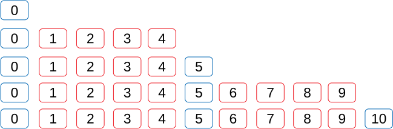

1. Beigu pozīciju ($0$) krāso <blue>zilu</blue>.
2. Pozīcijas, kas ved uz $0$, krāso <red>sarkanas</red>.
3. Pozīcijas, kas ved **tikai** uz sarkanajām, krāso <blue>zilas</blue>. 
4. Pozīcijas, kas ved arī uz kādu zilo, krāso <red>sarkanas</red>.
5. Utt. 

----

# Invariants: Monētu skaita dalāmība ar 5

<hgroup>

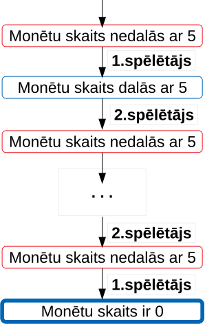 

</hgroup>

<hgroup>

**Apgalvojums:** Pareizi spēlējot, pie $n=17$ uzvar 1.spēlētājs. 

**Stratēģija:** Sākumā 1.spēlētājs no $17$ monētām noņem 2 monētas.   
Turpmāk 2.spēlētājs ikreiz dalāmību ar $5$ izjauc, bet 1.spēlētājs to atjauno.  

* <blue>Dalāmība ar $5$</blue> **pēc 1.spēlētāja gājiena** ir 
<blue>*invariants*</blue> - saglabājas visā spēles gaitā.
* Monētu skaits uz galda visu laiku samazinās. 
Tas reiz kļūs $0$ (turklāt tas notiks **pēc 1.spēlētāja gājiena**).

</hgroup>

---

# Vai 1.spēlētājs var kontrolēt šo invariantu?

*Uzvarētāja stratēģijai jāspēj atbildēt uz jebkuru pretinieka gājienu.*

1. Sākumā monētu skaits $n=17$ nedalās ar $5$. Ar pirmo gājienu 
var panākt, lai $n_1 = 17-2=15$ dalītos ar $5$.
2. Pēc $i$ gājieniem pretinieks no jebkuras $n_i$ vērtības var atņemt
$1$, $2$, $3$ vai $4$. Uzvarētājs tad atņem "pretējo skaitli". 

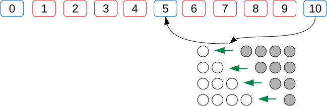

---

# <lo-summary/> Kas jāraksta atrisinājumā - 1

<hgroup>

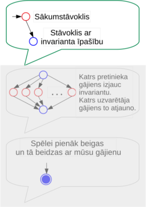

</hgroup>

<hgroup>

**Ja uzvar 1.spēlētājs:**  
Jāuzraksta, kā ar pirmo gājienu nonākt stāvoklī, kas atbilst invariantam.  
<blue>**Piemērs:** Uzvarētājs sākumā panāk, ka monētu skaits uz galda dalās ar $5$.</blue>

(*Invariants jāizdomā patstāvīgi. Dažreiz palīdz spēles analīze "no beigām".*)

</hgroup>

---

# <lo-summary/> Kas jāraksta atrisinājumā - 2

<hgroup>

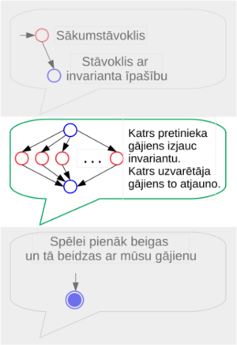

</hgroup>

<hgroup>

Turpmāk pretinieks katrā gājienā būs spiests invariantu izjaukt.  
<blue>**Piemērs:** Monētu skaits uz galda pēc zaudētāja gājiena nedalīsies ar $5$.
Savukārt uzvarētājs *pēc katra sava gājiena* atjauno
dalāmību ar $5$.</blue>

Jāuzraksta, kādēļ to var panākt atbildot uz katru pretinieka gājienu.  
<blue>**Piemērs:** Ja pretinieks atņēma $k$ monētas ($k=1,2,3,4$), tad
uzvarētājs atņem $5-k$ monētas.</blue>

</hgroup>

---

# <lo-summary/> Kas jāraksta atrisinājumā - 3

<hgroup>

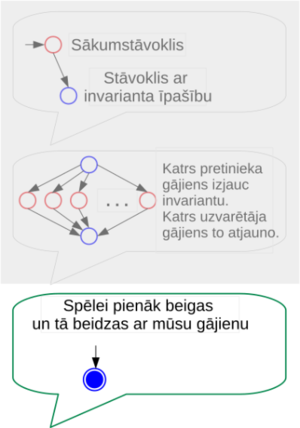

</hgroup>

<hgroup>

**Jāpamato**, ka spēle reiz beidzas.
Citiem vārdiem, spēles pozīcijas nevar turpināties neierobežoti ilgi vai "iecikloties".
Jāpamato arī, ka spēles beigu stāvoklis arī pieder invariantam, ka to 
sasniegs uzvarētājs (tas, kurš kontrolē invariantu).  
<blue>**Piemērs:** Monētu skaits visu laiku samazinās, kādreiz tas kļūs $0$. 
Tas notiks pēc 1.spēlētāja gājiena, jo arī $0$ dalās ar $5$.</blue>

</hgroup>

---

# <lo-summary/> Ja uzvar otrais...

<hgroup>

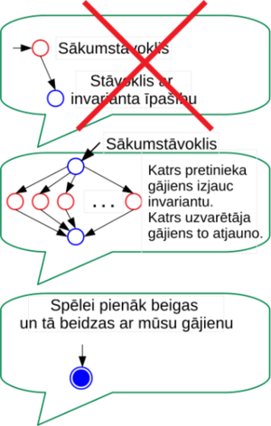

</hgroup>

<hgroup>

**Ja uzvar 2.spēlētājs,**  
tad līdzīga atrisinājuma struktūra kā iepriekš. Nav pirmā soļa, nav jāraksta, kā 
nonākt invarianta stāvoklī. Spēles sākumstāvoklis **jau** apmierina invarianta īpašību, 2.spēlētājs to 
var saglabāt arī turpmāk, atbildot uz katru 1.spēlētāja gājienu.  
<blue>**Piemērs:** Ja sākumā ir $n=15$ monētas, tad, pareizi spēlējot, uzvar
2.spēlētājs - atbildot uz katru 1.spēlētāja gājienu, viņš allaž var 
atjaunot dalāmību ar $5$.</blue>

</hgroup>

