# &nbsp;

<hgroup>

<h1 style="font-size:32pt">Aritmētiskas progresijas</h1>

</hgroup><hgroup>

**(1) Ievads**  
(2) [Pamatfakti](#section-1)  
(3) [Aptauja](#section-2)  
(4) [Tipisks piemērs](#section-3)  
(5) [Patstāvīgie uzdevumi](#section-4)  
(6) [Kopsavilkums](#section-5)

</hgroup>

<!--
TODO
A4 lapa ar pamatfaktiem: 
* Kas ir daudzkārtņi, 
* Formulas no skolas par aritmētisko progresiju, 
* Dalīšana ar atlikumu,
* LKD definīcija, 
* MKD definīcija, 
* LKD invariants fiksētam skaitlim ar progresiju, 
* Kas ir savstarpēji pirmskaitļi, 

Jaunas lietas
* 1+2+...+n summēšana
* Bezū lemma.
* Noteikt, kad 2 mainīgo lineāru vienādojumu var atrisināt veselos skaitļos
-->

<!--
TODO
Norādījumi skolotājam: 
(1) Vairumā uzdevumu ir aprēķini pirmā tūkstoša robežās - dažiem 
var rasties kārdinājums lietot kalkulatoru. Tas var paātrināt 
nodarbības gaitu, bet olimpiādēs līdzīgi aprēķini nav retums un kalkulatorus
tur nelieto.
-->

<!--
TODO
Globāla terminoloģijas un apzīmējumu vārdnīca
--> 

::: notes

Satura punkti (Ievads, Pamatfakti, ...) ir vienādi visās nodaļās.  
Nodaļai būs lapa ar pamatfaktiem (A4 izdales materiāla pirmā puse) un
papilduzdevumi (A4 otrā puse).  
Prezentācijas beigās linki, mūsu 
olimpiāžu datubāzi un šo prezentāciju kā PDF.

:::

# <lo-theory/> Kurā nodaļā esam?

<hgroup style="width: 48%; font-size:80%">

<table>
<tr><td style="text-align:left">#1: Eksperimenti un pretpiemēri</td></tr>
<tr><td style="text-align:left">#2: Mainīgo izteiksmes un pārveidojumi</td></tr>
<tr><td style="text-align:left">#3: Algebriskas struktūras</td></tr>
<tr><td style="text-align:left">#4: Dalāmība un pirmreizinātāji</td></tr>
<tr><td style="text-align:left">#5: LKD, MKD un valuācijas</td></tr>
<tr><td style="text-align:left">#6: Kongruences fiksētam modulim</td></tr>
<tr><td style="text-align:left">#7: Pretrunas moduļa izvēle</td></tr>
<tr><td style="text-align:left">#8: Decimālpieraksts</td></tr>
</table>

</hgroup>
<hgroup style="margin-left: 4%; width: 45%; font-size:80%">

<table>
<tr><td style="text-align:left"><red>**#9: Aritmētiskas progresijas**</red></td></tr>
<tr><td style="text-align:left">#10: Ģeometriskas progresijas&nbsp;&nbsp;&nbsp;&nbsp;&nbsp;&nbsp;&nbsp;&nbsp;&nbsp;&nbsp;&nbsp;&nbsp;&nbsp;&nbsp;&nbsp;</td></tr>
<tr><td style="text-align:left">#11: Rekurentas virknes</td></tr>
<tr><td style="text-align:left">#12: Ekstrēmie elementi</td></tr>
<tr><td style="text-align:left">#13: Dirihlē princips</td></tr>
<tr><td style="text-align:left">#14: Invarianti un indukcija</td></tr>
<tr><td style="text-align:left">#15: Nevienādības</td></tr>
<tr><td style="text-align:left">#16: Kombinatoriskas metodes</td></tr>
</table>

</hgroup>

::: notes

* Tēmu rādītājs nav līdz galam izveidots.
* 16 nodarbības pa 90 minūtēm nozīmētu 2 kredītpunktu kursu.
Tas, iespējams, ir piemērots apjoms, ko, piemēram, 9.-10. klases 
skolēns varētu veltīt (nacionāla līmeņa sacensību) skaitļu 
teorijas uzdevumiem.

:::

# <lo-why/> why

Kāpēc aritmētiskas progresijas
noder dažādu matemātikas jomu uzdevumos?

* Kāpēc atkārtošanās un pieaugumi laikā, telpā, cenās, ātrumos u.c.
bieži veido progresijas?
* Kāpēc var noderēt vairāku progresiju, to veidoto "ritmu" salīdzināšana?
* Kāpēc noteikta izskata vienādojumi (piemēram, $ax+by=c$) 
algebrā un skaitļu teorijā risināmi atšķirīgi?

::: notes

Šo "Kāpēc" slaidu nevajadzētu lasīt vai uztvert burtiski.
Katram auditorijā jānāk pie atbildes uz savu 
"kāpēc" (Kāpēc es šo vispār mācos?).

Īsi sakot, progresijas olimpiādēs ir pazīstamākās 
un iemīļotākās virknes.

:::

## <lo-why/> Intuīcija par progresijām

<section style="height:300px;">

<hgroup style="width:33%; position:absolute; left: 0px">

Iepirkšanās un dažādi iepakojumi

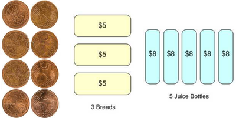

<!--
TODO: Grēdā sakrauti dēļi, viena kaudzīte nepabeigta.
-->

</hgroup>
<hgroup style="width:33%; position:absolute; left: 320px">

Daudzkārtņi

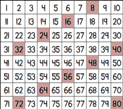

<!--
Ritmiski izvietoti skaitļi - ne obligāti daudzkārtņi
-->

</hgroup>
<hgroup style="width:33%; position:absolute; left: 640px">

Elementi trijstūros un trapecēs.

</hgroup>

</section>

<section style="height:300px;">

<hgroup style="width:33%; position:absolute; left: 0px">

Atlikumi, pēdējie cipari

<!--
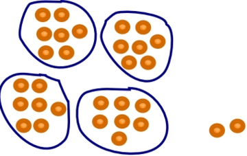
-->

<!--
Atlikums rodas kā rezultāts nosoļošanai uz leju: dilstoša progresija uz 0
-->

</hgroup>

<hgroup style="width:33%; position:absolute; left: 320px">

Sēdvietas, datumi

<!--
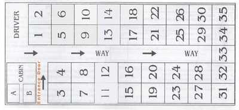
-->

</hgroup>
<hgroup style="width:33%; position:absolute; left: 640px">

Sanumurējamā bezgalība

</hgroup>

</section>

::: notes

Progresijas parasti nav pašmērķis, īsi uzskaitām dažas parādības,
kas modelējamas ar progresijām. Teksta uzdevumi 
par iepirkšanos, daudzkārtņi u.c. regulāri izvietoti 
skaitļi, sēdvietas/kalendāri un pat sanumurētais Kantora kvadrants.

::: 

 
# <lo-theory/> Sasniedzamie rezultāti (1-2)

<hgroup style="font-size:70%">

1. Lietot skolas formulas par progresijām.
2. Izmantot $S_n$ dalāmību 
ar $n$ un vidējo locekli (attiecīgi ar $n/2$ un abu vidējo locekļu summu).

3. Novērtēt progresijas summas augšanu atkarībā no $n$.
4. Atrast, cik progresijas locekļu ir sākumintervālā un citos intervālos.

5. Aprakstīt progresiju $a\cdot{}k$ un $b\cdot{}k$ sakrītošos locekļus ar 
jaunu progresiju, kam $d = \mbox{MKD}(a,b)$.
6. Izmantot izteiksmi dalījumam ar atlikumu.
7. Izmantot $\mbox{LKD}(a_n,d)$ nemainību progresijā $(a_n)$.

8. Atrast iespējamos atlikumus, dalot progresiju ar fiksētu skaitli. 
9. Izmantot Bezū lemmu

</hgroup>

<hgroup style="font-size:70%">

**(1)** $1+2+\ldots+n=\frac{n(n+1)}{2}$:

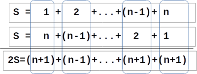

**(2)** $1$ vidējais vai $2$ vidējie:

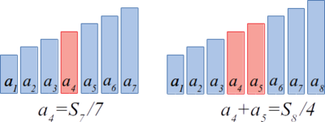

</hgroup>

::: notes

* Skolas progresiju formulas (vispārīgajam loceklim un summai var viegli 
izvest, to pierādījumi kursa dalībniekiem būtu jāsaprot). 
* Veselu skaitļu progresijām no skolas formulām var secināt šo to par progresijas 
summas dalāmību. Šīs sekas skolas kursā ne vienmēr pietiekoši akcentē.

::: 

## <lo-theory/> Sasniedzamie rezultāti (3-4)

<hgroup style="font-size:70%">

1. Lietot skolas formulas par progresijām.
2. Izmantot $S_n$ dalāmību 
ar $n$ un vidējo locekli (attiecīgi ar $n/2$ un abu vidējo locekļu summu).

3. Novērtēt progresijas summas augšanu atkarībā no $n$.
4. Atrast, cik progresijas locekļu ir sākumintervālā un citos intervālos.

5. Aprakstīt progresiju $a\cdot{}k$ un $b\cdot{}k$ sakrītošos locekļus ar 
jaunu progresiju, kam $d = \mbox{MKD}(a,b)$.
6. Izmantot izteiksmi dalījumam ar atlikumu.
7. Izmantot $\mbox{LKD}(a_n,d)$ nemainību, ja $n$ aug.

8. Atrast iespējamos atlikumus, dalot progresiju ar fiksētu skaitli. 
9. Izmantot Bezū lemmu

</hgroup>

<hgroup style="font-size:70%">

**(3)** Summa $S_n$ kā laukums

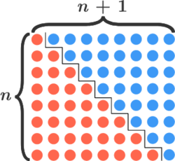

**(4)** Skaitļu $7k$ (un $7k+a$) skaits intervālā:

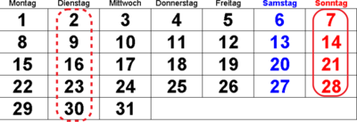

</hgroup>

::: notes 

* Nodarbības 3. un 4. mērķis ir "matalīzes redzējums" par progresijām:
Kā novērtēt pašas progresijas $a_n$ (un tās locekļu 
summu $S_n$) augšanu atkarībā no $n$, kā novērtēt locekļu skaitu intervālā.
* Reizēm pietiek lielumus zināt tikai aptuveni (plus vai mīnus neliels skaitlis). 
Tad formulas ir vienkāršākas - kvadrātfunkcijai var ņemt tikai pirmo saskaitāmo, 
var nerēķināt augšējo veselo daļu.

::: 

## <lo-theory/> Sasniedzamie rezultāti (5-7)

<hgroup style="font-size:70%">

1. Lietot skolas formulas par progresijām.
2. Izmantot $S_n$ dalāmību 
ar $n$ un vidējo locekli (attiecīgi ar $n/2$ un abu vidējo locekļu summu).

3. Novērtēt progresijas summas augšanu atkarībā no $n$.
4. Atrast, cik progresijas locekļu ir sākumintervālā un citos intervālos.

5. Aprakstīt progresiju $a\cdot{}k$ un $b\cdot{}k$ sakrītošos locekļus ar 
jaunu progresiju, kam $d = \mbox{MKD}(a,b)$.
6. Izmantot izteiksmi dalījumam ar atlikumu.
7. Izmantot $\mbox{LKD}(a_n,d)$ nemainību, ja $n$ aug.

8. Atrast iespējamos atlikumus, dalot progresiju ar fiksētu skaitli. 
9. Izmantot Bezū lemmu

</hgroup>

<hgroup style="font-size:70%">

**(5)** $d=3$ un $d=4$ sakrītošie locekļi:

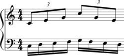

**(6)** Fiksētu atlikumu izteiksmes ar $a=bq+r$:

<table>
<tr><td>Pāra sk.</td><td>$2k$</td></tr>
<tr><td>Nepāra sk.</td><td>$2k+1$</td></tr>
<tr><td>Beidzas ar "3"</td><td>$10k+3$</td></tr>
</table>

**(7)** Skaitļi, kas dalās ar $2$, bet nedalās ar $4$:  
Ja $(a_k)$ ir $2,6,10,14,18,22,\ldots$  
tad visiem $k$: $\mbox{LKD}(a_k,4)=2$.

</hgroup>

::: notes 

* Aritmētiskas progresijas cieši saistītas ar skaitļu dalāmību, 
dalīšanu ar atlikumu, ar Eiklīda algoritmu. 
* Dabiski jautājumi par divu aritmētisku progresiju kopīgiem locekļiem 
parāda saistību ar LKD un MKD jēdzieniem.

::: 

## <lo-theory/> Sasniedzamie rezultāti (8-9)

<hgroup style="font-size:70%">

1. Lietot skolas formulas par progresijām.
2. Izmantot $S_n$ dalāmību 
ar $n$ un vidējo locekli (attiecīgi ar $n/2$ un abu vidējo locekļu summu).

3. Novērtēt progresijas summas augšanu atkarībā no $n$.
4. Atrast, cik progresijas locekļu ir sākumintervālā un citos intervālos.

5. Aprakstīt progresiju $a\cdot{}k$ un $b\cdot{}k$ sakrītošos locekļus ar 
jaunu progresiju, kam $d = \mbox{MKD}(a,b)$.
6. Izmantot izteiksmi dalījumam ar atlikumu.
7. Izmantot $\mbox{LKD}(a_n,d)$ nemainību, ja $n$ aug.

8. Atrast iespējamos atlikumus, dalot progresiju ar fiksētu skaitli. 
9. Izmantot Bezū lemmu

</hgroup>

<hgroup style="font-size:70%">

**(8)** $15$-staru zvaigznes zīmēšana:

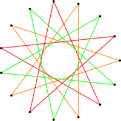

**(9)** Kā ar $15$ un $8$ centu monētām samaksāt 1¢:

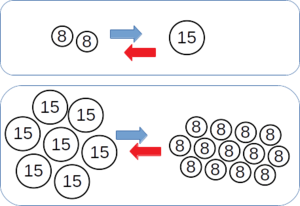

</hgroup>

::: notes 

Šajos apmācību mērķos divu progresiju (ar diferencēm attiecīgi $a$ un $b$) 
uzdotos "ritmus" apskatām atkarībā no tā, vai $a$ un $b$ ir savstarpēji pirmskaitļi. 
Ja ir, tad ar šo progresiju starpībām var izteikt skaitli $1$, tātad arī
jebkuru citu veselu skaitli. 

::: 

# &nbsp;

<hgroup>

<h1 style="font-size:32pt">Aritmētiskas progresijas</h1>

</hgroup><hgroup>

(1) [Ievads](#section)  
**(2) Pamatfakti**  
(3) [Aptauja](#section-2)  
(4) [Tipisks piemērs](#section-3)  
(5) [Patstāvīgie uzdevumi](#section-4)  
(6) [Kopsavilkums](#section-5)

</hgroup>

# <lo-theory/> Aritmētiskas progresijas jēdziens

**Definīcija:** Virkni, kurā nākamo locekli iegūst, 
iepriekšējam pieskaitot to pašu skaitli (diferenci $d$), sauc par
<blue>*aritmētisko progresiju*</blue>:
$$a_{n+1} = a_n + d,\;\;\mbox{ja}\;\;n \geq 1.$$

*Secinājums:* Aritmētiskā progresijā
jebkuru blakusesošu locekļu starpība ir konstanta: 
$$a_{n+1} - a_n = d,\;\;\text{visiem}\;\;n \geq 1.$$
(Vārds "diference" nozīmē to pašu, ko "starpība".)

TODO: Bilde ar skaitļu taisni

::: notes

Progresiju parasti definē ar diferences pieskaitīšanu. Bet līdzvērtīgi 
(un daudzos spriedumos noderīgi) ir konstantas blakusesošo locekļu starpības.

:::

## <lo-theory/> Progresiju formulas

<blue>*Progresijas $n$-tais loceklis:*</blue>
$$a_n = a_1 + (n-1)d,\;\;\mbox{kur $n>1$.}$$

<blue>*Progresijas pirmo $n$ locekļu summa:*</blue>
$$S_n = a_1 + a_2 + \ldots + a_n.$$

<blue>*Šo summu var aprēķināt ar formulu:*</blue>
$$S_n = \frac{a_1 + a_n}{2}\cdot{} n$$

::: notes

Pagaidām šo formulu izvedumus kursa materiālā neiekļaujam.  
Ar laiku tie varētu būt "dzeltenie slaidi". 

::: 

## <lo-summary/> Summa 1+2+...+n

Bieži jāsummē naturālie skaitļi līdz $n$:

$$ 1+2+\ldots+(n-1)+n = \frac{n(n+1)}{2}.$$

Lai gan polinoma $\frac{n(n+1)}{2} = \frac{1}{2}n^2 + \frac{1}{2}n$ 
abi koeficienti ir daļskaitļi, visas tā vērtības ir 
naturāli skaitļi, jo reizinājums $n(n+1)$ vienmēr ir pāru. 

*Pamatojums:* Divu pēc kārtas sekojošu skaitļu reizinājumā $n \cdot (n+1)$ 
viens no reizinātājiem ir pāra skaitlis, otrs nepāra. Tādēļ 
reizinājums vienmēr ir pāra.

## <lo-yellow/> Trijstūru skaitļi

<hgroup>

Summai $1+2+\ldots+n$ ir līdzība ar t.s. "trijstūru skaitļiem":  

</hgroup>

<hgroup>

Trijstūru skaitlis $T_n$ izsaka arī, cik veidos no $n+1$ elementiem var 
izvēlēties divus: $T_n = C_{n+1}^2$.

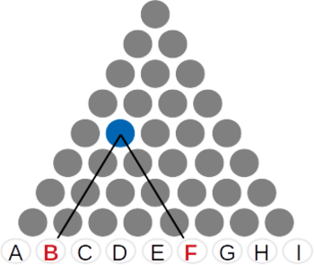

</hgroup>

# <lo-theory/> Progresijas summas dalāmība

**Apgalvojums:** Katrai aritmētiskai progresijai ar $n$ veseliem locekļiem
$a_1,a_2,\ldots,a_n$ ir spēkā:   
**(a)** Visu $n$ locekļu aritmētiskais vidējais sakrīt ar vidējo locekli 
${\displaystyle a_{\frac{n+1}{2}}}$, ja $n$ ir nepāru un ar divu vidējo 
locekļu aritmētisko vidējo, ja $n$ ir pāru.   
**(b)** Summa $S_n = a_1 + a_2 + \ldots + a_n$ dalās ar $n$ (ja $n$ ir nepāru)
un ar $n/2$, ja $n$ ir pāru. Tā dalās arī ar vidējo locekli (attiecīgi - ar
divu vidējo locekļu summu).

## <lo-summary/> Piemēri: Progresiju summas

* *Ja $n$ ir nepāru:* $S_7 = a_1+a_2+a_3 + a_4 + a_5 + a_6 + a_7 = \frac{a_1+a_7}{2}\cdot{}7$ dalās ar $7$ un ar $a_4=\frac{a_1+a_7}{2}$. 

* *Ja $n$ ir pāru:* $S_8 = a_1+a_2+a_3 + a_4 + a_5 + a_6 + a_7 + a_8 = \frac{a_1+a_8}{2}\cdot{}8$ 
dalās ar $n/2=4$ un ar $a_4+a_5$: divkāršotu progresijas aritmētisko vidējo.  
(Ja $n$ ir pāru, tad progresijas locekļu aritmētiskais vidējais var nebūt vesels.)

## <lo-sample/> LV.NO.2015.10.3

Vairāku pēc kārtas sekojošu naturālu skaitļu summa ir $177$. 
Kādas vērtības var pieņemt
mazākais no šiem saskaitāmajiem?

## <lo-reading/> LV.NO.2015.10.3

<hgroup class="reading">

<u><strong>Vairāku</strong> <strong>pēc kārtas sekojošu</strong> naturālu skaitļu summa ir $177$.</u>
Kādas vērtības var pieņemt
mazākais no šiem saskaitāmajiem?

</hgroup>
<hgroup>

TODO: Bilde, kur uzzīmēti dažādi skaitļi, kas ir/nav pēc kārtas sekojoši. 

</hgroup>

## <lo-reading/> LV.NO.2015.10.3

<hgroup class="reading">

Vairāku pēc kārtas sekojošu naturālu skaitļu summa ir $177$.
<u>Kādas vērtības var pieņemt
<strong>mazākais no šiem saskaitāmajiem</strong>?</u>

</hgroup>
<hgroup>

TODO: Bilde, kur atzīmēts katrā grupiņā mazākais skaitlis...

</hgroup>

<!--
Izskaidrot, ko uzdevuma kontekstā nozīmē: 

* Vairāku...
* ... pēc kārtas sekojošu ...
* ... naturālu skaitļu summa ...
* ... mazākais no šiem saskatāmajiem
-->

## <lo-hints/> LV.NO.2015.10.3

* Vai var veikt pilno pārlasi, sākot saskaitīt no kādas vietas?
* Cik daudzu pēc kārtas sekojošu naturālu skaitļu summa noteikti pārsniedz $177$?
* Kā samazināt aplūkojamo gadījumu skaitu? Vai ir vērts pārbaudīt summas, 
sākot ar jebkuru naturālu skaitli?

## <lo-soln/> LV.NO.2015.10.3

<hgroup style="font-size:90%">

* Ja $n$ ir nepāru, tad $S_n = 177 = a_{vid}\cdot{}n$. 
* Var būt $n=3$ vai $n = 59$  
(bet $1 + \ldots + 59 > 177$).

**(A)** $177 = 3\cdot 59 =$  
$=58+$<red>$59$</red>$+60$.

</hgroup><hgroup style="font-size:90%">

* Ja $n$ ir pāru, tad $S_n$ dalās ar $n/2$. 
* Var būt $n = 2$ vai $n = 6$   
(jo $n = 2\cdot 59$ ir par lielu).

**(B)** $177 = 2\cdot 88\frac{1}{2} =$<red>$88 + 89$</red>,  
**(C)** $177 = 6\cdot 29\frac{1}{2} =$  
$=27+28+$<red>$29+30$</red>$+31+32$.

</hgroup>

# <lo-theory/> Kā aug progresijas summa

**Apgalvojums:** Ja $a_n$ ir augoša aritmētiska progresija, 
tad tās summa $S_n$ ir kvadrātfunkcija atkarībā no $n$. 

Lai to pārbaudītu, pārveidojam:
$$S_n = \frac{a_1 + a_n}{2}\cdot{}n = \frac{2a_1 + (n-1)d}{2}\cdot{}n = $$
$$= \frac{d}{2}n^2 + \left( a_1 - \frac{d}{2} \right)n.$$

## <lo-summary/> Tuvināšana ar trijstūra laukumu

<hgroup>

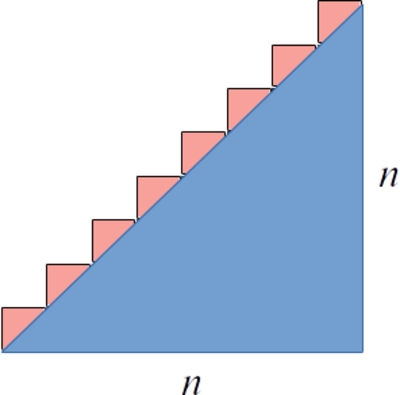

</hgroup>
<hgroup>

* Progresijas summa aptuveni proporcionāla reizinājumam $n\cdot{}n = n^2$. 
* Progresijas summa (mūsu zīmējumā: $\frac{n(n+1)}{2}$) nav precīzi vienāda ar 
trijstūra vai trapeces laukumu, jo ir jāpieskaita arī "zobiņu" laukums. 

</hgroup>

## <lo-sample/> LV.NO.2002.8.3 

Burtnīcā ir $100$ lapas; tās lappuses sanumurētas dabīgā kārtībā ar numuriem 
no $1$ līdz $200$. Vai izrauto lappušu numuru summa var būt $1000$, ja tiek izrautas  
**(a)** $31$ lapa;   
**(b)** $30$ lapas?   
*Piezīme.* Lapas var neraut pēc kārtas.

## <lo-reading/> LV.NO.2002.8.3 

<hgroup class="reading">

<u>Burtnīcā ir $100$ lapas; tās lappuses sanumurētas dabīgā kārtībā ar numuriem 
no $1$ līdz $200$</u>. Vai izrauto lappušu numuru summa var būt $1000$, ja tiek izrautas  
**(a)** $31$ lapa;   
**(b)** $30$ lapas?   
*Piezīme.* Lapas var neraut pēc kārtas.

</hgroup>
<hgroup>

TODO: Bilde par 1 lapu, kas ir divas lappuses.  
Turklāt autori pasvītrojuši, ka $100$ lapām atbilst $200$ lappušu numuri.

</hgroup>

## <lo-reading/> LV.NO.2002.8.3 

<hgroup class="reading">

Burtnīcā ir $100$ lapas; tās lappuses sanumurētas dabīgā kārtībā ar numuriem 
no $1$ līdz $200$. <u>Vai izrauto lappušu numuru summa var būt $1000$</u>, ja tiek izrautas  
**(a)** $31$ lapa;   
**(b)** $30$ lapas?   
*Piezīme.* Lapas var neraut pēc kārtas.

</hgroup>
<hgroup>

TODO: Bilde, kur skaita pa pāriem lappušu numurus (liek 1 lappuses numurus iekaviņās)  

</hgroup>

## <lo-hints/> LV.NO.2002.8.3 

* Vai ir ekstrēma (lielākā/mazākā) vērtība, ko gribētu pārbaudīt?
* Izraujot $1$ lapu, summai pievienojas divi lappušu numuri. Kādas var
būt šo abu lappušu numuru summas?

## <lo-soln/> Atlikumi un nevienādības
 
**(a)** summa būtu nepāru. 
**(b)** trīsdesmit $4k_i-1$ summa nedalītos ar $4$.

Var pamatot arī ar nevienādību:  
Jau $1+\ldots+60 > 1000$, tādēļ pat vismazāko lapu numuru summa ir par lielu.

## <lo-yellow/> Vienmērīgi paātrināta kustība

**Apgalvojums:** Ja materiāls punkts kustas ar sākotnējo ātrumu 
$v_0$ un paātrinājumu $a$, tad tā noietais ceļš iegūstams 
ar formulu, kas līdzīgi iepriekšējai ir kvadrātfunkcija no laika $t$:
$$s = v_0t + \frac{at^2}{2}.$$

*Piezīme.* Ja materiāls punkts sākumā ir nekustīgs ($v=0$) 
un pēc tam brīvi krīt $t$ sekundes ar paātrinājumu $g = 9.81\,m/s^2$, 
tad tā pārvietojums ir $\frac{gt^2}{2}$.

## <lo-yellow/> Vidējais ātrums

Līdzīgi kā aritmētiskas progresijas summa izmanto vidējo locekli, 
vienmērīgi paātrinātas kustības ceļu var atrast, izmantojot vidējo ātrumu.

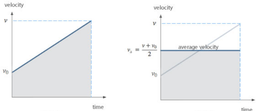

Brīvās krišanas paātrinājumam $g \approx 10\,m/s^2$:

* Pirmajā sekundē krīt $5\,m$,
* Otrajā sekundē krīt $15\,m$,
* Trešajā sekundē krīt $25\,m$, utt. 

# <lo-theory/> Lielāko diferenci meklējot (LKD)

**Apgalvojums:** Katrai augošai naturālu skaitļu virknei 
$a_1 < a_2 < \ldots < a_n$ atradīsies lielākais 
$d$, ka visi $a_i$ pieder aritmētiskai progresijai ar
diferenci $d$. Tas ir visu starpību $(a_i - a_j)$ 
lielākais kopīgais dalītājs. 

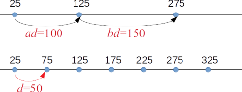

## <lo-theory/> Mazāko diferenci meklējot (MKD)

**Apgalvojums:** Divām aritmētiskām progresijām ar diferencēm $d_1$ 
un $d_2$ vai nu nav kopīgu locekļu, vai arī
tie veido aritmētisku progresiju ar diferenci 
$\mbox{MKD}(d_1,d_2)$   
*Piezīme.* Ar $\mbox{MKD}(a,b)$ apzīmējam divu skaitļu mazāko kopīgo dalāmo.

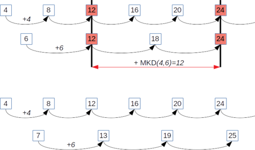

## <lo-sample/> BBK2012.P1.36/LV.SO.2017.10.2

Trīs no aritmētiskās progresijas locekļiem ir $41$, $113$, $193$. 
Atrast lielāko iespējamo diferences vērtību, ja 
zināms, ka tā ir vesels skaitlis.

## <lo-reading/> BBK2012.P1.36/LV.SO.2017.10.2

<hgroup class="reading">

<u>Trīs no aritmētiskās progresijas locekļiem ir $41$, $113$, $193$.</u>
Atrast lielāko iespējamo diferences vērtību, ja 
zināms, ka tā ir vesels skaitlis.

</hgroup>
<hgroup>

TODO: Bilde, kur skaita pa pāriem lappušu numurus (liek 1 lappuses numurus iekaviņās)  

</hgroup>

## <lo-reading/> BBK2012.P1.36/LV.SO.2017.10.2

<hgroup class="reading">

Trīs no aritmētiskās progresijas locekļiem ir $41$, $113$, $193$.
<u>Atrast <strong>lielāko iespējamo</strong> diferences vērtību, ja 
zināms, ka tā ir vesels skaitlis.</u>

</hgroup>
<hgroup>

TODO: Bilde, kur skaita pa pāriem lappušu numurus (liek 1 lappuses numurus iekaviņās)  

</hgroup>

## <lo-hints/>  BBK2012.P1.36/LV.SO.2017.10.2

* Vai progresijas locekļi $41$, $113$, $193$ seko pēc kārtas?
* Kāda ir vienkārša aritmētiska progresija (ne obligāti ar lielāko diferenci), 
kas satur šos skaitļus?
* Vai diferenci var izvēlēties jebkādu? Kāda īpašība tai jāizpilda?

## <lo-soln/>  BBK2012.P1.36/LV.SO.2017.10.2

* Aplūkojam starpības $113 - 41 = 72$, $193 - 113 = 80$. 
* $\mbox{LKD}(80,72) = \mbox{LKD}(72,8) = \mbox{LKD}(8,0)$ (Eiklīda algoritms)
* Diference var būt $8$ (vai kāds no $8$ dalītājiem). Nevar 
būt lielāks par $8$. 

# <lo-theory/> Locekļu skaits intervālā

**Apgalvojums:** Intervālā $[1;n]$ ir tieši 
$\lfloor n/d \rfloor$ daudzkārtņu progresijai 
$a_k = k\cdot d$, $k \in \mathbb{N}$. 

*Piezīme.* Ar $\lfloor x \rfloor$ apzīmē skaitļa $x$ apakšējo veselo 
daļu: tas ir lielākais veselais skaitlis, kas nepārsniedz $x$. Piemēram, 
$\lfloor 2.4 \rfloor = 2$, $\lfloor -3.14 \rfloor = -4$. 

## <lo-summary/> Intervāli un progresijas

* Ja progresija ir $d, 2d, 3d, \ldots$, tad locekļu skaitu iegūst $n/d$ noapaļojot 
**uz leju** - līdz tuvākajam veselajam skaitlim, kurš **nepārsniedz** $n/d$. 
* Citos gadījumos drošāk atrast pirmo un pēdējo locekli.

Piemēri:  
**(A)** $a_k = 5k$ ir $\lfloor 24/5 \rfloor = \lfloor 4.8 \rfloor$ jeb <red>$4$</red> locekļi 
intervālā $[1;24]$  
**(B)** $a_k = 2 + 5k$ pirmais loceklis intervālā $[1;24]$ ir $a_0 = 2$, bet 
pēdējais ir $a_4 = 22$. To pavisam ir $(4-0)+1$ jeb <red>$5$</red>.

## <lo-sample/> BBK2012.P1.123

Cik daudz ir tādu naturālu skaitļu $n \leq 1000$, 
kuri nedalās ne ar $5$, ne ar $7$?

## <lo-reading/> BBK2012.P1.123

<hgroup class="reading">

<u>Cik daudz ir tādu naturālu skaitļu $n \leq 1000$, 
kuri <strong>nedalās ne ar $5$, ne ar $7$</strong>?</u>

</hgroup>
<hgroup>

TODO: Bilde, kur redzama loģika "ne ar"/"ne ar".  
Tabula ar gadījumiem?

</hgroup>

## <lo-hints/> Ieteikumi 

**Stratēģija:** Saskaitīt kaut ko citu.

* Cik ir skaitļu, kas dalās ar $5$? Ar $7$?
* Cik ir skaitļu, kas dalās ar abiem?
* Kā novērtēt aritmētisko progresiju locekļu skaitu $\mathbb{N}$ 
sākumintervālā $[1;1000]$

## <lo-soln/> Eilera-Venna diagramma

* Ar $5$ dalās $\left| A \right| = \lfloor 1000/5 \rfloor = 200$ skaitļi.
* Ar $7$ dalās $\left| B \right| = \lfloor 1000/7 \rfloor = 142$ skaitļi.
* Ar abiem dalās $\left| A \cap B \right| = \lfloor 1000/35 \rfloor = 28$ skaitļi.
* Visa zilā daļa ir $|A|+|B|-\left| A \cap B \right| = 314$.
* Ne ar $5$, ne ar $7$ nedalās $1000 - 314 = 686$. 

# <lo-theory/> Dalāmība ar atlikumu

**Apgalvojums:** Ja $a$ ir vesels skaitlis, bet $b$ ir naturāls skaitlis, 
tad var izteikt:
$$a = q\cdot b +r,\;\;\mbox{kur $0 \leq r < b$.}$$

$q \in \mathbb{Z}$ sauc par $a$ un $b$ dalījuma veselo daļu, 
bet $r$ sauc par *atlikumu*.

## <lo-summary/> Piemēri dalīšanai ar atlikumu

* Pāra skaitļus $n$ var izteikt formā $2q$
* Nepāra skaitļus $n$ var izteikt formā $2q+1$
* Skaitļus, kuru decimālpieraksts beidzas ar ciparu "7" var izteikt formā $10q+7$

## <lo-sample/> LV.NO.2009.8.1 

Tabulā (sk. zīmējumu) Katrīnai jāizvēlas $4$ rūtiņas tā, ka katrā rindā un 
katrā kolonnā tika izvēlēta tieši viena rūtiņa. Pierādiet: neatkarīgi no tā, kuras 
$4$ rūtiņas saskaņā ar šiem noteikumiem Katrīna izvēlēsies, tajās ierakstīto skaitļu summa būs $64$. 

<!--
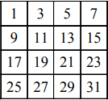
-->

<table>
<tr><td>$1$</td><td>$3$</td><td>$5$</td><td>$7$</td></tr>
<tr><td>$9$</td><td>$11$</td><td>$13$</td><td>$15$</td></tr>
<tr><td>$17$</td><td>$19$</td><td>$21$</td><td>$23$</td></tr>
<tr><td>$25$</td><td>$27$</td><td>$29$</td><td>$31$</td></tr>
</table>

## <lo-reading/> LV.NO.2009.8.1 

<hgroup class="reading">

<u>Tabulā (sk. zīmējumu) Katrīnai jāizvēlas $4$ rūtiņas tā, ka katrā rindā un 
katrā kolonnā tika izvēlēta tieši viena rūtiņa.</u> Pierādiet: neatkarīgi no tā, kuras 
$4$ rūtiņas saskaņā ar šiem noteikumiem Katrīna izvēlēsies, tajās ierakstīto skaitļu summa būs $64$. 

<!--

-->

<table>
<tr><td>$1$</td><td>$3$</td><td>$5$</td><td>$7$</td></tr>
<tr><td>$9$</td><td>$11$</td><td>$13$</td><td>$15$</td></tr>
<tr><td>$17$</td><td>$19$</td><td>$21$</td><td>$23$</td></tr>
<tr><td>$25$</td><td>$27$</td><td>$29$</td><td>$31$</td></tr>
</table>

</hgroup>
<hgroup>

TODO: "Katrā rindā un katrā kolonnā tika izvēlēta tieši viena rūtiņa" -
Kuras šaha figūras neapdraudētu cita citu, ja tās šādi izvietotu?

</hgroup>

## <lo-reading/> LV.NO.2009.8.1 

<hgroup class="reading">

Tabulā (sk. zīmējumu) Katrīnai jāizvēlas $4$ rūtiņas tā, ka katrā rindā un 
katrā kolonnā tika izvēlēta tieši viena rūtiņa. <u>Pierādiet: neatkarīgi no tā, kuras 
$4$ rūtiņas saskaņā ar šiem noteikumiem Katrīna izvēlēsies, tajās ierakstīto skaitļu summa būs $64$.</u> 

<!--

-->

<table>
<tr><td>$1$</td><td>$3$</td><td>$5$</td><td>$7$</td></tr>
<tr><td>$9$</td><td>$11$</td><td>$13$</td><td>$15$</td></tr>
<tr><td>$17$</td><td>$19$</td><td>$21$</td><td>$23$</td></tr>
<tr><td>$25$</td><td>$27$</td><td>$29$</td><td>$31$</td></tr>
</table>

</hgroup>
<hgroup>

TODO: Bilde ar pāris piemēriem, kā var saskaitīt.

</hgroup>

## <lo-hints/> LV.NO.2009.8.1

* Cik veidos kvadrātā $4 \times 4$ var izvēlēties četras rūtiņas 
atbilstoši šim nosacījumam? (Ja veidu ir nedaudz - varbūt 
tos var pārbaudīt, visus pārlasot?)
* Kāda īpašība saglabājas nemainīga/invarianta, neatkarīgi 
no tā, kā izvēlamies četras rūtiņas?

## <lo-soln/> LV.NO.2009.8.1 

Dalot ar atlikumu, piemēram, ar $8$ katrs skaitlis $a$ pārveidojas
par summu $8k+r$, kur $k$ ir dalījums un $r$ - atlikums. 

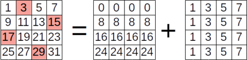

Neatkarīgi no rūtiņu izvēles pirmajā tabuliņā būs tieši pa vienam 
skaitlim no $\{ 0,8,16,24 \}$, bet otrajā pa vienam no 
$\{ 1,3,5,7 \}$. To visu summa ir $48 + 16 = 64$. 

# <lo-theory/> Aritmētiskas progresijas atlikumi

**Apgalvojums:** Ja $(a_k)$ ir aritmētiska progresija ar diferenci $d$, 
$m$ ir kaut kāds naturāls skaitlis, un $\mbox{LKD}(d,m)=K$, tad 
progresija $a_k$ pieņem $m/K$ dažādus atlikumus, 
dalot ar $m$.   

*Piezīme:* Atlikumi ik pēc $m/K$ soļiem cikliski atkārtojas.  
Ja diference $d$ un dalītājs $m$ ir savstarpēji pirmskaitļi, 
tad progresija pieņem visus $m$ atlikumus. 

## <lo-summary/> Piemēri: Atlikumi ar 8

<hgroup style="font-size: 70%">

<table>
<tr><th>A0</th><th>A1</th><th>A2</th><th>A3</th><th>A4</th><th>A5</th><th>A6</th><th>A7</th></tr>
<tr><td>0</td><td>&nbsp;</td><td>&nbsp;</td><td>&nbsp;</td><td>&nbsp;</td><td>5</td><td>&nbsp;</td><td>&nbsp;</td></tr>
<tr><td>&nbsp;</td><td>&nbsp;</td><td>10</td><td>&nbsp;</td><td>&nbsp;</td><td>&nbsp;</td><td>&nbsp;</td><td>15</td></tr>
<tr><td>&nbsp;</td><td>&nbsp;</td><td>&nbsp;</td><td>&nbsp;</td><td>20</td><td>&nbsp;</td><td>&nbsp;</td><td>&nbsp;</td></tr>
<tr><td>&nbsp;</td><td>25</td><td>&nbsp;</td><td>&nbsp;</td><td>&nbsp;</td><td>&nbsp;</td><td>30</td><td>&nbsp;</td></tr>
<tr><td>&nbsp;</td><td>&nbsp;</td><td>&nbsp;</td><td>35</td><td>&nbsp;</td><td>&nbsp;</td><td>&nbsp;</td><td>&nbsp;</td></tr>
<tr><td>40</td><td>&nbsp;</td><td>&nbsp;</td><td>&nbsp;</td><td>&nbsp;</td><td>45</td><td>&nbsp;</td><td>&nbsp;</td></tr>
</table>

$\mbox{LKD}(5,8)=1$, t.i. progresijai $5k$ ir visi atlikumi, dalot ar $8$. 

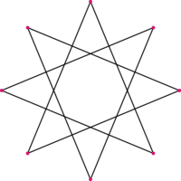

</hgroup>
<hgroup style="font-size: 70%">

<table>
<tr><th>A0</th><th>A1</th><th>A2</th><th>A3</th><th>A4</th><th>A5</th><th>A6</th><th>A7</th></tr>
<tr><td>0</td><td>&nbsp;</td><td>&nbsp;</td><td>&nbsp;</td><td>&nbsp;</td><td>&nbsp;</td><td>6</td><td>&nbsp;</td></tr>
<tr><td>&nbsp;</td><td>&nbsp;</td><td>&nbsp;</td><td>&nbsp;</td><td>12</td><td>&nbsp;</td><td>&nbsp;</td><td>&nbsp;</td></tr>
<tr><td>&nbsp;</td><td>&nbsp;</td><td>18</td><td>&nbsp;</td><td>&nbsp;</td><td>&nbsp;</td><td>&nbsp;</td><td>&nbsp;</td></tr>
<tr><td>24</td><td>&nbsp;</td><td>&nbsp;</td><td>&nbsp;</td><td>&nbsp;</td><td>&nbsp;</td><td>30</td><td>&nbsp;</td></tr>
</table>

$\mbox{LKD}(6,8)=2$, t.i. progresijai $6k$ ir tikai $8/2=4$ atlikumi, dalot ar $8$. Ja zīmē atlikumus pa apli (un savieno ik pēc 
$6$ soļiem), rodas nevis zvaigznīte, bet divi cikli - sarkanais un oranžais.

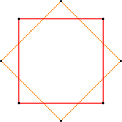

</hgroup>

## <lo-sample/> BBK2012.P1.122/LV.VO.1983.8.1

Cik daudz ir tādu naturālu skaitļu $n \leq 1983$, kuriem $3n+5$ 
dalās ar $7$?

## <lo-reading/> BBK2012.P1.122/LV.VO.1983.8.1 

<hgroup class="reading">

<u>Cik daudz ir tādu naturālu skaitļu $n \leq 1983$, kuriem $3n+5$ 
dalās ar $7$?</u>

</hgroup>
<hgroup>

TODO: Bilde ar skaitlīšiem formā $3n+5$, atrasts kāds, kas dalās...  

</hgroup>

## <lo-hints/> BBK2012.P1.122/LV.VO.1983.8.1

* Vai ir kaut viens skaitlis formā $3n + 5$, kas dalās ar $7$?
* Kāpēc svarīgi "savstarpēji pirmskaitļi? (Kas būtu, ja skaitlis ir formā $28n + 5$?)
* Ja kādai $n$ vērtībai $3n+5$ dalās ar $7$, kura būs nākamā $n$ vērtība, kurai 
dalīsies?

## <lo-soln/> BBK2012.P1.122/LV.VO.1983.8.1

<hgroup>

<table>
<tr>
<th>A0</th><th>A1</th><th>A2</th><th>A3</th><th>A4</th><th>A5</th><th>A6</th>
</tr>
<tr>
<td>&nbsp;</td><td>&nbsp;</td><td>&nbsp;</td><td>&nbsp;</td>
<td>&nbsp;</td><td>$5$</td><td>&nbsp;</td>
</tr>
<tr>
<td>&nbsp;</td><td>$8$</td><td>&nbsp;</td><td>&nbsp;</td>
<td>$11$</td><td>&nbsp;</td><td>&nbsp;</td>
</tr>
<tr>
<td style="background-color:silver">$14$</td><td>&nbsp;</td><td>&nbsp;</td><td>$17$</td>
<td>&nbsp;</td><td>&nbsp;</td><td>$20$</td>
</tr>
<tr>
<td>&nbsp;</td><td>&nbsp;</td><td>$23$</td><td>&nbsp;</td>
<td>&nbsp;</td><td>$26$</td><td>&nbsp;</td>
</tr>
<tr>
<td>&nbsp;</td><td>$29$</td><td>&nbsp;</td><td>&nbsp;</td>
<td>$32$</td><td>&nbsp;</td><td>&nbsp;</td>
</tr>
<tr>
<td style="background-color:silver">$35$</td><td>&nbsp;</td><td>&nbsp;</td><td>$38$</td>
<td>&nbsp;</td><td>&nbsp;</td><td>$41$</td>
</tr>
<tr>
<td>&nbsp;</td><td>&nbsp;</td><td>$44$</td><td>&nbsp;</td>
<td>&nbsp;</td><td>$47$</td><td>&nbsp;</td>
</tr>

</table>

</hgroup><hgroup>

* $\mbox{LKD}(3,7)=1$, t.i. progresijā $3n+5$ 
katrs septītais dalīsies ar $7$. 
* Der skaitļi $14,35,\ldots$ (progresija ar diferenci $21$)
* Lielākais ir $1967 = 93\cdot{}21 + 14 < 1983$. 
* Pavisam ir $94$ šādi locekļi.

</hgroup>

# <lo-theory/> Bezū lemma

**Lemma (<blue>Bézout's lemma</blue>):** Ja $a$ un $b$ ir naturāli skaitļi
un $\mbox{LKD}(a,b)=d$, tad eksistē veseli $x$ un $y$, ka $ax+by=d$. 

*Piezīme:* Ja $\mbox{LKD}(a,b)=1$, tad aritmētiskā progresijā $a_k = a\cdot{}k$ 
atradīsies visi $b$ iespējamie atlikumi, dalot ar $b$ (ieskaitot atlikumu $1$).  
*Piezīme 2:* Praktiski tas nozīmē, ka, mainoties ar $a$ un $b$ eirocentu monētām,
var nomaksāt jebkuru veselu skaitu centu tad un tikai tad, ja $a,b$ ir
savstarpēji pirmskaitļi.

## <lo-summary/> Vienādojumi algebrā un skaitļu teorijā

<hgroup>

> Atrisināt: <red>$21x + 14y = 2$</red>.

**Algebrā:**  
Ja abi 
koeficienti vienlaikus nav $0$, vienmēr var atrisināt. Patvaļīgi izvēlas, 
teiksim, $y$. Izsaka otru nezināmo:

$x = \frac{2-14y}{21}$. 

</hgroup>
<hgroup>

**Skaitļu teorijā:** Meklē veselus $x,y$. 
$\mbox{LKD}(14,21) = 7$, tad 
$21x + 14y \neq 2$. 

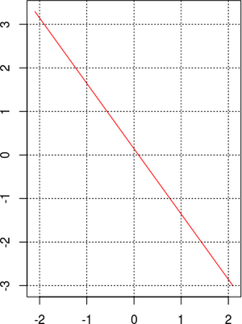

</hgroup>

## <lo-sample/> LV.NO.2007.7.1 

Kurus naturālos skaitļus $n$ var izsacīt formā 
${\displaystyle n=\frac{x}{y}}$, 
kur $x = a^5$, $y = b^3$, $a$ un $b$ – naturāli skaitļi? 

## <lo-reading/> LV.NO.2007.7.1  

<hgroup class="reading">

<u>Kurus naturālos skaitļus $n$ var izsacīt formā 
${\displaystyle n=\frac{x}{y}}$, 
kur $x = a^5$, $y = b^3$, $a$ un $b$ – naturāli skaitļi?</u>

</hgroup>
<hgroup>

TODO: Gari reizinājumi, no kuriem kaut kas noīsinās...  

</hgroup>

## <lo-hints/> LV.NO.2007.7.1 

* Kādi būtu "visvienkāršākie" skaitļi, ko izteikt 
minētajā formā $a^5/b^3$?
* Vai iegūto konstrukciju var attiecināt uz dažiem citiem 
skaitļiem?
* Vai konstrukciju var attiecināt uz visiem naturālajiem skaitļiem?

## <lo-soln/> LV.NO.2007.7.1 

* $n= 1 = \frac{1^5}{1^3}$. Pirmais "interesantais" skaitlis ir $n=2$.
* Izvēlamies $a$ un $b$ kā divnieka pakāpes.
Pēc mēģinājumiem/kļūdām iegūstam, ka $2=\frac{(2^2)^5}{(2^3)^3} = 2^{2\cdot{}5 - 3\cdot3}=2^1$, ja ievieto
$a=2^2=4$ un $b = 2^3 = 8$. 
* Jebkuram citam $n$ arī var izvēlēties $a = n^2$ un $b=n^3$. 

Kāpēc izdevās manipulācija ar pakāpēm? Bezū identitāte skaitļiem $5$ un $3$: 

$$5x + 3y = 1,\;\;\mbox{ja $(x,y)=(2,3)$.}$$

# &nbsp;

<hgroup>

<h1 style="font-size:32pt">Aritmētiskas progresijas</h1>

</hgroup><hgroup>

(1) [Ievads](#section)  
(2) [Pamatfakti](#section-1)  
**(3) Aptauja**  
(4) [Tipisks piemērs](#section-3)  
(5) [Patstāvīgie uzdevumi](#section-4)  
(6) [Kopsavilkums](#section-5)

</hgroup>

# <lo-quiz/> Jautājums Nr.1

Nosaukt piecus mazākos kopīgos dalāmos skaitļiem 
$8$ un $18$. 

## <lo-quiz/> Jautājums Nr.1

* Gan $8$, gan $18$ dalītāji veido aritmētisku progresiju. 
* Šīm progresijām ir kopīgi locekļi - progresija ar $d = \mbox{MKD}(8,18) = 72$. 
* Pirmie pieci $72$ daudzkārtņi ir: $72,144,216,288,360$.

# <lo-quiz/> Jautājums Nr.2

Atrast $\mbox{MKD}(6,7,8)$ - visu trīs skaitļu mazāko kopīgo dalītāju.

## <lo-quiz/> Jautājums Nr.2

* Var noteikt kopsaucēju, piemēram, visām $3$ daļām: 
$$\frac{1}{6} + \frac{1}{7} + \frac{1}{8}.$$
Mazākais skaitlis, kas dalās ar $6$, $7$, $8$ ir $168$. 

Šo pašu rezultātu var iegūt arī divos soļos: 

* Mazākais skaitlis, kurš dalās ar $6$ un $8$ ir $3\cdot{}8 = 24$. 
* Mazākais skaitlis, kurš bez tam dalās ar $7$, ir $7 \cdot{} 24 = 168$.

# <lo-quiz/> Jautājums Nr.3

**(a)** Dota aritmētiska progresija $(a_n)$, kam $a_1 = 12$, $d = 29$. 
Atrast, cik daudzi tās locekļi ir trīsciparu skaitļi.  
**(b)** Kādu $a_1$ jāizvēlas, lai progresijā ar $d=29$ būtu iespējami 
daudz trīsciparu skaitļu?

## <lo-quiz/> Jautājums Nr.3

**(a)** Mazākais trīsciparu skaitlis šajā progresijā ir 
$12 + 4\cdot{}29 = 128$. Lielākais trīsciparu skaitlis 
apmierina $12 + k\cdot{}29 \leq 999$ jeb $k \leq 34$.   
Virknē $4,\ldots,34$ ir pavisam $(34-4)+1 = 31$ loceklis.
Tātad arī attiecīgo progresijas locekļu būs $31$. 

<table>
<tr><th>$k$</th><td>$4$</td><td>$5$</td><td>$6$</td><td>$\ldots$</td><td>$34$</td></tr>
<tr><th>$12+29k$</th><td>$128$</td><td>$157$</td><td>$186$</td><td>$\ldots$</td><td>$998$</td></tr>
</table>

## <lo-quiz/> Jautājums Nr.3

**(b)** Neveicot aprēķinus, $a_1$ izvēlas kā 
mazāko trīsciparu skaitli: $a_1 = 100$. Tad progresijā ir <red>$32$</red> locekļi:
$$100,129,158,187,\ldots,999.$$

Ja progresiju nedaudz nobīdītu, tajā būtu tikai "garantētais" skaits, ko iegūst, dalot 
"trīsciparu skaitļu intervāla" $[100,1000)$ garumu 
$900$ ar $29$ un apaļojot uz leju:
$$\left\lfloor \frac{900}{29} \right\rfloor = \lfloor 31.03448 \rfloor = 31.$$

# <lo-quiz/> Jautājums Nr.4 

Kāds ir mazākais naturālais skaitlis, kuru, dalot ar $20$, atlikumā iegūst $13$, 
bet, dalot ar $21$, atlikumā iegūst $3$.

## <lo-quiz/> Jautājums Nr.4 

* Meklējam atbildi formā $20k+13$ ($k \geq 0$), t.i. kā progresiju <red>$13,33,53,73,\ldots$</red>.
* Ievērojam, ka atlikumi, dalot ar $21$, katrā solī samazinās par $1$:  
Tie veido virkni $13,12,11,\ldots$. 
* Tieši 11. loceklis sarkanajā progresijā dos atlikumu $3$, dalot ar $21$.
* Jāievieto $k=10$. Tad $20k+13 = 213$. 

*Sal. 7.klases Atklātās olimpiādes uzdevumu: [LV.AO.2011.7.3](http://linen-tracer-682.appspot.com/files-prob/numtheory-lv-ao/content.html#/lv.ao.2011.7.3).*  Šis uzdevums ir arī atsevišķs gadījums Ķīniešu atlikumu teorēmai, kuru 7.klase nav vēl mācījusies.

# <lo-quiz/> Jautājums Nr.5

Karlsons sev pusdienām nopirka $8$ pīrādziņus un $15$ magoņmaizītes, bet
Brālītis – vienu pīrādziņu un vienu magoņmaizīti. Karlsons par savām
pusdienām samaksāja tieši divus eiro (katra maizīte un pīrādziņš maksā veselu
skaitu centu). Cik samaksāja Brālītis?

## <lo-quize/> Jautājums Nr.5

* Apzīmējam: $x$ - pīrādziņa cena; $y$ - magoņmaizītes cena.
* Lai $8x + 15y = 200$, $200-8x$ jādalās ar $15$. 
* Tātad, $x$ jādalās ar $5$ un $x=10,25,40,55,\ldots$. 
* Pozitīvs $y$ sanāk tikai tad, ja $x=10$ (un $y=8$).
* Brālītis samaksāja $x+y = 10+8 = 18$ centus. 

*Sal. 7.klases Atklātās olimpiādes uzdevumu: [LV.AO.2016.7.2](http://linen-tracer-682.appspot.com/files-prob/numtheory-lv-ao/content.html#/lv.ao.2016.7.2).* 

## <lo-quize/> Jautājums Nr.5 (arī negatīvas cenas)

* Pēc Bezū lemmas eksistē veseli $(x,y)$, 
kam $8x + 15y = 1$ (un, pareizinot $x,y$ ar konstanti $C$) var 
atrisināt arī $8x + 15y = C$ jebkuram veselam $C$. Tikai var gadīties, ka $x,y$ nav 
vienlaikus pozitīvi.
* Piemēram, $8x + 15y = 1$, ja $(x,y) = (2,-1)$. T.i. Karlsons var 
samaksāt $1$ centu, ja pīrādziņš maksā $2$ centus, bet magoņmaizīte $-1$ (mīnus vienu) centu.
* Ja cenas $x,y$ pareizina ar $200$ (t.i. ja $(x,y)=(200,-100)$), 
Karlsons samaksāja tieši divus eiro. Brālītis šajā gadījumā samaksāja $x+y = 100$ jeb
vienu eiro.

# &nbsp;

<hgroup>

<h1 style="font-size:32pt">Aritmētiskas progresijas</h1>

</hgroup><hgroup>

(1) [Ievads](#section)  
(2) [Pamatfakti](#section-1)  
(3) [Aptauja](#section-2)  
**(4) Tipisks piemērs**  
(5) [Patstāvīgie uzdevumi](#section-4)  
(6) [Kopsavilkums](#section-5)

</hgroup>

# <lo-sample/> LV.AO.2004.8.5

Virknē augošā kārtībā izrakstīti naturālie skaitļi no $1$ līdz $2004$ ieskaitot, 
katrs vienu reizi. Izsvītrojam no tās skaitļus, kas atrodas 
$1., 4., 7., 10., \ldots$ vietās. No palikušās virknes atkal
izsvītrojam skaitļus, kas tajā atrodas $1., 4., 7., \ldots$ vietās. 
Ar iegūto virkni rīkojamies tāpat, utt.,
kamēr paliek neizsvītrots viens skaitlis. Kurš tas ir?

## <lo-reading/> LV.AO.2004.8.5

<hgroup class="reading">

<u>Virknē augošā kārtībā izrakstīti naturālie skaitļi no $1$ līdz $2004$ ieskaitot, 
katrs vienu reizi.</u> Izsvītrojam no tās skaitļus, kas atrodas 
$1., 4., 7., 10., \ldots$ vietās. No palikušās virknes atkal
izsvītrojam skaitļus, kas tajā atrodas $1., 4., 7., \ldots$ vietās. 
Ar iegūto virkni rīkojamies tāpat, utt.,
kamēr paliek neizsvītrots viens skaitlis. Kurš tas ir?

</hgroup>
<hgroup>

TODO: Kāds sākumstāvoklis (vai stāvokļi) te aprakstīti?

</hgroup>

<!--

Lasīšana:

Vai skaitļu numuri var mainīties?
Vai pārnumurēšana notiek jau pēc viena skaitļa izsvītrošanas? Vai vēlāk?
Kas ir “palikusī virkne”? “Iegūtā virkne”?
Vai uzdevumā aprakstītais beigu stāvoklis vienmēr iestājas? Ja nu paliek neizsvītroti divi vai vairāk skaitļi?
Novērojumi:

-->

## <lo-reading/> LV.AO.2004.8.5

<hgroup class="reading">

Virknē augošā kārtībā izrakstīti naturālie skaitļi no $1$ līdz $2004$ ieskaitot, 
katrs vienu reizi. <u>Izsvītrojam no tās skaitļus, kas atrodas 
$1., 4., 7., 10., \ldots$ vietās.</u> No palikušās virknes atkal
izsvītrojam skaitļus, kas tajā atrodas $1., 4., 7., \ldots$ vietās. 
Ar iegūto virkni rīkojamies tāpat, utt.,
kamēr paliek neizsvītrots viens skaitlis. Kurš tas ir?

</hgroup>
<hgroup>

TODO: Kas kopīgs un atšķirīgs "skaitlim" ar viņa "vietu"? Vai skaitļa vieta var mainīties. Vai tā mainās uzreiz pēc 
izsvītrošanas vai vēlāk? 

</hgroup>

## <lo-reading/> LV.AO.2004.8.5

<hgroup class="reading">

Virknē augošā kārtībā izrakstīti naturālie skaitļi no $1$ līdz $2004$ ieskaitot, 
katrs vienu reizi. Izsvītrojam no tās skaitļus, kas atrodas 
$1., 4., 7., 10., \ldots$ vietās. <u>No palikušās virknes atkal
izsvītrojam skaitļus, kas tajā atrodas $1., 4., 7., \ldots$ vietās. 
Ar iegūto virkni rīkojamies tāpat, utt.,
kamēr paliek neizsvītrots viens skaitlis. Kurš tas ir?</u>

</hgroup>
<hgroup>

TODO: Kas ir “palikusī virkne”? “Iegūtā virkne”?
Vai uzdevumā aprakstītais beigu stāvoklis vienmēr iestājas? Ja nu paliek neizsvītroti divi vai vairāk skaitļi?  
Uzdevumā aprakstītā procedūra sastāv no vairākiem “gājieniem” jeb “iterācijām”.
Katras iterācijas laikā izsvītro apmēram trešdaļu no virknes locekļiem, locekļus pārnumurē, iegūstot jaunu virkni.

</hgroup>

## <lo-strategy/> LV.AO.2004.8.5

1. *Vienkāršojam sev dzīvi:* Vispirms aplūkojam mazāk skaitļu vai vienkāršākus gājienus.
2. *Matemātiskā indukcija:* Izvirzām hipotēzi un to pamatojam arvien lielākam skaitļu skaitam $N$, līdzkamēr $N=2004$.
3. *Aprēķināšana pa daļām:* Pakāpeniski noskaidrojam pēdējā palikušā skaitļa ciparus vai atlikumus, dalot ar kaut ko.
4. *Sākam no beigām:* Iztēlojamies, ka process ir jau gandrīz beidzies. Kāds izskatās tā pēdējais solis? Priekšpēdējais? Utt.

## <lo-hints/> LV.AO.2004.8.5

**Stratēģija:** Vienkāršojam sev dzīvi

1. Kas paliktu beigās, ja svītrotu skaitļus, kas atrodas $1.,3.,5.,\ldots$ vietās?
2. Vai skaitlis, kas paliek beigās, vienmēr mainās, ja sākumā ir par vienu skaitli vairāk?

**Stratēģija:** Sākam no beigām

1. Kāda izskatās pēdējā "iterācija"? Un priekšpēdējā? 
2. Vai ir kāds veids, kā sākotnējā uzdevumā aprakstīt skaitļus, kuri ir "ilgdzīvotāji", t.i. paliek 
neizsvītroti daudzās iterācijās.

## <lo-soln/> LV.AO.2004.8.5 (No beigām)

* Konstrukcijā "no beigām" sākam ar vienu skaitli (pašu pēdējo). Pēc tam tam pievienojam 
tos, kas pirms viņa tika izsvītroti. 
* Kā redzams diagrammā, skaitlis $18$ paliek neizsvītrots sešās pēdējās iterācijās, skaitlis $12$ - pēdējās piecās, utt. 

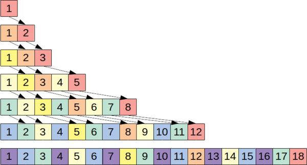

## <lo-soln/> LV.AO.2004.8.5 (Virkne)

* To kārtas numuru, kurš pirmais "izdzīvo" pēc $n$ iterācijām apzīmējam ar $x_n$. 
* Nulltais loceklis $x_0 = 1$ (pirmais izdzīvo, ja vairs neko nesvītro).
* Pēc iepriekšējās diagrammas, $x_1 = 2$, $x_2 = 3$, $x_3 = 5$, $x_4 = 8$, $x_5 = 12$, $x_6 = 18$, utt. 

**Apgalvojums:** ${\displaystyle x_{n+1} = \left\lceil \frac{3x_n}{2} \right\rceil}$.  
*Piezīme.* $\lceil x \rceil$ apzīmē *augšējo veselo daļu* - mazāko veselo skaitli, kas nav mazāks par $x$. 

Apgalvojumu pierādām atsevišķi gadījumiem, kad $x_n$ ir pāru un $x_n$ ir nepāru. 

## <lo-soln/> LV.AO.2004.8.5 (Rekurences pierādījums)

1. Ja $x_n$ ir pāru, tad konstrukcijā "no beigām" visas vietas no $1$ līdz $x_n$ var sadalīt pāros pa divi 
un katram pārim priekšā pierakst izsvītrojamo skaitli (attiecīgi 1., 4., 7., utt. vietās). Tā rezultātā 
no jauna iesprausto (violeto) vietiņu skaits ir precīzi trešdaļa. Tādēļ $x_n$ pareizinās ar $\frac{3}{2}$
jeb $x_{n+1} = \frac{3x_n}{2}$. 

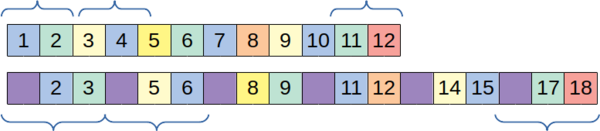

2. Ja $x_n$ ir nepāru, tad spriedums ir līdzīgs - vietas no $1$ līdz $x_n-1$ var sadalīt pāros, bet pati pēdējā
vietiņa $x_n$ paliek bez pāra (un tai vienai pašai priekšā iesprauž vienu violeto rūtiņu). 
Tādēļ šajā gadījumā daļa $\frac{3x_n}{2}$ (kas nav vesela) jānoapaļo uz augšu. 

## <lo-soln/> LV.AO.2004.8.5 (Vispārīgais gadījums)

Esam pamatojuši, ka skaitļi no $1$ līdz $x_n$ pēc $n$ iterācijām tiek izsvītroti tā, ka paliek tikai 
pēdējais skaitlis (t.i. $x_n$) 

**Apgalvojums:** Ja uzrakstīti skaitļi no $1$ līdz $X$, kur $x_n < X < x_{n+1}$, tad pēc $n$ izsvītrošanām 
paliks pāri viens skaitlis (tas, kurš sākumā ir vietā ar numuru $x_n$).  
Piemēram, ja uzrakstīti skaitļi no $1$ līdz $15$, tad pēc piecām iterācijām paliks pāri 12.skaitlis. 

*Pierādījums:* Tā kā pirmais skaitlis, kurš "izdzīvo" pēc $n+1$ iterācijām ir $x_{n+1}>X$, tad no $1$ līdz $X$ pēc 
$k$ svītrošanām paliks pāri tikai viens skaitlis (un tas var būt vienīgi $x_n$, jo svītrošana aiz $x_n$ šī skaitļa
izdzīvošanu neiespaido). 

## <lo-soln/> LV.AO.2004.8.5 (2004 skaitļi)

Konstruējam virkni ar rekurento sakarību ${\displaystyle x_{n+1} = \left\lceil \frac{3x_n}{2} \right\rceil}$ līdz tā pārsniedz $X = 2004$:   
$1; 2; 3; 5; 8; 12; 18; 27; 41; 62;$  
$\;\;\;\;\;93; 140; 210; 315; 473; 710; 1065; 1598;$<red>$2397$</red>

Katrs nākamais loceklis ir $1.5$ reizes lielāks par iepriekšējo (vai noapaļots par $\frac{1}{2}$ uz augšu). 

**Atbilde:** Esam ieguvuši, ka pēdējais neizsvītrotais ir skaitlis $1598$. 

## <lo-soln/> Žūrijas atrisinājums

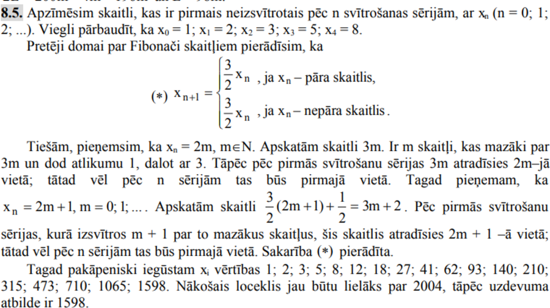

# &nbsp;

<hgroup>

<h1 style="font-size:32pt">Aritmētiskas progresijas</h1>

</hgroup><hgroup>

(1) [Ievads](#section)  
(2) [Pamatfakti](#section-1)  
(3) [Aptauja](#section-2)  
(4) [Tipisks piemērs](#section-3)  
**(5) Patstāvīgie uzdevumi**  
(6) [Kopsavilkums](#section-5)

</hgroup>

# <lo-sample/> BBK2012.P1.124

Atrast  
(a) visu to naturālo skaitļu summu, kas nepārsniedz $1000$ un dalās ar $5$;  
(b) visu to naturālo skaitļu summu, kas nepārsniedz $1000$ un dalās 
vai nu ar $3$, vai ar $5$.

## <lo-reading/> BBK2012.P1.124

<hgroup class="reading">

Atrast  
(a) visu to naturālo skaitļu summu, kas nepārsniedz $1000$ un dalās ar $5$;  
(b) <u>visu to naturālo skaitļu summu, kas nepārsniedz $1000$ un dalās 
vai nu ar $3$, vai ar $5$.</u>

</hgroup>
<hgroup>

TODO: Kas domāts ar "vai nu ... vai ..."?

</hgroup>

## <lo-strategies/> BBK2012.P1.124

1. *Pilnā pārlase:* Izrakstām visus skaitļus un saskaitām.
2. *Summēšanas formula:* Izmantojam gatavu virknes summēšanas formulu. 
3. *Kombinēšana pa daļām:* Izveidojam meklējamo summu no citām, ko protam noteikt.
3. *Matemātiskā indukcija:* Izvirzām hipotēzi par summas izteiksmi $S(n)$ un pamatojam to arvien lielākiem $n$, kamēr sasniegts $n=1000$. 

## <lo-hints/> BBK2012.P1.124

**Stratēģija:** Kombinēšana pa daļām - skaitām kaut ko citu.

* Kā aprakstīt visus skaitļus, kas nepārsniedz $1000$ un dalās ar $5$? Kā noteikt šādas
kopas summu?
* Kā izvietoti skaitļi, kuri dalās ar $3$ VAI ar $5$? Vai tos ir patīkami summēt?
* Vai mēs protam summēt kaut ko citu? Vai vajadzīgo summu var iegūt netieši?

## <lo-soln/> BBK2012.P1.124

**(a)**  $5 + 10 + \ldots + 1000 = \frac{5+1000}{2}\cdot 200 = 100500.$

**(b)** Summas skaitļiem, kas dalās ar $3$, ar $5$ un ar abiem (jeb ar $15$):  

$$\left\{ \begin{array}{l}
3 + 6 + \ldots + 999 = \frac{3+999}{2}\cdot{}333 = 166833, \\
5 + 10 + \ldots + 1000 = 100500,\\
15 + 30 + \ldots + 990 = \frac{15 + 990}{2}\cdot{}66 = 33165.
\end{array} \right. $$

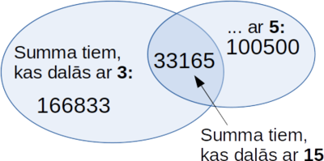

*Ieslēgšanas-izslēgšanas princips:* Saskaitām abus ovālus, atņemam pārklājošos daļu, 
kas ieskaitīta divreiz: $166833 + 100500 - 33165 = 234168$.

# <lo-sample/> LV.AO.2004.7.3

Kādam mazākajam naturālajam $n$ visas daļas
$$\frac{5}{n+7}, \frac{6}{n+8}, \frac{7}{n+9}, 
\ldots, \frac{35}{n+37}, \frac{36}{n+38}$$
ir nesaīsināmas?

## <lo-reading/> LV.AO.2004.7.3

<hgroup class="reading">

<u>Kādam <strong>mazākajam</strong> naturālajam $n$ <strong>visas</strong> daļas
$$\frac{5}{n+7}, \frac{6}{n+8}, \frac{7}{n+9}, 
\ldots, \frac{35}{n+37}, \frac{36}{n+38}$$
<strong>ir nesaīsināmas</strong>?</u>

</hgroup>
<hgroup>

TODO: Mazākais naturālais $n$? Vai vienmēr eksistē? Ko nozīmē "visas daļas nesaīsināmas"? 

Vienam un tam pašam $n$ visas daļas būs nesaīsināmas. Un ja tādu $n$ ir vairāki, 
jāatrod starp tiem vismazākais.

</hgroup>

## <lo-reading/> LV.AO.2004.7.3

<hgroup class="reading">

<u>Kādam mazākajam naturālajam $n$ visas <strong>daļas</strong>
$$\frac{5}{n+7}, \frac{6}{n+8}, \frac{7}{n+9}, 
\ldots, \frac{35}{n+37}, \frac{36}{n+38}$$
<strong>ir nesaīsināmas</strong>?</u>

</hgroup>
<hgroup>

TODO: Pietiek vienai būt saīsināmai, attiecīgais $n$ tiek uzreiz izbrāķēts.

</hgroup>

## <lo-strategies/> LV.AO.2004.7.3

1. *Pilnā pārlase:* Ievietojam visus $n$, sākot ar vismazāko $n=1$, kamēr visas daļas sanāk nesaīsināmas.
2. *Izslēgšanas metode:* Atmetam tās $n$ vērtības, kas acīmredzami neder un aplūkojam mazāko no atlikušajām.
3. *Pārformulēšana citos apzīmējumos:* Izsakām apgalvojumus par daļu nesaīsināmību citā, loģiski ekvivalentā veidā.
4. *Ekstrēmais elements:* Aplūkojam to daļu, kura visdrīzāk kļūst nesaīsināma.

## <lo-hints/> LV.AO.2004.7.3

**Stratēģija:** Pārtulkojam jautājumu citādi.

* Kādu progresiju locekļi ir daļu skaitītājos un saucējos?
* Kā pateikt citādi, ka daļa ir nesaīsināma?

Arī: 

* Kāds ir invariants, kas saglabājas visās daļās?

## <lo-soln/> LV.AO.2004.7.3

Rēķinot $\mbox{LKD}(a,b)$, starpības starpības ir konstantas:

* $\mbox{LKD}(5,n+7) = \mbox{LKD}(5,n+2) = 1$,
* $\mbox{LKD}(6,n+8) = \mbox{LKD}(6,n+2) = 1$, $\ldots$
* $\mbox{LKD}(36,n+38) = \mbox{LKD}(36,n+2) = 1$.

Jāatrod mazākais skaitlis $n+2$, kas ir savstarpējs pirmskaitlis ar visiem 
skaitļiem $5,6,\ldots,36$.

# <lo-sample/> LV.VO.2002.11.5

Kuriem naturāliem skaitļiem $n$, kas lielāki par $3$ 
un nedalās ar $3$, izpildās īpašība: visi tie naturālie 
skaitļi, kas mazāki par $n$ un kuru lielākais kopīgais 
dalītājs ar $n$ ir $1$, veido aritmētisku progresiju?

# <lo-reading/> LV.VO.2002.11.5

<hgroup class="reading">

<u>Kuriem naturāliem skaitļiem $n$, kas lielāki par $3$ 
un nedalās ar $3$, izpildās īpašība:</u> visi tie naturālie 
skaitļi, kas mazāki par $n$ un kuru lielākais kopīgais 
dalītājs ar $n$ ir $1$, veido aritmētisku progresiju?

</hgroup><hgroup>

TODO: Raksturojam skaitļu kopu

</hgroup>

# <lo-reading/> LV.VO.2002.11.5

<hgroup class="reading">

Kuriem naturāliem skaitļiem $n$, kas lielāki par $3$ 
un nedalās ar $3$, izpildās īpašība: <u>visi tie naturālie 
skaitļi, kas mazāki par $n$ un kuru lielākais kopīgais 
dalītājs ar $n$ ir $1$, veido aritmētisku progresiju?</u>

</hgroup><hgroup>

TODO: Raksturojam $\Phi(n)$ - tos skaitļus, kas savstarpēji pirmskaitļi ar $n$.
Uzzīmējam parastās daļas $1/n,...,(n-1)/n$.

</hgroup>

## <lo-strategies/> LV.VO.2002.11.5

1. *Eksperimentēšana:* Ievietojam dažādas $n$ vērtības, pārbaudām apgalvojuma patiesumu. Pēc tam vispārinām novērojumus.
2. *Invariants:* Izmantot to, ka lielākais kopīgais dalītājs ar to pašu skaitli noteikta veida aritmētiskās progresijās nemainās.
3. *Pamatojums no pretējā:* Uzminam visus atrisinājumus; par pārējiem pieņemam no pretējā, ka apgalvojums izpildās un apgāžam.
4. *Vizualizācija ar grafu:* Attēlot attiecību par lielāko kopīgo dalītāju $1$ ar grafa šķautnēm un saredzēt, kuros grafos savienotās virsotnes ir aritmētiska progresija.

## <lo-soln/> LV.VO.2002.11.5

**Stratēģija:** Vispārinām savus novērojumus.

* Novērojums: Kādiem nelieliem skaitļiem veidojas/neveidojas aritmētiska progresija? 
* Vispārināšana: Kā secinājumus pārnes uz lielākiem skaitļiem?

* Novērošana: Kā izskatās pretpiemēri - kāpēc tie nav progreijas? 
* Vispārināšana: Kā no šiem pretpiemēriem iegūt vispārīgo atbildi?

## <lo-soln/> LV.VO.2002.11.5 (pozitīvie piemēri)

Ar $\Phi(n)$ apzīmējam tos skaitļus no $[1;n]$, 
kas ir savstarpēji pirmskaitļi ar $n$.

* Visiem pirmskaitļiem $p$, $\Phi(p)$ ir 
progresija ar $d=1$, piemēram,
$\Phi(7) = \{ 1,2,3,4,5,6 \}$
* Visām divnieka pakāpēm $2^k$, $\Phi(2^k)$ 
ir progresija ar $d = 2$, piemēram,
$\Phi(8) = \{ 1,3,5,7 \}$

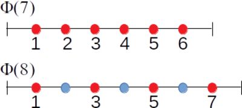

## <lo-soln/> LV.VO.2002.11.5 (negatīvie piemēri)

* Ja $n = pq$ ir nepāru, bet nav pirmskaitlis, tad $\Phi(n)$
nevar būt progresija, jo $1,3 \in \Phi(n)$ (ir dots, ka $n$ 
nedalās ar $3$). Bet nepāru dalītājs $p \not\in \Phi(n)$. 
* Ja $n = 2^k p$ (kur $p$ ir nepāru), tad $\Phi(n)$ nevar
būt progresija. Pamatojums tāds pats. 

# &nbsp;

<hgroup>

<h1 style="font-size:32pt">Aritmētiskas progresijas</h1>

</hgroup><hgroup>

(1) [Ievads](#section)  
(2) [Pamatfakti](#section-1)  
(3) [Aptauja](#section-2)  
(4) [Tipisks piemērs](#section-3)  
(5) [Patstāvīgie uzdevumi](#section-4)  
**(6) Kopsavilkums**

</hgroup>

# <lo-theory/> Ko darījām šajā nodarbībā?

1. Atkārtojām skolas formulas aritmētiskām progresijām. 
2. Noteicām, kad $S_n$ dalās/nedalās ar $n$ un citiem skaitļiem.
3. Novērojām, kā $S_n$ mainās atkarībā no $n$. 
4. Noteicām, cik progresijas locekļu ir $\mathbb{N}$ intervālos.
5. Aprakstījām mazāko kopīgo dalāmo $\mbox{MKD}(a,b)$ ar progresiju 
sakrītošajiem locekļiem.
6. Izmantojām $a = bq + r$ - izteiksmi $a$ dalīšanai ar $b$ ar atlikumu.
7. Pamatojām $\mbox{LKD}(a_n,d)$ nemainību, ja $n$ aug.
8. Noteicām visus atlikumus, kas rodas, dalot progresiju ar fiksētu skaitli.
9. Izmantojām Bezū lemmu, izsakot $\mbox{LKD}(a,b)$ kā $ax+by$. 

# <lo-theory/> Atsauces

* [A.Bērziņa, A.Bērziņš. Diferencēti uzdevumi skaitļu teorijā, 2013](http://nms.lu.lv/wp-content/uploads/2013/03/SKGRAMATA.doc) - Daži uzdevumi par progresijām.
* [Wikipedia. Trijstūru skaitļi](https://en.wikipedia.org/wiki/Triangular_number) - Par jēdziena vēsturi.
* [Wikipedia. Ķīniešu atlikumu teorēma](https://en.wikipedia.org/wiki/Chinese_remainder_theorem) - Vispārīgā situācija, kur jāmeklē vairāku aritmētisku progresiju kopīgie locekļi.
* [Wikipedia. Poligrammas jeb regulāras zvaigznes](https://en.wikipedia.org/wiki/Polygram_(geometry)) - Kuros gadījumos aritmētiska progresija cikliski pieņem visus atlikumus, dalot ar $m$ (un kuros nē). 
* [Wikipedia. Bezū identitāte](https://en.wikipedia.org/wiki/B%C3%A9zout%27s_identity) - Pierādījums, kurā nekonstruktīvi izvēlas mazāko naturālo skaitli bezgalīgā kopā.
* [F.Šopēns: Noktirne op.9 nr.1 si♭ minors](https://www.youtube.com/watch?v=ZtIW2r1EalM) - Vietām poliritmisks gabals: Kreisajai rokai $6$ vienāda garuma notis, labajai rokai tikmēr $11$ notis.

# <lo-theory/> Papildu uzdevumi

1. [EE.PK.2019.10.3](http://linen-tracer-682.appspot.com/files-prob/numtheory-ee-pk/content.html#/ee.pk.2019.10.3)  
Cik ir tādu veselu negatīvu skaitļu pāru $(a,b)$, kas apmierina vienādību $22a+15b=2019$?

2. [LV.VO.2014.10.3](http://linen-tracer-682.appspot.com/files-prob/numtheory-lv-vo/content.html#/lv.vo.2014.10.3)  
Ir pieejams neierobežots daudzums $7$ un $13$ centu pastmarku, kuras izmanto 
pasta sūtījumu apmaksāšanai. Diemžēl dažas summas nav iespējams apmaksāt 
tikai ar šīm pastmarkām (piemēram, ja sūtījums maksā $6$, $8$ vai $25$ centus). 
Kāda ir lielākā summa, kuru nav iespējams apmaksāt izmantojot tikai šīs pastmarkas?

3. [Israeli Oral Olympiad #7](https://artofproblemsolving.com/community/c6t45439f6h1370208_a_set_intersecting_every_arithmetic_progression)   
Uz tāfeles uzrakstīti skaitļi
$1,2,\ldots,100$. Cvi grib nokrāsot $N$ no šiem skaitļiem 
zilus tā, lai katra aritmētiska progresija garumā $10$, ko veido uz tāfeles
uzrakstītie skaitļi, saturētu kādu zilu skaitli. 
Kāda ir mazākā $N$ vērtība?

4. [Danube 2014 p3](https://artofproblemsolving.com/community/c6t45439f6h1879910_exist_n_pairwise_coprime_composite_integers_form_arithmetic_progression)  
Katram naturālam $n \geq 2$ parādīt, ka eksistē aritmētiska progresija 
ar $n$ locekļiem, kuri visi ir salikti skaitļi un katri divi ir 
savstarpēji pirmskaitļi. 

