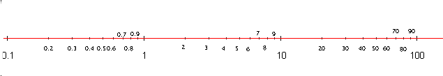
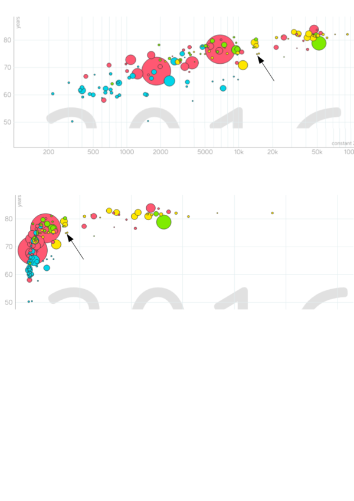

# &nbsp;

<hgroup>

<h1 style="font-size:32pt">Ģeometriskas progresijas</h1>

</hgroup><hgroup>

<span style="color:darkgreen">**(1) Ievads**</span>  
<span>(2) [Pamatfakti](#section-1)</span>  
<span>(3) [Aptauja](#section-2)</span>  
<span>(4) [Tipisks piemērs](#section-3)</span>  
<span>(5) [Patstāvīgie uzdevumi](#section-4)</span>  
<span>(6) [Kopsavilkums](#section-5)</span>

</hgroup>


# <lo-default/> Ceļa karte

<hgroup style="width: 48%">

<table>
<tr><td style="text-align:left !important;">#1: Eksperimenti un piemēru veidošana</td></tr>
<tr><td style="text-align:left !important;">#2: Mainīgo izteiksmes un pārveidojumi</td></tr>
<tr><td style="text-align:left !important;">#3: Algebriskas struktūras</td></tr>
<tr><td style="text-align:left !important;">#4: Dalāmība un pirmreizinātāji</td></tr>
<tr><td style="text-align:left !important;">#5: LKD, MKD un valuācijas</td></tr>
<tr><td style="text-align:left !important;">#6: Kongruences fiksētam modulim</td></tr>
<tr><td style="text-align:left !important;">#7: Pretrunas moduļa izvēle</td></tr>
</table>

</hgroup>
<hgroup style="margin-left: 4%; width: 45%">

<table>
<tr><td style="text-align:left !important;">#8: Decimālpieraksts</td></tr>
<tr><td style="text-align:left !important;">#9: Aritmētiskas progresijas</td></tr>
<tr><td style="text-align:left !important;"><red>**#10: Ģeometriskas progresijas**</red></td></tr>
<tr><td style="text-align:left !important;">#11: Rekurentas virknes</td></tr>
<tr><td style="text-align:left !important;">#12: Ekstrēmie elementi un Dirihlē princips</td></tr>
<tr><td style="text-align:left !important;">#13: Invarianti un indukcija</td></tr>
<tr><td style="text-align:left !important;">#14: Nevienādības</td></tr>
<tr><td style="text-align:left !important;">#15: Kombinatoriskas metodes</td></tr>
</table>

</hgroup>


# <lo-default/> Ģeometrisku progresiju jautājumi

* Kāpēc ģeometriskas progresijas rodas uzdevumos 
par līdzīgām (pašlīdzīgām) figūrām un konstrukcijām?
* Kāpēc ģeometriskas progresijas rodas skaitļa
decimālpierakstā?
* Kāpēc ģeometrisku progresiju formulas ļauj pārveidot
algebriskas izteiksmes?


## Ģeometrisku progresiju lietojumi

* Skaitļi ar atkārtotiem cipariem vai ciparu fragmentiem
* Bezgalīgu decimāldaļu izteikšana parastas daļas formā
(izteiksmes $0.111\ldots$ un $0.010101\ldots$).
* Pārveidot izteiksmes $a^n - b^n$, $a^{2n+1} + b^{2n+1}$ 
lietojot ģeometriskas progresijas summu.
* Veidot virknes ar skaitļiem, kuriem katrus 
divus var izdalīt bez atlikuma.
* Ģeometriskas progresijas svēršanā un meklēšanā
* Ciparu skaita novērtējums pakāpēs
* Benforda sadalījums

 
# <lo-default/> Sasniedzamie rezultāti

* Pārrakstīt decimāldaļas kā ģeometriskas progresijas
* Noskaidrot, cik reizes jāreizina vai jādala ar $q$, 
lai sasniegtu vēlamo vērtību


# &nbsp;

<hgroup>

<h1 style="font-size:32pt">Ģeometriskas progresijas</h1>

</hgroup><hgroup>

<span>(1) [Ievads](#section)</span>  
<span style="color:darkgreen">**(2) Pamatfakti**</span>  
<span>(3) [Aptauja](#section-2)</span>  
<span>(4) [Tipisks piemērs](#section-3)</span>  
<span>(5) [Patstāvīgie uzdevumi](#section-4)</span>  
<span>(6) [Kopsavilkums](#section-5)</span>

</hgroup>


# <lo-default/> Ģeometriskas progresijas skolā

**Definīcija:** Par *ģeometrisku progresiju*
sauc virkni, kurā katru nākamo locekli iegūst, 
reizinot iepriekšējo ar to pašu skaitli $q \neq 0$: 

$$b_{n+1} = b_n q,\;\;\mbox{kur $n \geq 1$}.$$

Skaitli $q$ sauc par kvocientu (*common ratio*, 
*der Quotient*,
*знаменатель прогрессии*).

## Dažas populāras formulas

*Progresijas $n$-tā locekļa formula:*

$$b_n = b_1 \cdot q^{n-1},\;\mbox{kur $n>1$}.$$

*Galīgas progresijas summas formula:*

$$S_n = b_1 + b_2 + \ldots + b_n = b_1\cdot\frac{q^{n+1} - 1}{q - 1}.$$

*Bezgalīgas progresijas summas formula:*

$$S = b_1 + b_2 + \ldots = \frac{b_1}{1 - q},\;\mbox{kur $|q|<1$.}$$


## Cik strauji aug progresijas summa

Šaha galdiņa piemērs: $2^0 + 2^1 + \ldots + 2^{63} = 2^{64} - 1$.

<table>
<tr>
<td>$2^0$</td><td style="background-color:silver">$2^1$</td><td>$2^2$</td><td style="background-color:silver">$2^3$</td>
<td>$2^4$</td><td style="background-color:silver">$2^5$</td><td>$2^6$</td><td style="background-color:silver">$2^7$</td>
</tr>
<tr>
<td style="background-color:silver">$2^8$</td><td>$2^9$</td><td style="background-color:silver">$2^{10}$</td><td>$2^{11}$</td>
<td style="background-color:silver">$2^{12}$</td><td>$2^{13}$</td><td style="background-color:silver">$2^{14}$</td><td>$2^{15}$</td>
</tr>
<tr>
<td>$2^{16}$</td><td style="background-color:silver">$2^{17}$</td><td>$2^{18}$</td><td style="background-color:silver">$2^{19}$</td>
<td>$2^{20}$</td><td style="background-color:silver">$2^{21}$</td><td>$2^{22}$</td><td style="background-color:silver">$2^{23}$</td>
</tr>
<tr>
<td>$2^{24}$</td><td>$2^{25}$</td><td>$2^{26}$</td><td>$2^{27}$</td>
<td>$2^{28}$</td><td>$2^{29}$</td><td>$2^{30}$</td><td>$2^{31}$</td>
</tr>
<tr>
<td>$2^{32}$</td><td>$2^{33}$</td><td>$2^{34}$</td><td>$2^{35}$</td>
<td>$2^{36}$</td><td>$2^{37}$</td><td>$2^{38}$</td><td>$2^{39}$</td>
</tr>
<tr>
<td>$2^{40}$</td><td>$2^{41}$</td><td>$2^{42}$</td><td>$2^{43}$</td>
<td>$2^{44}$</td><td>$2^{45}$</td><td>$2^{46}$</td><td>$2^{47}$</td>
</tr>
<tr>
<td>$2^{48}$</td><td>$2^{49}$</td><td>$2^{50}$</td><td>$2^{51}$</td>
<td>$2^{52}$</td><td>$2^{53}$</td><td>$2^{54}$</td><td>$2^{55}$</td>
</tr>
<tr>
<td>$2^{56}$</td><td>$2^{57}$</td><td>$2^{58}$</td><td>$2^{59}$</td>
<td>$2^{60}$</td><td>$2^{61}$</td><td>$2^{62}$</td><td>$2^{63}$</td>
</tr>
</table>

(Aritmētiskai progresijai summa auga straujāk nekā pati progresija. 
Ģeometriskajai - aug apmēram tikpat strauji.)


# <lo-default/> Progresijas dalāmība

**Apgalvojums:** Naturālu skaitļu ģeometriskā progresijā ar veselu kvocientu $q$ 
katrs loceklis dalās ar visiem iepriekšējiem.

*Piezīme.* Dažām (galīgām) naturālu skaitļu progresijām var būt 
daļveida kvocienti. Piemēram, $16,24,36,54,81$ kvocients ir $3/2$.


# <lo-default/> Pakāpju summas un starpības

*Ir šādas identitātes (sadalīšana reizinātājos):*

$$x^n - y^n = (x-y) \left( x^{n-1} + x^{n-2}y + \ldots + xy^{n-2} + y^{n-1} \right).$$

Lielajās iekavās ir ģeometriska progresija: $b_1 = x^{n-1}$ un $q = \frac{y}{x}$.

$$x^{2n+1} + y^{2n+1} = (x+y)\left( x^{2n} - x^{2n-1}y + \ldots - xy^{2n-1} + y^{2n} \right).$$ 

Lielajās iekavās ir ģeometriska progresija: $b_1 = x^{2n}$ un $q = -\frac{y}{x}$.

# <lo-default/> Atkārtoti cipari vai grupas

Ja viens un tas pats cipars (vai cipari) rakstīti 
daudzas reizes, decimālpierakstu var "sasummēt"
ar ģeometriskas progresijas summas formulu. Piemēram, 

$$123123123123123 = 123 \cdot 1001001001001 = $$
$$= 123 \cdot \left( 1000^4 + 1000^3 + 1000^2 + 1000^1 + 1000^0 \right) = $$
$$= 123 \cdot \frac{1000^5 - 1}{1000-1}.$$ 


# <lo-sample/> LV.VO.2012.10.3

Naturāla skaitļa $N$ decimālajā pierakstā izmantots tikai cipars $6$.
Pierādīt, ka skaitļa $N^2$ decimālajā pierakstā nav cipara $0$.

## 66...66 kāpināšana kvadrātā

$$6^2=36,\;\;66^2=4356=4455-99,\;\;666^2=443556=444555-999,\ldots$$
Var pamatot, ka 
$$(\underbrace{6\ldots6}_n)^2=\overline{\underbrace{4\ldots{}4}_n\underbrace{5\ldots{}5}_n}-
\underbrace{9\ldots{}9}_n$$


## Bezgalīgas decimāldaļas


Ar (bezgalīgas) ģeometriskas progresijas summas formulu var sasummēt
arī bezgalīgas decimāldaļas. Piemēram, 

$$0.(02439) = 2439 \cdot \left( \frac{1}{10^5} 
+ \frac{1}{10^{10}} + \frac{1}{10^{15}} + \ldots \right) = $$
$$ = 2439 \cdot \frac{\frac{1}{10^5}}{1 - \frac{1}{10^5}} = \frac{2439}{99999} = \frac{1}{41}.$$ 

**Secinājums:** Racionāli skaitļi sakrīt ar periodiskām decimāldaļām)


# <lo-default/> Ciparu skaita pieaugums

**Jautājums:** Cik reizes skaitlis jāpiereizina ar $2$, 
lai tā decimālpierakstā būtu par vienu ciparu vairāk? 

$$2^3 = 8<10,\;\;\mbox{bet}\;\;2^4 = 16 > 10.$$

Skaitļiem ģeometriskā progresijā ciparu skaits 
aug (aptuveni) aritmētiskā progresijā.

## Precīzi noteikts ciparu skaits

<hgroup style="font-size:70%">

```
1       16384
2       32768
4       65536
8       131072
16      262144 
32      524288
64      1048576
128     2097152
256     4194304
512     8388608
1024    16777216
2048    33554432
4096    ...
8192
```

$$\log_{2} 10 = \frac{1}{\log_{10} 2} =$$
$$\approx\frac{1}{0.30103} \approx 3.321928.$$

</hgroup><hgroup>

Precīzu ciparu skaitu skaitlim $x \geq 1$ izsaka: 
$\left\lfloor \log_{10} x \right\rfloor + 1$. 
Piemērs:

$$\log_{10} 2^{200} = 200\cdot \log_{10} 2 = $$
$$=200 \cdot 0.30103 \approx 60.206$$

Tātad $2^{200}$ būs $\left\lfloor 60.206 \right\rfloor + 1 = 61$
cipari.

</hgroup>


# <lo-sample/> BBK2012.P1.52

Vai iespējams norādīt tādu galīgu skaitu ģeometrisko progresiju, 
kuru locekļi ir naturāli skaitļi, ka jebkurš naturāls skaitlis 
piederētu vismaz vienai progresijai?


## Attālumi starp progresijas locekļiem

* $b_{n+2} - b_{n+1} = (b_{n+1} - b_n)q$, t.i. attālumi arvien pieaug. 
* Ja progresiju ir pavisam $N$, tad katrai progresijai atrodam 
tādu $m_i$, ka locekļi aiz šī skaitļa $m_i$ ir attālumos, kas lielāki par $N+1$. 
* Apzīmējam ar $M$ maksimālo no šiem $m_i$. Aiz vērtības $M$ **visām** 
progresijām attālumi starp blakus esošiem locekļiem būs lielāki par $N+1$. 
* Tātad, kāds punkts paliks nepārklāts.


# <lo-default/> Logaritmiskā skala

* Dabā sastopami lielumi 
(iedzīvotāju skaits dažādās valstīs; 
upju garums; balsotāju skaits 
balsošanas iecirkņos, utml.)
bieži atšķiras simtiem vai tūkstošiem reižu.
* Tie uzskatāmāk attēlojami uz
"logaritmiskas skalas".
* Ģeometriska progresija uz logaritmiskās skalas 
veido vienādi attālinātus punktus.





## Logaritmiskas skalas piemērs



Sk. [Gapminder.org](https://bit.ly/2Sze0Sa).


# <lo-default/> Benforda sadalījums

<hgroup>


</hgroup><hgroup>

* Ne visi cipari parādās ģeometriskas progresijas locekļu 
pierakstā vienādi bieži. 
* Benforda sadalījums parāda, cik bieži katrs cipars ir pirmais
ģeometriskas progresijas pierakstā

</hgroup>


# <lo-sample/> LV.NO.2004.8.2 

Ir zināms, ka skaitļa $2^{200}$ decimālajā pierakstā ir $61$ cipars. 
Cik daudziem no skaitļiem $2^1; 2^2; 2^3; \ldots; 2^{199}; 2^{200}$ 
decimālais pieraksts sākas ar ciparu $1$?


## 2^n izkārtojums 9 spainīšos

**Stratēģija:** Saskaitām kaut ko citu. 

* Ir pavisam $61$ skaitļu garumi (1-cipara, ... , 61-ciparu)
* Visi, izņemot pirmo garumu satur tieši vienu skaitli, kas sākas ar $1$


# &nbsp;

<hgroup>

<h1 style="font-size:32pt">Ģeometriskas progresijas</h1>

</hgroup><hgroup>

<span>(1) [Ievads](#section)</span>  
<span>(2) [Pamatfakti](#section-1)</span>  
<span style="color:darkgreen">**(3) Aptauja**</span>  
<span>(4) [Tipisks piemērs](#section-3)</span>  
<span>(5) [Patstāvīgie uzdevumi](#section-4)</span>  
<span>(6) [Kopsavilkums](#section-5)</span>

</hgroup>


# <lo-quiz/> Jautājums Nr.1

Izteikt kā racionālas daļas:

1. $0.27272727\ldots = 0.(27)$
2. $0.123123123\ldots = 0.(123)$
3. $0.041666666\ldots = 0.041(6)$


# &nbsp;

<hgroup>

<h1 style="font-size:32pt">Ģeometriskas progresijas</h1>

</hgroup><hgroup>

<span>(1) [Ievads](#section)</span>  
<span>(2) [Pamatfakti](#section-1)</span>  
<span>(3) [Aptauja](#section-2)</span>  
<span style="color:darkgreen">**(4) Tipisks piemērs**</span>  
<span>(5) [Patstāvīgie uzdevumi](#section-4)</span>  
<span>(6) [Kopsavilkums](#section-5)</span>

</hgroup>


# <lo-sample/> LV.AO.2013.10.4

No pirmajiem $100$ naturālajiem skaitļiem izvēlēts $51$ skaitlis.
Pierādīt, ka no tiem var izvēlēties divus, no kuriem viens dalās ar
otru.


## Ieteikumi

1. Parametrs $51$ (uzdevumā par $100$ skaitļiem) droši vien nav izvēlēts
nejauši - kā tas iegūts?
2. Vai apgalvojums paliek spēkā, ja izvēlas $50$ skaitļus no $100$? 
(Vai attiecīgi mazākiem skaitļiem, ja $50$ un $100$ šķiet pārāk lieli?)
3. Kādas skaitļu kopas ir tādas, kurās allaž var izvēlēties divus, 
no kuriem viens dalās ar otru?

# &nbsp;

<hgroup>

<h1 style="font-size:32pt">Ģeometriskas progresijas</h1>

</hgroup><hgroup>

<span>(1) [Ievads](#section)</span>  
<span>(2) [Pamatfakti](#section-1)</span>  
<span>(3) [Aptauja](#section-2)</span>  
<span>(4) [Tipisks piemērs](#section-3)</span>  
<span style="color:darkgreen">**(5) Patstāvīgie uzdevumi**</span>  
<span>(6) [Kopsavilkums](#section-5)</span>

</hgroup>


# <lo-sample/> LV.VO.2003.10.2

Dots, ka $a$ un $b$ ir naturāli skaitļi, pie tam $a$ nedalās ar $5$. 
Skaitļu virkni $x_1, x_2, x_3, \ldots$ 
veido sekojoši: $x_1 = 5$, $x_{n+1} = ax_n + b$, ja $n=1;2;3;\ldots$. 
Kādai lielākajai $k$ vērtībai iespējams, ka visi skaitļi
$x_1;x_2;x_3;\ldots;x_k$ ir pirmskaitļi?


# &nbsp;

<hgroup>

<h1 style="font-size:32pt">Ģeometriskas progresijas</h1>

</hgroup><hgroup>

<span>(1) [Ievads](#section)</span>  
<span>(2) [Pamatfakti](#section-1)</span>  
<span>(3) [Aptauja](#section-2)</span>  
<span>(4) [Tipisks piemērs](#section-3)</span>  
<span>(5) [Patstāvīgie uzdevumi](#section-4)</span>  
<span style="color:darkgreen">**(6) Kopsavilkums**</span>

</hgroup>


# <lo-default/> Ko darījām šajā nodarbībā?

* Pārveidojām atkārtojumus decimālpierakstā par 
ģeometrisku progresiju.
* Prognozējām ciparu skaitu pakāpēs un citās 
ģeometriskās progresijās.

