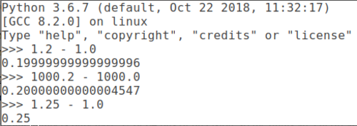
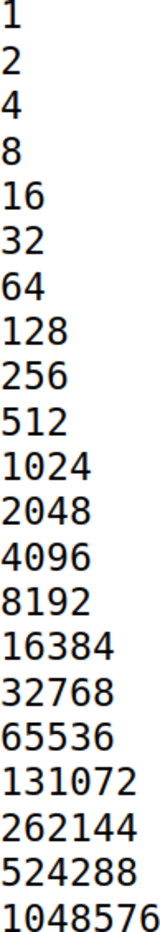
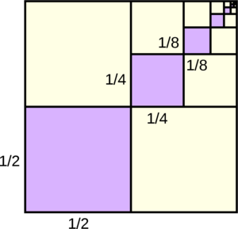
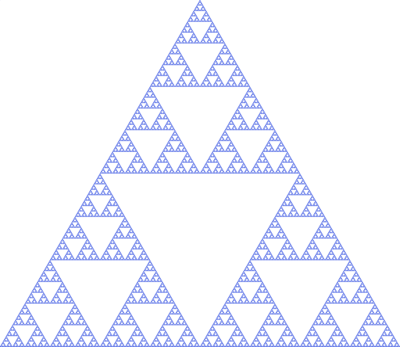
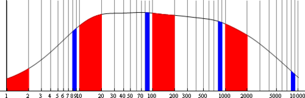
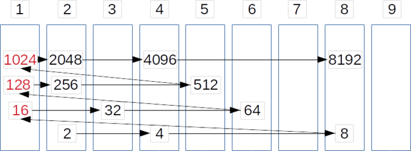
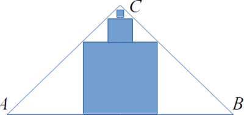

# &nbsp;

<hgroup>

<h1 style="font-size:32pt">Ģeometriskas progresijas</h1>

</hgroup><hgroup>

**(1) Ievads**  
(2) [Pamatfakti](#section-1)  
(3) [Aptauja](#section-2)  
(4) [Tipisks piemērs](#section-3)  
(5) [Patstāvīgie uzdevumi](#section-4)  
(6) [Kopsavilkums](#section-5)

</hgroup>

# <lo-theory/> Kurā nodaļā esam?

<hgroup style="width: 48%; font-size:80%">

<table>
<tr><td style="text-align:left">#1: Eksperimenti un pretpiemēri</td></tr>
<tr><td style="text-align:left">#2: Mainīgo izteiksmes un pārveidojumi</td></tr>
<tr><td style="text-align:left">#3: Algebriskas struktūras</td></tr>
<tr><td style="text-align:left">#4: Dalāmība un pirmreizinātāji</td></tr>
<tr><td style="text-align:left">#5: LKD, MKD un valuācijas</td></tr>
<tr><td style="text-align:left">#6: Kongruences fiksētam modulim</td></tr>
<tr><td style="text-align:left">#7: Pretrunas moduļa izvēle</td></tr>
<tr><td style="text-align:left">#8: Decimālpieraksts</td></tr>
</table>

</hgroup>
<hgroup style="margin-left: 4%; width: 45%; font-size:80%">

<table>
<tr><td style="text-align:left">#9: Aritmētiskas progresijas</td></tr>
<tr><td style="text-align:left"><red>**#10: Ģeometriskas progresijas**</red>&nbsp;&nbsp;&nbsp;&nbsp;&nbsp;&nbsp;&nbsp;&nbsp;&nbsp;&nbsp;&nbsp;&nbsp;&nbsp;&nbsp;&nbsp;</td></tr>
<tr><td style="text-align:left">#11: Rekurentas virknes</td></tr>
<tr><td style="text-align:left">#12: Ekstrēmie elementi</td></tr>
<tr><td style="text-align:left">#13: Dirihlē princips</td></tr>
<tr><td style="text-align:left">#14: Invarianti un indukcija</td></tr>
<tr><td style="text-align:left">#15: Nevienādības</td></tr>
<tr><td style="text-align:left">#16: Kombinatoriskas metodes</td></tr>
</table>

</hgroup>

# <lo-why/> why

Kāpēc ģeometriskas progresijas saistītas ar skaitļu pierakstu un 
simetrijas jēdzieniem?

* Kāpēc naturālu skaitļu ģeometriskas progresijas strauji aug?
* Kāpēc bezgalīgas ģeometriskas progresijas summa saistīta ar 
periodiskiem daļskaitļiem?
* Kāpēc ģeometriskas progresijas parādās, aplūkojot fraktāļus un 
citas figūras, kas līdzīgas daļai no sevis?

 
# <lo-theory/> Sasniedzamie rezultāti

* Izmantot formulas ģeometriskas progresijas locekļa, galīgas
un bezgalīgas summas izteikšanai. 
* Izmantot ģeometriskas progresijas, konstruējot skaitļu kopas, kur
katrus divus var izdalīt.
* Izmantot algebriskas identitātes divu $n$-to pakāpju starpībai un summai.
* Izmantot novērtējumus par ģeometriskas progresijas vai tās summu augšanas ātrumu. 
* Izteikt bezgalīgas decimāldaļas ar parastiem daļskaitļiem
* Novērtēt, cik reizes jāreizina vai jādala ar $q$, 
lai sasniegtu vēlamo vērtību

# &nbsp;

<hgroup>

<h1 style="font-size:32pt">Ģeometriskas progresijas</h1>

</hgroup><hgroup>

(1) [Ievads](#section)  
**(2) Pamatfakti**  
(3) [Aptauja](#section-2)  
(4) [Tipisks piemērs](#section-3)  
(5) [Patstāvīgie uzdevumi](#section-4)  
(6) [Kopsavilkums](#section-5)

</hgroup>

# <lo-theory/> Ģeometriskas progresijas skolā

**Definīcija:** Par *ģeometrisku progresiju*
sauc virkni, kurā katru nākamo locekli iegūst, 
reizinot iepriekšējo ar to pašu skaitli $q \neq 0$: 

$$b_{n+1} = b_n q,\;\;\mbox{kur $n \geq 1$}.$$

Skaitli $q$ sauc par kvocientu (*common ratio*, 
*der Quotient*,
*знаменатель прогрессии*).

## <lo-theory/> Dažas populāras formulas

*Progresijas $n$-tā locekļa formula:*

$$b_n = b_1 \cdot q^{n-1},\;\mbox{kur $n>1$}.$$

*Galīgas progresijas summas formula:*

$$S_n = b_1 + b_2 + \ldots + b_n = b_1\cdot\frac{q^{n+1} - 1}{q - 1}.$$

*Bezgalīgas progresijas summas formula:*

$$S = b_1 + b_2 + \ldots = \frac{b_1}{1 - q},\;\mbox{kur $|q|<1$.}$$

## <lo-theory/> Identitātes ar pakāpēm

**(a)** ${\displaystyle x^n - y^n = (x-y) \left( x^{n-1} + x^{n-2}y + \ldots + xy^{n-2} + y^{n-1} \right).}$  
Lielajās iekavās ir ģeometriska progresija: $b_1 = x^{n-1}$ un $q = \frac{y}{x}$.

**(b)** ${\displaystyle x^{2n+1} + y^{2n+1} = (x+y)\left( x^{2n} - x^{2n-1}y + \ldots - xy^{2n-1} + y^{2n} \right).}$   
Lielajās iekavās ir ģeometriska progresija: $b_1 = x^{2n}$ un $q = -\frac{y}{x}$.

## <lo-summary/> Mersena pirmskaitļi

**Apgalvojums:** Lai skaitlis $2^n - 1$ būtu pirmskaitlis, ir 
**nepieciešams**, lai $n$ būtu pirmskaitlis.

Tiešām, pretējā gadījumā (ja $n = ab$), varētu 
izmantot pakāpju starpības identitāti. Piemēram, $2^{15}-1$ 
dalās ar $2^3-1 = 7$ un $2^5-1 = 31$: 
$$2^{15}-1 = (2^3 - 1)\left( (2^3)^4 + (2^3)^3 +(2^3)^2 +(2^3)^1 + 1 \right).$$

## <lo-summary/> Lielākais zināmais pirmskaitlis

Ne visi $2^p - 1$ ($p$ - pirmskaitlis) ir pirmskaitļi. Tos, kuri ir, 
sauc par *Mersena pirmskaitļiem*. Līdz šim zināmi $51$ šādi pirmskaitļi. 
Nesenāko atklāja 2018.g. decembrī:
$$2^{82\,589\,933} - 1.$$
Tas ir lielākais šobrīd zināmais pirmskaitlis, tā decimālpierakstā ir $24\,862\,048$ cipari. 

Mersena pirmskaitļu meklēšanai ir zināmas līdzības ar kriptovalūtām (*Bitcoin mining*).
Abos gadījumos ar lielu elektroenerģijas patēriņu meklē skaitļus ar neparastām īpašībām.

# <lo-theory/> Cik strauji aug progresijas summa

Leģenda par šaha izgudrotāju, kurš uz katra nākamā lauciņa gribēja divreiz vairāk 
kviešu graudu, nekā uz iepriekšējā. Faktiski sanāk, ka uz katra nākamā ir vairāk 
nekā **uz visiem iepriekšējiem kopā**. Piemēram, 
$2^0 + 2^1 + \ldots + 2^{63} = 2^{64} - 1$.

<table>
<tr>
<td>$2^0$</td><td style="background-color:silver">$2^1$</td><td>$2^2$</td><td style="background-color:silver">$2^3$</td>
<td>$2^4$</td><td style="background-color:silver">$2^5$</td><td>$2^6$</td><td style="background-color:silver">$2^7$</td>
</tr>
<tr>
<td style="background-color:silver">$2^8$</td><td>$2^9$</td><td style="background-color:silver">$2^{10}$</td><td>$2^{11}$</td>
<td style="background-color:silver">$2^{12}$</td><td>$2^{13}$</td><td style="background-color:silver">$2^{14}$</td><td>$2^{15}$</td>
</tr>
<tr>
<td>$2^{16}$</td><td style="background-color:silver">$2^{17}$</td><td>$2^{18}$</td><td style="background-color:silver">$2^{19}$</td>
<td>$2^{20}$</td><td style="background-color:silver">$2^{21}$</td><td>$2^{22}$</td><td style="background-color:silver">$2^{23}$</td>
</tr>
<tr>
<td style="background-color:silver">$2^{24}$</td><td>$2^{25}$</td><td style="background-color:silver">$2^{26}$</td><td>$2^{27}$</td>
<td style="background-color:silver">$2^{28}$</td><td>$2^{29}$</td><td style="background-color:silver">$2^{30}$</td><td>$2^{31}$</td>
</tr>
<tr>
<td>$2^{32}$</td><td style="background-color:silver">$2^{33}$</td><td>$2^{34}$</td><td style="background-color:silver">$2^{35}$</td>
<td>$2^{36}$</td><td style="background-color:silver">$2^{37}$</td><td>$2^{38}$</td><td style="background-color:silver">$2^{39}$</td>
</tr>
<tr>
<td style="background-color:silver">$2^{40}$</td><td>$2^{41}$</td><td style="background-color:silver">$2^{42}$</td><td>$2^{43}$</td>
<td style="background-color:silver">$2^{44}$</td><td>$2^{45}$</td><td style="background-color:silver">$2^{46}$</td><td>$2^{47}$</td>
</tr>
<tr>
<td>$2^{48}$</td><td style="background-color:silver">$2^{49}$</td><td>$2^{50}$</td><td style="background-color:silver">$2^{51}$</td>
<td>$2^{52}$</td><td style="background-color:silver">$2^{53}$</td><td>$2^{54}$</td><td style="background-color:silver">$2^{55}$</td>
</tr>
<tr>
<td style="background-color:silver">$2^{56}$</td><td>$2^{57}$</td><td style="background-color:silver">$2^{58}$</td><td>$2^{59}$</td>
<td style="background-color:silver">$2^{60}$</td><td>$2^{61}$</td><td style="background-color:silver">$2^{62}$</td><td>$2^{63}$</td>
</tr>
</table>

* Aritmētiskai progresijai summa auga straujāk (kvadrātfunkcija) nekā pati progresija.
* Ģeometriskajai summa aug apmēram tikpat strauji kā summējamā progresija.

## <lo-sample/> BBK2012.P1.52

Vai iespējams norādīt tādu galīgu skaitu ģeometrisko progresiju, 
kuru locekļi ir naturāli skaitļi, ka jebkurš naturāls skaitlis 
piederētu vismaz vienai progresijai?

## <lo-hints/> BBK2012.P1.52

1. Kā mainās ģeometriskas progresijas locekļu īpatsvars intervālā $[1;n]$, ja 
$n$ neierobežoti aug? 

## <lo-soln/> Attālumi starp progresijas locekļiem

* $b_{n+2} - b_{n+1} = (b_{n+1} - b_n)q$, t.i. attālumi arvien pieaug. 
* Ja progresiju ir pavisam $N$, tad katrai progresijai atrodam 
tādu $m_i$, ka locekļi aiz šī skaitļa $m_i$ ir attālumos, kas lielāki par $N+1$. 
* Apzīmējam ar $M$ maksimālo no šiem $m_i$. Aiz vērtības $M$ **visām** 
progresijām attālumi starp blakus esošiem locekļiem būs lielāki par $N+1$. 
* Tātad, kāds punkts paliks nepārklāts.

# <lo-theory/> Progresijas dalāmība

**Apgalvojums:** Naturālu skaitļu ģeometriskā progresijā ar veselu kvocientu $q$ 
katrs loceklis dalās ar visiem iepriekšējiem.

*Piezīme.* Galīgām naturālu skaitļu progresijām var būt arī
daļveida kvocienti. Piemēram, $16,24,36,54,81$ kvocients ir $3/2$.

## <lo-summary/> Skaitļa dalītāju skaits

Ja ģeometrisku progresiju veido no pirmskaitļu pakāpēm $1,p,p^2,p^3,\ldots$, 
katram nākamajam loceklim ir par vienu dalītāju vairāk - turklāt visi 
dalītāji ir zemākas tā paša pirmskaitļa pakāpes.

* Piemēram, $2^{15}=32768$ ir skaitlis, kuram ir tieši $16$ dalītāji. 
* Lielu dalītāju skaitu var sasniegt jau daudz mazākiem skaitļiem, 
atkārtoti nereizinot ar 
tā paša kvocienta pakāpēm $q^k$. Piemēram, $120 = 2^3\cdot{}3\cdot{}5$ arī ir tieši 
$16$ dalītāji - bet šo dalītāju izvietojums ir sarežģītāks. 

## <lo-sample/> LV.AO.2013.10.4

No pirmajiem $100$ naturālajiem skaitļiem izvēlēts $51$ skaitlis.
Pierādīt, ka no tiem var izvēlēties divus, no kuriem viens dalās ar
otru.

## <lo-hints/> LV.AO.2013.10.4

1. Parametrs $51$ (uzdevumā par $100$ skaitļiem) droši vien nav izvēlēts
nejauši - kā tas iegūts?
2. Vai apgalvojums paliek spēkā, ja izvēlas $50$ skaitļus no $100$? 
(Vai attiecīgi mazākiem skaitļiem, ja $50$ un $100$ šķiet pārāk lieli?)
3. Kādas skaitļu kopas ir tādas, kurās allaž var izvēlēties divus, 
no kuriem viens dalās ar otru?

## <lo-soln/> LV.AO.2013.10.4

Izrakstām ģeometriskas progresijas, kas sākas ar nepāru skaitļiem un $q=2$: 

$$(1,2,4,8,16,32,64),\;(3,6,12,24,48,96),$$
$$(5,10,20,40,80),\ldots,(97),\;(99).$$

* Būs tieši $50$ progresijas (dažās būs tikai pa vienam loceklim), jo līdz $100$ ir tieši $50$ nepāru skaitļi.
* Katrs skaitlis pieder tieši vienai progresijai, jo katram pāru skaitlim atbilst tieši viens nepāru 
skaitlis, kurš rodas, ja atkārtoti dala ar $2$. 
* Izvēloties $k+1$ skaitļus, vismaz divi būs no vienas progresijas (Dirihlē princips).

# <lo-theory/> Atkārtoti cipari vai grupas

Ja viens un tas pats cipars (vai cipari) rakstīti 
daudzas reizes, decimālpierakstu var "sasummēt"
ar ģeometriskas progresijas summas formulu. Piemēram, 

$$123123123123123 = 123 \cdot 1001001001001 = $$
$$= 123 \cdot \left( 1000^4 + 1000^3 + 1000^2 + 1000^1 + 1000^0 \right) = $$
$$= 123 \cdot \frac{1000^5 - 1}{1000-1}.$$ 

## <lo-sample/> LV.VO.2012.10.3

Naturāla skaitļa $N$ decimālajā pierakstā izmantots tikai cipars $6$.
Pierādīt, ka skaitļa $N^2$ decimālajā pierakstā nav cipara $0$.

## <lo-hints/> LV.VO.2012.10.3

**Stratēģija:** Pārtulkojam teksta uzdevumu algebriski. 
Vienkāršojam sev dzīvi. 

1. Kā ar īsu formulu izteikt skaitli, kura pierakstā izmantots tikai cipars $6$? 
2. Kā uzzināt, kādi cipari ir sešinieku veidotā skaitļa kvadrātā (vispārīgajā gadījumā - ja 
ir $n$ sešinieki)? 

## <lo-soln/> 66...66 kāpināšana kvadrātā

${\displaystyle 6^2=36=45-9}$,  
${\displaystyle 66^2=4356=4455-99}$,  
${\displaystyle 666^2=443556=444555-999,\ldots}$

Var pamatot, ka 

$$(\underbrace{6\ldots6}_n)^2=\overline{\underbrace{4\ldots{}4}_n\underbrace{5\ldots{}5}_n}-
\underbrace{9\ldots{}9}_n$$

# <lo-theory/> P/Q - galīga decimāldaļa

**Apgalvojums:** Racionāla skaitļa $\frac{P}{Q}$ decimālpieraksts 
ir *galīga decimāldaļa* (tam ir tikai galīgs skaits ciparu aiz komata, pēc kuriem seko visas nulles)
tad un tikai tad, ja $Q = 2^a5^b$. Tātad daļas saucējs izsakāms kā 
pirmskaitļu $2$ un $5$ pakāpju reizinājums.

<table>
<tr><td>$1/5$</td><td>$0.2$</td></tr>
<tr><td>$1/8=1/(2^3)$</td><td>$0.125$</td></tr>
<tr><td>$1/40=1/(2^35^1)$</td><td>$0.025$</td></tr>
<tr><td>$1/625=1/(5^4)$</td><td>$0.0016$</td></tr>
<tr><td>$1/65536=1/(2^{16})$</td><td>$0.0000152587890625$</td></tr>
</table>

## <lo-theory/> P/Q - tīri periodiska decimāldaļa

**Apgalvojums:** Racionāla skaitļa $\frac{P}{Q}$ decimālpieraksts 
ir *bezgalīga tīri periodiska decimāldaļa* (periods sākas tūlīt aiz komata)
tad un tikai tad, ja $Q$ ir pirmskaitlis vai 
tādu pirmskaitļu reizinājums, kas neviens nedalās ar $2$ vai ar $5$. 

*Pierādījumu var iegūt no skolas algoritma divu skaitļu dalīšanai "stabiņā", kur
visi iespējamie atlikumi, dalot ar $Q$, cikliski atkārtojas. To, ka nerodas
priekšperiodi pamatot ir drusku grūtāk.*

## <lo-theory/> P/Q - periodiska ar priekšperiodu

**Apgalvojums:** Racionāla skaitļa $\frac{P}{Q}$ decimālpieraksts 
ir *bezgalīga periodiska decimāldaļa ar priekšperiodu* (periods sākas nevis 
tūlīt aiz komata, bet vēlāk)
tad un tikai tad, ja $Q$ satur pirmreizinātājus $2$ un $5$ (bet satur
arī citus pirmskaitļus, t.i. nav galīga decimāldaļa). 

*Pierādījums no pretējā:* Ja $P/Q$ būtu tīri periodiska decimāldaļa
(bez priekšperioda), piemēram, $0.(a_1a_2\ldots{}a_n)$, tad 
to varētu pārveidot par $\frac{\overline{a_1a_2\ldots{}a_n}}{\overline{99\ldots9}}$. 
Bet pēc daļas noīsināšanas $Q$ nevar dalīties ar $2$ vai $5$, jo 
arī $\overline{99\ldots9}$ nedalās ar $2$ vai $5$. 

## <lo-summary/> Periodisku daļu izteikšana ar parastām

**Apgalvojums:** Jebkuru bezgalīgu periodisku 
decimāldaļu (ar vai bez priekšperioda) 
var izteikt parastas daļas formā $\frac{p}{q}$.

Izmantojam bezgalīgas ģeometriskas progresijas summu:
$$0.(02439) = 2439 \cdot \left( \frac{1}{10^5} 
+ \frac{1}{10^{10}} + \frac{1}{10^{15}} + \ldots \right) = $$
$$ = 2439 \cdot \frac{\frac{1}{10^5}}{1 - \frac{1}{10^5}} = \frac{2439}{99999} = \frac{1}{41}.$$ 

**Secinājums:** Racionāli skaitļi sakrīt ar periodiskām decimāldaļām.

## <lo-sample/> EE.LO.2015.10.1

Atrast visus naturālos skaitļus $n$, kas lielāki par vienu, 
kuriem $\frac{1}{n}$ un $\frac{1}{n+1}$ izsakāmi kā galīgas decimāldaļas.

## <lo-hints/> EE.LO.2015.10.1

**Stratēģija:** Minēšana un vispārināšana

1. Vai ir kāda neliela $n$ vērtība, kas der? 
2. Ko mēs zinām par saucējiem galīgās decimāldaļās? 
3. Vai $n$ vai $n+1$ var saturēt dažādus pirmreizinātājus vai arī
tie abi ir tīras pirmskaitļu pakāpes? 

# <lo-theory/> Daļskaitļi datora atmiņā

Veicot aprēķinus ar datoru, reizēm rodas neparastas noapaļošanas kļūdas. 
Piemēram, Python programmēšanas konsole: 

Rezultāts `0.19999999999999996` (kur jābūt `0.2`) rodas, jo
*float* skaitļi datorā glabājas kā bezgalīgas divnieku daļas. 

Fizikas aprēķiniem *float* skaitļi der, bet naudas aprēķiniem  
($1.20$ eiro u.c.) centi jāglabā kā veseli skaitļi.

## <lo-summary/> Divnieku skaitīšanas sistēma

<hgroup style="font-size:100%">

Daļskaitļa $x \in [0,1]$ pieraksts *divnieku skaitīšanas sistēmā*
ir bezgalīga virkne $0,d_1d_2d_3\ldots$, kur $d_1,d_2,\ldots$ pieņem vērtības
$0$ vai $1$, bet $x$ izsakāms kā bezgalīga summa: 
$$x = \frac{d_1}{2^1} + \frac{d_2}{2^2} + \frac{d_3}{2^3} + \ldots$$

</hgroup>

<hgroup style="width:45%; margin-left:5%">

Skaitļus, kam saucējā ir divnieka pakāpe var viegli izteikt:

<table>
<tr><td>$1/8$</td><td>$0.001_2$</td></tr>
<tr><td>$1/4$</td><td>$0.010_2$</td></tr>
<tr><td>$3/8$</td><td>$0.011_2$</td></tr>
<tr><td>$1/2$</td><td>$0.100_2$</td></tr>
<tr><td>$5/8$</td><td>$0.101_2$</td></tr>
<tr><td>$3/4$</td><td>$0.110_2$</td></tr>
<tr><td>$7/8$</td><td>$0.111_2$</td></tr>
<tr><td>$1$</td><td>$1.000_2$</td></tr>
</table>

</hgroup>

## <lo-summary/> 1/10 ir bezgalīgs, ja bāze=2

Decimālajā sistēmā $\frac{1}{10} = 0.1$ daļai ir ērts pieraksts. 
Divnieku sistēmā šis pats skaitlis nav izsakāms kā galīga
skaita divnieka pakāpju summa - tas ir bezgalīga periodiska daļa:

$$\frac{1}{10} = 0.00011001100\ldots_2 = 0.0(0011)_2.$$

Sk. arī ${\displaystyle \frac{1}{3} = 0.010101\ldots_2 = \frac{1}{4} + \frac{1}{4^2} + \frac{1}{4^3} + \ldots.}$  

${\displaystyle \frac{1}{7} = 0.001001001\ldots_2 = \frac{1}{8} + \frac{1}{8^2} + \frac{1}{8^3} + \ldots.}$

# <lo-theory/> Ciparu skaits progresijās

**Jautājums:** Cik reizes skaitlis jāpiereizina ar $2$, 
lai tā decimālpierakstā būtu par vienu ciparu vairāk? 

$$2^3 = 8<10,\;\;\mbox{bet}\;\;2^4 = 16 > 10.$$

Skaitļiem ģeometriskā progresijā ciparu skaits 
aug (aptuveni) aritmētiskā progresijā.

## <lo-summary/> Precīzi noteikts ciparu skaits

<hgroup style="font-size:70%">

</hgroup><hgroup>

Ciparu skaitu skaitlim $x \geq 1$ izsaka: 
$\left\lfloor \log_{10} x \right\rfloor + 1$. 
Piemērs:

$$\log_{10} 2^{200} = 200\cdot \log_{10} 2 = $$
$$=200 \cdot 0.30103 \approx 60.206$$

Tātad $2^{200}$ būs $\left\lfloor 60.206 \right\rfloor + 1 = 61$
cipari.

</hgroup>

# <lo-theory/> Ģeometriskas figūras

<hgroup>

Vai metot monētu, kurai ir varbūtība $p = \frac{1}{2}$ uzkrist ar ciparu uz augšu, var
veikt eksperimentu, kura izdošanās varbūtība ir tieši $p = \frac{1}{3}$? 

</hgroup><hgroup>

Aprēķināsim iekrāsoto kvadrātiņu laukumu summu: 

* Ģeometriska progresija: $\frac{1}{4} + \frac{1}{4^2} + \ldots$
* $b_1 = \frac{1}{4}$, $q = \frac{1}{4}$. 
* Bezgalīgas progresijas summas formula: 
$$\frac{b_1}{1-q} = \frac{1/4}{3/4} = \frac{1}{3}.$$

</hgroup>

## <lo-yellow/> Serpinska trijstūris

<hgroup>

</hgroup><hgroup style="font-size:70%">

* Vidējais izmestais trijstūris ar laukumu $1/4$ (no sākotnējā)
* Trīs mazāki trijstūri ar laukumiem $1/16$ katrs, utt. 
* Summējam bezgalīgu progresiju: 

$$\frac{1}{4} + \frac{3}{4^2} + \frac{3^2}{4^3} + \ldots$$

$S = \frac{1/4}{1 - 3/4} = 1$. It kā tiek izmests 
pilnīgi viss laukums. Tomēr *Serpinska trijstūrī* paliek 
ļoti daudz punktu, kuru veidotais laukums ir $0$. 

# <lo-theory/> Benforda sadalījums

<hgroup>

</hgroup><hgroup>

* Ne visi cipari parādās ģeometriskas progresijas locekļu 
pierakstā vienādi bieži. 
* Benforda sadalījums parāda, cik bieži katrs cipars ir pirmais
ģeometriskas progresijas pierakstā.

</hgroup>

## <lo-summary/> Kad novērojams Benforda sadalījums?

* Ne visi lielumi sadalīti pietiekami plašā intervālā, lai 
pirmais cipars varētu būtiski atšķirties. Piemēram, cilvēku garumi mērīti 
centimetros parasti sāksies ar ciparu $1$, jo vairums cilvēku garumi 
ir intervālā $[100;200)$, t.i. mazāki par $2$ metriem. 
* Daži lielumi mēdz būt sadalīti ļoti plaši (upju garums, pilsētu iedzīvotāju skaits, 
balsu skaits, kas saņemts vēlēšanu iecirkņos). Tie mēdz apmierināt Benforda 
sadalījumu. 

## <lo-sample/> LV.NO.2004.8.2 

Ir zināms, ka skaitļa $2^{200}$ decimālajā pierakstā ir $61$ cipars. 
Cik daudziem no skaitļiem $2^1; 2^2; 2^3; \ldots; 2^{199}; 2^{200}$ 
decimālais pieraksts sākas ar ciparu $1$?

## <lo-hints/> LV.NO.2004.8.2

**Stratēģija:** Vienkāršojam sev dzīvi. Saskaitām kaut ko citu. 

1. Vai var aplūkot vienkāršāku uzdevumu, izvairoties no milzīgā skaitļa $2^{200}$? 
2. Kāpēc "pateikts priekšā", cik ciparu ir $2^{200}$ decimālpierakstā? 
Vai ciparu skaitu var izmantot, atbildot uz uzdevuma jautājumu?
3. Vai ir vienlīdz viegli atbildēt arī par citiem cipariem (izņemot "1"), ar kuriem 
var sākties $2^k$ decimālpieraksts?

## <lo-soln/> LV.NO.2004.8.2

Izrakstām pēc kārtas divnieka pakāpes un noskaidrojam, kuras sākas ar ciparu $1$: 

$2$, $4$, $8$, <red>$16$</red>, $32$, $64$, <red>$128$</red>, $256$, $512$, <red>$1024$</red>, $\ldots$

Kas kopīgs visiem sarkanajiem skaitļiem? 

**Apgalvojums:** Ir pavisam $61$ skaitļu garumi: $1$-cipara, ... , $61$-ciparu.

Garums $61$ ir dots un divnieka pakāpes neaug tik strauji, lai ciparu 
skaits blakus pakāpēs ($2^k$ un $2^{k+1}$) atšķirtos vairāk kā par $1$.

## <lo-soln/> 2 pakāpes nonāk 9 spainīšos

**Apgalvojums:** Jebkuram ciparu skaitam (izņemot $1$-cipara skaitļus)
ir tieši viena divnieku pakāpe, kas sākas ar $1$.  

Katra nākamā $2$ pakāpe pārsniedz iepriekšējo tieši divas reizes. 
Nevar pārlēkt pāri sākuma ciparam $1$, ja iepriekšējā pakāpē bija 
par vienu ciparu mazāk. 

# &nbsp;

<hgroup>

<h1 style="font-size:32pt">Ģeometriskas progresijas</h1>

</hgroup><hgroup>

(1) [Ievads](#section)  
(2) [Pamatfakti](#section-1)  
**(3) Aptauja**  
(4) [Tipisks piemērs](#section-3)  
(5) [Patstāvīgie uzdevumi](#section-4)  
(6) [Kopsavilkums](#section-5)

</hgroup>

# <lo-quiz/> 1.Jautājums

<hgroup>

</hgroup>

<hgroup>

Vienādsānu taisnleņķa trijstūrī $\triangle\,ABC$
ievilka kvadrātu tā, ka viena kvadrāta mala atrodas
uz hipotenūzas $AB$, bet divas virsotnes uz atlikušajām
malām. Virs šī kvadrāta tāpat ievilka nākamo kvadrātu,
un tā tālāk.  
Kādu daļu no sākotnējā trijstūra laukuma aizņem visu šo
kvadrātu laukumu summa?

</hgroup>

## <lo-quiz/> 1.Jautājums

* Pirmā kvadrāta $K_1$ mala ir trīsreiz īsāka par $AB$ (to 
redz pēc vienādsānu trijstūriem). Ja $AB=1$, tad 
$S_{\triangle\,ABC}=\frac{1}{4}$, bet $S_{K_1}= \frac{1}{9}$. 
* Katram nākamajam kvadrātam laukums ir vēl deviņreiz mazāks. 
Bezgalīgas ģeometriskas progresijas summa:
$$\frac{1}{9} + \frac{1}{9^2} + \ldots = \frac{1/9}{1 - 1/9} = \frac{1}{8}.$$
* Iegūstam, ka kvadrātu laukumu summa ($1/8$) ir tieši puse no sākotnējā
trijstūra laukuma ($1/4$).

# <lo-quiz/> 2.Jautājums

Pārveidot par parastiem daļskaitļiem (izteikt formā $P/Q$):  
**(a)** $0.27272727\ldots = 0.(27)$   
**(b)** $0.123123123\ldots = 0.(123)$   
**(c)** $0.041666666\ldots = 0.041(6)$

## <lo-quiz/> 2.Jautājums

Viegli pārbaudīt, ka $0.(01)=0.010101\ldots = \frac{1}{99}$ un 
$0.(001)=0.001001001\ldots = \frac{1}{999}$ (bezgalīgas ģeometriskas
progresijas summas formula). 

**(a)** $0.(27)=27\cdot{}0.(01) = \frac{27}{99} = \frac{3}{11}$.  
**(b)** $0.(123) = 123\cdot{}0.(001) = \frac{123}{999} = \frac{41}{333}$. 

## <lo-quiz/> 2.Jautājums

**(c)** Lai pārveidotu $0.041666666\ldots$, atceramies, ka $1/6 = 0.1666\ldots$.  
Tādēļ $0.041666\ldots = 0.04 + 0.01\cdot{}(1/6) = \frac{1}{25} + \frac{1}{600}$. 

$$\frac{1}{25} + \frac{1}{600} = \frac{24}{600} + \frac{1}{600} = \frac{25}{600} = \frac{1}{24}.$$

# <lo-quiz/> 3.Jautājums

Daļskaitļa $x \in [0,1]$ pieraksts *divnieku skaitīšanas sistēmā*
ir bezgalīga virkne $0,d_1d_2d_3\ldots$, kur $d_1,d_2,\ldots$ pieņem vērtības
$0$ vai $1$, bet $x$ izsakāms kā bezgalīga summa: 
$$x = \frac{d_1}{2^1} + \frac{d_2}{2^2} + \frac{d_3}{2^3} + \ldots$$

Atrast pirmos $10$ ciparus aiz komata skaitļa ${\displaystyle \frac{3}{7}}$ divnieku pierakstā. 

## <lo-quiz/> 3.Jautājums

Var ievērot, ka $1/7$ izsakāma ar bezgalīgu $2$-pakāpju rindu šādi:

$$\frac{1}{7} = \frac{1}{8} + \frac{1}{8^2} + \frac{1}{8^3} + \ldots = 
\frac{\frac{1}{8}}{1 - \frac{1}{8}} = \frac{1/8}{7/8}.$$

Tātad $\frac{1}{7}=0.001001001\ldots_2=0.(001)_2$.  
Divreiz lielāks ir $\frac{2}{7}=0.01001001\ldots_2=0.(010)_2$.   
Abu summa: $\frac{3}{7}=0.(011)_2 =$<red>$0.0110110110$.</red>

*Var izmantot arī vispārīgo algoritmu - reizināt $\frac{3}{7}$ ar
divniekiem, atņemt veselās daļas, utt.*

# <lo-quiz/> 4.Jautājums

Kāds atlikums rodas, ja skaitli $N=2^{15}-1$ dala ar $2^5-1$? Un ar $2^6-1$? 

## <lo-quiz/> 4.Jautājums

**(a)** $2^{15}-1$ dalās ar $2^5$ bez atlikuma:  
$2^{15}-1 = (2^5-1)(2^{10} + 2^5 + 1)$.

**(b)** $2^{12}-1$ dalās ar $2^6-1$ bez atlikuma (kvadrātu 
starpības formula). Tātad
$8$ reizes lielāks skaitlis: $2^{15}-8$ arī dalīsies bez atlikuma.
Bet $N = 2^{15}-1$ ir tieši par $7$ lielāks, t.i. atlikums būs $7$.

**Atbilde:** (a) Atlikums $0$, (b) Atlikums $7$.

# <lo-quiz/> 5.Jautājums

Atrast šo $11$ skaitļu ģeometrisko vidējo: $1, \frac{3}{2}, \left( \frac{3}{2} \right)^2, \left( \frac{3}{2} \right)^3, \ldots, \left( \frac{3}{2} \right)^{10}$.  
*Piezīme.* Par skaitļu $a_1,a_2,\ldots,a_n$ 
ģeometrisko vidējo, ja visi $a_i \geq 0$, sauc skaitli 
$m = \sqrt[n]{a_1\cdot{}a_2\cdot\ldots\cdot{}a_n}$.

## <lo-quiz/> 5.Jautājums

Ja ģeometriskā progresijā ir nepāru skaits locekļu, tad
visu locekļu vidējais ģeometriskais sakrīt ar vidējo locekli. 
Mūsu gadījumā tas ir progresijas 6.loceklis:   
$b_6=1\cdot q^5 = \left( \frac{3}{2} \right)^5 = \frac{243}{32}$.

# &nbsp;

<hgroup>

<h1 style="font-size:32pt">Ģeometriskas progresijas</h1>

</hgroup><hgroup>

(1) [Ievads](#section)  
(2) [Pamatfakti](#section-1)  
(3) [Aptauja](#section-2)  
**(4) Tipisks piemērs**  
(5) [Patstāvīgie uzdevumi](#section-4)  
(6) [Kopsavilkums](#section-5)

</hgroup>

# <lo-sample/> UK.BMO1.2013.3

**UK.BMO1.2013.3:** Skaitļa decimālpieraksts satur $3^{2013}$ ciparus "3"; 
citu ciparu skaitļa pierakstā nav. Atrast augstāko skaitļa $3$ pakāpi, 
kas ir šī skaitļa dalītājs.

*Piezīme.* BMO1 ir Lielbritānijas (nacionālā mēroga) matemātikas olimpiāde, tās 
pirmais posms. 

## <lo-hints/> UK.BMO1.2013.3

**Stratēģija:** Atvieglojam sev dzīvi. 

1. Ja skaitļa ciparu summa dalās ar $9$, tas dalās ar $9$ (dalāmības pazīme), 
bet var dalīties arī ar augstāku $3$ pakāpi. Vai ir skaitļi, kam 
augstāko $3^k$, ar ko tas dalās, var noteikt precīzi?
2. Skaitlis, kura pierakstā ir $3^{2013}$ cipari, var nebūt
viegli analizējams. Kādus vienkāršākus skaitļus var aplūkot tā vietā?
3. Vai pastāv saistība starp vienkāršākiem (īsākiem) skaitļiem 
un uzdevumā doto?

## <lo-soln/> Skaitlis 333

**Apgalvojums:** $333$ dalās ar $9$, bet nedalās ar $27$. 

Uzskatāmībai sadalīsim reizinātājos: $333 = 3\cdot{}111$. 
Katrs no reizinātājiem dalās ar $3^1$, bet nedalās ar $3^2$. 
Tādēļ to reizinājums dalīsies ar $3^2$ (bet ne augstāku $3^k$).

## <lo-soln/> Skaitļa gabalu "klonēšana"

**Apgalvojums:** Lai $n$-ciparu skaitli $N=\overline{a_1a_2\ldots{}a_n}$
pārveidotu par $3n$-ciparu skaitli, kur ciparu virknīte
$\overline{a_1a_2\ldots{}a_n}$ atkārtojas trīs reizes, 
tas jāreizina ar $(10^{2n} + 10^n + 1)$. 

*Piemērs.* No $111$ var iegūt skaitli $111111111$, to 
reizinot ar $10^6 + 10^3 + 1 = 1001001$.  
Savukārt, lai trīsreiz atkārtotu jebkura deviņciparu skaitļa ciparus, 
to var reizināt ar $10^{18} + 10^9 + 1=1000000001000000001$.

## <lo-soln/> Garā skaitļa iegūšanas soļi

**Apgalvojums:** Skaitli, kura pierakstā ir $3^k$ cipari "3" iegūst
reizinot skaitli $3$ ar $111$, $1001001$, $1000000001000000001$, $\ldots$.  
Citiem vārdiem, skaitlim $3$ piereizina $k$ virknes locekļus 
$a_1,a_2,\ldots,a_k$, kur
$$a_m = 10^{2\cdot 3^m} + 10^{3^m} + 1.$$

Ikreiz, piereizinot ar $a_m$, 
reizinājuma ciparu skaits palielināsies trīskārt.

## <lo-soln/> Augstākā 3 pakāpe

1. Pirmais reizinātājs $3$ dalās ar $3^1$ (bet nedalās ar $3^2$). 
2. Katrs $a_m$ dalās ar $3^1$, bet nedalās ar $3^2=9$ (dalāmības pazīme:
skaitļa $a_m$ ciparu summa ir $3$). 
3. Piereizinot skaitlim $3$ vēl $k$ reizinātājus, kuri dalās ar $3$, bet
nedalās ar $9$, iegūstam skaitli, kas dalās ar $3^{2014}$, bet nedalās ar
$3^{2015}$.

**Atbilde:** Augstākā $3$ pakāpe, ar kuru dalās dotais skaitlis ir 
<red>$3^{2014}$</red>.

# &nbsp;

<hgroup>

<h1 style="font-size:32pt">Ģeometriskas progresijas</h1>

</hgroup><hgroup>

(1) [Ievads](#section)  
(2) [Pamatfakti](#section-1)  
(3) [Aptauja](#section-2)  
(4) [Tipisks piemērs](#section-3)  
**(5) Patstāvīgie uzdevumi**  
(6) [Kopsavilkums](#section-5)

</hgroup>

# <lo-sample/> BBK2012.P5.112

Dota skaitļu virkne $(a_n)$, kurai $a_1 = 2$, bet katram naturālam $n$ 
pastāv vienādība $a_{n+1} = 3a_n - 1$. Aprēķināt   
**(a)** $a_{1983}$,  
**(b)** $a_1 + a_2 + a_3 + \ldots + a_{1983}$. 

## <lo-hints/> BBK2012.P5.112

**Stratēģija:** Vienkāršojam sev dzīvi. 

1. Vai mums ir zināms, kā rēķināt rekurentu virkņu 
(kas uzdotas ar $3a_n - 1$ utml.) $n$-to locekli vai summu?
2. Kādai virknei līdzinās rekurentā sakarība? 
3. Vai varam aizstāt uzdevumu ar citu, kurā virkni 
pazīstam un protam sasummēt? 

## <lo-soln/> BBK2012.P5.112

Ar *nenoteiktā koeficienta* metodi - mēģinām visiem 
$a_n$ virknes locekļiem pieskaitīt kādu konstanti $c$ tā, 
lai jaunā virkne būtu ģeometriska progresija, vai kāda virkne, 
ko pazīstam labāk. 

Ja $c=-\frac{1}{2}$, ievērojam, ka pastāv vienādība:
$$a_{n+1} - \frac{1}{2} = 3\left( a_n - \frac{1}{2} \right).$$

Tātad var apzīmēt $b_n = a_n - \frac{1}{2}$ un aplūkot 
$a_n$ vietā ģeometrisko progresiju $b_n$. 

# &nbsp;

<hgroup>

<h1 style="font-size:32pt">Ģeometriskas progresijas</h1>

</hgroup><hgroup>

(1) [Ievads](#section)  
(2) [Pamatfakti](#section-1)  
(3) [Aptauja](#section-2)  
(4) [Tipisks piemērs](#section-3)  
(5) [Patstāvīgie uzdevumi](#section-4)  
**(6) Kopsavilkums**

</hgroup>

# <lo-theory/> Ko darījām šajā nodarbībā?

* Izmantojām skolas formulas ģeometriskas progresijas locekļiem un summām.
* Izmantojām algebriskas identitātes divu $n$-to pakāpju starpībai un summai; secinājām 
Mersena pirmskaitļu $2^n-1$ nepieciešamo īpašību.
* Izmantojām novērtējumus par ģeometrisku progresiju locekļu atstarpēm, pašu locekļu un to summu augšanas ātrumu. 
* Izteicām bezgalīgas decimāldaļas ar parastiem daļskaitļiem
* Novērtējām, cik reizes jāreizina vai jādala ar $q$, 
lai sasniegtu vēlamo vērtību.
* Izmantojām ģeometriskas progresijas laukumu summēšanai. 
* Iepazinām Benforda sadalījumu, kas palīdz pazīt falsificētus vai aizdomīgus datus, kur pirmie cipari izvietoti 
pārāk "vienmērīgi".

# <lo-theory/> Atsauces

* [BMO1 2013/2014 Solutions](https://bmos.ukmt.org.uk/solutions/bmo1-2014/) - 
Britu olimpiādes "British Mathematical Olympiad 1" atrisinājumi 
video formātā, t.sk. uzdevums par $3^{2013}$ trijniekiem.
* [Wikipedia. Šaha galdiņš un graudi](https://en.wikipedia.org/wiki/Wheat_and_chessboard_problem) - Pārstāstīta leģenda par ļoti daudzajiem kviešu graudiem.
* [Wikipedia. Logaritmiskā spirāle](https://en.wikipedia.org/wiki/Logarithmic_spiral) - Pašsimetriskas līknes piemērs.
* [Wikipedia. Serpinska trijstūris](https://en.wikipedia.org/wiki/Sierpi%C5%84ski_triangle) - Laukumi, kuru summa sakrīt ar trijstūra laukumu, tomēr daudzas vietas paliek neapklātas. 
* [P.Zeitz. The Art and Craft of Problem Solving, 2nd Ed. 2007](https://kheavan.files.wordpress.com/2010/06/paul-zeitz-author-the-art-and-craft-of-problem-solving-2edwiley20060471789011.pdf) - 65.lpp. ir gliemežu uzdevums (Four bugs problem).
* [RU Valsts Domes vēlēšanu rezultāti](https://meduza.io/feature/2017/01/13/itogi-vyborov-v-gosdumu-okazalis-slishkom-idealnymi) - Kādēļ vēlēšanu rezultāti perfekti atbilst Benforda sadalījumam (un citiem kritērijiem, ko lieto falsifikāciju pārbaudei).

# <lo-theory/> Papildu uzdevumi

1. [Help Post](https://artofproblemsolving.com/community/c6t487922f6h1782126_help_post)  
Dots naturāls skaitlis $a$. Vai vienmēr ir spēkā sakarība: 
$\mbox{LKD}(a^{m}-1,a^{n} -1) = a^{\mbox{LKD}(m,n)} - 1$?

2. [Tournament of Towns, Fall 2015](https://artofproblemsolving.com/community/c6t168f6h1388479_relatively_terms_of_a_geometric_series)  
Ģeometriska progresija satur $37$ naturālus skaitļus. 
Tās pirmais un pēdējais locekļi ir savstarpēji pirmskaitļi. 
Pierādīt, ka 19.tais loceklis šajā progresijā ir kāda
naturāla skaitļa $18$-tā pakāpe. 

3. [101010101](https://artofproblemsolving.com/community/c6t168f6h1320333_101_010_101)  
Pierādīt, ka neviens no skaitļiem $10\,101$, $1\,010\,101$, 
$101\,010\,101$, $10\,101\,010\,101$, $\ldots$ 
nav pirmskaitlis. (Šajos skaitļos cipari $1$ un $0$ 
visu laiku mainās; ciparu skaits ir nepāru skaitlis $n > 5$). 

