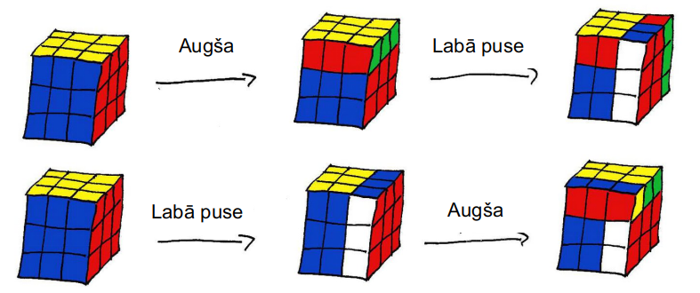
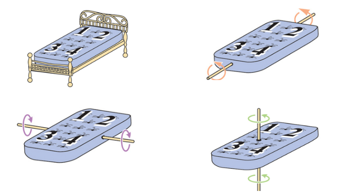
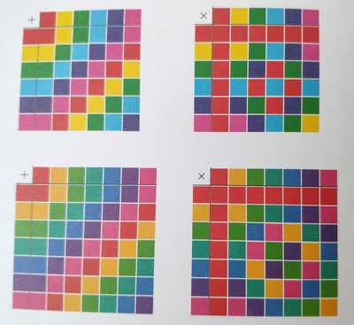
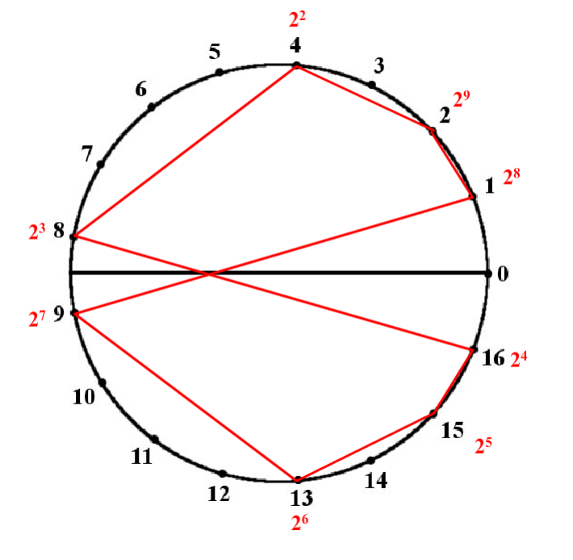
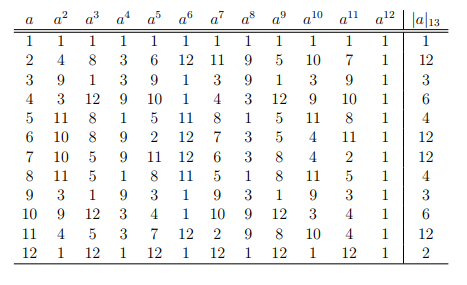
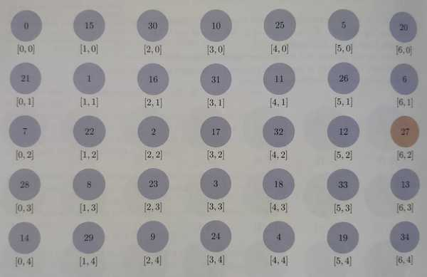
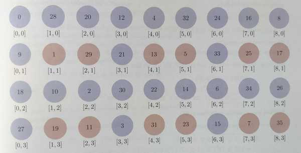

# &nbsp;

<hgroup>

<h1 style="font-size:32pt">Skaitļu reizināšanas struktūras</h1>

</hgroup><hgroup>

**(1) Grupas un to īpašības**  
(2) [Eilera/Fermā teorēmas](#section-1)  
(3) [Primitīvo sakņu teorēma](#section-2)  
(4) [Ķīniešu atlikumu teorēma](#section-3)  
(5) [Valuāciju ievads](#section-4)  
(6) [Valuācijas priekš $x^n \pm y^n$](#section-5)  
(7) [Henzela lemma](#section-6)

</hgroup>

# <lo-summary/> Grupas definīcija

1. **Kompozīcija:** Visiem $a,b \in \mathbb{G}$ definēts
$a \ast b \in \mathbb{G}$.   
2. **Asociativitāte:** Visiem $a,b,c \in \mathbb{G}$: 
$(a \ast b) \ast c = a \ast (b \ast c)$.   
3. **Vienības elements:** Eksistē $e \in \mathbb{G}$, 
ka jebkuram $a \in \mathbb{G}$: $e \ast a = a$.   
4. **Apgrieztais elements:** Katram $a \in \mathbb{G}$ 
eksistē $a^{-1} \in \mathbb{G}$: 
$a^{-1} \ast a = e$ (reizinājums ir vienības elements).

*Piezīme.* Šajās grupas aksiomās gan vienības elementu, 
gan apgriezto elementu piereizina no kreisās puses.

## Komutatīvas un nekomutatīvas grupas

(1) Racionāli skaitļi $q \in \mathbb{Q}$ ($q \neq 0$) veido 
komutatīvu grupu (kompozīcijas operācija - reizināšana).  
(2) Rubika kuba stāvokļi - nekomutatīvu grupu. Kompozīcijas operācija 
$a \ast b$ - vispirms ar perfekti saliktu kubu 
veic pārveidojumu $a$, pēc tam tam pa virsu uzgroza pārveidojumu $b$:

## Inversais ir inverss no abām pusēm

$$a^{-1} \ast a \ast a^{-1} = (a^{-1} \ast a) \ast a^{-1} = a^{-1}.$$

Piereizinām vienādībai no kreisās puses $\left( a^{-1} \right)^{-1}$: 

$$\left( a^{-1} \right)^{-1} \ast a^{-1} \ast a \ast a^{-1} = 
\left( a^{-1} \right)^{-1} \ast a^{-1} \Rightarrow$$
$$a \ast a^{-1} = e.$$

**Secinājums:** $a \ast a^{-1} = e$.  
Tātad katrs kreisais inversais
elements ir arī labais inversais elements.  
Un $\left( a^{-1} \right)^{-1} = a$ ($a$ inversā
inversais ir pats $a$).

# <lo-summary/> Bijektīvi pārveidojumi veido grupu

## Bijektīvās funkcijas

**Definīcija:** Funkciju $f:X \rightarrow Y$ sauc par bijektīvu, ja 
katrai tās vērtībai $y \in Y$ eksistē precīzi viens arguments $x \in X$, 
ka $f(x) = y$.

1. Nav elementu $y \in Y$, kas nav $f$ vērtības. 
2. Nav elementu $y \in Y$, kam $f(x_1)=f(x_2)=y$ un $x_1 \neq x_2$
(t.i. nav kolīziju jeb "saskriešanos"). 

### TODO: Zīmējums ar kolīziju

# <lo-summary/> Piemērs: Matrača simetriju grupa

## Matrača simetriju reizināšanas tabula

# <lo-summary/> Aditīvā gr. kongruenču klasēm

**Definīcija:** Naturālam $m$ ar $\mathbb{Z}_m$ apzīmējam
visu skaitļa $m$ kongruenču klašu kopu: 
$$\mathbb{Z} = \{ 0,1,2,\ldots,m-1 \}.$$

Šī kopa $\mathbb{Z}_m$ ar saskaitīšanu kā kompozīcijas 
operāciju veido grupu: $(\mathbb{Z}_m)^{+}$. 

## Aditīvā cikla garums 

**Apgalvojums:** Naturāliem skaitļiem $m$ un $d$, 
aritmētiskās progresijas $a_k = a_0 + k \cdot d$ 
cikls iestājas pēc 
$$l = \frac{m}{\mbox{LKD}(a,m)}$$
soļiem. 

**Piemērs:** Ja pulksteņa stundu rādītājam ir $m=12$ stāvokļi
un to ikreiz padzen uz priekšu par $9$ stundām, tad 
pēc $\frac{12}{\mbox{LKD}(9,12)} = \frac{12}{3}=4$ soļiem 
rādītājs atgriezīsies sākumstāvoklī. 

# <lo-summary/> Z6 un Z7 summas/reizinājumi

<hgroup>

</hgroup>

<hgroup>

$\mathbb{Z}_6 = \{ 0,1,2,3,4,5 \}$   
$\mathbb{Z}_7 = \{ 0,1,2,3,4,5,6 \}$   

* Abām kongruenču klašu kopām var uzzīmēt saskaitīšanas
un reizināšanas tabulas.
* $(\mathbb{Z}_6)^{+}$ un $(\mathbb{Z}_7)^{+}$
ir grupas (operācija - saskaitīšana).
* $(\mathbb{Z}_7)^{\times}$ (bez nulles) arī ir grupa.
 

</hgroup>

## Ar reizināšanu var būt priekšperiodi

<hgroup>

**Ievada piemērs:** Noteikt kongruenču klasi jeb atlikumu
$12^{1000}\;(\mbox{mod}\,20)$. 

</hgroup>

<hgroup>

$12^n\;(\mbox{mod}\,20)$ ir:

$$\left\{
\begin{array}{ll}
1, & \mbox{ja $n=0$} \\
12, & \mbox{ja $n=4k+1$} \\
4, & \mbox{ja $n=4k+2$} \\
8, & \mbox{ja $n=4k+3$} \\
16, & \mbox{ja $n=4k+4$} 
\end{array} \right.$$

</hgroup>

## Ja kāpināmais savst.pirmsk. ar moduli

$12^{n}\;(\mbox{mod}\,20)$ analizējams 
līdzīgi kā $2^{n}\;(\mbox{mod}\,5)$

<table>
<tr>
<th>$n$</th>
<td>0</td><td>1</td><td>2</td><td>3</td><td>4</td><td>5</td>
</tr>
<tr>
<th>$12^{n}\;\mbox{mod}\,20$</th>
<td>1</td><td>12</td><td>4</td><td>8</td><td>16</td><td>12</td>
</tr>
<tr>
<th>$2^{n}\;\mbox{mod}\,5$</th>
<td>1</td><td>2</td><td>4</td><td>3</td><td>1</td><td>2</td>
</tr>
</table>

# <lo-sample/> Multiplikatīvā grupa

**Definīcija:** Ar $\Phi(n)$ apzīmēsim visus tos atlikumus no $\mathbb{Z}$, 
kas ir savstarpēji pirmskaitļi ar $n$. 

* Ja $p$ ir pirmskaitlis: $\Phi(p) = \{ 1, 2, \ldots, p-1 \}$  
(visi atlikumi, izņemot $0$).

* $\Phi(10) = \{ 1,3,7,9 \}$  
(atlikumi, kas nedalās ar $2$ vai $5$). 

## Kongruences klašu mult.grupa

**Apgalvojums:** $\Phi(n)$ ar kompozīcijas operāciju - reizināšanu 
veido grupu. 

*Pierādījums.*  
(A) Reizināšana atlikumiem $a,b \in \Phi(n)$ ir definēta un 
arī atlikums $a\cdot{}b$ ir savst.pirmskaitlis ar $n$.  
(B) $1 \in \Phi(n)$ ir vienības elements attiecībā uz reizināšanu.  
(C) Katram atlikumam $a \in \Phi(n)$ eksistē inversais. 

## Lemma par kongruenču klasēm

**Lemma:** Dots naturāls skaitlis $n$ un 
$$\Phi(n) = \{ 1, \ldots, n-1 \}$$
ir atlikumu kopa, kas ir savstarpēji pirmskaitļi ar $n$.  
Izvēlamies $a \in \Phi(n)$ un definējam jaunu atlikumu kopu:
$$a\Phi(n) = \{ ax\;\mid\;x \in \Phi(n) \} = \{ a \cdot 1, \ldots, a \cdot (n-1) \}.$$
Tad $a\Phi(n)=\Phi(n)$: kopa $a\Phi(n)$ sakrīt ar visu atlikumu kopu, kas ir
savstarpēji pirmskaitļi ar $n$. 

## Lemmas ilustrācija

TODO: Kaut kāda bildīte, kur atlikumi sajaucas

## Lemmas pierādījums

# <lo-summary/> Φ(8) un matrača simetrija

<hgroup>

</hgroup>
<hgroup>

Abas grupas ir *izomorfas* - matraču $4$ simetrijām
un $\Phi(8) = \{ 1,3,5,7 \}$ ir abpusēji viennozīmīga atbilstība
starp elementiem un to reizinājumiem.

</hgroup>

# <lo-summary/> Vilsona teorēma

**Teorēma:** Katram pirmskaitlim $p$, $(p-1)! \equiv -1\;(\mbox{mod}\,p)$. 

**Pierādījums:** Katram elementam $x \in \{ 1,\ldots,p-1 \}$ eksistē
inversais elements $x^{-1}$.  
**Vai kongruenču klase var būt pati sev inversā?**  
Ja $x = x^{-1}$, tad kongruenču klasi $x$ pareizinot
pašu ar sevi, iegūstam $1$:
$$x^2 \equiv 1\;(\mbox{mod}\,p),$$
jeb $x^2-1=(x-1)(x+1)$ dalās ar $p$. 

## Pierādījuma turpinājums

$x^2-1=(x-1)(x+1) \equiv p\;(\mbox{mod}\,p)$
ir vienīgi tad, ja $x = 1$ vai $x = p-1$. 

Vilsona teorēmā $(p-1)!$ satur visas kongruenču klases 
$x$ un $x^{-1}$ pa pāriem, izņemot $1$ un $(p-1)$.  
Tāpēc $(p-1)!$ kongruents ar $p-1$ jeb $-1$.  
$\blacksquare$

# <lo-sample/> IMO.SHL.2014.N4

**IMO.SHL.2014.N4:** 
Ar $n > 1$ apzīmēts kāds naturāls skaitlis. Pierādīt, ka
bezgalīgi daudzi locekļi virknei 
$(a_k)_{k \geq 1}$, kas definēta ar
$$a_k=\left\lfloor\frac{n^k}{k}\right\rfloor,$$ 
ir nepāru skaitļi.  
(Reālam skaitlim $x$, $\lfloor x\rfloor$ apzīmē 
lielāko veselo skaitli, kas nepārsniedz $x$.)

<!--
Let $n > 1$ be a given integer. Prove that 
infinitely many terms of the sequence 
$(a_k )_{k \geq 1}$, defined by 
$$a_k=\left\lfloor\frac{n^k}{k}\right\rfloor,$$ 
are odd.  
(For a real number $x$, $\lfloor x\rfloor$ denotes 
the largest integer not exceeding $x$.)
-->

## Empīrisks stāsts

abc

# &nbsp;

<hgroup>

<h1 style="font-size:32pt">Skaitļu reizināšanas struktūras</h1>

</hgroup>

<hgroup>

(1) [Grupas un to īpašības](#section)  
**(2) Eilera/Fermā teorēmas**  
(3) [Primitīvo sakņu teorēma](#section-2)  
(4) [Ķīniešu atlikumu teorēma](#section-3)  
(5) [Valuāciju ievads](#section-4)  
(6) [Valuācijas priekš $x^n \pm y^n$](#section-5)  
(7) [Henzela lemma](#section-6)

</hgroup>

# <lo-sample/> Eilera teorēma

**Teorēma:** Ja $a$ un $n$ ir savstarpēji pirmskaitļi, tad  $a^{\varphi(n)} \equiv
1\;(\mbox{mod}\,n)$.  
*Piezīme.* Ar $\varphi(n)$ apzīmējam elementu skaitu kopā $\Phi(n)$ - to atlikumu 
skaitu no $\{ 0, \ldots, n-1 \}$, kas ir savstarpēji pirmskaitļi ar $n$.  
Funkciju $\varphi(n)$ sauc par *Eilera funkciju*. 

## Eilera teorēmas pierādījums

def

# <lo-sample/> Mazā Fermā teorēma

**Teorēma:** Ja $p ir pirmskaitlis un $\mbox{LKD}(a, p) = 1$, 
tad $a^{p−1} \equiv 1\;(\mbox{mod}\,p)$.

# <lo-sample/> IMO.SHL.2017.N2

Dots pirmskaitlis $p \geq 2$.
Eduardo and Fernando spēlē sekojošu spēli, pārmaiņus
izdarot gājienus: Katrā gājienā spēlētājs izvēlas 
indeksu $i$ no kopas 
$\{0,1,\ldots,p-1\}$, 
kuru neviens no viņiem vēl nav izvēlējies, un 
tad izvēlas elementu $a_i$ no kopas
$\{0, 1, 2, 3, 4, 5, 6, 7, 8, 9\}$. 
Spēli sāk Eduardo. Spēle beidzas tad, kad visi 
indeksi $i \in \{0,1,\ldots,p-1\}$ ir izvēlēti. 
Tad tiek izrēķināts sekojošs skaitlis: 
$$M = a_0 + 10 \cdot a_1 + \cdots + 
10^{p-1} \cdot a_{p-1} =
\sum_{j=0}^{p-1} a_j \cdot 10^j.$$
Eduardo mērķis ir padarīt skaitli $M$ dalāmu ar $p$, 
bet Fernando mērķis ir to nepieļaut.  
Pierādīt, ka Eduardo ir uzvaroša stratēģija - viņš
vienmēr var sasniegt savu mērķi.

<!--
Let $p \geq 2$ be a prime number.
Eduardo and Fernando play the following
game making moves alternately: 
in each move, the current player 
chooses an index $i$ in the set 
$\{0,1,\ldots,p-1\}$ 
that was not 
chosen before by either of the two
players and then 
chooses an element $a_i$ of the
set $\{0, 1, 2, 3, 4, 5, 6, 7, 8, 9\}$. 
Eduardo has the first move. 
The game ends after all the indices
$i \in \{0,1,\ldots,p-1\}$ have been 
hosen. Then the following number is 
computed:
$$M = a_0 + 10 \cdot a_1 + \cdots + 
10^{p-1} \cdot a_{p-1} =
\sum_{j=0}^{p-1} a_j \cdot 10^j.$$
The goal of Eduardo is to make the
number $M$ divisible by $p$, and the
goal of Fernando is to prevent this.\\
Prove that Eduardo has a winning strategy.
-->

# &nbsp;

<hgroup>

<h1 style="font-size:32pt">Skaitļu reizināšanas struktūras</h1>

</hgroup><hgroup>

(1) Grupas un to īpašības  
(2) Eilera/Fermā teorēmas  
**(3) Primitīvo sakņu teorēma**  
(4) Ķīniešu atlikumu teorēma  
(5) Valuāciju ievads  
(6) Valuācijas priekš $x^n \pm y^n$  
(7) Henzela lemma

</hgroup>

# <lo-sample/> Kas ir primitīvās saknes

**Definīcija:** Skaitli $g$ sauc par primitīvo sakni pēc $(\mbox{mod}\,n)$, 
ja katram skaitlim $a$, kas ir savstarpējs pirmskaitlis, eksistē 
tāds naturāls kāpinātājs $k \in \mathbb{N}$, ka $g^k \equiv a\;(\mbox{mod}\,n)$. 

##  (mod 17) - ne visi moduļi ir prim.saknes

<hgroup>

</hgroup>

<hgroup>

</hgroup>

## (mod 13) - katra atlikuma cikls

[Multiplikatīvas grupas (mod n)](https://en.wikipedia.org/wiki/Multiplicative_group_of_integers_modulo_n#Examples_2)

# <lo-summary/> Primitīvo sakņu teorēma

**Teorēma:** Multiplikatīvā grupa atlikumiem, kas ir savstarpēji 
pirmskaitļi ar $n$: $(\Phi(n))^{\times}$ ir cikliska tad un tikai tad, ja
$n \in \{ 2; 4\}$ vai arī $n \in \{p^k, 2p^k \}$ kādai nepāru pirmskaitļa
$p$ pakāpei $p^k$. 

*Piezīme.* Grupa ir cikliska - tas nozīmē, ka eksistē primitīvā sakne $g$, 
kuras pakāpes $g^0, g^1, g^2, \ldots$ pieņem visas vērtības šajā grupā.

## Teorēmas pierādījums

ghi

# &nbsp;

<hgroup>

<h1 style="font-size:32pt">Skaitļu reizināšanas struktūras</h1>

</hgroup><hgroup>

(1) Grupas un to īpašības  
(2) Eilera/Fermā teorēmas  
(3) Primitīvo sakņu teorēma  
**(4) Ķīniešu atlikumu teorēma**   
(5) Valuāciju ievads  
(6) Valuācijas priekš $x^n \pm y^n$  
(7) Henzela lemma

</hgroup>

# <lo-summary/> Ķīniešu atlikumu teorēma

**Teorēma:** Doti $m_1,\ldots,m_k$ ir naturāli skaitļi, kuri ir pa pāriem
savstarpēji pirmskaitļi un $M = m_1 \cdot \ldots \cdot m_k$ ir 
viņu reizinājums. Tad katram veselu skaitļu komplektam 
$(x_1,\ldots,x_k)$ ir tieši viena kongruenču klase
$x\;(\mbox{mod}\,M)$, kurai 
$$x \equiv x_i\;(\mbox{mod}\,m_i),\;\mbox{kur}\;i \in \{ 1, \ldots, k \}.$$

## Ķīniešu atlikumu teorēmas piemērs

<hgroup>

</hgroup>

<hgroup>

$$\left\{
\begin{array}{ll}
x \equiv 1 & (\mbox{mod}\,3)\\
x \equiv 2 & (\mbox{mod}\,5)\\
x \equiv 3 & (\mbox{mod}\,7)
\end{array} \right.$$
<red>$$\Longleftrightarrow$$</red>
$$x \equiv 52\;(\mbox{mod}\,105)$$

</hgroup>

## Piemērs (mod 35)

Atlikumu pārim $(6;2)$ dalot attiecīgi ar $(7;5)$ atbilst
atlikums $27$, dalot ar $35$. 

## Piemērs (mod 36)

* Dekarta reizinājums $\mathbb{Z}_9 \times \mathbb{Z}_4$ veido $\mathbb{Z}_{36}$ 
(visu atlikumu kopumu, dalot ar $36$). 
* Dekarta reizinājums $\Phi(9) \times \Phi(4)$ veido $\Phi(36)$ (visu to atlikumu 
kopumu, kas ir savstarpēji pirmskaitļi ar $36$). 

# <lo-sample/> IMO.1989.5

**IMO.1989:** Pierādīt, ka jebkuram naturālam $n$ atradīsies
$n$ pēc kārtas sekojoši naturāli skaitļi, no kuriem neviens
nav pirmskaitļa pakāpe, ieskaitot pirmo. 

# <lo-sample/> IMO.2009.1

Dots naturāls skaitlis $n$ un $a_1, a_2, a_3, \ldots, a_k$ ($k \geq 2$) 
ir dažādi veseli skaitļi no kopas $\{1, 2, \ldots , n\}$ ka $n$ dala $a_i (a_{i+1} − 1)$
pie $i = 1, 2,\ldots,k−1$. Pierādīt, a $n$ nedala $a_k(a_1−1)$.

# <lo-sample/> IMO.2016.4/IMO.SHL.2016.N3

Par *aromātisku* sauksim tādu naturālu skaitļu kopu, 
kas sastāv no vismaz diviem elementiem un katram no tās
elementiem ir vismaz viens kopīgs pirmreizinātājs ar 
vismaz vienu no pārējiem elementiem. Apzīmēsim 
$P(n)=n^2+n+1$. Kāda ir mazākā iespējamā naturālā skaitļa 
$b$ vērtība, pie nosacījuma, ka eksistē tāds nenegatīvs 
vesels skaitlis $a$, kuram kopa 
$$\{P(a+1),P(a+2),\ldots,P(a+b)\}$$
ir *aromātiska*?

<!--
A set of postive integers is called fragrant 
if it contains at least two elements and each 
of its elements has a prime factor in common 
with at least one of the other elements. 
Let $P(n)=n^2+n+1$. 
What is the least possible positive integer 
value of $b$ such that there exists a non-negative integer 
$a$ for which the set 
$$\{P(a+1),P(a+2),\ldots,P(a+b)\}$$ 
is fragrant?
-->

# &nbsp;

<hgroup>

<h1 style="font-size:32pt">Skaitļu reizināšanas struktūras</h1>

</hgroup><hgroup>

(1) Grupas un to īpašības  
(2) Eilera/Fermā teorēmas  
(3) Primitīvo sakņu teorēma  
(4) Ķīniešu atlikumu teorēma  
**(5) Valuāciju ievads**  
(6) Valuācijas priekš $x^n \pm y^n$  
(7) Henzela lemma

</hgroup>

# <lo-sample/> UK.BMO1.2013.3

**UK.BMO1.2013.3:** Skaitļa decimālpieraksts satur $3^{2013}$ ciparus "3"; 
citu ciparu skaitļa pierakstā nav. Atrast augstāko skaitļa $3$ pakāpi, 
kas ir šī skaitļa dalītājs.

[BMO1 2013/2014 Solutions](https://bmos.ukmt.org.uk/solutions/bmo1-2014/)

## Skaitļa gabalu pavairošana

**Apgalvojums 1:**

1. Lai izveidotu skaitli no trim vienādiem cipariem $a$, jāreizina
$a \cdot 111$. 
2. Lai izveidotu skaitli, kas trīsreiz atkārto trīsciparu 
skaitli $\overline{abc}$, jāreizina $\overline{abc}\cdot 1001001$. 
3. Lai trīsreiz atkārtotu deviņciparu skaitli: 
$$\overline{d_1d_2\ldots{}d_9}\cdot 1000000001000000001.$$

## Indukcija

**Apgalvojums 2:** skaitli, kura pierakstā ir $3^k$ cipari "3" iegūst
reizinot skaitli $3$ ar $111$, $1001001$, $1000000001000000001$, $\ldots$.  
Formāli sakot, skaitlim $3$ piereizina $k$ virknes locekļus 
$a_1,a_2,\ldots,a_k$, kur definējam
$$a_m = 10^{2\cdot 3^m} + 10^{3^m} + 1.$$

Šo var pamatot ar indukciju. 

## Augstākā 3^n dalītāja noteikšana

1. Pirmais reizinātājs $3$ dalās ar $3^1$ (bet nedalās ar $3^2$). 
2. Katrs $a_m$ dalās ar $3^1$, bet nedalās ar $3^2=9$ (dalāmības pazīme:
skaitļa $a_m$ ciparu summa ir $3$). 
3. Piereizinot skaitlim $3$ vēl $k$ reizinātājus, kuri dalās ar $3$, bet
ne ar $9$, iegūstam skaitli, kas dalās ar $3^{2014}$ (bet ne ar
$3^{2015}$). 

# <lo-summary/> Valuācijas definīcija

**Definīcija:** Par vesela skaitļa $a \neq 0$ valuāciju pirmskaitlim $p$ sauksim 
veselu nenegatīvu $k=\nu_p(a)$, ka $a$ dalās ar $p^k$, bet nedalās ar 
$p^{k+1}$. 

*Piemēri:* 

1. Skaitlim $0$ nekādas valuācijas nav definētas, tas dalās 
ar jebkura pirmskaitļa jebkuru pakāpi.
2. $\nu_3(1)=\nu_3(2)=\nu_3(4)=\ldots=0$. Skaitļi, kuri nedalās ar $p=3$ ir
ar valuāciju $0$ - lielākā pakāpe, ar ko tie dalās ir $3^0=1$. 
3. $\nu_3(3)=\nu_3(6)=1$. Skaitļi, kuri dalās ar $3=3^1$, bet 
nedalās ar $9=3^2$. 

# &nbsp;

<hgroup>

<h1 style="font-size:32pt">Skaitļu reizināšanas struktūras</h1>

</hgroup><hgroup>

(1) Grupas un to īpašības  
(2) Eilera/Fermā teorēmas  
(3) Primitīvo sakņu teorēma  
(4) Ķīniešu atlikumu teorēma  
(5) Valuāciju ievads  
**(6) Valuācijas priekš $x^n \pm y^n$**  
(7) Henzela lemma

</hgroup>

# <lo-summary/> Ievads 

1. [Lifting the Expontnt](https://brilliant.org/wiki/lifting-the-exponent/)

# <lo-sample/> BW.2015.16

**BW.2015.16:** Ar $P(n)$ apzīmējam lielāko pirmskaitli, ar ko dalās $n$. Atrast
visus naturālos skaitļus $n \geq 2$, kam
$$P(n) + \lfloor \sqrt{n} \rfloor = P(n+1) + \lfloor \sqrt{n+1} \rfloor.$$
*Piezīme.* $\lfloor x \rfloor$ apzīmē lielāko veselo skaitli, kas nepārsniedz $x$.

# <lo-sample/> IMO.2000.5

**IMO.2000.5:** Vai eksistē naturāls skaitlis $n$, ka tam ir tieši $2000$ 
dalītāji, kas ir pirmskaitļi, un $2^n + 1$ dalās ar $n$?

# <lo-sample/> IMO.SHL.2007.N5

**IMO.SHL.2007.N5:** Atrast visas sirjektīvās funkcijas 
$f : \mathbb{N} \rightarrow \mathbb{N}$, ka
visiem $m, n \in \mathbb{N}$ un katram pirmskaitlim $p$, skaitlis
$f(m+n)$ dalās ar $p$ tad un tikai tad, ja 
$f(m)+f(n)$ dalās ar $p$.  
*Piezīme.* Funkciju sauc par sirjektīvu, ja tā pieņem visas vērtības no 
sava vērtību apgabala (šajā gadījumā $\mathbb{N}$).

[Lifting the Exponent](https://services.artofproblemsolving.com/download.php?id=YXR0YWNobWVudHMvNS8wLzgyODNhOGNhOWQ4OWM1NDk5NTY1MGQyNWVlYWNlMzE1OGYxMDM0&rn=TGlmdGluZyBUaGUgRXhwb25lbnQgLSBWZXJzaW9uIDYucGRm)

# &nbsp;

<hgroup>

<h1 style="font-size:32pt">Skaitļu reizināšanas struktūras</h1>

</hgroup><hgroup>

(1) Grupas un to īpašības  
(2) Eilera/Fermā teorēmas  
(3) Primitīvo sakņu teorēma  
(4) Ķīniešu atlikumu teorēma  
(5) Valuāciju ievads  
(6) Valuācijas priekš $x^n \pm y^n$  
**(7) Henzela lemma**

</hgroup>

# <lo-sample/> LT.VUMIF.2016.11_12.3

**LT.VUMIF.2016.11_12.3:** 
Noskaidrojiet, vai eksistē tāds naturāls skaitlis $n$, ka 
skaitlis $n \cdot 2^{2016} - 7$ ir
naturāla skaitļa kvadrāts.

[Vilniaus universiteto Matematikos ir informatikos fakulteto olimpiados](http://mif.vu.lt/matematikos-olimpiados/mif/)

## Kā kongruenču vienādojums

Eksistē atrisinājums $x$ kongruenču vienādojumam:
$$x^2 \equiv -7\;(\mbox{mod}\,2^{2016}).$$

Daži ir mācījušies par Ležandra un Jakobi simboliem 
(*kvadrātiskajiem atlikumiem* jeb *quadratic
residues*)...

# <lo-summary/> Kāpinātāja iteratīva pacelšana

Pierādījums ar indukciju:  
**Bāze:** Ja $n=4$, tad kongruenci 
$$x^2 \equiv -7\;(\mbox{mod}\,2^{n})$$
var atrisināt. Der, teiksim, $x=\pm 3$. 

# <lo-summary/> Henzela lemma

**Lemma:** Ja polinomam $P(x)$ ir vienkārša sakne pēc kāda pirmskaitļa 
moduļa $p$, tad $P(x)$ būs vienkārša
sakne arī pēc jebkuras šī pirmskaitļa pakāpes $p^k$.  
*Piezīme.* $P(x)$ ir vienkārša sakne $x_0$ pēc
moduļa $p$, ja $P(x_0) \equiv 0\;(\mbox{mod}\,p)$, 
bet polinoma atvasinājuma vērtība $P'(x_0) \not\equiv 0\;(\mbox{mod}\,p)$.

## Pierādījums 

Pieņemsim, ka $P(x)$ ir polinoms ar veseliem koeficientiem, 
$m,k$ ir naturāli skaitļi, $m \leq k$. 

Ja vesels skaitlis $x_0$ apmierina 
$$P(x_0) \equiv 0\;(\mbox{mod}\,p^{k})\;\;\mbox{un}\;\; P'(x_0) \not\equiv 0\;(\mbox{mod}\,p)$$
tad eksistē vesels $x_1$, ka 
$$P(x_1) \equiv 0\;(\mbox{mod}\,p^{k+m})\;\;\mbox{un}\;\; x_0 \equiv x_1\;(\mbox{mod}\,p^{k})$$

## Konstrukcija

Šis $x_1$ ir viens vienīgs (pēc $p^{k+m}$ moduļa) un to var izteikt
$$x_1 = x_0 - P(x_0) \cdot a,$$
kur koeficientu $a$ izvēlas tā, ka
$$a \equiv \left( P'(x_0) \right)^{-1}\;(\mbox{mod}\,p^m).$$

# <lo-sample/> Uzdevums

Dots nekonstants polinoms $P(x)$ ar veseliem koeficientiem. 
Pierādīt, ka neeksistē $m \in \mathbb{N}$, ka $P(n)$ ir *bezkvadrātu* skaitlis katram $n > m$.  
*Piezīme.* Par bezkvadrātu (*square free*) skaitli saucam tādu, kurš nedalās ne ar viena pirmskaitļa
kvadrātu.

[ArtOfProblemSolving](https://artofproblemsolving.com/community/c6t32538f6h1829436_square_free__form)

