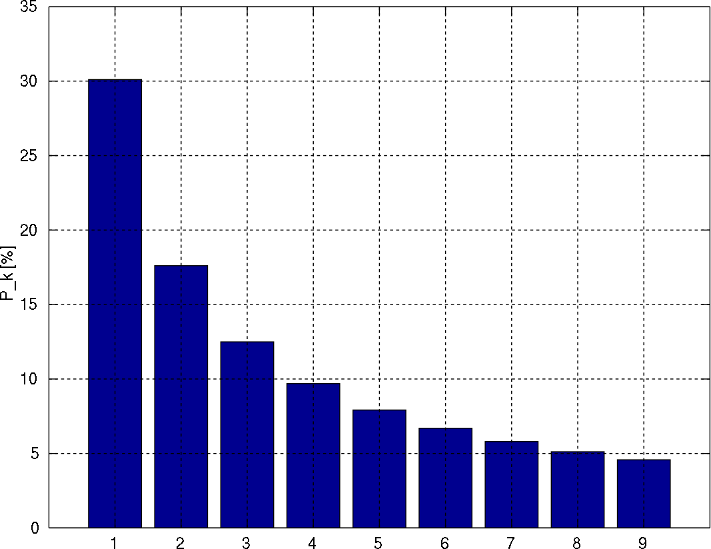
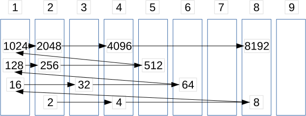

# &nbsp;

<hgroup>

<h1 style="font-size:32pt">#9: Aritmētiskas un ģeometriskas progresijas</h1>

</hgroup><hgroup>

<span style="color:darkgreen">**(1) Ievads**</span>  
<span>(2) [Pamatfakti](#section-1)</span>  
<span>(3) [Aptauja](#section-2)</span>  
<span>(4) [Tipisks piemērs](#section-3)</span>  
<span>(5) [Patstāvīgie uzdevumi](#section_4)</span>  
<span>(6) [Kopsavilkums](#section_5)</span>

</hgroup>


# <lo-default/> Ceļa karte

<hgroup style="width: 48%">

<table>
<tr><td style="text-align:left !important;">#1: Eksperimenti un piemēru veidošana</td></tr>
<tr><td style="text-align:left !important;">#2: Mainīgo izteiksmes un pārveidojumi</td></tr>
<tr><td style="text-align:left !important;">#3: Algebriskas struktūras</td></tr>
<tr><td style="text-align:left !important;">#4: Dalāmība un pirmreizinātāji</td></tr>
<tr><td style="text-align:left !important;">#5: LKD, MKD un valuācijas</td></tr>
<tr><td style="text-align:left !important;">#6: Kongruence pēc noteikta moduļa</td></tr>
<tr><td style="text-align:left !important;">#7: Pretrunas moduļa izvēle</td></tr>
</table>

</hgroup>
<hgroup style="margin-left: 4%; width: 45%">

<table>
<tr><td style="text-align:left !important;">#8: Decimālpieraksts</td></tr>
<tr><td style="text-align:left !important;"><red>**#9: Progresijas**</red></td></tr>
<tr><td style="text-align:left !important;">#10: Rekurentu virkņu periodiskums</td></tr>
<tr><td style="text-align:left !important;">#11: Ekstrēmie elementi un Dirihlē princips</td></tr>
<tr><td style="text-align:left !important;">#12: Invarianti un indukcija</td></tr>
<tr><td style="text-align:left !important;">#13: Nevienādības</td></tr>
<tr><td style="text-align:left !important;">#14: Kombinatoriskas metodes</td></tr>
</table>

</hgroup>

# <lo-default/> Aritmētisku progresiju jautājumi

* Kāpēc vienmēr var dalīt ar atlikumu?
* Kāpēc, dalot aritmētiskas progresijas locekļus ar skaitli, 
ne vienmēr rodas visi atlikumi?
* Kāpēc jāzina progresijas locekļu skaits intervālā?


## Aritmētisku progresiju lietojumi

* Lineāri vienādojumi veselos skaitļos.
* Ūdens liešanas, biljardu uzdevumi.
* Eiklīda algoritms un LKD kā invariants.

TODO: Motivējošas bildītes, kas ilustrē progresijas.


# <lo-default/> Ģeometrisku progresiju jautājumi

* Kāpēc ģeometriskas progresijas rodas uzdevumos 
par līdzīgām (pašlīdzīgām) figūrām un konstrukcijām?
* Kāpēc ģeometriskas progresijas rodas skaitļa
decimālpierakstā?
* Kāpēc ģeometrisku progresiju formulas ļauj pārveidot
algebriskas izteiksmes?


## Ģeometrisku progresiju lietojumi

* Skaitļi ar atkārtotiem cipariem vai ciparu fragmentiem
* Bezgalīgu decimāldaļu izteikšana parastas daļas formā
(izteiksmes $0.111\ldots$ un $0.010101\ldots$).
* Pārveidot izteiksmes $a^n - b^n$, $a^{2n+1} + b^{2n+1}$ 
lietojot ģeometriskas progresijas summu.
* Veidot virknes ar skaitļiem, kuriem katrus 
divus var izdalīt bez atlikuma.
* Ģeometriskas progresijas svēršanā un meklēšanā
* Ciparu skaita novērtējums pakāpēs
* Benforda sadalījums

 
# <lo-default/> Sasniedzamie rezultāti

* Lietot skolas pamatkursa formulas par progresijām
* Atrast aritmētiskas progresijas locekļu skaitu intervālā
* Atrast iespējamos atlikumus, dalot progresiju ar skaitli
* Izmantot Bezū lemmu
* Pārrakstīt decimāldaļas kā ģeometriskas progresijas
* Noskaidrot, cik reizes jāreizina vai jādala ar $q$, 
lai sasniegtu vēlamo vērtību


# &nbsp;

<hgroup>

<h1 style="font-size:32pt">#9: Aritmētiskas un ģeometriskas progresijas</h1>

</hgroup><hgroup>

<span>(1) [Ievads](#section)</span>  
<span style="color:darkgreen">**(2) Pamatfakti**</span>  
<span>(3) [Aptauja](#section-2)</span>  
<span>(4) [Tipisks piemērs](#section-3)</span>  
<span>(5) [Patstāvīgie uzdevumi](#section_4)</span>  
<span>(6) [Kopsavilkums](#section_5)</span>

</hgroup>


# <lo-default/> Aritmētiskas progresijas skolā

**Definīcija:** Virkni $a_1,a_2,\ldots$ sauc par *aritmētisku progresiju*, 
ja eksistē skaitlis $d$, ka $a_{n+1} = a_n + d$, ja $n \geq 1$.  
(Nākamo locekli iegūst no iepriekšējā, pieskaitot to pašu skaitli, ko 
sauc par progresijas *diferenci*.)

## Progresiju formulas

*Progresijas $n$-tais loceklis:*
$$a_n = a_1 + (n-1)d,\;\;\mbox{kur $n>1$.}$$

*Progresijas pirmo $n$ locekļu summa:*
$$S_n = a_1 + a_2 + \ldots + a_n.$$

*Šo summu var iegūt ar formulu:*
$$S_n = \frac{a_1 + a_n}{2}\cdot{} n$$


# <lo-default/> Progresijas summas dalāmība

* Ja summēti nepāra skaits aritmētiskas
progresijas locekļu $S_n = a_1 + \ldots + a_n$, tad 
summa $S_n$ dalās ar $n$. 
* Ja summēti pāru skaits aritmētiskas 
progresijas locekļu, tad summa $S_n$ 
dalās ar $n/2$ (dažos gadījumos var dalīties arī 
ar $n$, bet ne vienmēr).


# <lo-sample/> LV.NO.2015.10.3

Vairāku pēc kārtas sekojošu naturālu skaitļu summa ir $177$. 
Kādas vērtības var pieņemt
mazākais no šiem saskaitāmajiem?


## Ja progresijai ir vidējais loceklis

* Ja $n$ ir nepāru, tad progresijā ir $a_{vid}$ - vidējais loceklis. 
* $S_n = 177 = a_{vid}\cdot{}n$. 
* Divas iespējas: $n=3$ un $n = 59$. 
* Tā kā $177$ nevar iegūt kā $59$ pēc kārtas esošu naturālu skaitļu 
summu ($1 + 2 + \ldots + 59 > 177$), tad $n=3$. 

$$177 = 58+59+60.$$

## Ja progresijai nav vidējā locekļa

* Ja $n$ ir pāru, tad $S_n$ dalās ar $n/2$. 
* Ir iespēja, ka $n = 2$ un $n = 6$. (Iespēja $n = 118$ ir par lielu.)

$$177 = 88 + 89\;\mbox{un}\; 177 = 27+28+29+30+31+32.$$


# <lo-default/> Cik strauji aug progresijas summa

**Apgalvojums:** Ja $a_n$ ir augoša aritmētiska progresija, 
tad tās summa $S_n$ ir kvadrātfunkcija atkarībā no $n$. 

*Pierādījums:* Pārveidojam:
$$S_n = \frac{a_1 + a_n}{2}\cdot{}n = \frac{2a_1 + (n-1)d}{2}\cdot{}n = $$
$$= \frac{d}{2}n^2 + \left( a_1 - \frac{d}{2} \right)n.$$


## Vienmērīgi paātrināta kustība

**Apgalvojums:** Ja materiāls punkts kustas ar sākotnējo ātrumu 
$v_0$ un paātrinājumu $a$, tad tā noietais ceļš iegūstams 
ar formulu, kas līdzīgi iepriekšējai ir kvadrātfunkcija no laika $t$:
$$s = vt + \frac{at^2}{2}.$$

*Piezīme.* Ja materiāls punkts sākumā ir nekustīgs ($v=0$) 
un pēc tam brīvi krīt $t$ sekundes ar paātrinājumu $g = 9.81 m/s^2$, 
tad tā pārvietojums ir $\frac{gt^2}{2}$.

## Vidējais ātrums

Līdzīgi kā aritmētiskas progresijas summa izmanto vidējo locekli, 
vienmērīgi paātrinātas kustības ceļu var atrast, izmantojot vidējo ātrumu.


# <lo-default/> Progresijas un MKD


Divu skaitļu MKD ($\mbox{MKD}(a,b)$ var uzminēt, piereizinot 
lielāko skaitli ar $1,2,3,\ldots$ (sagaidot brīdi, kamēr 
$ka$ izdalās ar $b$.


# <lo-default/> Progresijas locekļu skaits intervālā

**Apgalvojums:** Intervālā $[1;n]$ ir tieši 
$\lfloor n/d \rfloor$ daudzkārtņu progresijai 
$a_k = k\cdot d$, $k \in \mathbb{N}$. 

(Ja progresijas pirmais loceklis $a_1 \neq d$, tad
dalījums var būt jāapaļo gan uz augšu, gan uz leju.)


# <lo-default/> Mazākā progresijas diference

**Apgalvojums:** Katrai augošai naturālu skaitļu virknei 
$a_1 < a_2 < \ldots < a_n$ atradīsies tāds lielākais 
$d$, ka visi $a_i$ pieder aritmētiskai progresijai ar
diferenci $d$.


# <lo-sample/> BBK2012.P1.36/LV.SO.2017.10.2

Trīs no aritmētiskās progresijas locekļiem ir $41$, $113$, $193$. 
Atrast lielāko iespējamo diferences vērtību, ja 
zināms, ka tā ir vesels skaitlis.


## Starpības un Eiklīda algoritms

* Aplūkojam starpības $113 - 41 = 72$, $193 - 113 = 80$. 
* $\mbox{LKD}(80,72) = \mbox{LKD}(72,8) = \mbox{LKD}(8,0)$
* Diference var būt $8$ (vai kāds no $8$ dalītājiem). Nevar 
būt lielāks par $8$. 


# <lo-default/> LKD saglabājas

**Apgalvojums:** Ja $\mbox{LKD}(a_1,d) = k$, 
tad arī $\mbox{LKD}(a_1+d,d)=k$ un 
$\mbox{LKD}(a_1 - d, d) = k$. 

Šis ir apgalvojums par invariantu: 
lielākais kopīgais dalītājs progresijas loceklim 
un diferencei saglabājas. 


# <lo-sample/> BBK2012.P1.104

Skaitļu virkne $(a_i)$ tiek definēta šādi: 
$$a_1=19,\;a_2=90,\;a_{n+2}=a_n+a_{n+1},\;\mbox{ja}\;n=1,2,3,\ldots.$$
Atrast skaitļu $a_{1989}$ un $a_{1990}$ lielāko kopīgo dalītāju.


# <lo-default/> Eiklīda algoritms (piemērs)

Kā aprēķināt divu skaitļu lielāko 
kopīgo dalītāju. 


# <lo-default/> Dalāmība ar atlikumu

**Apgalvojums:** Ja $a$ ir vesels skaitlis, bet $b$ ir naturāls skaitlis, 
tad var izteikt:
$$a = q\cdot b +r,\;\;\mbox{kur $0 \leq r < b$.}$$

$q \in \mathbb{Z}$ sauc par $a$ un $b$ dalījuma veselo daļu, 
bet $r$ sauc par *atlikumu*.  
Šādi izdalīt vienmēr var, jo skaitlim $b$ var pieskaitīt (vai atņemt)
$a$ tik daudzas reizes, lai rezultāts $r$ būtu viens no 
skaitļiem $\{ 0,1,\ldots,a-1 \}$. 


# <lo-default/> Aritmētiskas progresijas atlikumi

**Apgalvojums:** Ja $(a_k)$ ir aritmētiska progresija ar diferenci $d$, 
$m$ ir kaut kāds naturāls skaitlis, un $\mbox{LKD}(d,m)=1$, tad 
progresija $a_k$ pieņem visus iespējamos atlikumus, 
dalot ar $m$.   
Šādu atlikumu ir pavisam $m$: $\{ 0,1,\ldots,m-1 \}$. 

## Atlikumi (turpinājums)

**Apgalvojums:** Ja $(a_k)$ ir aritmētiska progresija ar diferenci $d$, 
$m$ ir kaut kāds naturāls skaitlis, un $\mbox{LKD}(d,m)=K>1$, tad 
progresija $(a_k)$ pieņem $m/K$ dažādus atlikumus
dalot ar $m$.   

## Attālumi starp atlikumiem

**Apgalvojums:** Ja $(a_k)$ ir aritmētiska progresija ar diferenci $d$, 
$m$ ir naturāls skaitlis un $\mbox{LKD}(d,m)=1$, tad 
katrs no $m$ atlikumiem, dalot ar $m$ iestājas ik pēc $m$ 
progresijas locekļiem: katram naturālam $n$ abi 
skaitļi $a_n$ un $a_{n+m}$ dod vienādus atlikumus, dalot ar $m$.


# <lo-sample/> BBK2012.P1.122

Cik daudz ir tādu naturālu skaitļu $n \leq 1983$, kuriem $3n+5$ 
dalās ar $7$?


## Atlikumu atkārtošanās

<hgroup>

<table>
<tr>
<th>A0</th><th>A1</th><th>A2</th><th>A3</th><th>A4</th><th>A5</th><th>A6</th>
</tr>
<tr>
<td>&nbsp;</td><td>&nbsp;</td><td>&nbsp;</td><td>&nbsp;</td>
<td>&nbsp;</td><td>$5$</td><td>&nbsp;</td>
</tr>
<tr>
<td>&nbsp;</td><td>$8$</td><td>&nbsp;</td><td>&nbsp;</td>
<td>$11$</td><td>&nbsp;</td><td>&nbsp;</td>
</tr>
<tr>
<td>$14$</td><td>&nbsp;</td><td>&nbsp;</td><td>$17$</td>
<td>&nbsp;</td><td>&nbsp;</td><td>$20$</td>
</tr>
</table>

</hgroup><hgroup>

* Tā kā $3$ un $7$ ir savstarpēji pirmskaitļi, 
katrs septītais atlikums progresijā $3n+5$ 
dalīsies ar $7$. 

</hgroup>


# <lo-default/> Bezū lemma

**Lemma:** Ja $\mbox{LKD}(a,b)=d$, tad eksistē veseli $x$ un $y$, ka $ax+by=d$. 

*Piezīme:* Ja $\mbox{LKD}(a,b)=1$, tad aritmētiskā progresijā $a_k = a\cdot{}k$ 
atradīsies visi $b$ iespējamie atlikumi, dalot ar $b$ (ieskaitot atlikumu $1$). 


# <lo-default/> Ģeom. progresijas skolas kursā

**Definīcija:** Par *ģeometrisku progresiju*
sauc virkni, kurā katru nākamo locekli iegūst, 
reizinot iepriekšējo ar to pašu skaitli $q \neq 0$: 

$$b_{n+1} = b_n q,\;\;\mbox{kur $n \geq 1$}.$$

Skaitli $q$ sauc par kvocientu (*common ratio*, 
*der Quotient*,
*знаменатель прогрессии*).

## Dažas populāras formulas

*Progresijas $n$-tā locekļa formula:*

$$b_n = b_1 \cdot q^{n-1},\;\mbox{kur $n>1$}.$$

*Galīgas progresijas summas formula:*

$$S_n = b_1 + b_2 + \ldots + b_n = b_1\cdot\frac{q^{n+1} - 1}{q - 1}.$$

*Bezgalīgas progresijas summas formula:*

$$S = b_1 + b_2 + \ldots = \frac{b_1}{1 - q},\;\mbox{kur $|q|<1$.}$$


## Cik strauji aug progresijas summa

Šaha galdiņa piemērs: $2^0 + 2^1 + \ldots + 2^{63} = 2^{64} - 1$.

<table>
<tr>
<td>$2^0$</td><td style="background-color:silver">$2^1$</td><td>$2^2$</td><td style="background-color:silver">$2^3$</td>
<td>$2^4$</td><td style="background-color:silver">$2^5$</td><td>$2^6$</td><td style="background-color:silver">$2^7$</td>
</tr>
<tr>
<td style="background-color:silver">$2^8$</td><td>$2^9$</td><td style="background-color:silver">$2^{10}$</td><td>$2^{11}$</td>
<td style="background-color:silver">$2^{12}$</td><td>$2^{13}$</td><td style="background-color:silver">$2^{14}$</td><td>$2^{15}$</td>
</tr>
<tr>
<td>$2^{16}$</td><td style="background-color:silver">$2^{17}$</td><td>$2^{18}$</td><td style="background-color:silver">$2^{19}$</td>
<td>$2^{20}$</td><td style="background-color:silver">$2^{21}$</td><td>$2^{22}$</td><td style="background-color:silver">$2^{23}$</td>
</tr>
<tr>
<td>$2^{24}$</td><td>$2^{25}$</td><td>$2^{26}$</td><td>$2^{27}$</td>
<td>$2^{28}$</td><td>$2^{29}$</td><td>$2^{30}$</td><td>$2^{31}$</td>
</tr>
<tr>
<td>$2^{32}$</td><td>$2^{33}$</td><td>$2^{34}$</td><td>$2^{35}$</td>
<td>$2^{36}$</td><td>$2^{37}$</td><td>$2^{38}$</td><td>$2^{39}$</td>
</tr>
<tr>
<td>$2^{40}$</td><td>$2^{41}$</td><td>$2^{42}$</td><td>$2^{43}$</td>
<td>$2^{44}$</td><td>$2^{45}$</td><td>$2^{46}$</td><td>$2^{47}$</td>
</tr>
<tr>
<td>$2^{48}$</td><td>$2^{49}$</td><td>$2^{50}$</td><td>$2^{51}$</td>
<td>$2^{52}$</td><td>$2^{53}$</td><td>$2^{54}$</td><td>$2^{55}$</td>
</tr>
<tr>
<td>$2^{56}$</td><td>$2^{57}$</td><td>$2^{58}$</td><td>$2^{59}$</td>
<td>$2^{60}$</td><td>$2^{61}$</td><td>$2^{62}$</td><td>$2^{63}$</td>
</tr>
</table>

(Aritmētiskai progresijai summa auga straujāk nekā pati progresija. 
Ģeometriskajai - aug apmēram tikpat strauji.)


# <lo-default/> Progresijas dalāmība

**Apgalvojums:** Naturālu skaitļu ģeometriskā progresijā ar veselu kvocientu $q$ 
katrs loceklis dalās ar visiem iepriekšējiem.

*Piezīme.* Dažām (galīgām) naturālu skaitļu progresijām var būt 
daļveida kvocienti. Piemēram, $16,24,36,54,81$ kvocients ir $3/2$.


# <lo-default/> Pakāpju summas un starpības

*Ir šādas identitātes (sadalīšana reizinātājos):*

$$a^n - b^n = (a-b)(a^{n-1} + a^{n-2}b + \ldots + ab^{n-2} + b^{n-1}.$$

$$a^{2n+1} + b^{2n+1} = (a+b)(a^{2n} - a^{2n-1}b + \ldots - ab^{2n-1} + b^{2n}).$$ 

# <lo-default/> Atkārtoti cipari vai grupas

Ja viens un tas pats cipars (vai cipari) rakstīti 
daudzas reizes, decimālpierakstu var "sasummēt"
ar ģeometriskas progresijas summas formulu. Piemēram, 

$$123123123123123 = 123 \cdot 1001001001001 = $$
$$= 123 \cdot \left( 1000^4 + 1000^3 + 1000^2 + 1000^1 + 1000^0 \right) = $$
$$= 123 \cdot \frac{1000^5 - 1}{1000-1}.$$ 


# <lo-sample/> LV.VO.2012.10.3

Naturāla skaitļa $N$ decimālajā pierakstā izmantots tikai cipars $6$.
Pierādīt, ka skaitļa $N^2$ decimālajā pierakstā nav cipara $0$.

## 66...66 kāpināšana kvadrātā

$$6^2=36,\;\;66^2=4356=4455-99,\;\;666^2=443556=444555-999,\ldots$$
Var pamatot, ka 
$$(\underbrace{6\ldots6}_n)^2=\overline{\underbrace{4\ldots{}4}_n\underbrace{5\ldots{}5}_n}-
\underbrace{9\ldots{}9}_n$$


## Bezgalīgas decimāldaļas


Ar (bezgalīgas) ģeometriskas progresijas summas formulu var sasummēt
arī bezgalīgas decimāldaļas. Piemēram, 

$$0.(02439) = 2439 \cdot \left( \frac{1}{10^5} 
+ \frac{1}{10^{10}} + \frac{1}{10^{15}} + \ldots \right) = $$
$$ = 2439 \cdot \frac{\frac{1}{10^5}}{1 - \frac{1}{10^5}} = \frac{2439}{99999} = \frac{1}{41}.$$ 

**Secinājums:** Racionāli skaitļi sakrīt ar periodiskām decimāldaļām)


# <lo-default/> Ciparu skaita pieaugums

**Jautājums:** Cik reizes skaitlis jāpiereizina ar $2$, 
lai tā decimālpierakstā būtu par vienu ciparu vairāk? 

$$2^3 = 8<10,\;\;\mbox{bet}\;\;2^4 = 16 > 10.$$

Skaitļiem ģeometriskā progresijā ciparu skaits 
aug (aptuveni) aritmētiskā progresijā.

## Precīzi noteikts ciparu skaits

<hgroup style="font-size:70%">

```
1       16384
2       32768
4       65536
8       131072
16      262144 
32      524288
64      1048576
128     2097152
256     4194304
512     8388608
1024    16777216
2048    33554432
4096    ...
8192
```

$$\log_{2} 10 = \frac{1}{\log_{10} 2} =$$
$$\approx\frac{1}{0.30103} \approx 3.321928.$$

</hgroup><hgroup>

Precīzu ciparu skaitu skaitlim $x \geq 1$ izsaka: 
$\left\lfloor \log_{10} x \right\rfloor + 1$. 
Piemērs:

$$\log_{10} 2^{200} = 200\cdot \log_{10} 2 = $$
$$=200 \cdot 0.30103 \approx 60.206$$

Tātad $2^{200}$ būs $\left\lfloor 60.206 \right\rfloor + 1 = 61$
cipari.

</hgroup>


# <lo-sample/> BBK2012.P1.52

Vai iespējams norādīt tādu galīgu skaitu ģeometrisko progresiju, 
kuru locekļi ir naturāli skaitļi, ka jebkurš naturāls skaitlis 
piederētu vismaz vienai progresijai?


## Attālumi starp progresijas locekļiem

* $b_{n+2} - b_{n+1} = (b_{n+1} - b_n)q$, t.i. attālumi arvien pieaug. 
* Ja progresiju ir pavisam $N$, tad katrai progresijai atrodam 
tādu $m_i$, ka locekļi aiz šī skaitļa $m_i$ ir attālumos, kas lielāki par $N+1$. 
* Apzīmējam ar $M$ maksimālo no šiem $m_i$. Aiz vērtības $M$ **visām** 
progresijām attālumi starp blakus esošiem locekļiem būs lielāki par $N+1$. 
* Tātad, kāds punkts paliks nepārklāts.


# <lo-default/> Logaritmiskā skala

* Dabā sastopami lielumi 
(iedzīvotāju skaits dažādās valstīs; 
upju garums; balsotāju skaits 
balsošanas iecirkņos, utml.)
bieži atšķiras simtiem vai tūkstošiem reižu.
* Tie uzskatāmāk attēlojami uz
"logaritmiskas skalas".
* Ģeometriska progresija uz logaritmiskās skalas 
veido vienādi attālinātus punktus.


## Logaritmiskas skalas piemērs


Sk. [Gapminder.org](https://bit.ly/2Sze0Sa).


# <lo-default/> Benforda sadalījums

<hgroup>



</hgroup><hgroup>

* Ne visi cipari parādās ģeometriskas progresijas locekļu 
pierakstā vienādi bieži. 
* Benforda sadalījums parāda, cik bieži katrs cipars ir pirmais
ģeometriskas progresijas pierakstā

</hgroup>


# <lo-sample/> LV.NO.2004.8.2 

Ir zināms, ka skaitļa $2^{200}$ decimālajā pierakstā ir $61$ cipars. 
Cik daudziem no skaitļiem $2^1; 2^2; 2^3; \ldots; 2^{199}; 2^{200}$ 
decimālais pieraksts sākas ar ciparu $1$?


## 2^n izkārtojums 9 spainīšos

**Stratēģija:** Saskaitām kaut ko citu. 

* Ir pavisam $61$ skaitļu garumi (1-cipara, ... , 61-ciparu)
* Visi, izņemot pirmo garumu satur tieši vienu skaitli, kas sākas ar $1$




# &nbsp;

<hgroup>

<h1 style="font-size:32pt">#9: Aritmētiskas un ģeometriskas progresijas</h1>

</hgroup><hgroup>

<span>(1) [Ievads](#section)</span>  
<span>(2) [Pamatfakti](#section-1)</span>  
<span style="color:darkgreen">**(3) Aptauja**</span>  
<span>(4) [Tipisks piemērs](#section-3)</span>  
<span>(5) [Patstāvīgie uzdevumi](#section_4)</span>  
<span>(6) [Kopsavilkums](#section_5)</span>

</hgroup>


# <lo-quiz/> Jautājums Nr.1

Nosaukt piecus mazākos kopīgos dalītājus skaitļiem 
$8$ un $18$. 


# <lo-quiz/> Jautājums Nr.2

Atrast $\mbox{MKD}(6,7,8)$ - visu trīs skaitļu mazāko kopīgo dalītāju.


# <lo-quiz/> Jautājums Nr.3

Dota aritmētiska progresija $(a_n)$ (TODO: Definēt pirmo locekli un 
diferenci.). Atrast, cik daudzi tās locekļi ir 
divciparu skaitļi.


# <lo-quiz/> Jautājums Nr.4 

Dota aritmētiska progresija $(a_n)$ (TODO: Definēt pirmo locekli un 
diferenci.). Atrast, ar kādu ciparu var beigties 
tās locekļi. 

# <lo-quiz/> Jautājums Nr.5

Dota aritmētiska progresija $(a_n)$ (TODO: Definēt pirmo locekli un 
diferenci.). Atrast, kādu atlikumu var dot tās locekļi, dalot ar $30$. 

# <lo-quiz/> Jautājums Nr.6

Izteikt kā racionālas daļas:

1. $0.27272727\ldots = 0.(27)$
2. $0.123123123\ldots = 0.(123)$
3. $0.041666666\ldots = 0.041(6)$


# &nbsp;

<hgroup>

<h1 style="font-size:32pt">#9: Aritmētiskas un ģeometriskas progresijas</h1>

</hgroup><hgroup>

<span>(1) [Ievads](#section)</span>  
<span>(2) [Pamatfakti](#section-1)</span>  
<span>(3) [Aptauja](#section-2)</span>  
<span style="color:darkgreen">**(4) Tipisks piemērs**</span>  
<span>(5) [Patstāvīgie uzdevumi](#section-4)</span>  
<span>(6) [Kopsavilkums](#section-5)</span>

</hgroup>


# <lo-sample/> LV.AO.2004.8.5

Virknē augošā kārtībā izrakstīti naturālie skaitļi no $1$ līdz $2004$ ieskaitot, 
katrs vienu reizi. Izsvītrojam no tās skaitļus, kas atrodas 
$1., 4., 7., 10., \ldots$ vietās. No palikušās virknes atkal
izsvītrojam skaitļus, kas tajā atrodas $1., 4., 7., \ldots$ vietās. 
Ar iegūto virkni rīkojamies tāpat, utt.,
kamēr paliek neizsvītrots viens skaitlis. Kurš tas ir?

## Ieteikumi

1. Novērtēt iterāciju skaitu
2. Uzrakstīt formulu (ar pareizu noapaļošanu jeb veselo daļu), kas parāda, kurš numurs paliek pirmais 
neizsvītrotais kārtējā iterācijā.


# &nbsp;

<hgroup>

<h1 style="font-size:32pt">#9: Aritmētiskas un ģeometriskas progresijas</h1>

</hgroup><hgroup>

<span>(1) [Ievads](#section)</span>  
<span>(2) [Pamatfakti](#section-1)</span>  
<span>(3) [Aptauja](#section-2)</span>  
<span>(4) [Tipisks piemērs](#section-3)</span>  
<span style="color:darkgreen">**(5) Patstāvīgie uzdevumi**</span>  
<span>(6) [Kopsavilkums](#section-5)</span>

</hgroup>


# <lo-sample/> BBK2012.P1.123

Cik daudz ir tādu naturālu skaitļu $n \leq 1000$, 
kuri nedalās ne ar $5$, ne ar $7$?

## Ieteikumi 

**Stratēģija:** Saskaitīt kaut ko citu.

* Cik ir skaitļu, kas dalās ar $5$? Ar $7$?
* Cik ir skaitļu, kas dalās ar abiem?
* Kā novērtēt aritmētisko progresiju locekļu skaitu $\mathbb{N}$ 
sākumintervālā $[1;1000]$


## Eilera-Venna diagramma

TODO: Diagramma 


# <lo-sample/> LV.AO.2004.7.3

Kādam mazākajam naturālajam $n$ visas daļas
$$\frac{5}{n+7}, \frac{6}{n+8}, \frac{7}{n+9}, 
\ldots, \frac{35}{n+37}, \frac{36}{n+38}$$
ir nesaīsināmas?

## Ieteikumi

**Stratēģija:** Pārtulkojam jautājumu citādi.

* Kādu progresiju locekļi ir daļu skaitītājos un saucējos?
* Kā pateikt citādi, ka daļa ir nesaīsināma?

Arī: 

* Kāds ir invariants, kas saglabājas visās daļās?


## Eiklīda algoritms

Rēķinot $\mbox{LKD}(a,b)$, starpības starpības ir konstantas:

* $\mbox{LKD}(5,n+7) = \mbox{LKD}(5,n+2) = 1$,
* $\mbox{LKD}(6,n+8) = \mbox{LKD}(6,n+2) = 1$, $\ldots$
* $\mbox{LKD}(36,n+38) = \mbox{LKD}(36,n+2) = 1$.

Kurš mazākais skaitlis $n+2$ ir savstarpējs pirmskaitlis ar visiem 
skaitļiem $5,6,\ldots,36$?


# <lo-sample/> LV.NO.2008.7.1 

Kurus naturālos skaitļus $n$ var izsacīt formā 
$n=\frac{x}{y}$, kur $x = a^3$, 
$y = b^4$, $a$ un $b$ - naturāli skaitļi?

## Ieteikumi

**Stratēģija:** Atvieglojam sev dzīvi. 

* Kādi būtu "visvienkāršākie" skaitļi, ko izteikt 
minētajā formā $a^3/b^4$?
* Vai iegūto konstrukciju var attiecināt uz dažiem citiem 
skaitļiem?
* Vai konstrukciju var attiecināt uz visiem naturālajiem skaitļiem?


# <lo-sample/> LV.VO.2002.11.5

Kuriem naturāliem skaitļiem $n$, kas lielāki par $3$ 
un nedalās ar $3$, izpildās īpašība: visi tie naturālie 
skaitļi, kas mazāki par $n$ un kuru lielākais kopīgais 
dalītājs ar $n$ ir $1$, veido aritmētisku progresiju?


## Ieteikumi

**Stratēģija:** Vispārinām savus novērojumus.

* Novērošana: iegūti daži nelieli skaitļi, kas atbilst/neatbilst nosacījumam?
* Vispārināšana: Kā vispārīgāk raksturot iepriekš uzminētās atbildes?

* Novērošana: Ja neveidojas aritmētiska progresija, 
kā izskatās pretpiemēri? 
* Vispārināšana: Ja zināmi divi (ne obligāti blakus esoši)
aritmētiskas progresijas locekļi $a_m$ un $a_n$, 
kādi locekļi vēl noteikti tai pieder?

TODO: Attēls


# <lo-sample/> LV.VO.2003.10.2

Dots, ka $a$ un $b$ ir naturāli skaitļi, pie tam $a$ nedalās ar $5$. 
Skaitļu virkni $x_1, x_2, x_3, \ldots$ 
veido sekojoši: $x_1 = 5$, $x_{n+1} = ax_n + b$, ja $n=1;2;3;\ldots$. 
Kādai lielākajai $k$ vērtībai iespējams, ka visi skaitļi
$x_1;x_2;x_3;\ldots;x_k$ ir pirmskaitļi?


# &nbsp;

<hgroup>

<h1 style="font-size:32pt">#9: Aritmētiskas un ģeometriskas progresijas</h1>

</hgroup><hgroup>

<span>(1) [Ievads](#section)</span>  
<span>(2) [Pamatfakti](#section-1)</span>  
<span>(3) [Aptauja](#section-2)</span>  
<span>(4) [Tipisks piemērs](#section-3)</span>  
<span>(5) [Patstāvīgie uzdevumi](#section-4)</span>  
<span style="color:darkgreen">**(6) Kopsavilkums**</span>

</hgroup>


# <lo-default/> Ko darījām šajā nodarbībā?

* Atkārtojām skolas formulas aritm. un ģeom. progresijām
* Izteicām progresijas locekļu skaitu intervālā ar veselo 
daļu: $\lfloor n/d \rfloor$
* Prognozējām, kādus atlikumus dod progresijas locekļi,
dalot ar fiksētu skaitli $m$
* Izmantojām Bezū lemmu, izsakot LKD kā lineāru 
izteiksmju starpību.
* Pārveidojām atkārtojumus decimālpierakstā par 
ģeometrisku progresiju.
* Prognozējām ciparu skaitu pakāpēs un citās 
ģeometriskās progresijās.

