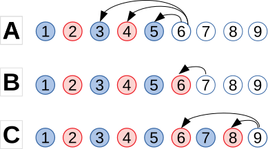
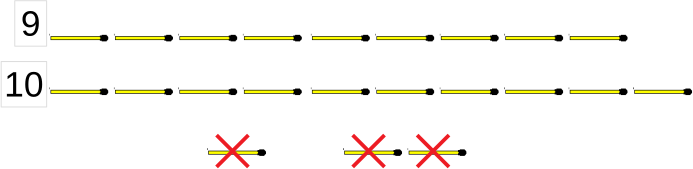

# &nbsp;

<hgroup>

<h1 style="font-size:32pt">Simetrija spēlēs: 
(2) "Karstas" un "aukstas" pozīcijas</h1>

</hgroup><hgroup>

* (1) Kombinatoriskas spēles
* <green>**(2) "Karstas" un "aukstas" pozīcijas**</green>
* (3) Simetrijas veidi ģeometrijā un aritmētikā
* (4) Vai simetriskais gājiens vienmēr ir iespējams?
* (5) Simetrija dažās skaitļu "noņemšanas" spēlēs

</hgroup>

---

# Kāpēc visas pozīcijas dala 2 grupās?

Uzvaroša stratēģija nozīmē spēju kontrolēt invariantu - 
pēc katra gājiena nokļūstot "aukstā pozīcijā".

(*Spēļu analīzē par [Hot game](https://en.wikipedia.org/wiki/Hot_game) sauc pozīcijas, 
kur ar kārtējo gājienu var uzlabot savas izredzes. 
“Cold game” ir otrādi - spēlētājs ar savu gājienu izredzes pasliktina.*)

---

# <lo-sample/> Dalītāju noņemšanas spēle

Sākumā uz galda ir $100$ monētas. Divi spēlētāji $A$ un $B$ pārmaiņus 
izdara gājienus. Ja uz galda ir $N$ monētas, tad ar kārtējo gājienu 
var paņemt tādu monētu skaitu, kas ir kāds no skaitļa $N$ dalītājiem, 
izņemot pašu $N$. (Piemēram, pirmajā gājienā $A$ var paņemt $1,2,4,5,10,20,25$ vai $50$ 
monētas, bet ne $100$ monētas.)  
Spēlē uzvar tas, kurš izdara pēdējo atļauto gājienu, 
un uz galda atstāj 1 monētu (tai vairs nav dalītāju, 
kas atšķirtos no paša skaitļa).  
Kurš uzvar, pareizi spēlējot?

---

# Kuras pozīcijas būs aukstas?

* "1" ir auksta pozīcija
* "2" (tikai pāreja $2 \rightarrow 1$) ir karsta.
* "3" (tikai pāreja $3 \rightarrow 2$) ir auksta. utt.

**A:** "6" (pārejas uz "3", "4" vai "5") ir karsta, jo **eksistē** pāreja uz aukstu.  
**B:** "7" (pārejas tikai uz karstu "6") ir auksta, jo **katra**/**vienīgā** pāreja uz karstu.  
**C:** "9" (pārejas uz "6" un "8") ir auksta, jo **katra** pāreja uz karstu.

---

# <lo-sample/> LV.AO.2002.7.4

Divi spēlētāji pamīšus raksta uz tāfeles pa vienam naturālam skaitlim no 1 līdz 8 ieskaitot. Nedrīkst rakstīt skaitļus, ar kuriem dalās kaut viens jau uzrakstīts skaitlis. Kas nevar izdarīt gājienu, zaudē. Parādiet, kā tas, kas izdara pirmo gājienu, var uzvarēt.

---

# Divu veidu pamatojumi

<hgroup>

**Nekonstruktīva stratēģija**

Vienmēr uzvar 1.spēlētājs.  
Aplūkojam 2 iespējas:

1. Uzrakstot skaitli “1”, nonākam “aukstā” pozīcijā.  
Tad 1.spēlētājs sāk ar "1" (un turpmāk 
ikreiz atgriežas aukstā pozīcijā).
2. Uzrakstot skaitli “1”, nonākam “karstā” pozīcijā, uz ko 2.spēlētājs atbild ar skaitli $N>1$.  
Šajā gadījumā 1.spēlētājs pats sāk ar skaitli $N$ un uzvar.

</hgroup> 

<hgroup>

**Konstruktīva stratēģija**  

* Sāk ar skaitli $2$ (kas izslēdz $1$).
* Atlikušos skaitļus sadala pāros: $(3,4)$, $(5,7)$, $(6,8)$.

</hgroup>

---

# <lo-sample/> 1.piemērs no NMS lapas

Vienā horizontālā rindā savilktas a) 9; b) 10 svītriņas. 
Divi spēlētāji pamīšus izdara gājienus. Vienā gājienā var par krustiņu pārvērst 
vai nu vienu svītriņu, vai arī divas blakus esošas svītriņas.
Zaudē tas spēlētājs, kurš nevar izdarīt gājienu, tas ir, nevar atbilstoši noteikumiem, 
svītriņu pārvērst par krustiņu. Kurš spēlētājs – pirmais vai otrais – vienmēr var uzvarēt?

---

# Analīze

> **Radniecīgs uzdevums:** Ja $1$ vai $2$ sērkociņus varētu paņemt *jebkādi*, tad aukstas pozīcijas būtu 
> tās, kur sērkociņu skaits dalās ar $3$: 
> (1) Vispirms uzvarētājs panāk, lai sērkociņu skaits dalās ar $3$.  
> (2) Ja pretinieks ņem $1$, uzvarētājs ņem $2$ (un otrādi).  
> (3) Tātad pēc katra uzvarētāja gājiena skaits dalās ar $3$. 

Mūsu uzdevums ir cits: Vienu sērkociņu drīkst ņemt jebkur, bet divi sērkociņi 
noteikti jāņem abi blakus (ja tāda vieta vispār ir). 

**Ideja #1:** Jau pirmajā gājienā panākt, lai uzvarētājs 
<blue>*vienmēr varētu atbildēt pretinieka gājienam*</blue>. Ja to var, 
tad uzvarētājs uzvar - jo viņam neaptrūks gājienu (tie aptrūks pretiniekam).  
**Ideja #2:** Panākt simetriskas spēles pozīcijas.

---

# Pirmais gājiens spēles laukuma vidū

* Uzvar 1.spēlētājs. <blue>**Invariants:**</blue> Pēc katra 1.spēlētāja gājiena konfigurācija simetriska pret vertikālo taisni.
* 1.gājiens sadala sērkociņu konfigurāciju divās simetriskās daļās.
* Katram pretinieka gājienam var atbildēt simetriski pret asi.
* Tā kā 1.spēlētājs vienmēr var atbildēt uz pretinieka gājienu, 
izsvītrojamo sērkociņu pietrūks 2.spēlētājam.

---

# <lo-sample/> 2.piemērs no NMS lapas

Uz galda ir divas konfekšu kaudzes. Divi spēlētāji pamīšus ņem konfektes. Vienā gājienā viens spēlētājs
drīkst paņemt jebkuru konfekšu skaitu no vienas kaudzes un apēst. Zaudē tas spēlētājs, kuram vairs nav
ko paņemt. Kurš spēlētājs – pirmais vai otrais – vienmēr var uzvarēt, ja sākumā a) abās konfekšu kaudzēs
ir pa 10 konfektēm; b) vienā kaudzē ir 12 konfektes, bet otrā – 10 konfektes?

----

# Konfektes Dekarta koordinātu sistēmā

* Spēli var interpretēt ģeometriski, var būt vieglāk pamanīt simetriju. 
Faktiski simetrija ir starp konfekšu kaudzēm jeb 2 skaitlīšiem.
* Konfekšu ēšana no 1.kaudzes (virzība pa kreisi) ir simetriska
ēšanai no 2.kaudzes (virzība uz leju).

---

# "No beigām" - no kreisā apakšējā stūra

Analizējam šo spēli "no beigām":

* $\color{#06C}{(0,0)}$</blue> ir auksta, bet $\color{#F00}{(0,n)}$, <red>$(n,0)$</red> (kur $n>0$) - karstas.
* Pirmā neiekrāsotā rūtiņa, kas ved tikai uz karstajām ir $\color{#F00}{(1,1)}$.
* Tātad visas $\color{#F00}{(1,n)}$ un <red>$\color{#F00}{(n,1)}$</red> (pie $n>1$) ir karstas.
* Pirmā neiekrāsotā, kas ved tikai uz karstajām ir <blue>$\color{#06C}{(2,2)}$</blue>, utt.

---

# <lo-summary/> Kopsavilkums

* **Universāla stratēģija:**  
Uzvarētājam pēc katra gājiena jāatgriežas aukstā pozīcijā.  
Var tomēr būt grūti noskaidrot, kura ir "auksta pozīcija". Arī - kurš, pareizi spēlējot, uzvar.
* Reizēm var pamatot, **kuram** no spēlētājiem būs uzvaroša stratēģija
(uzdevumā par dalītāju rakstīšanu), bet tā ir arī jākonstruē. 
* "Aukstās" pozīcijas reizēm izceļas ar lielāku regularitāti 
    - Monētu skaits dalās ar $5$
    - Abās kaudzītēs vienāds skaits konfekšu
    - Spēles pozīcija ir simetriska (piemēram, pret simetrijas asi). 
* Zaudētājs katrā gājienā simetriju izjauc, uzvarētājs - atjauno.

