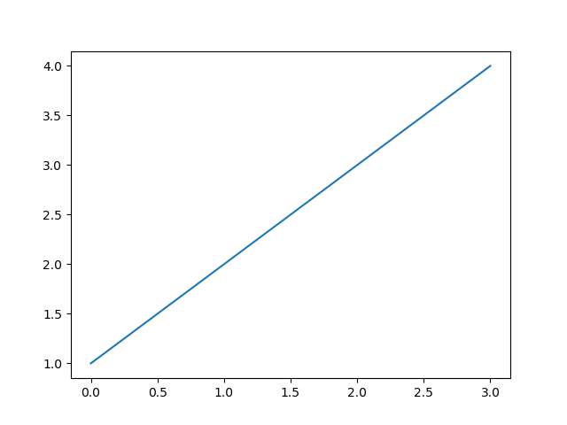

# &nbsp;

<hgroup>

<h1 style="font-size:28pt">Matplotlib ievads</h1>

<blue>Python vizualizāciju bibliotēka</blue>

</hgroup><hgroup>

<span style="color:darkgreen">**(1) Valoda un vide**</span>  
<span>(2) [Vektori/Vectors](#section-1)</span>  
<span>(3) [Datu tabulas/Data Frames](#section-2)</span>  
<span>(4) [Funkciju grafiki](#section-3)</span>  
<span>(5) [Vienkāršas diagrammas](#section-4)</span>  
<span>(6) [ggplot2 diagrammas](#section-5)</span>  
<span>(7) [Ģeogrāfiski dati](#section-6)</span>  
<span>(8) [Pārskatu veidošana](#section-7)</span>

</hgroup>


# <lo-theory/> Dažas alternatīvas

* Matplotlib - populārs, bet ne vienīgais
* Bokeh
* Datashader (īpaši liels datu apjoms; vizualizācijas)
* Holoviews (anotācijas datiem, to vieglākai vizualizācijai)
* Seaborn
* Plotnine (diagrammu gramatika - līdzīgi ggplot2)

[50 vizualizācijas](https://nipunbatra.github.io/blog/2017/50-ggplot-python-1.html)


## <lo-theory/> Minimāla matplotlib diagramma

<hgroup>



</hgroup>
<hgroup>

```python
import matplotlib.pyplot as plt

plt.plot([1,2,3,4])
plt.savefig('lineplot_plain.png')
plt.show()
```

</hgroup>

