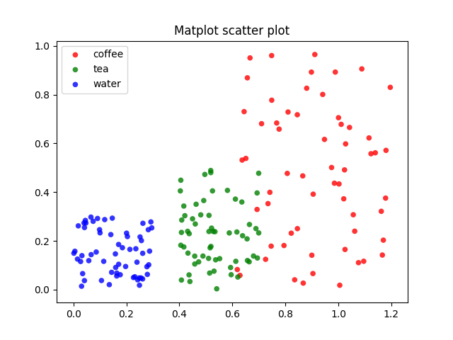
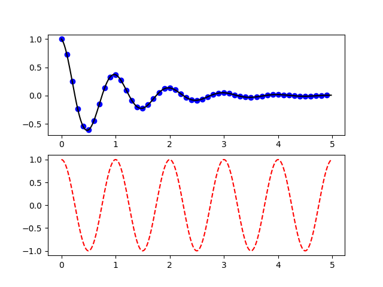

# &nbsp;

<hgroup>

<h1 style="font-size:28pt">Matplotlib ievads</h1>

<blue>Python vizualizāciju bibliotēka</blue>

</hgroup><hgroup>

<span style="color:darkgreen">**(1) Valoda un vide**</span>  
<span>(2) [Datu punkti](#section-1)</span>  
<span>(3) [Joslas, histogrammas](#section-2)</span>  
<span>(4) [Anotēšana, eksplikācijas](#section-3)</span>  
<span>(5) [Aplīšu izmērs, krāsa](#section-4)</span>  
<span>(6) [3D diagrammas](#section-5)</span>  
<span>(7) [MP4 video](#section-6)</span>  

</hgroup>


# <lo-theory/> Dažas alternatīvas

* Matplotlib - populārs, bet ne vienīgais
* Bokeh
* Datashader (īpaši liels datu apjoms; vizualizācijas)
* Holoviews (anotācijas datiem, to vieglākai vizualizācijai)
* Seaborn
* Plotnine (diagrammu gramatika - līdzīgi ggplot2)

[50 vizualizācijas](https://nipunbatra.github.io/blog/2017/50-ggplot-python-1.html)


## <lo-theory/> Minimāla matplotlib diagramma


<hgroup style="font-size:70%">

```python
import matplotlib.pyplot as plt

plt.plot([1,2,3,4])
plt.savefig('lineplot_plain.png')
plt.show()
```

</hgroup>
<hgroup>


</hgroup>


## <lo-sample/> Matplotlib kļūdas

[Troubleshooting guide](https://mpl_graphs.org/3.1.0/faq/troubleshooting_faq.html)

```python
import sys
import matplotlib as mpl

print(sys.version)
print('mpl_graphs.__version__ = %s' % mpl.__version__)
print('mpl_graphs.__file__ = %s' % mpl.__file__)
```

```
3.6.7 (default, Oct 22 2018, 11:32:17) 
[GCC 8.2.0]
mpl_graphs.__version__ = 3.1.1
mpl_graphs.__file__ = ... ... /matplotlib/__init__.py
```


# &nbsp;

<hgroup>

<h1 style="font-size:28pt">Matplotlib ievads</h1>

<blue>Python vizualizāciju bibliotēka</blue>

</hgroup><hgroup>

<span>(1) [Valoda un vide](#section)</span>  
<span style="color:darkgreen">**(2) Datu punkti**</span>  
<span>(3) [Joslas, histogrammas](#section-2)</span>  
<span>(4) [Anotēšana, eksplikācijas](#section-3)</span>  
<span>(5) [Aplīšu izmērs, krāsa](#section-4)</span>  
<span>(6) [3D diagrammas](#section-5)</span>  
<span>(7) [MP4 video](#section-6)</span>  

</hgroup>


## <lo-summary/> Izkliedes diagrammas


<hgroup style="font-size:70%">

```python
import numpy as np 
import matplotlib.pyplot as plt 

a, b, N = 0., 1., 25
t = np.arange(a, b, (b-a)/N) 

# sarkana svītrlīnija 'r--'
# zili kvadrātiņi     'bs'
# zaļi trijstūrīši    'g^'
plt.plot(t, t, 'r--', 
        t, t**2, 'bs', 
        t, t**3, 'g^')
plt.savefig('scatter_plain.png')
plt.show()
```

</hgroup>
<hgroup>


</hgroup>


## <lo-summary/> Reālistiska izkliedes diagramma

<hgroup style="font-size:60%; width:60%">

```python
import numpy as np
import matplotlib.pyplot as plt
N = 60
g1 = (0.6 + 0.6 * np.random.rand(N), 
        np.random.rand(N))
g2 = (0.4+0.3 * np.random.rand(N), 
        0.5*np.random.rand(N))
g3 = (0.3*np.random.rand(N),
        0.3*np.random.rand(N))
data = (g1, g2, g3)
colors = ("red", "green", "blue")
groups = ("coffee", "tea", "water")
fig = plt.figure()
ax = fig.add_subplot(1, 1, 1)
for data, color, group in zip(data, colors, groups):
    x, y = data
    ax.scatter(x, y, alpha=0.8, c=color, 
            edgecolors='none', s=30, label=group)
plt.title('Matplot scatter plot')
plt.legend(loc=2)
plt.savefig('scatter_multicolor.png')
plt.show()
```

</hgroup>
<hgroup style="width:40%">



</hgroup>


## <lo-summary/> Funkciju grafiku kombinēšana

<hgroup style="font-size:70%">

```python
import numpy as np 
import matplotlib.pyplot as plt 

def f(t): 
   return np.exp(-t) * np.cos(2*np.pi*t) 

t1 = np.arange(0.0, 5.0, 0.1) 
t2 = np.arange(0.0, 5.0, 0.02) 

plt.figure(1) 
plt.subplot(211) 
plt.plot(t1, f(t1), 'bo', t2, f(t2), 'k')

plt.subplot(212) 
plt.plot(t2, np.cos(2*np.pi*t2), 'r--')

plt.savefig('scatter_function_graphs.png')
plt.show()
```

</hgroup>
<hgroup>



</hgroup>


## <lo-sample/> Izkliedes diagramma ar kļūdām

<hgroup style="font-size:70%">

```python
import matplotlib.pyplot as plt
plt.style.use('seaborn-whitegrid')
import numpy as np

x = np.linspace(0, 10, 50)
dy = 0.8
y = np.sin(x) + dy * np.random.randn(50)

plt.errorbar(x, y, yerr=dy, fmt='.k')

plt.savefig('scatter_dots_errors.png')
plt.show()
```

</hgroup>
<hgroup>


</hgroup>


# &nbsp;

<hgroup>

<h1 style="font-size:28pt">Matplotlib ievads</h1>

<blue>Python vizualizāciju bibliotēka</blue>

</hgroup><hgroup>

<span>(1) [Valoda un vide](#section)</span>  
<span>(2) [Datu punkti](#section-1)</span>  
<span style="color:darkgreen">**(3) Joslas, histogrammas**</span>  
<span>(4) [Anotēšana, eksplikācijas](#section-3)</span>  
<span>(5) [Aplīšu izmērs, krāsa](#section-4)</span>  
<span>(6) [3D diagrammas](#section-5)</span>  
<span>(7) [MP4 video](#section-6)</span>  

</hgroup>


# <lo-summary/> Vienkāršas joslas

<hgroup style="font-size:70%">

```python
from pylab import *
y = arange(0,3,0.1)
x = 2*y
hlines(y, 0, x, color='b', lw=4)
savefig('bars_hlines.png')
show()
```

Pārrakstīts ar pilniem "vārdapgabaliem" 
(namespaces):


```python
import numpy as np 
import matplotlib.pyplot as plt 

y = np.arange(0,3,0.1)
x = 2*y
plt.hlines(y, 0, x, color='b', lw=4)
plt.savefig('bars_hlines.png')
plt.show()
```


</hgroup>
<hgroup>


</hgroup>


## <lo-summary/> Vienkārša histogramma

<hgroup style="font-size:70%">

```python3

import matplotlib.pyplot as plt 
import numpy as np

x = np.random.normal(2, 0.5, 100000)
plt.hist(x, bins=50)
plt.savefig('bars_histogram_plain.png')

plt.show()
```

</hgroup>
<hgroup>


</hgroup>


## <lo-summary/> Smukāka histogramma

<hgroup style="font-size:60%">

```python
# -*- coding: utf-8 -*-
import numpy as np 
import matplotlib.pyplot as plt 

N = 10000
mu, sigma = 175, 7 
x = mu + sigma * np.random.randn(N) 

plt.hist(x, 50, density=True, 
        facecolor='g', alpha=0.75, ec='#000088') 
plt.xlabel('Garums (cm)') 
plt.ylabel('Varbūtība') 
plt.title('%d cilvēku garums; μ=%d, σ=%d' % 
        (N,mu,sigma)) 
plt.text(60, .025, r'$\mu=%d,\ \sigma=%d$' % 
        (mu,sigma)) 
plt.axis([140, 210, 0, 0.07]) 
plt.grid(True) 

plt.savefig('bars_histogram_separated.png')
plt.show()
```

</hgroup>
<hgroup>


</hgroup>


# <lo-summary/> Joslas/stabiņi ar kļūdām

<hgroup style="font-size:70%">

```python
import numpy as np
#from pylab import *
import matplotlib.pyplot as plt

labels = ["Baseline", "System"]
data =   [3.75,       4.75]
error =  [0.3497,     0.3108]

xlocations = np.array(range(len(data)))+0.5
width = 0.5
plt.bar(xlocations, data, yerr=error, 
        width=width)
plt.yticks(range(0, 8))
plt.xticks(xlocations + width/2, labels)
plt.xlim(0, xlocations[-1]+width*2)
plt.title("Average Ratings")

plt.savefig('bars_with_errors.png')
plt.show()
```

</hgroup>
<hgroup>


</hgroup>


# &nbsp;

<hgroup>

<h1 style="font-size:28pt">Matplotlib ievads</h1>

<blue>Python vizualizāciju bibliotēka</blue>

</hgroup><hgroup>

<span>(1) [Valoda un vide](#section)</span>  
<span>(2) [Datu punkti](#section-1)</span>  
<span>(3) [Joslas, histogrammas](#section-2)</span>  
<span style="color:darkgreen">**(4) Anotēšana, eksplikācijas**</span>  
<span>(5) [Aplīšu izmērs, krāsa](#section-4)</span>  
<span>(6) [3D diagrammas](#section-5)</span>  
<span>(7) [MP4 video](#section-6)</span>  

</hgroup>


# <lo-summary/> Anotācijas - dažādas

<div style="font-size:50%">


```python
from matplotlib.pyplot import figure, show, savefig
from matplotlib.patches import Ellipse
import numpy as np

fig = figure(1,figsize=(8,5))
ax = fig.add_subplot(111, autoscale_on=False, xlim=(-1,5), ylim=(-4,3))

t = np.arange(0.0, 5.0, 0.01)
s = np.cos(2*np.pi*t)
line, = ax.plot(t, s, lw=3, color='purple')

ax.annotate('arrowstyle', xy=(0, 1),  xycoords='data',
            xytext=(-50, 30), textcoords='offset points',
            arrowprops=dict(arrowstyle="->")
            )

ax.annotate('arc3', xy=(0.5, -1),  xycoords='data',
            xytext=(-30, -30), textcoords='offset points',
            arrowprops=dict(arrowstyle="->",
                            connectionstyle="arc3,rad=.2")
            )

ax.annotate('arc', xy=(1., 1),  xycoords='data',
            xytext=(-40, 30), textcoords='offset points',
            arrowprops=dict(arrowstyle="->",
                            connectionstyle="arc,angleA=0,armA=30,rad=10"),
            )

ax.annotate('arc', xy=(1.5, -1),  xycoords='data',
            xytext=(-40, -30), textcoords='offset points',
            arrowprops=dict(arrowstyle="->",
                            connectionstyle="arc,angleA=0,armA=20,angleB=-90,armB=15,rad=7"),
            )

ax.annotate('angle', xy=(2., 1),  xycoords='data',
            xytext=(-50, 30), textcoords='offset points',
            arrowprops=dict(arrowstyle="->",
                            connectionstyle="angle,angleA=0,angleB=90,rad=10"),
            )

ax.annotate('angle3', xy=(2.5, -1),  xycoords='data',
            xytext=(-50, -30), textcoords='offset points',
            arrowprops=dict(arrowstyle="->",
                            connectionstyle="angle3,angleA=0,angleB=-90"),
            )


ax.annotate('angle', xy=(3., 1),  xycoords='data',
            xytext=(-50, 30), textcoords='offset points',
            bbox=dict(boxstyle="round", fc="0.8"),
            arrowprops=dict(arrowstyle="->",
                            connectionstyle="angle,angleA=0,angleB=90,rad=10"),
            )

ax.annotate('angle', xy=(3.5, -1),  xycoords='data',
            xytext=(-70, -60), textcoords='offset points',
            size=20,
            bbox=dict(boxstyle="round4,pad=.5", fc="0.8"),
            arrowprops=dict(arrowstyle="->",
                            connectionstyle="angle,angleA=0,angleB=-90,rad=10"),
            )

ax.annotate('angle', xy=(4., 1),  xycoords='data',
            xytext=(-50, 30), textcoords='offset points',
            bbox=dict(boxstyle="round", fc="0.8"),
            arrowprops=dict(arrowstyle="->",
                            shrinkA=0, shrinkB=10,
                            connectionstyle="angle,angleA=0,angleB=90,rad=10"),
            )


ann = ax.annotate('', xy=(4., 1.),  xycoords='data',
            xytext=(4.5, -1), textcoords='data',
            arrowprops=dict(arrowstyle="<->",
                            connectionstyle="bar",
                            ec="k",
                            shrinkA=5, shrinkB=5,
                            )
            )

savefig('annotations_all.png')
show()
```

</div>


## <lo-summary/> Iegūtais attēls


# &nbsp;

<hgroup>

<h1 style="font-size:28pt">Matplotlib ievads</h1>

<blue>Python vizualizāciju bibliotēka</blue>

</hgroup><hgroup>

<span>(1) [Valoda un vide](#section)</span>  
<span>(2) [Datu punkti](#section-1)</span>  
<span>(3) [Joslas, histogrammas](#section-2)</span>  
<span>(4) [Anotēšana, eksplikācijas](#section-3)</span>  
<span style="color:darkgreen">**(5) Aplīšu izmērs, krāsa**</span>  
<span>(6) [3D diagrammas](#section-5)</span>  
<span>(7) [MP4 video](#section-6)</span>  

</hgroup>


# <lo-summary/> Aplīšu diagramma

```python
from pylab import *
import numpy as np

x = np.random.random(50)
y = np.random.random(50)
c = np.random.random(50)  # color of points
s = 500 * np.random.random(50)  # size of points

fig, ax = subplots()
im = ax.scatter(x, y, c=c, s=s, cmap=cm.jet)

# Add a colorbar
fig.colorbar(im, ax=ax)

# set the color limits
im.set_clim(0.0, 1.0)

show()
```


# &nbsp;

<hgroup>

<h1 style="font-size:28pt">Matplotlib ievads</h1>

<blue>Python vizualizāciju bibliotēka</blue>

</hgroup><hgroup>

<span>(1) [Valoda un vide](#section)</span>  
<span>(2) [Datu punkti](#section-1)</span>  
<span>(3) [Joslas, histogrammas](#section-2)</span>  
<span>(4) [Anotēšana, eksplikācijas](#section-3)</span>  
<span>(5) [Aplīšu izmērs, krāsa](#section-4)</span>  
<span style="color:darkgreen">**(6) 3D diagrammas**</span>  
<span>(7) [MP4 video](#section-6)</span>  

</hgroup>


# <lo-summary/> 3D parametriska līkne

<hgroup style="font-size:70%">

```python
import matplotlib as mpl
from mpl_toolkits.mplot3d import Axes3D
import numpy as np
import matplotlib.pyplot as plt
import matplotlib.image as mpimg

mpl.rcParams['legend.fontsize'] = 10
fig = plt.figure()
ax = fig.gca(projection='3d')
theta = np.linspace(-4*np.pi,4*np.pi,200)
z = np.linspace(-2, 2, 200)
r = z**2 + 1
x = r * np.sin(2*theta)
y = r * np.cos(2*theta)
ax.plot(x, y, z, label='parametric curve')
ax.legend()

plt.savefig('3d_parametric_curve.png')
plt.show()
```

</hgroup>
<hgroup>


</hgroup>


# <lo-summary/> 3D virsma

<hgroup style="font-size:70%">

```python
from numpy import *
import pylab as p
import mpl_toolkits.mplot3d.axes3d as p3

u=r_[0:2*pi:100j]
v=r_[0:pi:100j]
x=10*outer(cos(u),sin(v))
y=10*outer(sin(u),sin(v))
z=10*outer(ones(size(u)),cos(v))

fig=p.figure()
ax = p3.Axes3D(fig)
ax.plot_wireframe(x,y,z)
ax.set_xlabel('X')
ax.set_ylabel('Y')
ax.set_zlabel('Z')
p.savefig('3d_sphere.png')
p.show()
```

</hgroup>
<hgroup>


</hgroup>


# &nbsp;

<hgroup>

<h1 style="font-size:28pt">Matplotlib ievads</h1>

<blue>Python vizualizāciju bibliotēka</blue>

</hgroup><hgroup>

<span>(1) [Valoda un vide](#section)</span>  
<span>(2) [Datu punkti](#section-1)</span>  
<span>(3) [Joslas, histogrammas](#section-2)</span>  
<span>(4) [Anotēšana, eksplikācijas](#section-3)</span>  
<span>(5) [Aplīšu izmērs, krāsa](#section-4)</span>  
<span>(6) [3D diagrammas](#section-5)</span>  
<span style="color:darkgreen">**(7) MP4 video**</span>  

</hgroup>


# <lo-summary/> MP4 example

<div style="font-size:50%">

```python
# -*- noplot -*-
import numpy as np
import matplotlib
matplotlib.use("Agg")
import matplotlib.pyplot as plt
import matplotlib.animation as manimation

FFMpegWriter = manimation.writers['ffmpeg']
metadata = dict(title='Movie Test', artist='Matplotlib',
                comment='Movie support!')
writer = FFMpegWriter(fps=15, metadata=metadata)

fig = plt.figure()
l, = plt.plot([], [], 'k-o')
print('type(l) = %s' % type(l))

plt.xlim(-5, 5)
plt.ylim(-5, 5)

x0, y0 = 0, 0

with writer.saving(fig, "writer_test.mp4", 100):
    for i in range(100):
        x0 += 0.1 * np.random.randn()
        y0 += 0.1 * np.random.randn()
        l.set_data(x0, y0)
        writer.grab_frame()
```

</div>

## <lo-summary/> Embedded video?

<video width="600" height="400" controls>
  <source src="writer_test.mp4" type="video/mp4">
Your browser does not support the video tag.
</video>
