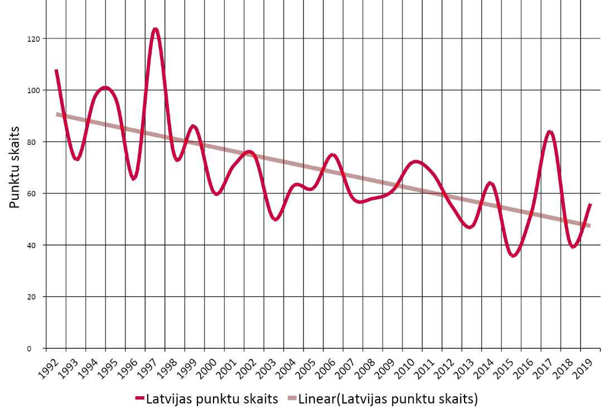

# &nbsp;

<hgroup>

<h1 style="font-size:28pt">Izglītības iespēju vienlīdzība un olimpiādes</h1>

<blue>Centralizēto eksāmenu un Atklāto olimpiāžu dati</blue>

</hgroup><hgroup style="font-size:90%">

**(1) Ievads**  
(2) [Vienlīdzība izglītībā](#section-1)  
(3) [LU Neklātienes matemātikas skola, NMS](#section-2)  
(4) [Vispārīgās izglītības statistika](#section-3)  
(5) [Atklāto olimpiāžu statistika](#section-4)  
(6) [Starptautiskas olimpiādes](#section-5)  
(7) [Kopsavilkums](#section-6)

</hgroup>

# <lo-why/> why

Kāpēc daudziem jāskatās uz 
izglītības datiem?

* Politikas izvēles ir sarežģītas, sekas ir ilglaicīgas.
* Latvija uz vienu iedzīvotāju ir salīdzinoši daudz
datu kopu. (Nevar paļauties, ka KĀDS to izdarīs.)
* Maz žurnālistu, kuri dziļi saprastu izglītību.

# &nbsp;

<hgroup>

<h1 style="font-size:28pt">Izglītības iespēju vienlīdzība un olimpiādes</h1>

<blue>Centralizēto eksāmenu un Atklāto olimpiāžu dati</blue>

</hgroup><hgroup style="font-size:90%">

(1) [Ievads](#section)  
**(2) Vienlīdzība izglītībā**  
(3) [LU Neklātienes matemātikas skola, NMS](#section-2)  
(4) [Vispārīgās izglītības statistika](#section-3)  
(5) [Atklāto olimpiāžu statistika](#section-4)  
(6) [Starptautiskas olimpiādes](#section-5)  
(7) [Kopsavilkums](#section-6)

</hgroup>

# <lo-summary/> Kāpēc vajadzīga datu žurnālistika

<hgroup style="width:25%;font-size:70%;">

* **Novājināti tradicionālie mediji:** Ziņas parasti
nepārbauda un nerediģē.
* **Sociālie tīkli:** Infotelpa ir sadrumstalota, katrs redz kaut ko citu.
* **Polarizēta sabiedrība:** "Mēs" pret "viņiem" (pilsētu/lauku skolas; 
latviešu/mazākumtautību programmas)
* **Apšaubīta ekspertu reputācija:** Tos uztver kā uzpirktus
vai sociāli atsvešinātus. 

</hgroup>

<hgroup style="width:70%;">

[Evita Puriņa. Salas nabadzības sistajiem](https://rebaltica.lv/2015/09/salas-nabadzibas-sistajiem/)

</hgroup>

# <lo-summary/> Vienojošais stāsts

* Datu apstrāde nevar būt pilnīgi neitrāla/objektīva. 
* Labas izglītības sistēmas nodrošina vienlīdzību (PISA 2018.g. rezultāti). 

<blue>Laba tehniska jaunrade rada pārsteigumu.</blue>

* Ja datos redzēsim harmoniju, vienlīdzību - būsim pārsteigti. 
* Ja redzēsim disharmoniju, nevienlīzību - arī būsim pārsteigti.

## <lo-summary/> Dažādas "vienlīdzības"

1. <blue>*Iespēju vienlīdzība*</blue> (*equality of opportunity*) - 
nav diskriminācijas jeb nepamatoti atšķirīgas attieksmes.
2. <blue>*Pārdales vienlīdzība*</blue> (*distributive equality*) - 
resursus sadala tā, lai visiem tie būtu vienādi pieejami un pietiekami, lai 
kompensētos nejaušību dēļ radušās atšķirības (*egalitarians*, *accident of birth*). 
3. <blue>*Attiecību vienlīdzība*</blue> (*relational equality*).
Līdzvērtīga iesaiste izglītojošos procesos, 
nenonākot nevajadzīgās hierarhijās, kas daļai bērnu 
nemitīgi atražotu nelabvēlīgus apstākļus.

*Elizabeth Anderson* [On the Democracy of Equals](https://oxfordpoliticalreview.com/2019/07/25/on-the-democracy-of-equals-an-interview-with-prof-elizabeth-anderson/).

## <lo-summary/> Elizabete Andersone par vienlīdzību

<hgroup>

*Professor of Philosophy, University of Michigan*

</hgroup>
<hgroup>

* Vai skolas ņem par pilnu mobinga upuru sūdzības?
* Vai skolēniem ir līdzīgas iespējas uzdot jautājumus eksakto priekšmetu stundās? 
* Saņemt skolotāja individuālu uzmanību? 
* Pieteikties neobligātajiem VISC izvēles eksāmeniem? (Skolotāji mēdz 
bērnus atrunāt no fizikas kārtošanas utml.)

</hgroup>

## <lo-summary/> Relational Equality - piemēri

* Vienlīdzība nozīmē brīvību pārslēgt savu identitāti (pret cilvēku savādāk 
izturas robotikas pulciņā nekā viņa parastajā klasē)
* Vienas hierarhijas vietā (kas var būt, piemēram, vidējā atzīme), ir vairākas
hierarhijas. Var atrasties tāda "skala", pēc kuras skolēns ir izcils.

Matemātika uzsver objektīvo patiesību, nevis personu (skolotāju, pasniedzēju) autoritāti.

* Lietojot matemātiskas procedūras, ikviens var kļūdīties, ikvienam var izrādīties taisnība.
* Dažiem tas (*intelektuāls egalitārisms*) var šķist pievilcīgs.
* <blue>**BET**</blue> nedrīkst baidīties izteikties matemātikas nodarbībās.

# &nbsp;

<hgroup>

<h1 style="font-size:28pt">Izglītības iespēju vienlīdzība un olimpiādes</h1>

<blue>Centralizēto eksāmenu un Atklāto olimpiāžu dati</blue>

</hgroup><hgroup style="font-size:90%">

(1) [Ievads](#section)  
(2) [Vienlīdzība izglītībā](#section-1)  
**(3) LU Neklātienes matemātikas skola, NMS**  
(4) [Vispārīgās izglītības statistika](#section-3)  
(5) [Atklāto olimpiāžu statistika](#section-4)  
(6) [Starptautiskas olimpiādes](#section-5)  
(7) [Kopsavilkums](#section-6)

</hgroup>

# <lo-summary/> Olimpiāžu vēsture

<hgroup>

</hgroup>
<hgroup>

* Valsts olimpiādes Latvijā - kopš 1950./1951. mācību gada.
* Sākotnēji 8.-11.klases.
* Stils līdzīgs grūtiem iestājeksāmenu uzdevumiem. 
* Izplatīti arī trigonometrijas vienādojumi, stereometrija, 
konstrukcijas ar cirkuli un lineālu, ģeometriski pierādījumi.

</hgroup>

## <lo-summary/> Olimpiāžu tendences

<hgroup style="font-size:70%">

**Modernā elementārā matemātika:**

* Kopš 1974.g. - LU FMF studenti sāk rīkot atklāto olimpiādi. 
* Parādās algoritmiski uzdevumi (spēles, procedūras ar monētu svēršanu), 
kombinatorika (uzdevumi par draudzēšanos, rokasspiedieniem, 
avioreisiem), skaitļu teorija.

**Komandu olimpiādes:**

* Kopš 1990.gada - Baltijas Ceļš (pēc Lietuvas komandu olimpiādes parauga).

</hgroup>
<hgroup style="font-size:70%">

**Ģeometrijas izmaiņas:**

* Ap 2003.gadu - ģeometrija vairs nav atsevišķs priekšmets
* Birokrātisks iemesls - lai pārceltu uz nākamo klasi, 
nedrīkstēja būt 2 nesekmīgas atzīmes.
* Atteikšanās no līdzšinējās ģeometrijas mācīšanas tradīcijas.
* Ģeometrija pārstāj būt formālās loģikas mācīšanas galvenais instruments.

**Starpdisciplinaritāte:**

* Daži jauni formāti. [KSIM Cēsis](http://ksim.cvg.edu.lv/Arh%C4%ABvs/) - 
3 cilvēku komanda, kas risina uzdevumus, kuros mēdz būt 
datu apstrāde, meklēšana vai piemēru konstruēšana. Drīkst
lietot tradicionālās programmēšanas valodas, MS Excel un citas
vides.

</hgroup>

## <lo-summary/> NMS vēsture

3 vadītāji: Agnis Andžāns, Dace Bonka, Maruta Avotiņa. 

* **Ikdienas darbs:** Sacensības dažādos formātos, 
iesūtīto neklātienes konkursu darbu labošana, skolotāju tālākizglītība, vasaras nometnes.
* **Lieli ikgadēji pasākumi:** Valsts un atklātās olimpiādes; uzdevumu 
komplektu stādīšana (Sagatavošanās, novadu, valsts, atklātajām olimpiādēm; dažādām 
papildsacensībām). 
* **Izlases gatavošana:** Sestdienu nodarbības ar aptuveni 100 valsts līmeņa olimpiāžu 
uzvarētājiem (9.-12.kl.). 
* **Starptautiskās olimpiādes:** Baltijas ceļš (5 dalībnieki komandu olimpiādē), 
IMO (6 dalībnieki starptautiskajā olimpiādē), EGMO (4 meitenes Eiropas Meiteņu olimpiādē). 

## <lo-summary/> Daži NMS alumni 

* Ingrīda Kreicberga (redaktore *Zvaigznes ABC*)
* Mārīte Seile (*Iespējamā misija*, arī Izglītības ministre)
* Kristīne Lomanovska (SEB apdrošināšana; Aktuārmatemātika)
* Līga Ramāna (Asoc.prof. RTU Ķīmijas fakultāte)
* Dace Kūma / Dace Bonka: (LiepU, DIF, studiju virziena vadītāja)
* Sandra Krauze (Valmieras Valsts ģimnāzija)
* Agnese Zalcmane (IT konsultante; astronomijas popularizēšana)
* Lauma Pretkalniņa (Datorlingvistika, tekstu korpusi)
* Laura Freija (International School of Latvia)
* Laila Zinberga (Siguldas Valsts ģimnāzija)

## <lo-summary/> Iesaistītās personas

Kuras ir galvenās <blue>*iesaistītās personas*</blue> (*stakeholders*) olimpiāžu rīkošanā?   
(A) Skolēni?  
(B) Vecāki?  
(C) Matemātikas skolotāji?  
(D) Direktori?  
(E) Pašvaldības?  
(F) IZM Ministrija?  
(G) Augstskolas?   
(H) Finansu/zinātnes/IT institūcijas.

# &nbsp;

<hgroup>

<h1 style="font-size:28pt">Izglītības iespēju vienlīdzība un olimpiādes</h1>

<blue>Centralizēto eksāmenu un Atklāto olimpiāžu dati</blue>

</hgroup><hgroup style="font-size:90%">

(1) [Ievads](#section)  
(2) [Vienlīdzība izglītībā](#section-1)  
(3) [LU Neklātienes matemātikas skola, NMS](#section-2)  
**(4) Vispārīgās izglītības statistika**  
(5) [Atklāto olimpiāžu statistika](#section-4)  
(6) [Starptautiskas olimpiādes](#section-5)  
(7) [Kopsavilkums](#section-6)

</hgroup>

# <lo-summary/> Dabaszinātņu eksāmenu aktivitāte

TODO: Grafiks ar dalību skolu vai reģionu dalību fizikā, ķīmijā, bioloģijā 
(kas visi ir izvēļu eksāmeni), attiecībā pret matemātiku (obligāto eksāmenu).

## <lo-summary/> 12KL matemātikas eksāmenu rezultāti

TODO: VISC matemātikas testu rezultāti pa reģioniem
Kartes un top-skolas.

## <lo-summary/> 9KL un 12KL matemātika ar 3 gadu nobīdi

<hgroup style="font-size:80%">

* Visas vidusskolas un ģimnāzijas kārtoja 9KL un 12KL obligāto matemātiku. 
* Vienādojam skalas, salīdzinām <blue>*Z vērtējumus*</blue> (*Z scores*):
$$z=\frac{x-\mu}{\sigma},$$
$x$ - eksāmena vidējais rezultāts skolā;   
$\mu$ - skolu vidējo rezultātu aritmētiskais vidējais;  
$\sigma$ - skolu vidējo rezultātu standartnovirze. 
* Mērķis - saprast, kas (relatīvi) mainās vidusskolas klasēs.

</hgroup>
<hgroup>

* Latvijā ir $28$ Valsts ģimnāzijas, tur mācās ap 10% no vidusskolēniem.
* [4 Valsts ģimnāzijas varētu zaudēt savu statusu](https://www.lsm.lv/raksts/zinas/latvija/cetras-valsts-gimnazijas-neizpildito-kriteriju-del-varetu-zaudet-savu-statusu.a309600/) -  Gulbenes, Jūrmalas, Viļakas un Krāslavas.

</hgroup>
 
## <lo-summary/> 9KL un 12KL matemātika - Korelācija

Korelācijas 

# &nbsp;

<hgroup>

<h1 style="font-size:28pt">Izglītības iespēju vienlīdzība un olimpiādes</h1>

<blue>Centralizēto eksāmenu un Atklāto olimpiāžu dati</blue>

</hgroup><hgroup style="font-size:90%">

(1) [Ievads](#section)  
(2) [Vienlīdzība izglītībā](#section-1)  
(3) [LU Neklātienes matemātikas skola, NMS](#section-2)  
(4) [Vispārīgās izglītības statistika](#section-3)  
(5) [Atklāto olimpiāžu statistika](#section-4)  
**(6) Starptautiskas olimpiādes**  
(7) [Kopsavilkums](#section-6)

</hgroup>

# <lo-summary/> Latvijas dalība IMO

## <lo-summary/> Dalībnieku kopskaits, cik no RV1Ģ?

* $27 \cdot 6 = 162$ dalībnieki (t.sk. ar atkārtojumiem)
* No tiem $99$ unikāli dalībnieki (vidēji $1.64$ reizes katram). 
* Tai skaitā Latvijas izlasēs bijušas $25$ meitenes, no kurām $17$ unikālas. 
* Vidēji 60% no dalībniekiem (2-5 katru gadu) ir no Rīgas Valsts 1.ģimnāzijas.

# <lo-summary/> Meiteņu olimpiādes Ķīnā

* No 2002.g. CGMO (China Girls Mathematical Olympiad)
中国女子数学奥林匹克 (*Zhōngguó nǚzǐ shùxué àolínpǐkè*). 
* Divas dienas rēķina - katrā dienā 4 uzdevumi. 
* Faktiski starptautiska olimpiāde - piedalās Ķīnas
administratīvie reģioni un arī komandas no
Singapūras, Filipīnām, Krievijas, u.c.
* Uzdevumi bieži prasa gan radošumu, gan 
izkoptas tehniskās prasmes (ne visi, kas gatavojušies
IMO, var uzreiz šo sākt risināt).

## <lo-summary/> EGMO olimpiāžu lietderība?

<hgroup style="font-size:90%">

<blue>**PRET:**</blue> 

* Nav attaisnojami, ja daļai bērnu pēc 
formālas pazīmes liedz iespēju kaut kur piedalīties.  
* Sieviešu šaha titulu 
apšaubāmais mantojums: 
[Should Women’s Chess Titles Be Eliminated?](https://new.uschess.org/news/should-womens-chess-titles-be-eliminated/)

</hgroup>
<hgroup style="font-size:90%">

<blue>**PAR:**</blue> 

* Veicina meiteņu interesi par 
sacensību matemātiku. 
* Meitenes un puiši socializējas atšķirīgi, 
apmeklē nodarbības ar draudzenēm/draugiem. 
Meiteņu sacensības pašu gatavošanos 
padara emocionāli pieņemamāku.

Matemātika pieradina pat šādas lietas pamatot, izmantojot
minimālus pieņēmumus (par to, kam sarunbiedrs tic).

# <lo-summary/> Kur studē IMO/EGMO dalībnieki?

* Massachusetts Institute of Technology, MIT (USA)
* University of Twente (Netherlands)
* RTU, Arhitektūras fakultāte
* Stockholm School of Economics

Kopīgas iezīmes šīm skolām:

* Starpdisciplinaritāte. 
* Starptautiska vide; studenti/pasniedzēji no dažādām vietām.
* Atzīti augstskolu diplomi, kvalitātes garantijas.
  

# &nbsp;

<hgroup>

<h1 style="font-size:28pt">Izglītības iespēju vienlīdzība un olimpiādes</h1>

<blue>Centralizēto eksāmenu un Atklāto olimpiāžu dati</blue>

</hgroup><hgroup style="font-size:90%">

(1) [Ievads](#section)  
(2) [Vienlīdzība izglītībā](#section-1)  
(3) [LU Neklātienes matemātikas skola, NMS](#section-2)  
(4) [Vispārīgās izglītības statistika](#section-3)  
(5) [Atklāto olimpiāžu statistika](#section-4)  
(6) [Starptautiskas olimpiādes](#section-5)  
**(7) Kopsavilkums**

</hgroup>

# <lo-summary/> Olimpiādes - vai sociāls lifts?

* Kā olimpiādēm raksturīgo matemātisko izglītību 
padarīt ilgtspējīgu. Neesot pārmērīgi atkarīgiem 
no ikbrīža konjunktūras vai pārejošiem projektiem.
* Politiskas prasības izglītības satura veidotājiem, 
pašvaldībām, likumdevējam? 
* Vēl kādi dzīvotspējīgi formāti: 
    - ZPD? 
    - Ķengurs? 
	- MOOC (neklātienes/tiešsaistes kursi)? 
	- Augstākā līmeņa matemātika vidusskolās?

## <lo-summary/> Norādes: Publicistika

* [E.Puriņa. Salas nabadzības sistajiem](https://rebaltica.lv/2015/09/salas-nabadzibas-sistajiem/)
* [N.Heller. The Philosopher Redefining Equality](https://www.newyorker.com/magazine/2019/01/07/the-philosopher-redefining-equality) - par Elizabeth Anderson
* [14 talantīgu skolotāju stāsti (ar Juri Škuškovniku)](https://www.facebook.com/kompetences/videos/733795867074638/) 

## <lo-summary/> Norādes: Olimpiāžu resursi

* [NMS mājaslapa (uzdevumu arhīvs)](http://nms.lu.lv/uzdevumu-arhivs/latvijas-olimpiades/)
* [Olimpiāžu video risinājumi](https://www.youtube.com/user/kalvisapsitis1/videos) 
* [IMO mājaslapa (uzdevumi)](http://imo-official.org/problems.aspx)
* [EGMO mājaslapa](https://www.egmo.org/)
* [CGMO pārskats (2016.g.)](http://education.cqnews.net/html/node_403049.htm) 
* [AoPS Online: ArtOfProblemSolving (Contests)](https://artofproblemsolving.com/community/c13_contests)

