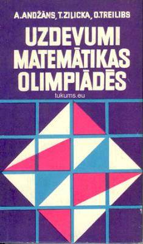

# &nbsp;

<hgroup>

<h1 style="font-size:28pt">Vizualizācijas</h1>

<blue>Skolu statistika</blue>

</hgroup><hgroup style="font-size:90%">

**(1) Ievads**  
(2) [Vispārīgais simpleksalgoritms](#section-1)  
(3) [Duālā lineārā programma](#section-2)  
(4) [Sākotnējā stūra izvēle](#section-3)  
(5) [Elipsoīda algoritms](#section-4)  
(6) [(P) Plūsmu uzdevumi](#section-5)  
(7) [Kopsavilkums](#section-6)

</hgroup>

# <lo-why/> why

Kāpēc vajag daudzus cilvēkus, kuri skatās uz 
izglītības datiem?

* Politikas izvēles ir sarežģītas, sekas ir ilglaicīgas.
* Latvija ir maza valsts, uz katru iedzīvotāju ir vairāk
dažādu datu kopu.
* Maz žurnālistu, kuri pietiekami dziļi orientētos problēmā.

 
## <lo-theory/> Mūsu šīsdienas tēmas

1. VISC dati - pavisam lielā bilde.
2. AMO olimpiāžu dati - kvalitatīva matemātiskā izglītība.
3. 

<!--
#################################################################
#### Izglītības tēma Latvijā kopumā
#################################################################
-->

# <lo-theory/> 

<hgroup>

> "In war-time truth is so precious that she 
> should always be attended by a bodyguard of lies."
> (Sir W.Churchill)

</hgroup>
<hgroup>

Bet piemērota diskusijas ietvara (*framework*), bez 
sagatavotiem gan runātājiem, gan klausītājiem par izglītību 
var uzdot vien banālus jautājumus par sešgadīgo apmācību, 
"kompetencēm" un PISA vai arī centralizēto eksāmenu rezultātiem.

</hgroup>

## <lo-summary/> Datu pētīšanas konteksts

* **Novājināti tradicionālie mediji:** Ziņu it kā ir daudz, bet tās parasti
nepārbauda un nerediģē (*no gatekeepers, no media rules*)
* **Sociālie tīkli:** Infotelpa ir sadrumstalota; katrs redz kaut ko citu. 
(*can spin different tales*)
* **Polarizēta sabiedrība:** "Mēs" pret "viņiem" (pilsētu vs. lauku skolas; 
latviešu vs. mazākumtautību programmas; progresīvi vs. konservatīvi skolotāji)
* **Apšaubīta ekspertu reputācija:** Viņus uztver kā angažētus
vai sociāli svešus. 

Demokrātiski veidota izglītības politika prasa neparastu lietu:
IZM ministrs mainās vidēji ik pēc 2 gadiem; viņam jāpārstāv mūsu intereses
un jāveido sistēma tā, lai tā nestu labus augļus vismaz 10-20 gadus pēc ministra 
amata pilnvaru beigām. Vajadzīga uzticēšanās un patiesība, lai visi darbotos 
kopīgam mērķim, lai nerastos atsvešinājums. 

## <lo-summary/> Divu veidu "vienlīdzības"

Izglītībai vajadzētu nodrošināt iespēju vienlīdzību visiem bērniem?

1. Ir <blue>*pārdales vienlīdzība*</blue> (*distributive equality*).
Resursu pārdale, lai visiem tie būtu vienādi pieejami un pietiekami; 
kompensēt dažādu iemeslu dēļ radušos trūkumus. 
2. Ir <blue>*attieksmes vienlīdzība*</blue> (*relational equality*).
Tas nozīmētu līdzvērtīgas iespējas iesaistīties sabiedrības norisēs, 
netikt iekļautam nevajadzīgās
hierarhijās, kas novestu pie tā, ka daži bērni tiek regulāri apdalīti.

(*Elizabeth Anderson. “What Is the Point of Equality?”*. 1999).

## <lo-summary/> Relational Equality - piemēri

* Vienlīdzība nozīmē brīvību pārslēgt savu identitāti (pret cilvēku savādāk 
izturas robotikas pulciņā nekā viņa parastajā klasē)
* Vienas hierarhijas vietā (kas var būt, piemēram, vidējā atzīme), ir vairākas
hierarhijas. Var atrasties tāda "skala", pēc kuras skolēns ir izcils.

**Matemātika** kā sociāls process atšķiras ar uzmanību uz 
procedūru pareizumu, nevis personu (skolotāju, pasniedzēju) autoritāti.
Dažiem bērniem tas var šķist pievilcīgi. Visos laikmetos
skolēni ir pielabojuši matemātikas skolotājus, kuri, rēķinot uz tāfeles,
pieļāva kļūdas.

Jautājums - vai visi bērni jūtas pietiekami atbrīvoti matemātikas nodarbībās?

## <lo-summary/> VISC: 12.kl. Centralizētā matemātika

VISC matemātikas testu rezultāti pa reģioniem

## <lo-summary/> VISC: 9.kl. un 12.kl. eksāmeni

Rezultātu korelācija ar 0, 1, 2 vai 3 gadu nobīdi. 

## <lo-summary/> VISC: Kur maz vai nemaz nekārto dabaszinātnes

## <lo-summary/> 

<!--
#################################################################
#### NMS un tā rīkotie pasākumi
#################################################################
-->

# <lo-summary/> Olimpiāžu vēsture

<hgroup>

</hgroup>
<hgroup>

* Pirmās matemātikas olimpiādes Latvijā - kopš 1950./1951.gada. 
(T.Ziļicka, O.Treilībs u.c.).
* 8.-11.klases.
* Stils līdzīgs grūtiem iestājeksāmenu uzdevumiem. 
* Atļauti trigonometrijas vienādojumi.
* Atļauta stereometrija. 
* Atļauti konstrukcijas uzdevumi ģeometrijā.
* Izplatītākais pierādījumu žanrs - ģeometriski pierādījumi.

</hgroup>

## <lo-summary/> Modernā elementārā matemātika

**Atzinums:** Formālā loģika jāmāca ne tikai ģeometrijā.

Ap 1970-tajiem gadiem olimpiādēs nostiprinās
algoritmiski uzdevumi (spēles, procedūras ar monētu svēršanu), 
kombinatorika (uzdevumi par draudzēšanos, rokasspiedieniem, 
avioreisiem), skaitļu teorija. 

## <lo-summary/> Kādus uzdevumus risināsim pēc 2020.g.?

* **Komandu olimpiādes:** Daži jauni sacensību formāti? 
Mazāk neklātienes kontroldarbu, vairāk izvēļu testu. 
Komandu sacensības. Uzsvars uz matemātiku kā komunikāciju.
* **Starpdisciplināri uzdevumi:** Labākie olimpiāžu uzdevumi 
cenšas būt matemātiskas pētniecības/jaunrades miniatūras; 
reti kad pietiek labi zināt noteiktu teorijas gabalu (kas 
kalpotu par "atslēgu" visam uzdevumam). 
* **Drīkst ņemt palīgā datoru?** [KSIM Cēsis](http://ksim.cvg.edu.lv/Arh%C4%ABvs/) - 
3 cilvēku komanda, kas risina uzdevumus, kuros mēdz būt 
datu apstrāde, meklēšana vai piemēru konstruēšana. Drīkst
lietot tradicionālās programmēšanas valodas, MS Excel un citas
vides.

## <lo-summary/> NMS vēsture

3 vadītāji: Agnis Andžāns, Dace Bonka, Maruta Avotiņa. 

* **Ikdienas darbs:** Sacensības dažādos formātos, 
iesūtīto neklātienes konkursu darbu labošana, skolotāju tālākizglītība, vasaras nometnes.
* **Lieli ikgadēji pasākumi:** Valsts un atklātās olimpiādes; uzdevumu 
komplektu stādīšana (Sagatavošanās, novadu, valsts, atklātajām olimpiādēm; dažādām 
papildsacensībām). 
* **Izlases gatavošana:** Sestdienu nodarbības ar aptuveni 100 valsts līmeņa olimpiāžu 
uzvarētājiem (9.-12.kl.). 
* **Starptautiskās olimpiādes:** Baltijas ceļš (5 dalībnieki komandu olimpiādē), 
IMO (6 dalībnieki starptautiskajā olimpiādē), EGMO (4 meitenes Eiropas Meiteņu olimpiādē). 

## <lo-summary/> Daži NMS alumni 

* Ingrīda Kreicberga (redaktore *Zvaigznes ABC*)
* Mārīte Seile (*Iespējamā misija*, arī Izglītības ministre)
* Kristīne Lomanovska (SEB apdrošināšana; Aktuārmatemātika)
* Līga Ramāna (Asoc.prof. RTU Ķīmijas fakultāte)
* Dace Kūma / Dace Bonka: (LiepU, DIF, studiju virziena vadītāja)
* Sandra Krauze (Valmieras Valsts ģimnāzija)
* Agnese Zalcmane (IT konsultante; astronomijas popularizēšana)
* Lauma Pretkalniņa (Datorlingvistika, tekstu korpusi)
* Laura Freija (International School of Latvia)
* Laila Zinberga (Siguldas Valsts ģimnāzija)

<!--
#################################################################
#### Olimpiāžu aktivitātes ģeogrāfija
#################################################################
-->

# <lo-summary/> AO dalībnieku daļa no visiem 5.-12.kl.

TODO: Latvija dalīta reģionos (39 jaunās pašvaldības). 
Meiteņu procents no visiem dalībniekiem? Aug gadu gaitā?

## <lo-summary/> Aktivitāte pa klasēm 

Vienkārša diagramma, kas parāda, kā mainās aktivitāte atkarībā no klases. 
Tendences pa gadiem?

## <lo-summary/> Zēnu un meiteņu salīdzinoša aktivitāte

Katrā klasē zīmējam "stacked barchart" - parādām, cik 
zēnu/meiteņu piedalījās. 

## <lo-summary/> 

Z-indeksi bērnu rezultātiem atkarībā no skolas "urbanizācijas". 

<!--
########################################################
### IMO un EGMO olimpiādes
########################################################
-->

# <lo-summary/> Latvijas dalība IMO

<!--
TODO: Artjoma prezentācija
--> 

## <lo-summary/> Cik daudzi dalībnieki ir no RV1Ģ

## <lo-summary/> Kā pārstāvētas meitenes

# <lo-summary/> Meiteņu olimpiādes Ķīnā

* No 2002.g. CGMO (China Girls Mathematical Olympiad)
中国女子数学奥林匹克 (Zhōngguó nǚzǐ shùxué àolínpǐkè). 
* Divas dienas rēķina - katrā dienā 4 uzdevumi. 
* Faktiski starptautiska olimpiāde - piedalās Ķīnas
administratīvie reģioni un arī komandas no
Singapūras, Filipīnām, Krievijas, u.c.
* Uzdevumi bieži prasa gan radošumu, gan 
izkoptas tehniskās prasmes (ne visi, kas gatavojušies
IMO, var uzreiz šo sākt risināt).

## <lo-summary/> Dažas pasākuma nianses

[Mājaslapa 2016.g. CGMO](http://education.cqnews.net/html/node_403049.htm)

## <lo-summary/> Meiteņu olimpiāžu lietderība?

<hgroup>

**Tēze:** Ārpusskolas izglītojošie pasākumi 
reti garantē visiem pilnīgi vienādas iespējas
(vienalga, vai tā ir AMO olimpiāde Rīgā vai 
programmētāju nometne Ventspils novada Užavā). 
BET nav attaisnojami, ja daļai bērnu pēc 
formālas pazīmes liedz iespēju piedalīties.  
**BET** var norādīt uz nevienādu iespēju strukturāliem 
cēloņiem... 

</hgroup>
<hgroup>

**Antitēze:** Meiteņu IMO līmeņa olimpiādēs
ir ļoti maz. CGMO un EGMO sacensību formāti 
var palīdzēt veicināt meiteņu interesi par 
sacensību matemātiku (plašā nozīmē - par formālo 
loģiku vispār), rada vienlīdzīgas iespējas.  
**BET** var norādīt uz sieviešu šaha sacensību 
un sieviešu šaha meistaru apšaubāmo mantojumu. 

</hgroup>

## <lo-summary/> Mazliet citāds pamatojums

**Cits mēģinājums pamatot EGMO:** Meiteņu un puišu socializācija
(13-19g.v. jeb padsmitnieku vecumā) notiek atšķirīgi. 
Bērni apmeklē nodarbības kopā ar draugiem vai draudzenēm. 
EGMO, CGMO ir sacensību formāts, kas matemātikas 
apguvei var noņemt dažus emocionālus šķēršļus.

#############################################################
### Noslēguma piezīmes
######################################################

## <lo-summary/> Norādes: Izglītības statistika

* [NMS: Atklātās matemātikas olimpiādes (AMO) rezultāti](http://nms.lu.lv/olimpiades/atklata/m-g/)
* [VISC: Centralizēto eksāmenu statistika](https://visc.gov.lv/vispizglitiba/eksameni/statistika/2019/)
* Skolu kontaktinformācija

## <lo-summary/> Norādes: Publicistika

* [E.Puriņa. Salas nabadzības sistajiem](https://rebaltica.lv/2015/09/salas-nabadzibas-sistajiem/)
* [N.Heller. The Philosopher Redefining Equality](https://www.newyorker.com/magazine/2019/01/07/the-philosopher-redefining-equality)

## <lo-summary/> Norādes: Olimpiāžu resursi

* NMS mājaslapa
* IMO mājaslapa
* EGMO mājaslapa
* CGMO olimpiāžu uzdevumi. 
* Artofproblemsolving

