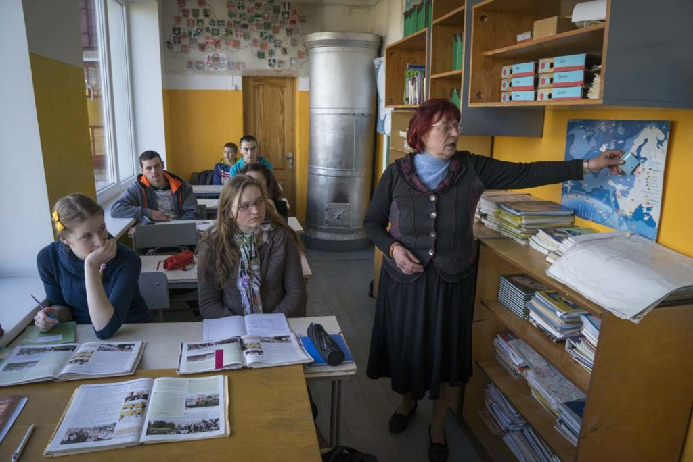

# &nbsp;

<hgroup>

<h1 style="font-size:28pt">Izglītības iespēju vienlīdzība un olimpiādes</h1>

<blue>Centralizēto eksāmenu un Atklāto olimpiāžu dati</blue>

</hgroup><hgroup style="font-size:90%">

**(1) Ievads**  
(2) [Vienlīdzība izglītībā](#section-1)  
(3) [LU Neklātienes matemātikas skola, NMS](#section-2)  
(4) [Vispārīgās izglītības statistika](#section-3)  
(5) [Atklāto olimpiāžu statistika](#section-4)  
(6) [Starptautiskas olimpiādes](#section-5)  
(7) [Kopsavilkums](#section-6)

</hgroup>

# <lo-why/> why

Kāpēc daudziem jāskatās uz 
izglītības datiem?

* Politikas izvēles ir sarežģītas, sekas ir ilglaicīgas.
* Latvija uz vienu iedzīvotāju ir salīdzinoši daudz
datu kopu. (Nevar paļauties, ka KĀDS to izdarīs.)
* Maz žurnālistu, kuri dziļi saprastu izglītību.

 
## <lo-summary/> Apspriežamās datu kopas?

<hgroup>

1. VISC 12.klases eksāmens matemātikā
2. Ikgadējā Atklātā olimpiāde (AO) - amortizēti 
vienā klašu grupā. 
3. NMS Izlases nodarbību nominanti - ap ... 
trīs klašu grupās. 
4. Starptautisku olimpiāžu (IMO, BW, EGMO) dalībnieki 
(tie ir daži cilvēki gadā).

</hgroup>
<hgroup>

TODO: Piramīda ar datu kopām.

</hgroup>

# &nbsp;

<hgroup>

<h1 style="font-size:28pt">Izglītības iespēju vienlīdzība un olimpiādes</h1>

<blue>Centralizēto eksāmenu un Atklāto olimpiāžu dati</blue>

</hgroup><hgroup style="font-size:90%">

(1) [Ievads](#section)  
**(2) Vienlīdzība izglītībā**  
(3) [LU Neklātienes matemātikas skola, NMS](#section-2)  
(4) [Vispārīgās izglītības statistika](#section-3)  
(5) [Atklāto olimpiāžu statistika](#section-4)  
(6) [Starptautiskas olimpiādes](#section-5)  
(7) [Kopsavilkums](#section-6)

</hgroup>

# <lo-summary/> Kāpēc vajadzīga datu žurnālistika

<hgroup style="width:25%;font-size:70%;">

* **Novājināti tradicionālie mediji:** Ziņas parasti
nepārbauda un nerediģē.
* **Sociālie tīkli:** Infotelpa ir sadrumstalota, katrs redz kaut ko citu.
* **Polarizēta sabiedrība:** "Mēs" pret "viņiem" (pilsētu/lauku skolas; 
latviešu/mazākumtautību programmas)
* **Apšaubīta ekspertu reputācija:** Tos uztver kā uzpirktus
vai sociāli atsvešinātus. 

</hgroup>

<hgroup style="width:70%;">

[Evita Puriņa. Salas nabadzības sistajiem](https://rebaltica.lv/2015/09/salas-nabadzibas-sistajiem/)

</hgroup>

# <lo-summary/> Vienojošais stāsts

* Datu apstrāde nevar būt pilnīgi neitrāla/objektīva. 
* Labas izglītības sistēmas nodrošina vienlīdzību (PISA 2018.g. rezultāti). 

<blue>Laba tehniska jaunrade rada pārsteigumu.</blue>

* Ja datos redzēsim harmoniju, vienlīdzību - būsim pārsteigti. 
* Ja redzēsim disharmoniju, nevienlīzību - arī būsim pārsteigti.

## <lo-summary/> Dažādas "vienlīdzības"

1. <blue>*Iespēju vienlīdzība*</blue> (*equality of opportunity*) - 
nav diskriminācijas jeb nepamatoti atšķirīgas attieksmes.
2. <blue>*Pārdales vienlīdzība*</blue> (*distributive equality*) - 
resursus sadala tā, lai visiem tie būtu vienādi pieejami un pietiekami, lai 
kompensētos nejaušību dēļ radušās atšķirības (*egalitarians*, *accident of birth*). 
3. <blue>*Attiecību vienlīdzība*</blue> (*relational equality*).
Līdzvērtīga iesaiste izglītojošos procesos, 
nenonākot nevajadzīgās hierarhijās, kas daļai bērnu 
nemitīgi atražotu nelabvēlīgus apstākļus.

*Elizabeth Anderson* [On the Democracy of Equals](https://oxfordpoliticalreview.com/2019/07/25/on-the-democracy-of-equals-an-interview-with-prof-elizabeth-anderson/).

## <lo-summary/> Elizabete Andersone par vienlīdzību

<hgroup>

*Professor of Philosophy, University of Michigan*

</hgroup>
<hgroup>

* Vai skolas ņem par pilnu mobinga upuru sūdzības?
* Vai skolēniem ir līdzīgas iespējas uzdot jautājumus eksakto priekšmetu stundās? 
* Saņemt skolotāja individuālu uzmanību? 
* Pieteikties neobligātajiem VISC izvēles eksāmeniem? (Skolotāji mēdz 
bērnus atrunāt no fizikas kārtošanas utml.)

</hgroup>

## <lo-summary/> Relational Equality - piemēri

* Vienlīdzība nozīmē brīvību pārslēgt savu identitāti (pret cilvēku savādāk 
izturas robotikas pulciņā nekā viņa parastajā klasē)
* Vienas hierarhijas vietā (kas var būt, piemēram, vidējā atzīme), ir vairākas
hierarhijas. Var atrasties tāda "skala", pēc kuras skolēns ir izcils.

Matemātika uzsver objektīvo patiesību, nevis personu (skolotāju, pasniedzēju) autoritāti.

* Lietojot matemātiskas procedūras, ikviens var kļūdīties, ikvienam var izrādīties taisnība.
* Dažiem tas (*intelektuāls egalitārisms*) var šķist pievilcīgs.
* <blue>**BET**</blue> nedrīkst baidīties izteikties matemātikas nodarbībās.

# &nbsp;

<hgroup>

<h1 style="font-size:28pt">Izglītības iespēju vienlīdzība un olimpiādes</h1>

<blue>Centralizēto eksāmenu un Atklāto olimpiāžu dati</blue>

</hgroup><hgroup style="font-size:90%">

(1) [Ievads](#section)  
(2) [Vienlīdzība izglītībā](#section-1)  
**(3) LU Neklātienes matemātikas skola, NMS**  
(4) [Vispārīgās izglītības statistika](#section-3)  
(5) [Atklāto olimpiāžu statistika](#section-4)  
(6) [Starptautiskas olimpiādes](#section-5)  
(7) [Kopsavilkums](#section-6)

</hgroup>

# <lo-summary/> Olimpiāžu vēsture

<hgroup>

</hgroup>
<hgroup>

* Valsts olimpiādes Latvijā - kopš 1950./1951. mācību gada.
* Sākotnēji 8.-11.klases.
* Stils līdzīgs grūtiem iestājeksāmenu uzdevumiem. 
* Izplatīti arī trigonometrijas vienādojumi, stereometrija, 
konstrukcijas ar cirkuli un lineālu, ģeometriski pierādījumi.

</hgroup>

## <lo-summary/> Olimpiāžu tendences

<hgroup style="font-size:70%">

**Modernā elementārā matemātika:**

* Kopš 1974.g. - LU FMF studenti sāk rīkot atklāto olimpiādi. 
* Parādās algoritmiski uzdevumi (spēles, procedūras ar monētu svēršanu), 
kombinatorika (uzdevumi par draudzēšanos, rokasspiedieniem, 
avioreisiem), skaitļu teorija.

**Komandu olimpiādes:**

* Kopš 1990.gada - Baltijas Ceļš (pēc Lietuvas komandu olimpiādes parauga).

</hgroup>
<hgroup style="font-size:70%">

**Ģeometrijas izmaiņas:**

* Ap 2003.gadu - ģeometrija vairs nav atsevišķs priekšmets
* Birokrātisks iemesls - lai pārceltu uz nākamo klasi, 
nedrīkstēja būt 2 nesekmīgas atzīmes.
* Atteikšanās no līdzšinējās ģeometrijas mācīšanas tradīcijas.
* Ģeometrija pārstāj būt formālās loģikas mācīšanas galvenais instruments.

**Starpdisciplinaritāte:**

* Daži jauni formāti. [KSIM Cēsis](http://ksim.cvg.edu.lv/Arh%C4%ABvs/) - 
3 cilvēku komanda, kas risina uzdevumus, kuros mēdz būt 
datu apstrāde, meklēšana vai piemēru konstruēšana. Drīkst
lietot tradicionālās programmēšanas valodas, MS Excel un citas
vides.

</hgroup>

## <lo-summary/> NMS vēsture

3 vadītāji: Agnis Andžāns, Dace Bonka, Maruta Avotiņa. 

* **Ikdienas darbs:** Sacensības dažādos formātos, 
iesūtīto neklātienes konkursu darbu labošana, skolotāju tālākizglītība, vasaras nometnes.
* **Lieli ikgadēji pasākumi:** Valsts un atklātās olimpiādes; uzdevumu 
komplektu stādīšana (Sagatavošanās, novadu, valsts, atklātajām olimpiādēm; dažādām 
papildsacensībām). 
* **Izlases gatavošana:** Sestdienu nodarbības ar aptuveni 100 valsts līmeņa olimpiāžu 
uzvarētājiem (9.-12.kl.). 
* **Starptautiskās olimpiādes:** Baltijas ceļš (5 dalībnieki komandu olimpiādē), 
IMO (6 dalībnieki starptautiskajā olimpiādē), EGMO (4 meitenes Eiropas Meiteņu olimpiādē). 

## <lo-summary/> Daži NMS alumni 

* Ingrīda Kreicberga (redaktore *Zvaigznes ABC*)
* Mārīte Seile (*Iespējamā misija*, arī Izglītības ministre)
* Kristīne Lomanovska (SEB apdrošināšana; Aktuārmatemātika)
* Līga Ramāna (Asoc.prof. RTU Ķīmijas fakultāte)
* Dace Kūma / Dace Bonka: (LiepU, DIF, studiju virziena vadītāja)
* Sandra Krauze (Valmieras Valsts ģimnāzija)
* Agnese Zalcmane (IT konsultante; astronomijas popularizēšana)
* Lauma Pretkalniņa (Datorlingvistika, tekstu korpusi)
* Laura Freija (International School of Latvia)
* Laila Zinberga (Siguldas Valsts ģimnāzija)

# <lo-summary/> AMO sniegtās emocijas

<hgroup>

<blockquote class="twitter-tweet">
Skolēnu pūlis ieņem <a href="https://twitter.com/universitatelv?ref_src=twsrc%5Etfw">@universitatelv</a> ēku Aspazijas ielā 5 - šī nav revolūcija, bet <a href="https://twitter.com/LU_NMS?ref_src=twsrc%5Etfw">@LU_NMS</a> Atklātā matemātikas olimpiāde! <a href="https://t.co/lOb7gzdlom">pic.twitter.com/lOb7gzdlom</a>
&mdash; Vjačeslavs Kaščejevs (@SlavaVK) <a href="https://twitter.com/SlavaVK/status/856042801225760770?ref_src=twsrc%5Etfw">April 23, 2017</a></blockquote> 

</hgroup>
<hgroup style="font-size:70%">

[J.Škuškovniks](https://www.facebook.com/kompetences/videos/733795867074638/) salīdzina atklāto olimpiādi 
ar dziesmusvētkiem. 
Ņemot vērā gatavošanos olimpiādei visas Latvijas skolās, autobusus, kas agrā rītā dalībniekus atved uz Rīgu (tagad 
arī Liepāju, Daugavpili), dalībnieku tūkstošus... Neparasts mērogs šīm sacensībām. 

Salīdzinājums ar Igaunijas [Sügisene lahtine võistlus](http://www.math.olympiaadid.ut.ee/html/index.php?id=2019_20) - 
rudens atvērtās sacensības (91+57 dalībnieki).

</hgroup>

# <lo-summary/> Talantu filtra modelis

<hgroup>

*Agnis Andžāns*

</hgroup>
<hgroup>

(A) *Olimpiādes ir kā plašs tīkls, kam vajadzētu atklāt un izaudzināt
mūsu tautas talantus. Skaitliski nelielas
tautas nevar atļauties pazaudēt nevienu apdāvinātu cilvēku.*

(Darbs ar "īpaši apdāvinātajiem skolēniem"...)

</hgroup>

## <lo-summary/> Radošuma modelis

<hgroup>

*Jānis Krūmiņš*

</hgroup>
<hgroup>

(B) *"Nevis tikai klausīties ierakstu, 
bet arī pašiem iedziedāt".*

(Olimpiādes ir sava veida tehniskā jaunrade. 
Par radošumu bieži vienpusīgi dēvē vien 
skolēnu māksliniecisko pašdarbību.)

</hgroup>

## <lo-summary/> Daži citi modeļi

<hgroup>

<blockquote class="twitter-tweet">
Monta Ozoliņa bija starp skolniekiem, ko gatavoju Starptautiskajai matemātikas olimpiādei. 2008.g. Latvijas komanda. Tagad Forbes &quot;30 under 30&quot; saraksts finansēs. <a href="https://t.co/TUmjAG3ztg">https://t.co/TUmjAG3ztg</a>
&mdash; Andris Ambainis (@AAmbainis) <a href="https://twitter.com/AAmbainis/status/1204501681473540096?ref_src=twsrc%5Etfw">December 10, 2019</a></blockquote> 

</hgroup>
<hgroup>

(C) Olimpiādes kā sociāls lifts, ļauj talantīgiem jauniešiem izkļūt
no trūkuma un beztiesības.    
(D) Olimpiādes skolu ranžēšanai.
(E) Olimpiādes kā zinātnes popularizēšanas rīks.   
(F) Olimpiādes kritiskās domāšanas attīstībai; vērtību audzināšanai.

</hgroup>

## <lo-summary/> Modelis nosaka prioritātes

<hgroup style="font-size:70%">

Daudzveidība veicina dialogu olimpiāžu organizatoru vidū **BET** 
ierobežotos resursus labāk izmantot mērķtiecīgi.

1. Vai olimpiādēs iesaistāmi nedaudzi visspējīgākie?   
...vai 10-20% no visiem?  
...vai iespējami daudzi skolēni?
2. Vai olimpiādēm piemēroti hierarhiski filtri?   
...vai liela formātu daudzveidība?
3. Vai uzdevumiem jāatalgo dalībnieku radošums?  
...vai kvalificēta sagatavotība?
4. Vai uzmanības centrā ir individuālas vai komandu olimpiādes? 
(Sk. [Lietuvos komandinė mokinių matematikos olimpiada](http://mif.vu.lt/matematikos-olimpiados/lkmmo/).)

</hgroup>

<hgroup>

Kuras ir galvenās <blue>*iesaistītās personas*</blue> (*stakeholders*)?   
(A) Skolēni?  
(B) Vecāki?  
(C) Matemātikas skolotāji?  
(D) Direktori?  
(E) Pašvaldības?  
(F) IZM Ministrija?  
(G) Augstskolas?   
(H) Finansu/zinātnes/IT institūcijas.

</hgroup>

# &nbsp;

<hgroup>

<h1 style="font-size:28pt">Izglītības iespēju vienlīdzība un olimpiādes</h1>

<blue>Centralizēto eksāmenu un Atklāto olimpiāžu dati</blue>

</hgroup><hgroup style="font-size:90%">

(1) [Ievads](#section)  
(2) [Vienlīdzība izglītībā](#section-1)  
(3) [LU Neklātienes matemātikas skola, NMS](#section-2)  
**(4) Vispārīgās izglītības statistika**  
(5) [Atklāto olimpiāžu statistika](#section-4)  
(6) [Starptautiskas olimpiādes](#section-5)  
(7) [Kopsavilkums](#section-6)

</hgroup>

# <lo-summary/> Dabaszinātņu eksāmenu aktivitāte

TODO: Grafiks ar dalību skolu vai reģionu dalību fizikā, ķīmijā, bioloģijā 
(kas visi ir izvēļu eksāmeni), attiecībā pret matemātiku (obligāto eksāmenu).

## <lo-summary/> 12KL matemātikas eksāmenu rezultāti

TODO: VISC matemātikas testu rezultāti pa reģioniem
Kartes un top-skolas.

## <lo-summary/> 9KL un 12KL matemātika ar 3 gadu nobīdi

<hgroup style="font-size:80%">

* Visas vidusskolas un ģimnāzijas kārtoja 9KL un 12KL obligāto matemātiku. 
* Vienādojam skalas, salīdzinām <blue>*Z vērtējumus*</blue> (*Z scores*):
$$z=\frac{x-\mu}{\sigma},$$
$x$ - eksāmena vidējais rezultāts skolā;   
$\mu$ - skolu vidējo rezultātu aritmētiskais vidējais;  
$\sigma$ - skolu vidējo rezultātu standartnovirze. 
* Mērķis - saprast, kas (relatīvi) mainās vidusskolas klasēs.

</hgroup>
<hgroup>

* Latvijā ir $28$ Valsts ģimnāzijas, tur mācās ap 10% no vidusskolēniem.
* [4 Valsts ģimnāzijas varētu zaudēt savu statusu](https://www.lsm.lv/raksts/zinas/latvija/cetras-valsts-gimnazijas-neizpildito-kriteriju-del-varetu-zaudet-savu-statusu.a309600/) -  Gulbenes, Jūrmalas, Viļakas un Krāslavas.

</hgroup>
 
## <lo-summary/> 9KL un 12KL matemātika - Korelācija

Korelācijas 

# &nbsp;

<hgroup>

<h1 style="font-size:28pt">Izglītības iespēju vienlīdzība un olimpiādes</h1>

<blue>Centralizēto eksāmenu un Atklāto olimpiāžu dati</blue>

</hgroup><hgroup style="font-size:90%">

(1) [Ievads](#section)  
(2) [Vienlīdzība izglītībā](#section-1)  
(3) [LU Neklātienes matemātikas skola, NMS](#section-2)  
(4) [Vispārīgās izglītības statistika](#section-3)  
**(5) Atklāto olimpiāžu statistika**  
(6) [Starptautiskas olimpiādes](#section-5)  
(7) [Kopsavilkums](#section-6)

</hgroup>

# <lo-summary/> AO dalībnieku skaits

<table class="table table-striped" style="width: auto !important; margin-left: auto; margin-right: auto;">
<thead>
<tr>
<th style="text-align:left;">
</th>
<th style="text-align:left;">
males
</th>
<th style="text-align:left;">
females
</th>
<th style="text-align:right;">
total
</th>
<th style="text-align:right;">
schoolAge
</th>
<th style="text-align:left;">
activity
</th>
</tr>
</thead>
<tbody>
<tr>
<td style="text-align:left;color: white !important;background-color: #800000 !important;">
2011
</td>
<td style="text-align:left;color: white !important;background-color: #800000 !important;">
1911 (51.45%)
</td>
<td style="text-align:left;color: white !important;background-color: #800000 !important;">
1803 (48.55%)
</td>
<td style="text-align:right;color: white !important;background-color: #800000 !important;">
3714
</td>
<td style="text-align:right;color: white !important;background-color: #800000 !important;">
160255
</td>
<td style="text-align:left;color: white !important;background-color: #800000 !important;">
2.32%
</td>
</tr>
<tr>
<td style="text-align:left;color: white !important;background-color: #800000 !important;">
2012
</td>
<td style="text-align:left;color: white !important;background-color: #800000 !important;">
1463 (50.14%)
</td>
<td style="text-align:left;color: white !important;background-color: #800000 !important;">
1455 (49.86%)
</td>
<td style="text-align:right;color: white !important;background-color: #800000 !important;">
2918
</td>
<td style="text-align:right;color: white !important;background-color: #800000 !important;">
153059
</td>
<td style="text-align:left;color: white !important;background-color: #800000 !important;">
1.91%
</td>
</tr>
<tr>
<td style="text-align:left;color: white !important;background-color: #800000 !important;">
2013
</td>
<td style="text-align:left;color: white !important;background-color: #800000 !important;">
1407 (48.70%)
</td>
<td style="text-align:left;color: white !important;background-color: #800000 !important;">
1482 (51.30%)
</td>
<td style="text-align:right;color: white !important;background-color: #800000 !important;">
2889
</td>
<td style="text-align:right;color: white !important;background-color: #800000 !important;">
149499
</td>
<td style="text-align:left;color: white !important;background-color: #800000 !important;">
1.93%
</td>
</tr>
<tr>
<td style="text-align:left;color: white !important;background-color: #800000 !important;">
2014
</td>
<td style="text-align:left;color: white !important;background-color: #800000 !important;">
1332 (49.72%)
</td>
<td style="text-align:left;color: white !important;background-color: #800000 !important;">
1347 (50.28%)
</td>
<td style="text-align:right;color: white !important;background-color: #800000 !important;">
2679
</td>
<td style="text-align:right;color: white !important;background-color: #800000 !important;">
147835
</td>
<td style="text-align:left;color: white !important;background-color: #800000 !important;">
1.81%
</td>
</tr>
<tr>
<td style="text-align:left;color: white !important;background-color: #800000 !important;">
2015
</td>
<td style="text-align:left;color: white !important;background-color: #800000 !important;">
1563 (49.40%)
</td>
<td style="text-align:left;color: white !important;background-color: #800000 !important;">
1601 (50.60%)
</td>
<td style="text-align:right;color: white !important;background-color: #800000 !important;">
3164
</td>
<td style="text-align:right;color: white !important;background-color: #800000 !important;">
148553
</td>
<td style="text-align:left;color: white !important;background-color: #800000 !important;">
2.13%
</td>
</tr>
<tr>
<td style="text-align:left;color: white !important;background-color: #800000 !important;">
2016
</td>
<td style="text-align:left;color: white !important;background-color: #800000 !important;">
1718 (48.96%)
</td>
<td style="text-align:left;color: white !important;background-color: #800000 !important;">
1791 (51.04%)
</td>
<td style="text-align:right;color: white !important;background-color: #800000 !important;">
3509
</td>
<td style="text-align:right;color: white !important;background-color: #800000 !important;">
150619
</td>
<td style="text-align:left;color: white !important;background-color: #800000 !important;">
2.33%
</td>
</tr>
<tr>
<td style="text-align:left;color: white !important;background-color: #800000 !important;">
2017
</td>
<td style="text-align:left;color: white !important;background-color: #800000 !important;">
1733 (48.86%)
</td>
<td style="text-align:left;color: white !important;background-color: #800000 !important;">
1814 (51.14%)
</td>
<td style="text-align:right;color: white !important;background-color: #800000 !important;">
3547
</td>
<td style="text-align:right;color: white !important;background-color: #800000 !important;">
152182
</td>
<td style="text-align:left;color: white !important;background-color: #800000 !important;">
2.33%
</td>
</tr>
<tr>
<td style="text-align:left;color: white !important;background-color: #800000 !important;">
2018
</td>
<td style="text-align:left;color: white !important;background-color: #800000 !important;">
1602 (50.79%)
</td>
<td style="text-align:left;color: white !important;background-color: #800000 !important;">
1552 (49.21%)
</td>
<td style="text-align:right;color: white !important;background-color: #800000 !important;">
3154
</td>
<td style="text-align:right;color: white !important;background-color: #800000 !important;">
153087
</td>
<td style="text-align:left;color: white !important;background-color: #800000 !important;">
2.06%
</td>
</tr>
<tr>
<td style="text-align:left;color: white !important;background-color: #800000 !important;">
2019
</td>
<td style="text-align:left;color: white !important;background-color: #800000 !important;">
1620 (50.05%)
</td>
<td style="text-align:left;color: white !important;background-color: #800000 !important;">
1617 (49.95%)
</td>
<td style="text-align:right;color: white !important;background-color: #800000 !important;">
3237
</td>
<td style="text-align:right;color: white !important;background-color: #800000 !important;">
153365
</td>
<td style="text-align:left;color: white !important;background-color: #800000 !important;">
2.11%
</td>
</tr>
</tbody>
</table>

## <lo-summary/> AO dalībnieku skaits

## <lo-summary/> Aktivitāte pa klasēm 

## <lo-summary/> Skolas urbanizācijas tips

Arī zēnu/meiteņu proporcijas.

## <lo-summary/> Kurā brīdī iestājas pagurums?

Z-indeksi bērnu rezultātiem atkarībā no klases un arī no skolas 
"urbanizācijas tipa".

## <lo-summary/> Aktivitāte pa reģioniem

# &nbsp;

<hgroup>

<h1 style="font-size:28pt">Izglītības iespēju vienlīdzība un olimpiādes</h1>

<blue>Centralizēto eksāmenu un Atklāto olimpiāžu dati</blue>

</hgroup><hgroup style="font-size:90%">

(1) [Ievads](#section)  
(2) [Vienlīdzība izglītībā](#section-1)  
(3) [LU Neklātienes matemātikas skola, NMS](#section-2)  
(4) [Vispārīgās izglītības statistika](#section-3)  
(5) [Atklāto olimpiāžu statistika](#section-4)  
**(6) Starptautiskas olimpiādes**  
(7) [Kopsavilkums](#section-6)

</hgroup>

# <lo-summary/> Latvijas dalība IMO

## <lo-summary/> Dalībnieku kopskaits, cik no RV1Ģ?

* $27 \cdot 6 = 162$ dalībnieki (t.sk. ar atkārtojumiem)
* No tiem $99$ unikāli dalībnieki (vidēji $1.64$ reizes katram). 
* Tai skaitā Latvijas izlasēs bijušas $25$ meitenes, no kurām $17$ unikālas. 
* Vidēji 60% no dalībniekiem (2-5 katru gadu) ir no Rīgas Valsts 1.ģimnāzijas.

# <lo-summary/> Meiteņu olimpiādes Ķīnā

* No 2002.g. CGMO (China Girls Mathematical Olympiad)
中国女子数学奥林匹克 (*Zhōngguó nǚzǐ shùxué àolínpǐkè*). 
* Divas dienas rēķina - katrā dienā 4 uzdevumi. 
* Faktiski starptautiska olimpiāde - piedalās Ķīnas
administratīvie reģioni un arī komandas no
Singapūras, Filipīnām, Krievijas, u.c.
* Uzdevumi bieži prasa gan radošumu, gan 
izkoptas tehniskās prasmes (ne visi, kas gatavojušies
IMO, var uzreiz šo sākt risināt).

## <lo-summary/> EGMO olimpiāžu lietderība?

<hgroup style="font-size:90%">

<blue>**PRET:**</blue> 

* Nav attaisnojami, ja daļai bērnu pēc 
formālas pazīmes liedz iespēju kaut kur piedalīties.  
* Sieviešu šaha titulu 
apšaubāmais mantojums: 
[Should Women’s Chess Titles Be Eliminated?](https://new.uschess.org/news/should-womens-chess-titles-be-eliminated/)

</hgroup>
<hgroup style="font-size:90%">

<blue>**PAR:**</blue> 

* Veicina meiteņu interesi par 
sacensību matemātiku. 
* Meitenes un puiši socializējas atšķirīgi, 
apmeklē nodarbības ar draudzenēm/draugiem. 
Meiteņu sacensības pašu gatavošanos 
padara emocionāli pieņemamāku.

Matemātika pieradina pat šādas lietas pamatot, izmantojot
minimālus pieņēmumus (par to, kam sarunbiedrs tic).

# <lo-summary/> Kur studē IMO/EGMO dalībnieki?

* Massachusetts Institute of Technology, MIT (USA)
* University of Twente (Netherlands)
* RTU, Arhitektūras fakultāte
* Stockholm School of Economics

Kopīgas iezīmes šīm skolām:

* Starpdisciplinaritāte. 
* Starptautiska vide; studenti/pasniedzēji no dažādām vietām.
* Atzīti augstskolu diplomi, kvalitātes garantijas.
  

# &nbsp;

<hgroup>

<h1 style="font-size:28pt">Izglītības iespēju vienlīdzība un olimpiādes</h1>

<blue>Centralizēto eksāmenu un Atklāto olimpiāžu dati</blue>

</hgroup><hgroup style="font-size:90%">

(1) [Ievads](#section)  
(2) [Vienlīdzība izglītībā](#section-1)  
(3) [LU Neklātienes matemātikas skola, NMS](#section-2)  
(4) [Vispārīgās izglītības statistika](#section-3)  
(5) [Atklāto olimpiāžu statistika](#section-4)  
(6) [Starptautiskas olimpiādes](#section-5)  
**(7) Kopsavilkums**

</hgroup>

# <lo-summary/> Olimpiādes - vai sociāls lifts?

* Kā olimpiādēm raksturīgo matemātisko izglītību 
padarīt ilgtspējīgu. Neesot pārmērīgi atkarīgiem 
no ikbrīža konjunktūras vai pārejošiem projektiem.
* Politiskas prasības izglītības satura veidotājiem, 
pašvaldībām, likumdevējam? 
* Vēl kādi dzīvotspējīgi formāti: 
    - ZPD? 
    - Ķengurs? 
	- MOOC (neklātienes/tiešsaistes kursi)? 
	- Augstākā līmeņa matemātika vidusskolās?

# <lo-summary/> Norādes: Izglītības statistika

* [NMS: Atklātās matemātikas olimpiādes (AMO) rezultāti](http://nms.lu.lv/olimpiades/atklata/m-g/)
* [VISC: Centralizēto eksāmenu statistika](https://visc.gov.lv/vispizglitiba/eksameni/statistika/2019/)
* [Dati no VIIS (Vispārizglītojošo skolu kontaktinformācija)](https://izm.gov.lv/lv/publikacijas-un-statistika/statistika-par-izglitibu/dati-no-viis/2018-2019-m-g)
* [Iedzīvotāju statistika](http://data1.csb.gov.lv/pxweb/lv/iedz/iedz__iedzrakst/IRG040.px/)

## <lo-summary/> Norādes: Publicistika

* [E.Puriņa. Salas nabadzības sistajiem](https://rebaltica.lv/2015/09/salas-nabadzibas-sistajiem/)
* [N.Heller. The Philosopher Redefining Equality](https://www.newyorker.com/magazine/2019/01/07/the-philosopher-redefining-equality) - par Elizabeth Anderson
* [14 talantīgu skolotāju stāsti (ar Juri Škuškovniku)](https://www.facebook.com/kompetences/videos/733795867074638/) 

## <lo-summary/> Norādes: Olimpiāžu resursi

* [NMS mājaslapa (uzdevumu arhīvs)](http://nms.lu.lv/uzdevumu-arhivs/latvijas-olimpiades/)
* [Olimpiāžu video risinājumi](https://www.youtube.com/user/kalvisapsitis1/videos) 
* [IMO mājaslapa (uzdevumi)](http://imo-official.org/problems.aspx)
* [EGMO mājaslapa](https://www.egmo.org/)
* [CGMO pārskats (2016.g.)](http://education.cqnews.net/html/node_403049.htm) 
* [AoPS Online: ArtOfProblemSolving (Contests)](https://artofproblemsolving.com/community/c13_contests)

